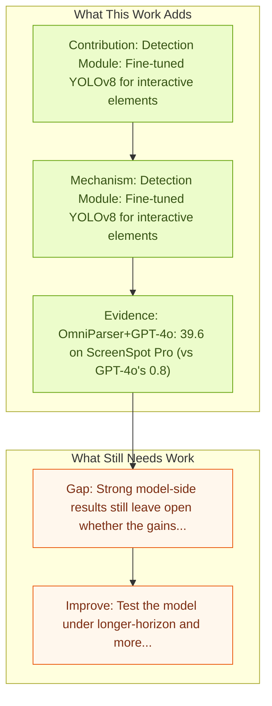

# OmniParser: Pure Vision Based GUI Agent

Entry report generated on 2026-03-28 (Asia/Tokyo). This report is based on the repository entry, linked source metadata, and audit-time cross-checks.

## Snapshot

| Field | Detail |
| --- | --- |
| Repo entry | OmniParser: Pure Vision Based GUI Agent |
| Actual target | [OmniParser for Pure Vision Based GUI Agent](https://arxiv.org/abs/2408.00203) |
| Section | Models and Architectures |
| Source location | `papers/models/README.md:81` |
| Primary link type | `link` |
| Audit status | `ok` |
| Date / venue | August 2024 |
| Authors | Yadong Lu, Jianwei Yang, Yelong Shen, Ahmed Awadallah |
| Focus tags | `model` `grounding` `microsoft` `parsing` |
| Center of gravity | web, grounding |
| Related assets | [GitHub](https://github.com/microsoft/OmniParser) |

## Quick Read

| Lens | Read |
| --- | --- |
| Problem pressure | Screen parsing tool that converts UI screenshots to structured format. |
| Most novel move | The architecture-level novelty is most visible in detection Module: Fine-tuned YOLOv8 for interactive elements. |
| Strongest evidence | OmniParser+GPT-4o: 39.6 on ScreenSpot Pro (vs GPT-4o's 0.8) |
| Main caveat | Strong model-side results still leave open whether the gains survive precise element localization and recovery after grounding misses. |

## Visual Frame

```mermaid
flowchart LR
  Problem["Problem: Screen parsing tool that converts UI screenshots to..."] --> Novelty["Novelty: The architecture-level novelty is most visible in detection..."]
  Novelty --> Framework["Framework: Detection Module: Fine-tuned YOLOv8 for interactive elements"]
  Framework --> Evidence["Evidence: OmniParser+GPT-4o: 39.6 on ScreenSpot Pro (vs GPT-4o's 0.8)"]
  Evidence --> Gap["Gap: Strong model-side results still leave open whether the gains..."]
  Gap --> Next["Next: Test the model under longer-horizon and more..."]
  classDef insight fill:#dbeafe,stroke:#2563eb,color:#0f172a;
  classDef risk fill:#fee2e2,stroke:#dc2626,color:#7f1d1d;
  classDef next fill:#dcfce7,stroke:#16a34a,color:#14532d;
  class Problem,Novelty,Framework insight;
  class Evidence insight;
  class Gap risk;
  class Next next;
```

## Analysis Map

## Executive Summary

Screen parsing tool that converts UI screenshots to structured format. The recent success of large vision language models shows great potential in driving the agent system operating on user interfaces. However, we argue that the power multimodal models like GPT-4V as a general agent on multiple operating systems across different applications is largely underestimated due to the lack of a robust screen parsing technique capable of: 1) reliably identifying interactable icons within the user interface, and 2) understanding the semantics of various elements in a screenshot and accurately associate the intended action with the corresponding region on the screen. To fill these gaps, we introduce \textsc{OmniParser}, a comprehensive method for parsing user interface screenshots into structured elements, which significantly enhances the ability of GPT-4V to generate actions that can be accurately grounded in the corresponding regions of the...

## Novelty

- The architecture-level novelty is most visible in detection Module: Fine-tuned YOLOv8 for interactive elements.
- It also stands out for captioning Module: Fine-tuned Florence-2 for element descriptions.
- The recent success of large vision language models shows great potential in driving the agent system operating on user interfaces.

## Core Contributions

- Detection Module: Fine-tuned YOLOv8 for interactive elements
- Captioning Module: Fine-tuned Florence-2 for element descriptions
- The recent success of large vision language models shows great potential in driving the agent system operating on user interfaces.
- However, we argue that the power multimodal models like GPT-4V as a general agent on multiple operating systems across different applications is largely underestimated due to the lack of a robust screen parsing technique capable of: 1) reliably identifying interactable icons within the user interface, and 2) understanding the semantics of various elements in a screenshot and accurately associate the intended action with the corresponding region on the screen.

## Framework and Operating Logic

- Detection Module: Fine-tuned YOLOv8 for interactive elements
- Captioning Module: Fine-tuned Florence-2 for element descriptions
- The recent success of large vision language models shows great potential in driving the agent system operating on user interfaces.

## Evidence and Claimed Results

- OmniParser+GPT-4o: 39.6 on ScreenSpot Pro (vs GPT-4o's 0.8)
- However, we argue that the power multimodal models like GPT-4V as a general agent on multiple operating systems across different applications is largely underestimated due to the lack of a robust screen parsing technique capable of: 1) reliably identifying interactable icons within the user interface, and 2) understanding the semantics of various elements in a screenshot and accurately associate the intended action with the corresponding region on the screen.
- To fill these gaps, we introduce \textsc{OmniParser}, a comprehensive method for parsing user interface screenshots into structured elements, which significantly enhances the ability of GPT-4V to generate actions that can be accurately grounded in the corresponding regions of the interface.
- These datasets were utilized to fine-tune specialized models: a detection model to parse interactable regions on the screen and a caption model to extract the functional semantics of the detected elements. \textsc{OmniParser} significantly improves GPT-4V's performance on ScreenSpot benchmark.
- And on Mind2Web and AITW benchmark, \textsc{OmniParser} with screenshot only input outperforms the GPT-4V baselines requiring additional information outside of screenshot.

## Gaps and Limitations

- Strong model-side results still leave open whether the gains survive precise element localization and recovery after grounding misses.
- A stronger agent core does not by itself guarantee safer planning, error recovery, or tool-use discipline.

## How To Improve

- Test the model under longer-horizon and more safety-sensitive workloads rather than only narrow benchmark slices.
- Separate perception gains from planning gains with clearer studies over precise element localization and recovery after grounding misses.
- Report richer failure modes, especially around recovery after an early grounding or reasoning error.

## Why It Matters

- This entry matters because architecture choices determine whether GUI understanding becomes reliable control rather than passive description.
- It also acts as a capability anchor that other benchmark and method papers in the repo can be read against.

## Connections In This Repo

- [GUI-Actor: Coordinate-Free Visual Grounding](gui-actor-coordinate-free-visual-grounding.md) - shared emphasis on precise UI localization and action placement.
- [SeeClick: Harnessing GUI Grounding for Advanced Visual GUI Agents](seeclick-harnessing-gui-grounding-for-advanced-visual-gui-agents.md) - shared emphasis on precise UI localization and action placement.
- [Ferret-UI: Grounded Mobile UI Understanding](ferret-ui-grounded-mobile-ui-understanding.md) - shared emphasis on precise UI localization and action placement.
- [R-VLM: Region-Aware VLM for Precise GUI Grounding](r-vlm-region-aware-vlm-for-precise-gui-grounding.md) - shared emphasis on precise UI localization and action placement.

## Source Basis

- Primary basis: abstract-level paper metadata plus the repo-local notes in the source Markdown file.
- Audit access note: Metadata resolved cleanly during the audit.
