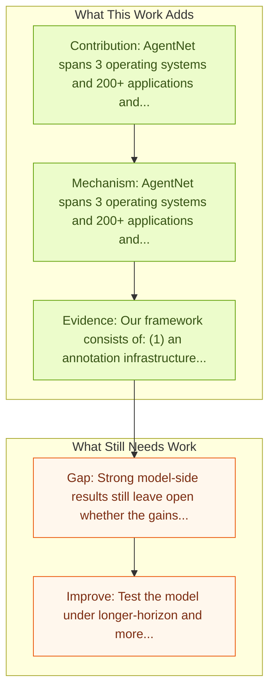

# OpenCUA: Open Foundations for Computer-Use Agents

Entry report generated on 2026-03-28 (Asia/Tokyo). This report is based on the repository entry, linked source metadata, and audit-time cross-checks.

## Snapshot

| Field | Detail |
| --- | --- |
| Repo entry | OpenCUA: Open Foundations for Computer-Use Agents |
| Actual target | [OpenCUA: Open Foundations for Computer-Use Agents](https://arxiv.org/abs/2508.09123) |
| Section | Models and Architectures |
| Source location | `papers/models/README.md:251` |
| Primary link type | `link` |
| Audit status | `ok` |
| Date / venue | NeurIPS 2025 Spotlight |
| Authors | Xinyuan Wang, Bowen Wang, Dunjie Lu, Junlin Yang, Tianbao Xie, Junli Wang, Jiaqi Deng, Xiaole Guo, Yiheng Xu, Chen Henry Wu, Zhennan Shen, Zhuokai Li, Ryan Li, Xiaochuan Li, Junda Chen, Boyuan Zheng, Peihang Li, Fangyu Lei, Ruisheng Cao, Yeqiao Fu, Dongchan Shin, Martin Shin, Jiarui Hu, Yuyan Wang, Jixuan Chen, Yuxiao Ye, Danyang Zhang, Dikang Du, Hao Hu, Huarong Chen, Zaida Zhou, Haotian Yao, Ziwei Chen, Qizheng Gu, Yipu Wang, Heng Wang, Diyi Yang, Victor Zhong, Flood Sung, Y. Charles, Zhilin Yang, Tao Yu |
| Focus tags | `model` `open-source` `foundation-model` `desktop` |
| Center of gravity | open-source, foundation-model, desktop |

## Quick Read

| Lens | Read |
| --- | --- |
| Problem pressure | Open-source framework for scaling computer-use-agent data, models, and annotation infrastructure. |
| Most novel move | The architecture-level novelty is most visible in agentNet spans 3 operating systems and 200+ applications and websites. |
| Strongest evidence | Our framework consists of: (1) an annotation infrastructure that seamlessly captures human computer-use demonstrations; (2) AgentNet... |
| Main caveat | Strong model-side results still leave open whether the gains survive desktop heterogeneity, long workflows, and OS-level side effects. |

## Visual Frame

```mermaid
flowchart LR
  Problem["Problem: Open-source framework for scaling computer-use-agent data..."] --> Novelty["Novelty: The architecture-level novelty is most visible in agentNet..."]
  Novelty --> Framework["Framework: AgentNet spans 3 operating systems and 200+ applications and..."]
  Framework --> Evidence["Evidence: Our framework consists of: (1) an annotation infrastructure..."]
  Evidence --> Gap["Gap: Strong model-side results still leave open whether the gains..."]
  Gap --> Next["Next: Test the model under longer-horizon and more..."]
  classDef insight fill:#dbeafe,stroke:#2563eb,color:#0f172a;
  classDef risk fill:#fee2e2,stroke:#dc2626,color:#7f1d1d;
  classDef next fill:#dcfce7,stroke:#16a34a,color:#14532d;
  class Problem,Novelty,Framework insight;
  class Evidence insight;
  class Gap risk;
  class Next next;
```

## Analysis Map

## Executive Summary

Open-source framework for scaling computer-use-agent data, models, and annotation infrastructure. Vision-language models have demonstrated impressive capabilities as computer-use agents (CUAs) capable of automating diverse computer tasks. As their commercial potential grows, critical details of the most capable CUA systems remain closed. As these agents will increasingly mediate digital interactions and execute consequential decisions on our behalf, the research community needs access to open CUA frameworks to study their capabilities, limitations, and risks.

## Code and Supporting Artifacts

- Code repository: no dedicated code link is currently tracked in the repo entry.

## Novelty

- The architecture-level novelty is most visible in agentNet spans 3 operating systems and 200+ applications and websites.
- It also stands out for captures human demonstrations and converts them into reflective state-action training pairs.
- It also stands out for openCUA-72B reaches 45.0% average success on OSWorld-Verified.

## Core Contributions

- AgentNet spans 3 operating systems and 200+ applications and websites.
- Captures human demonstrations and converts them into reflective state-action training pairs.
- OpenCUA-72B reaches 45.0% average success on OSWorld-Verified.
- Vision-language models have demonstrated impressive capabilities as computer-use agents (CUAs) capable of automating diverse computer tasks.

## Framework and Operating Logic

- AgentNet spans 3 operating systems and 200+ applications and websites.
- Captures human demonstrations and converts them into reflective state-action training pairs.
- OpenCUA-72B reaches 45.0% average success on OSWorld-Verified.

## Evidence and Claimed Results

- Our framework consists of: (1) an annotation infrastructure that seamlessly captures human computer-use demonstrations; (2) AgentNet, the first large-scale computer-use task dataset spanning 3 operating systems and 200+ applications and websites; (3) a scalable pipeline that transforms demonstrations into state-action pairs with reflective long Chain-of-Thought reasoning that sustain robust performance gains as data scales.
- In particular, OpenCUA-72B achieves an average success rate of 45.0% on OSWorld-Verified, establishing a new state-of-the-art (SOTA) among open-source models.

## Gaps and Limitations

- Strong model-side results still leave open whether the gains survive desktop heterogeneity, long workflows, and OS-level side effects.
- A stronger agent core does not by itself guarantee safer planning, error recovery, or tool-use discipline.

## How To Improve

- Test the model under longer-horizon and more safety-sensitive workloads rather than only narrow benchmark slices.
- Separate perception gains from planning gains with clearer studies over desktop heterogeneity, long workflows, and OS-level side effects.
- Report richer failure modes, especially around recovery after an early grounding or reasoning error.

## Why It Matters

- This entry matters because architecture choices determine whether GUI understanding becomes reliable control rather than passive description.
- It also acts as a capability anchor that other benchmark and method papers in the repo can be read against.

## Connections In This Repo

- [Mobile-Agent-v3.5: Multi-platform Fundamental GUI Agents](mobile-agent-v3-5-multi-platform-fundamental-gui-agents.md) - shared desktop or OS-level interaction surface.
- [ShowUI-Aloha: Human-Taught GUI Agent](showui-aloha-human-taught-gui-agent.md) - shared desktop or OS-level interaction surface.
- [OmegaUse: Building a General-Purpose GUI Agent for Autonomous Task Execution](omegause-building-a-general-purpose-gui-agent-for-autonomous-task-execution.md) - shared desktop or OS-level interaction surface.
- [AutoGLM: Autonomous Foundation Agents for GUIs](autoglm-autonomous-foundation-agents-for-guis.md) - neighbor entry in the same models and architectures cluster.

## Source Basis

- Primary basis: Primary arXiv abstract metadata was fetched live from the linked paper page.
- Audit access note: Metadata resolved cleanly during the audit.
