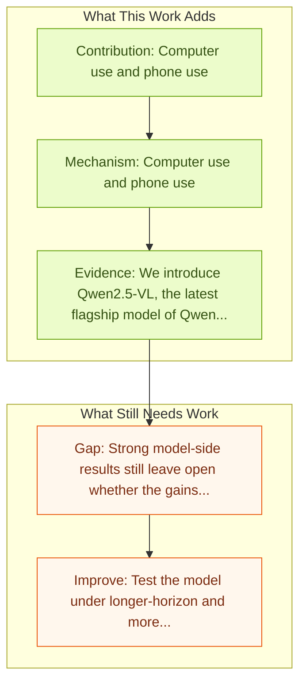

# Qwen2.5-VL Technical Report

Entry report generated on 2026-03-28 (Asia/Tokyo). This report is based on the repository entry, linked source metadata, and audit-time cross-checks.

## Snapshot

| Field | Detail |
| --- | --- |
| Repo entry | Qwen2.5-VL Technical Report |
| Actual target | [Qwen2.5-VL Technical Report](https://arxiv.org/abs/2502.13923) |
| Section | Models and Architectures |
| Source location | `papers/models/README.md:188` |
| Primary link type | `link` |
| Audit status | `limited-access` |
| Date / venue | February 2025 |
| Authors | Shuai Bai, Keqin Chen, Xuejing Liu, Jialin Wang, Wenbin Ge, Sibo Song, Kai Dang, Peng Wang, Shijie Wang, Jun Tang, Humen Zhong, Yuanzhi Zhu, Mingkun Yang, Zhaohai Li, Jianqiang Wan, Pengfei Wang, Wei Ding, Zheren Fu, Yiheng Xu, Jiabo Ye, Xi Zhang, Tianbao Xie, Zesen Cheng, Hang Zhang, Zhibo Yang, Haiyang Xu, Junyang Lin |
| Focus tags | `model` `vlm` `agent-capable` `reasoning` |
| Center of gravity | desktop, mobile |
| Model hub | [HuggingFace](https://huggingface.co/Qwen/Qwen2.5-VL-72B-Instruct) |

## Quick Read

| Lens | Read |
| --- | --- |
| Problem pressure | Visual agent capable of reasoning and dynamically directing tools. |
| Most novel move | The architecture-level novelty is most visible in computer use and phone use. |
| Strongest evidence | We introduce Qwen2.5-VL, the latest flagship model of Qwen vision-language series, which demonstrates significant advancements in both... |
| Main caveat | Strong model-side results still leave open whether the gains survive long-horizon transfer, recovery behavior, and distribution shift. |

## Visual Frame

```mermaid
flowchart LR
  Problem["Problem: Visual agent capable of reasoning and dynamically directing..."] --> Novelty["Novelty: The architecture-level novelty is most visible in computer..."]
  Novelty --> Framework["Framework: Computer use and phone use"]
  Framework --> Evidence["Evidence: We introduce Qwen2.5-VL, the latest flagship model of Qwen..."]
  Evidence --> Gap["Gap: Strong model-side results still leave open whether the gains..."]
  Gap --> Next["Next: Test the model under longer-horizon and more..."]
  classDef insight fill:#dbeafe,stroke:#2563eb,color:#0f172a;
  classDef risk fill:#fee2e2,stroke:#dc2626,color:#7f1d1d;
  classDef next fill:#dcfce7,stroke:#16a34a,color:#14532d;
  class Problem,Novelty,Framework insight;
  class Evidence insight;
  class Gap risk;
  class Next next;
```

## Analysis Map

## Executive Summary

Visual agent capable of reasoning and dynamically directing tools. We introduce Qwen2.5-VL, the latest flagship model of Qwen vision-language series, which demonstrates significant advancements in both foundational capabilities and innovative functionalities. Qwen2.5-VL achieves a major leap forward in understanding and interacting with the world through enhanced visual recognition, precise object localization, robust document parsing, and long-video comprehension. A standout feature of Qwen2.5-VL is its ability to localize objects using bounding boxes or points accurately.

## Code and Supporting Artifacts

- Code repository: no dedicated code link is currently tracked in the repo entry.
- Model weights or hub: [HuggingFace](https://huggingface.co/Qwen/Qwen2.5-VL-72B-Instruct)

## Novelty

- The architecture-level novelty is most visible in computer use and phone use.
- It also stands out for tool usage in real-world scenarios.
- It also stands out for operating computers and mobile devices.

## Core Contributions

- Computer use and phone use
- Tool usage in real-world scenarios
- Operating computers and mobile devices
- We introduce Qwen2.5-VL, the latest flagship model of Qwen vision-language series, which demonstrates significant advancements in both foundational capabilities and innovative functionalities.

## Framework and Operating Logic

- Computer use and phone use
- Tool usage in real-world scenarios
- Operating computers and mobile devices

## Evidence and Claimed Results

- We introduce Qwen2.5-VL, the latest flagship model of Qwen vision-language series, which demonstrates significant advancements in both foundational capabilities and innovative functionalities.
- Qwen2.5-VL achieves a major leap forward in understanding and interacting with the world through enhanced visual recognition, precise object localization, robust document parsing, and long-video comprehension.
- A standout feature of Qwen2.5-VL is its ability to localize objects using bounding boxes or points accurately.
- To handle complex inputs, Qwen2.5-VL introduces dynamic resolution processing and absolute time encoding, enabling it to process images of varying sizes and videos of extended durations (up to hours) with second-level event localization.

## Gaps and Limitations

- Strong model-side results still leave open whether the gains survive long-horizon transfer, recovery behavior, and distribution shift.
- A stronger agent core does not by itself guarantee safer planning, error recovery, or tool-use discipline.

## How To Improve

- Test the model under longer-horizon and more safety-sensitive workloads rather than only narrow benchmark slices.
- Separate perception gains from planning gains with clearer studies over long-horizon transfer, recovery behavior, and distribution shift.
- Report richer failure modes, especially around recovery after an early grounding or reasoning error.

## Why It Matters

- This entry matters because architecture choices determine whether GUI understanding becomes reliable control rather than passive description.
- It also acts as a capability anchor that other benchmark and method papers in the repo can be read against.

## Connections In This Repo

- [CogAgent: A Visual Language Model for GUI Agents](cogagent-a-visual-language-model-for-gui-agents.md) - neighbor entry in the same models and architectures cluster.
- [ScreenAgent: A VLM-driven Computer Control Agent](screenagent-a-vlm-driven-computer-control-agent.md) - neighbor entry in the same models and architectures cluster.
- [Attacking Vision-Language Computer Agents via Pop-ups](../safety-and-security/attacking-vision-language-computer-agents-via-pop-ups.md) - the papers sit in the same local research cluster in this repository.
- [UI-TARS: Pioneering Automated GUI Interaction with Native Agents](ui-tars-pioneering-automated-gui-interaction-with-native-agents.md) - neighbor entry in the same models and architectures cluster.

## Source Basis

- Primary basis: abstract-level paper metadata plus the repo-local notes in the source Markdown file.
- Audit access note: The linked source had limited direct readability during the audit, so the report leans more heavily on accessible metadata and repo context.
