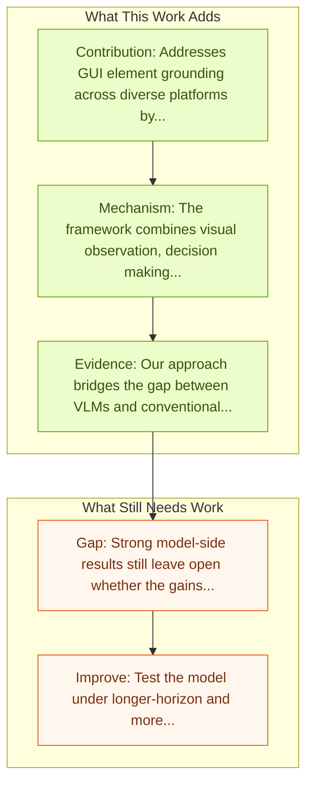

# R-VLM: Region-Aware VLM for Precise GUI Grounding

Entry report generated on 2026-03-28 (Asia/Tokyo). This report is based on the repository entry, linked source metadata, and audit-time cross-checks.

## Snapshot

| Field | Detail |
| --- | --- |
| Repo entry | R-VLM: Region-Aware VLM for Precise GUI Grounding |
| Actual target | [R-VLM: Region-Aware Vision Language Model for Precise GUI Grounding](https://arxiv.org/abs/2507.05673) |
| Section | Models and Architectures |
| Source location | `papers/models/README.md:218` |
| Primary link type | `link` |
| Audit status | `limited-access` |
| Date / venue | ACL 2025 |
| Authors | Joonhyung Park, Peng Tang, Sagnik Das, Srikar Appalaraju, Kunwar Yashraj Singh, R. Manmatha, Shabnam Ghadar |
| Focus tags | `model` `grounding` `region-aware` |
| Center of gravity | web, grounding |

## Quick Read

| Lens | Read |
| --- | --- |
| Problem pressure | Addresses GUI element grounding across diverse platforms by reducing irrelevant information processing. |
| Most novel move | The architecture-level novelty is most visible in grounding. |
| Strongest evidence | Our approach bridges the gap between VLMs and conventional object detection techniques, improving the state-of-the-art grounding... |
| Main caveat | Strong model-side results still leave open whether the gains survive precise element localization and recovery after grounding misses. |

## Visual Frame

```mermaid
flowchart LR
  Problem["Problem: Addresses GUI element grounding across diverse platforms by..."] --> Novelty["Novelty: The architecture-level novelty is most visible in grounding."]
  Novelty --> Framework["Framework: The framework combines visual observation, decision making..."]
  Framework --> Evidence["Evidence: Our approach bridges the gap between VLMs and conventional..."]
  Evidence --> Gap["Gap: Strong model-side results still leave open whether the gains..."]
  Gap --> Next["Next: Test the model under longer-horizon and more..."]
  classDef insight fill:#dbeafe,stroke:#2563eb,color:#0f172a;
  classDef risk fill:#fee2e2,stroke:#dc2626,color:#7f1d1d;
  classDef next fill:#dcfce7,stroke:#16a34a,color:#14532d;
  class Problem,Novelty,Framework insight;
  class Evidence insight;
  class Gap risk;
  class Next next;
```

## Analysis Map

## Executive Summary

Addresses GUI element grounding across diverse platforms by reducing irrelevant information processing. Visual agent models for automating human activities on Graphical User Interfaces (GUIs) have emerged as a promising research direction, driven by advances in large Vision Language Models (VLMs). A critical challenge in GUI automation is the precise grounding of interface elements across diverse platforms. Existing vision-only GUI agents directly ground elements from large and cluttered screenshots, requiring them to process substantial irrelevant information that compromises their accuracy.

## Novelty

- The architecture-level novelty is most visible in grounding.
- Visual agent models for automating human activities on Graphical User Interfaces (GUIs) have emerged as a promising research direction, driven by advances in large Vision Language Models (VLMs).
- A critical challenge in GUI automation is the precise grounding of interface elements across diverse platforms.

## Core Contributions

- Addresses GUI element grounding across diverse platforms by reducing irrelevant information processing.
- Visual agent models for automating human activities on Graphical User Interfaces (GUIs) have emerged as a promising research direction, driven by advances in large Vision Language Models (VLMs).
- A critical challenge in GUI automation is the precise grounding of interface elements across diverse platforms.
- Existing vision-only GUI agents directly ground elements from large and cluttered screenshots, requiring them to process substantial irrelevant information that compromises their accuracy.

## Framework and Operating Logic

- The framework combines visual observation, decision making, and action execution into a reusable control loop.
- Visual agent models for automating human activities on Graphical User Interfaces (GUIs) have emerged as a promising research direction, driven by advances in large Vision Language Models (VLMs).
- A critical challenge in GUI automation is the precise grounding of interface elements across diverse platforms.

## Evidence and Claimed Results

- Our approach bridges the gap between VLMs and conventional object detection techniques, improving the state-of-the-art grounding accuracy by 13% across diverse GUI platforms on the GUI grounding benchmarks ScreenSpot and AgentStudio.
- In addition, our R-VLM approach shows 3.2-9.7% absolute accuracy improvements in GUI navigation tasks on the AITW and Mind2Web benchmarks.

## Gaps and Limitations

- Strong model-side results still leave open whether the gains survive precise element localization and recovery after grounding misses.
- A stronger agent core does not by itself guarantee safer planning, error recovery, or tool-use discipline.

## How To Improve

- Test the model under longer-horizon and more safety-sensitive workloads rather than only narrow benchmark slices.
- Separate perception gains from planning gains with clearer studies over precise element localization and recovery after grounding misses.
- Report richer failure modes, especially around recovery after an early grounding or reasoning error.

## Why It Matters

- This entry matters because architecture choices determine whether GUI understanding becomes reliable control rather than passive description.
- It also acts as a capability anchor that other benchmark and method papers in the repo can be read against.

## Connections In This Repo

- [OmniParser: Pure Vision Based GUI Agent](omniparser-pure-vision-based-gui-agent.md) - shared emphasis on precise UI localization and action placement.
- [SeeClick: Harnessing GUI Grounding for Advanced Visual GUI Agents](seeclick-harnessing-gui-grounding-for-advanced-visual-gui-agents.md) - shared emphasis on precise UI localization and action placement.
- [Ferret-UI: Grounded Mobile UI Understanding](ferret-ui-grounded-mobile-ui-understanding.md) - shared emphasis on precise UI localization and action placement.
- [GUI-Actor: Coordinate-Free Visual Grounding](gui-actor-coordinate-free-visual-grounding.md) - shared emphasis on precise UI localization and action placement.

## Source Basis

- Primary basis: abstract-level paper metadata plus the repo-local notes in the source Markdown file.
- Audit access note: The linked source had limited direct readability during the audit, so the report leans more heavily on accessible metadata and repo context.
