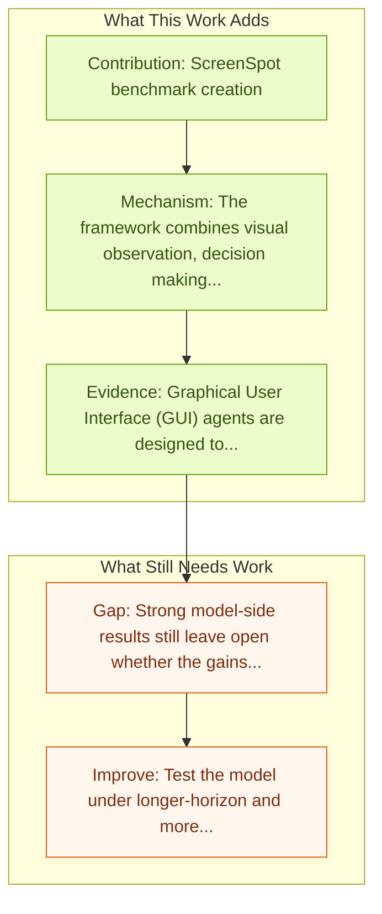

# SeeClick: Harnessing GUI Grounding for Advanced Visual GUI Agents

Entry report generated on 2026-03-28 (Asia/Tokyo). This report is based on the repository entry, linked source metadata, and audit-time cross-checks.

## Snapshot

| Field | Detail |
| --- | --- |
| Repo entry | SeeClick: Harnessing GUI Grounding for Advanced Visual GUI Agents |
| Actual target | [SeeClick: Harnessing GUI Grounding for Advanced Visual GUI Agents](https://arxiv.org/abs/2401.10935) |
| Section | Models and Architectures |
| Source location | `papers/models/README.md:99` |
| Primary link type | `link` |
| Audit status | `ok` |
| Date / venue | ACL 2024 |
| Authors | Kanzhi Cheng, Qiushi Sun, Yougang Chu, Fangzhi Xu, Yantao Li, Jianbing Zhang, Zhiyong Wu |
| Focus tags | `model` `grounding` `screenspot` |
| Center of gravity | web, desktop, mobile |
| Code repo | [GitHub](https://github.com/njucckevin/SeeClick) |

## Quick Read

| Lens | Read |
| --- | --- |
| Problem pressure | Visual GUI agent with GUI grounding pre-training. |
| Most novel move | The architecture-level novelty is most visible in screenSpot benchmark creation. |
| Strongest evidence | Graphical User Interface (GUI) agents are designed to automate complex tasks on digital devices, such as smartphones and desktops. |
| Main caveat | Strong model-side results still leave open whether the gains survive precise element localization and recovery after grounding misses. |

## Visual Frame

```mermaid
flowchart LR
  Problem["Problem: Visual GUI agent with GUI grounding pre-training."] --> Novelty["Novelty: The architecture-level novelty is most visible in screenSpot..."]
  Novelty --> Framework["Framework: The framework combines visual observation, decision making..."]
  Framework --> Evidence["Evidence: Graphical User Interface (GUI) agents are designed to..."]
  Evidence --> Gap["Gap: Strong model-side results still leave open whether the gains..."]
  Gap --> Next["Next: Test the model under longer-horizon and more..."]
  classDef insight fill:#dbeafe,stroke:#2563eb,color:#0f172a;
  classDef risk fill:#fee2e2,stroke:#dc2626,color:#7f1d1d;
  classDef next fill:#dcfce7,stroke:#16a34a,color:#14532d;
  class Problem,Novelty,Framework insight;
  class Evidence insight;
  class Gap risk;
  class Next next;
```

## Analysis Map

## Executive Summary

Visual GUI agent with GUI grounding pre-training. Graphical User Interface (GUI) agents are designed to automate complex tasks on digital devices, such as smartphones and desktops. Most existing GUI agents interact with the environment through extracted structured data, which can be notably lengthy (e.g., HTML) and occasionally inaccessible (e.g., on desktops). To alleviate this issue, we propose a novel visual GUI agent -- SeeClick, which only relies on screenshots for task automation.

## Code and Supporting Artifacts

- Code repository: [GitHub](https://github.com/njucckevin/SeeClick)

## Novelty

- The architecture-level novelty is most visible in screenSpot benchmark creation.
- It also stands out for automated GUI grounding data curation.
- It also stands out for cross-platform capabilities (mobile, desktop, web).

## Core Contributions

- ScreenSpot benchmark creation
- Automated GUI grounding data curation
- Cross-platform capabilities (mobile, desktop, web)
- ## Mobile-Focused Models

## Framework and Operating Logic

- The framework combines visual observation, decision making, and action execution into a reusable control loop.
- Graphical User Interface (GUI) agents are designed to automate complex tasks on digital devices, such as smartphones and desktops.
- Most existing GUI agents interact with the environment through extracted structured data, which can be notably lengthy (e.g., HTML) and occasionally inaccessible (e.g., on desktops).

## Evidence and Claimed Results

- Graphical User Interface (GUI) agents are designed to automate complex tasks on digital devices, such as smartphones and desktops.
- Most existing GUI agents interact with the environment through extracted structured data, which can be notably lengthy (e.g., HTML) and occasionally inaccessible (e.g., on desktops).
- To alleviate this issue, we propose a novel visual GUI agent -- SeeClick, which only relies on screenshots for task automation.

## Gaps and Limitations

- Strong model-side results still leave open whether the gains survive precise element localization and recovery after grounding misses.
- A stronger agent core does not by itself guarantee safer planning, error recovery, or tool-use discipline.

## How To Improve

- Test the model under longer-horizon and more safety-sensitive workloads rather than only narrow benchmark slices.
- Separate perception gains from planning gains with clearer studies over precise element localization and recovery after grounding misses.
- Report richer failure modes, especially around recovery after an early grounding or reasoning error.

## Why It Matters

- This entry matters because architecture choices determine whether GUI understanding becomes reliable control rather than passive description.
- It also acts as a capability anchor that other benchmark and method papers in the repo can be read against.

## Connections In This Repo

- [OmniParser: Pure Vision Based GUI Agent](omniparser-pure-vision-based-gui-agent.md) - shared emphasis on precise UI localization and action placement.
- [Ferret-UI: Grounded Mobile UI Understanding](ferret-ui-grounded-mobile-ui-understanding.md) - shared emphasis on precise UI localization and action placement.
- [R-VLM: Region-Aware VLM for Precise GUI Grounding](r-vlm-region-aware-vlm-for-precise-gui-grounding.md) - shared emphasis on precise UI localization and action placement.
- [GUI-Actor: Coordinate-Free Visual Grounding](gui-actor-coordinate-free-visual-grounding.md) - shared emphasis on precise UI localization and action placement.

## Source Basis

- Primary basis: abstract-level paper metadata plus the repo-local notes in the source Markdown file.
- Audit access note: Metadata resolved cleanly during the audit.
