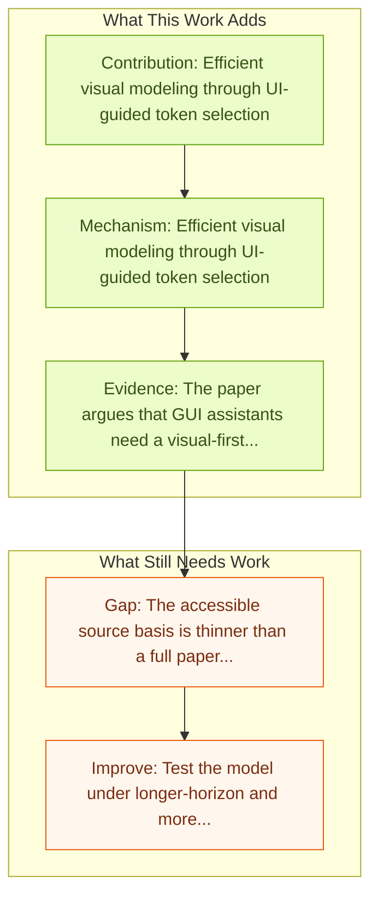

# ShowUI: Vision-Language-Action Model for GUI Visual Agent

Entry report generated on 2026-03-28 (Asia/Tokyo). This report is based on the repository entry, linked source metadata, and audit-time cross-checks.

## Snapshot

| Field | Detail |
| --- | --- |
| Repo entry | ShowUI: Vision-Language-Action Model for GUI Visual Agent |
| Actual target | [ShowUI: One Vision-Language-Action Model for GUI Visual Agent](https://openaccess.thecvf.com/content/CVPR2025/papers/Lin_ShowUI_One_Vision-Language-Action_Model_for_GUI_Visual_Agent_CVPR_2025_paper.pdf) |
| Section | Models and Architectures |
| Source location | `papers/models/README.md:52` |
| Primary link type | `link` |
| Audit status | `pdf-light-read` |
| Date / venue | CVPR 2025 |
| Authors | Kevin Qinghong Lin, Linjie Li, Difei Gao, Zhengyuan Yang, Shiwei Wu, Zechen Bai, Weixian Lei, Lijuan Wang, Mike Zheng Shou |
| Focus tags | `model` `vla` `efficient` |
| Center of gravity | models |

## Quick Read

| Lens | Read |
| --- | --- |
| Problem pressure | Vision-Language-Action model with novel UI-guided visual token selection strategy. |
| Most novel move | The architecture-level novelty is most visible in efficient visual modeling through UI-guided token selection. |
| Strongest evidence | The paper argues that GUI assistants need a visual-first action model rather than a language-only layer on top of HTML or accessibility... |
| Main caveat | The accessible source basis is thinner than a full paper review, so some claims rest on project metadata, repo notes, or abstract-level... |

## Visual Frame

```mermaid
flowchart LR
  Problem["Problem: Vision-Language-Action model with novel UI-guided visual..."] --> Novelty["Novelty: The architecture-level novelty is most visible in efficient..."]
  Novelty --> Framework["Framework: Efficient visual modeling through UI-guided token selection"]
  Framework --> Evidence["Evidence: The paper argues that GUI assistants need a visual-first..."]
  Evidence --> Gap["Gap: The accessible source basis is thinner than a full paper..."]
  Gap --> Next["Next: Test the model under longer-horizon and more..."]
  classDef insight fill:#dbeafe,stroke:#2563eb,color:#0f172a;
  classDef risk fill:#fee2e2,stroke:#dc2626,color:#7f1d1d;
  classDef next fill:#dcfce7,stroke:#16a34a,color:#14532d;
  class Problem,Novelty,Framework insight;
  class Evidence insight;
  class Gap risk;
  class Next next;
```

## Analysis Map

## Executive Summary

Vision-Language-Action model with novel UI-guided visual token selection strategy. The paper argues that GUI assistants need a visual-first action model rather than a language-only layer on top of HTML or accessibility trees. ShowUI introduces three core ideas: UI-guided visual token selection to cut compute by exploiting screen structure, interleaved vision-language-action streaming to manage action history, and a carefully curated GUI instruction-following dataset with resampling to handle data imbalance. The overall goal is a single model that can perceive, reason, and act across GUI tasks with lower cost.

## Code and Supporting Artifacts

- Code repository: no dedicated code link is currently tracked in the repo entry.

## Novelty

- The architecture-level novelty is most visible in efficient visual modeling through UI-guided token selection.
- It also stands out for interleaved vision-language-action streaming.
- It also stands out for unified handling of different GUI tasks.

## Core Contributions

- Efficient visual modeling through UI-guided token selection
- Interleaved vision-language-action streaming
- Unified handling of different GUI tasks
- The paper argues that GUI assistants need a visual-first action model rather than a language-only layer on top of HTML or accessibility trees.

## Framework and Operating Logic

- Efficient visual modeling through UI-guided token selection
- Interleaved vision-language-action streaming
- Unified handling of different GUI tasks

## Evidence and Claimed Results

- The paper argues that GUI assistants need a visual-first action model rather than a language-only layer on top of HTML or accessibility trees.
- ShowUI introduces three core ideas: UI-guided visual token selection to cut compute by exploiting screen structure, interleaved vision-language-action streaming to manage action history, and a carefully curated GUI instruction-following dataset with resampling to handle data imbalance.
- The overall goal is a single model that can perceive, reason, and act across GUI tasks with lower cost.

## Gaps and Limitations

- The accessible source basis is thinner than a full paper review, so some claims rest on project metadata, repo notes, or abstract-level evidence rather than a complete methods read.
- Strong model-side results still leave open whether the gains survive long-horizon transfer, recovery behavior, and distribution shift.
- A stronger agent core does not by itself guarantee safer planning, error recovery, or tool-use discipline.

## How To Improve

- Test the model under longer-horizon and more safety-sensitive workloads rather than only narrow benchmark slices.
- Separate perception gains from planning gains with clearer studies over long-horizon transfer, recovery behavior, and distribution shift.
- Report richer failure modes, especially around recovery after an early grounding or reasoning error.

## Why It Matters

- This entry matters because architecture choices determine whether GUI understanding becomes reliable control rather than passive description.
- It also acts as a capability anchor that other benchmark and method papers in the repo can be read against.

## Connections In This Repo

- [UI-TARS: Pioneering Automated GUI Interaction with Native Agents](ui-tars-pioneering-automated-gui-interaction-with-native-agents.md) - neighbor entry in the same models and architectures cluster.
- [UI-TARS-2: Advancing GUI Agent with Multi-Turn RL](ui-tars-2-advancing-gui-agent-with-multi-turn-rl.md) - neighbor entry in the same models and architectures cluster.
- [CogAgent: A Visual Language Model for GUI Agents](cogagent-a-visual-language-model-for-gui-agents.md) - neighbor entry in the same models and architectures cluster.
- [ScreenAgent: A VLM-driven Computer Control Agent](screenagent-a-vlm-driven-computer-control-agent.md) - neighbor entry in the same models and architectures cluster.

## Source Basis

- Primary basis: Companion arXiv abstract used to complement the CVPR PDF link.
- Audit access note: The PDF was resolved, but this report favors abstract-level metadata and repo-curated notes instead of pretending to be a full manual paper review.
