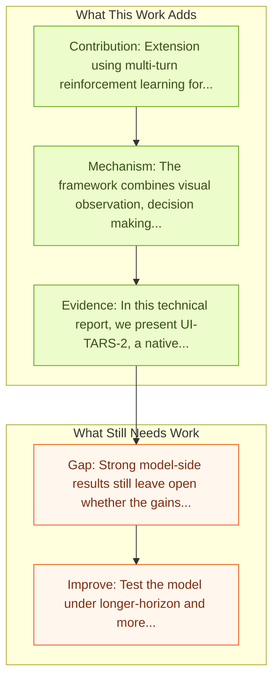

# UI-TARS-2: Advancing GUI Agent with Multi-Turn RL

Entry report generated on 2026-03-28 (Asia/Tokyo). This report is based on the repository entry, linked source metadata, and audit-time cross-checks.

## Snapshot

| Field | Detail |
| --- | --- |
| Repo entry | UI-TARS-2: Advancing GUI Agent with Multi-Turn RL |
| Actual target | [UI-TARS-2 Technical Report: Advancing GUI Agent with Multi-Turn Reinforcement Learning](https://arxiv.org/abs/2509.02544) |
| Section | Models and Architectures |
| Source location | `papers/models/README.md:28` |
| Primary link type | `link` |
| Audit status | `ok` |
| Date / venue | September 2025 |
| Authors | Haoming Wang, Haoyang Zou, Huatong Song, Jiazhan Feng, Junjie Fang, Junting Lu, Longxiang Liu, Qinyu Luo, Shihao Liang, Shijue Huang, Wanjun Zhong, Yining Ye, Yujia Qin, Yuwen Xiong, Yuxin Song, Zhiyong Wu, Aoyan Li, Bo Li, Chen Dun, Chong Liu, Daoguang Zan, Fuxing Leng, Hanbin Wang, Hao Yu, Haobin Chen, Hongyi Guo, Jing Su, Jingjia Huang, Kai Shen, Kaiyu Shi, Lin Yan, Peiyao Zhao, Pengfei Liu, Qinghao Ye, Renjie Zheng, Shulin Xin, Wayne Xin Zhao, Wen Heng, Wenhao Huang, Wenqian Wang, Xiaobo Qin, Yi Lin, Youbin Wu, Zehui Chen, Zihao Wang, Baoquan Zhong, Xinchun Zhang, Xujing Li, Yuanfan Li, Zhongkai Zhao, Chengquan Jiang, Faming Wu, Haotian Zhou, Jinlin Pang, Li Han, Qi Liu, Qianli Ma, Siyao Liu, Songhua Cai, Wenqi Fu, Xin Liu, Yaohui Wang, Zhi Zhang, Bo Zhou, Guoliang Li, Jiajun Shi, Jiale Yang, Jie Tang, Li Li, Qihua Han, Taoran Lu, Woyu Lin, Xiaokang Tong, Xinyao Li, Yichi Zhang, Yu Miao, Zhengxuan Jiang, Zili Li, Ziyuan Zhao, Chenxin Li, Dehua Ma, Feng Lin, Ge Zhang, Haihua Yang, Hangyu Guo, Hongda Zhu, Jiaheng Liu, Junda Du, Kai Cai, Kuanye Li, Lichen Yuan, Meilan Han, Minchao Wang, Shuyue Guo, Tianhao Cheng, Xiaobo Ma, Xiaojun Xiao, Xiaolong Huang, Xinjie Chen, Yidi Du, Yilin Chen, Yiwen Wang, Zhaojian Li, Zhenzhu Yang, Zhiyuan Zeng, Chaolin Jin, Chen Li, Hao Chen, Haoli Chen, Jian Chen, Qinghao Zhao, Guang Shi |
| Focus tags | `model` `reinforcement-learning` `multi-turn` |
| Center of gravity | web, desktop, mobile |

## Quick Read

| Lens | Read |
| --- | --- |
| Problem pressure | Extension using multi-turn reinforcement learning for improved performance. |
| Most novel move | The architecture-level novelty is most visible in reinforcement-learning. |
| Strongest evidence | In this technical report, we present UI-TARS-2, a native GUI-centered agent model that addresses these challenges through a systematic... |
| Main caveat | Strong model-side results still leave open whether the gains survive long-horizon transfer, recovery behavior, and distribution shift. |

## Visual Frame

```mermaid
flowchart LR
  Problem["Problem: Extension using multi-turn reinforcement learning for..."] --> Novelty["Novelty: The architecture-level novelty is most visible in..."]
  Novelty --> Framework["Framework: The framework combines visual observation, decision making..."]
  Framework --> Evidence["Evidence: In this technical report, we present UI-TARS-2, a native..."]
  Evidence --> Gap["Gap: Strong model-side results still leave open whether the gains..."]
  Gap --> Next["Next: Test the model under longer-horizon and more..."]
  classDef insight fill:#dbeafe,stroke:#2563eb,color:#0f172a;
  classDef risk fill:#fee2e2,stroke:#dc2626,color:#7f1d1d;
  classDef next fill:#dcfce7,stroke:#16a34a,color:#14532d;
  class Problem,Novelty,Framework insight;
  class Evidence insight;
  class Gap risk;
  class Next next;
```

## Analysis Map

## Executive Summary

Extension using multi-turn reinforcement learning for improved performance. The development of autonomous agents for graphical user interfaces (GUIs) presents major challenges in artificial intelligence. While recent advances in native agent models have shown promise by unifying perception, reasoning, action, and memory through end-to-end learning, open problems remain in data scalability, multi-turn reinforcement learning (RL), the limitations of GUI-only operation, and environment stability. In this technical report, we present UI-TARS-2, a native GUI-centered agent model that addresses these challenges through a systematic training methodology: a data flywheel for scalable data generation, a stabilized multi-turn RL framework, a hybrid GUI environment that integrates file systems and terminals, and a unified sandbox platform for large-scale rollouts.

## Code and Supporting Artifacts

- Code repository: no dedicated code link is currently tracked in the repo entry.

## Novelty

- The architecture-level novelty is most visible in reinforcement-learning.
- The development of autonomous agents for graphical user interfaces (GUIs) presents major challenges in artificial intelligence.
- While recent advances in native agent models have shown promise by unifying perception, reasoning, action, and memory through end-to-end learning, open problems remain in data scalability, multi-turn reinforcement learning (RL), the limitations of GUI-only operation, and environment stability.

## Core Contributions

- Extension using multi-turn reinforcement learning for improved performance.
- The development of autonomous agents for graphical user interfaces (GUIs) presents major challenges in artificial intelligence.
- While recent advances in native agent models have shown promise by unifying perception, reasoning, action, and memory through end-to-end learning, open problems remain in data scalability, multi-turn reinforcement learning (RL), the limitations of GUI-only operation, and environment stability.
- In this technical report, we present UI-TARS-2, a native GUI-centered agent model that addresses these challenges through a systematic training methodology: a data flywheel for scalable data generation, a stabilized multi-turn RL framework, a hybrid GUI environment that integrates file systems and terminals, and a unified sandbox platform for large-scale rollouts.

## Framework and Operating Logic

- The framework combines visual observation, decision making, and action execution into a reusable control loop.
- The development of autonomous agents for graphical user interfaces (GUIs) presents major challenges in artificial intelligence.
- While recent advances in native agent models have shown promise by unifying perception, reasoning, action, and memory through end-to-end learning, open problems remain in data scalability, multi-turn reinforcement learning (RL), the limitations of GUI-only operation, and environment stability.

## Evidence and Claimed Results

- In this technical report, we present UI-TARS-2, a native GUI-centered agent model that addresses these challenges through a systematic training methodology: a data flywheel for scalable data generation, a stabilized multi-turn RL framework, a hybrid GUI environment that integrates file systems and terminals, and a unified sandbox platform for large-scale rollouts.
- Empirical evaluation demonstrates that UI-TARS-2 achieves significant improvements over its predecessor UI-TARS-1.5.
- On GUI benchmarks, it reaches 88.2 on Online-Mind2Web, 47.5 on OSWorld, 50.6 on WindowsAgentArena, and 73.3 on AndroidWorld, outperforming strong baselines such as Claude and OpenAI agents.
- In game environments, it attains a mean normalized score of 59.8 across a 15-game suite-roughly 60% of human-level performance-and remains competitive with frontier proprietary models (e.g., OpenAI o3) on LMGame-Bench.

## Gaps and Limitations

- Strong model-side results still leave open whether the gains survive long-horizon transfer, recovery behavior, and distribution shift.
- A stronger agent core does not by itself guarantee safer planning, error recovery, or tool-use discipline.

## How To Improve

- Test the model under longer-horizon and more safety-sensitive workloads rather than only narrow benchmark slices.
- Separate perception gains from planning gains with clearer studies over long-horizon transfer, recovery behavior, and distribution shift.
- Report richer failure modes, especially around recovery after an early grounding or reasoning error.

## Why It Matters

- This entry matters because architecture choices determine whether GUI understanding becomes reliable control rather than passive description.
- It also acts as a capability anchor that other benchmark and method papers in the repo can be read against.

## Connections In This Repo

- [ComputerRL: End-to-End Online RL for Computer Use Agents](../methods-and-techniques/computerrl-end-to-end-online-rl-for-computer-use-agents.md) - the papers sit in the same local research cluster in this repository.
- [WebRL: Self-Evolving Online Curriculum RL for Web Agents](../methods-and-techniques/webrl-self-evolving-online-curriculum-rl-for-web-agents.md) - the papers sit in the same local research cluster in this repository.
- [DigiRL: Training In-The-Wild Device-Control](../methods-and-techniques/digirl-training-in-the-wild-device-control.md) - the papers sit in the same local research cluster in this repository.
- [UI-TARS: Pioneering Automated GUI Interaction with Native Agents](ui-tars-pioneering-automated-gui-interaction-with-native-agents.md) - neighbor entry in the same models and architectures cluster.

## Source Basis

- Primary basis: abstract-level paper metadata plus the repo-local notes in the source Markdown file.
- Audit access note: Metadata resolved cleanly during the audit.
