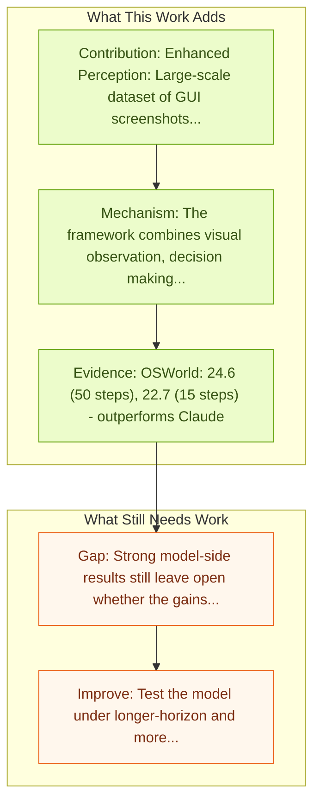

# UI-TARS: Pioneering Automated GUI Interaction with Native Agents

Entry report generated on 2026-03-28 (Asia/Tokyo). This report is based on the repository entry, linked source metadata, and audit-time cross-checks.

## Snapshot

| Field | Detail |
| --- | --- |
| Repo entry | UI-TARS: Pioneering Automated GUI Interaction with Native Agents |
| Actual target | [UI-TARS: Pioneering Automated GUI Interaction with Native Agents](https://arxiv.org/abs/2501.12326) |
| Section | Models and Architectures |
| Source location | `papers/models/README.md:9` |
| Primary link type | `link` |
| Audit status | `ok` |
| Date / venue | January 2025 |
| Authors | Yujia Qin, Yining Ye, Junjie Fang, Haoming Wang, Shihao Liang, Shizuo Tian, Junda Zhang, Jiahao Li |
| Focus tags | `model`, `bytedance`, `sota`, `end-to-end` |
| Center of gravity | `mobile`, `grounding` |
| Related assets | [GitHub](https://github.com/bytedance/UI-TARS) |

## Quick Read

| Lens | Read |
| --- | --- |
| Problem pressure | Native GUI agent model that solely perceives screenshots and performs human-like interactions. |
| Most novel move | The architecture-level novelty is most visible in enhanced Perception: Large-scale dataset of GUI screenshots for context-aware... |
| Strongest evidence | OSWorld: 24.6 (50 steps), 22.7 (15 steps) - outperforms Claude |
| Main caveat | Strong model-side results still leave open whether the gains survive long-horizon transfer, recovery behavior, and distribution shift. |

## Visual Frame

```mermaid
flowchart LR
  Problem["Problem: Native GUI agent model that solely perceives screenshots and..."] --> Novelty["Novelty: The architecture-level novelty is most visible in enhanced..."]
  Novelty --> Framework["Framework: The framework combines visual observation, decision making..."]
  Framework --> Evidence["Evidence: OSWorld: 24.6 (50 steps), 22.7 (15 steps) - outperforms Claude"]
  Evidence --> Gap["Gap: Strong model-side results still leave open whether the gains..."]
  Gap --> Next["Next: Test the model under longer-horizon and more..."]
  classDef insight fill:#dbeafe,stroke:#2563eb,color:#0f172a;
  classDef risk fill:#fee2e2,stroke:#dc2626,color:#7f1d1d;
  classDef next fill:#dcfce7,stroke:#16a34a,color:#14532d;
  class Problem,Novelty,Framework insight;
  class Evidence insight;
  class Gap risk;
  class Next next;
```

## Analysis Map

## Executive Summary

Native GUI agent model that solely perceives screenshots and performs human-like interactions. The paper introduces UI-TARS, a native GUI agent model that solely perceives the screenshots as input and performs human-like interactions (e.g., keyboard and mouse operations). Unlike prevailing agent frameworks that depend on heavily wrapped commercial models (e.g., GPT-4o) with expert-crafted prompts and workflows, UI-TARS is an end-to-end model that outperforms these sophisticated frameworks. The reported experiments indicate its superior performance: UI-TARS achieves SOTA performance in 10+ GUI agent benchmarks evaluating perception, grounding, and GUI task execution.

## Novelty

- The architecture-level novelty is most visible in enhanced Perception: Large-scale dataset of GUI screenshots for context-aware understanding.
- It also stands out for unified Action Modeling: Standardized actions across platforms.
- It also stands out for system-2 Reasoning: Deliberate reasoning with task decomposition, reflection, milestone recognition.

## Core Contributions

- Enhanced Perception: Large-scale dataset of GUI screenshots for context-aware understanding
- Unified Action Modeling: Standardized actions across platforms
- System-2 Reasoning: Deliberate reasoning with task decomposition, reflection, milestone recognition
- Iterative Training: Reflective online traces collection on virtual machines

## Framework and Operating Logic

- The framework combines visual observation, decision making, and action execution into a reusable control loop.
- The paper introduces UI-TARS, a native GUI agent model that solely perceives the screenshots as input and performs human-like interactions (e.g., keyboard and mouse operations).
- Unlike prevailing agent frameworks that depend on heavily wrapped commercial models (e.g., GPT-4o) with expert-crafted prompts and workflows, UI-TARS is an end-to-end model that outperforms these sophisticated frameworks.

## Evidence and Claimed Results

- OSWorld: 24.6 (50 steps), 22.7 (15 steps) - outperforms Claude
- AndroidWorld: 46.6 - surpasses GPT-4o (34.5)
- Unlike prevailing agent frameworks that depend on heavily wrapped commercial models (e.g., GPT-4o) with expert-crafted prompts and workflows, UI-TARS is an end-to-end model that outperforms these sophisticated frameworks.
- Experiments demonstrate its superior performance: UI-TARS achieves SOTA performance in 10+ GUI agent benchmarks evaluating perception, grounding, and GUI task execution.
- Notably, in the OSWorld benchmark, UI-TARS achieves scores of 24.6 with 50 steps and 22.7 with 15 steps, outperforming Claude (22.0 and 14.9 respectively).

## Gaps and Limitations

- Strong model-side results still leave open whether the gains survive long-horizon transfer, recovery behavior, and distribution shift.
- A stronger agent core does not by itself guarantee safer planning, error recovery, or tool-use discipline.

## How To Improve

- Test the model under longer-horizon and more safety-sensitive workloads rather than only narrow benchmark slices.
- Separate perception gains from planning gains with clearer studies over long-horizon transfer, recovery behavior, and distribution shift.
- Report richer failure modes, especially around recovery after an early grounding or reasoning error.

## Why It Matters

- This entry matters because architecture choices determine whether GUI understanding becomes reliable control rather than passive description.
- It also acts as a capability anchor that other benchmark and method papers in the repo can be read against.

## Connections In This Repo

- [Mobile-Agent-v3: Fundamental Agents for GUI Automation](mobile-agent-v3-fundamental-agents-for-gui-automation.md) - neighbor entry in the same models and architectures cluster.
- [WebVoyager: End-to-End Web Agent with LMMs](../benchmarks-and-datasets/webvoyager-end-to-end-web-agent-with-lmms.md) - benchmark pressure here is a natural proving ground for the model.
- [UI-TARS-2: Advancing GUI Agent with Multi-Turn RL](ui-tars-2-advancing-gui-agent-with-multi-turn-rl.md) - neighbor entry in the same models and architectures cluster.
- [CogAgent: A Visual Language Model for GUI Agents](cogagent-a-visual-language-model-for-gui-agents.md) - neighbor entry in the same models and architectures cluster.

## Source Basis

- Primary basis: abstract-level paper metadata plus the repo-local notes in the source Markdown file.
- Audit access note: Metadata resolved cleanly during the audit.
