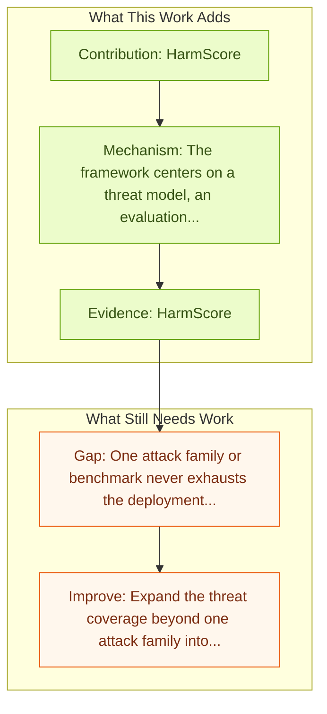

# AgentHarm: LLM Agent Safety Benchmark

Entry report generated on 2026-03-28 (Asia/Tokyo). This report is based on the repository entry, linked source metadata, and audit-time cross-checks.

## Snapshot

| Field | Detail |
| --- | --- |
| Repo entry | AgentHarm: LLM Agent Safety Benchmark |
| Actual target | [AgentHarm: A Benchmark for Measuring Harmfulness of LLM Agents](https://arxiv.org/abs/2410.09024) |
| Section | Safety and Security |
| Source location | `papers/safety/README.md:7` |
| Primary link type | `link` |
| Audit status | `ok` |
| Date / venue | October 2024 |
| Authors | Maksym Andriushchenko, Alexandra Souly, Mateusz Dziemian, Derek Duenas, Maxwell Lin, Justin Wang, Dan Hendrycks, Andy Zou |
| Focus tags | `safety`, `benchmark`, `jailbreak`, `multi-step` |
| Center of gravity | `safety` |

## Quick Read

| Lens | Read |
| --- | --- |
| Problem pressure | Benchmark assessing LLM agents' capacity to resist harmful tasks. |
| Most novel move | The paper turns general security concern into an operational agent-risk story centered on jailbreak, multi-step, key findings. |
| Strongest evidence | HarmScore |
| Main caveat | One attack family or benchmark never exhausts the deployment threat surface for computer-use agents. |

## Visual Frame

```mermaid
flowchart LR
  Problem["Problem: Benchmark assessing LLM agents' capacity to resist harmful..."] --> Novelty["Novelty: The paper turns general security concern into an operational..."]
  Novelty --> Framework["Framework: The framework centers on a threat model, an evaluation..."]
  Framework --> Evidence["Evidence: HarmScore"]
  Evidence --> Gap["Gap: One attack family or benchmark never exhausts the deployment..."]
  Gap --> Next["Next: Expand the threat coverage beyond one attack family into..."]
  classDef insight fill:#dbeafe,stroke:#2563eb,color:#0f172a;
  classDef risk fill:#fee2e2,stroke:#dc2626,color:#7f1d1d;
  classDef next fill:#dcfce7,stroke:#16a34a,color:#14532d;
  class Problem,Novelty,Framework insight;
  class Evidence insight;
  class Gap risk;
  class Next next;
```

## Analysis Map

## Executive Summary

Benchmark assessing LLM agents' capacity to resist harmful tasks. The robustness of LLMs to jailbreak attacks, where users design prompts to circumvent safety measures and misuse model capabilities, has been studied primarily for LLMs acting as simple chatbots. Meanwhile, LLM agents -- which use external tools and can execute multi-stage tasks -- may pose a greater risk if misused, but their robustness remains underexplored. To facilitate research on LLM agent misuse, we propose a new benchmark called AgentHarm.

## Novelty

- The paper turns general security concern into an operational agent-risk story centered on jailbreak, multi-step, key findings.
- The robustness of LLMs to jailbreak attacks, where users design prompts to circumvent safety measures and misuse model capabilities, has been studied primarily for LLMs acting as simple chatbots.
- Meanwhile, LLM agents -- which use external tools and can execute multi-stage tasks -- may pose a greater risk if misused, but their robustness remains underexplored.

## Core Contributions

- HarmScore
- RefusalRate
- Exposes vulnerabilities in multi-turn agentic settings
- Single-turn chatbot defenses don't transfer well
- Turns agent safety into concrete scenarios, attack surfaces, or measurable guardrail objectives.

## Framework and Operating Logic

- The framework centers on a threat model, an evaluation setup, and a concrete criterion for attack or defense success.
- The robustness of LLMs to jailbreak attacks, where users design prompts to circumvent safety measures and misuse model capabilities, has been studied primarily for LLMs acting as simple chatbots.
- Meanwhile, LLM agents -- which use external tools and can execute multi-stage tasks -- may pose a greater risk if misused, but their robustness remains underexplored.

## Evidence and Claimed Results

- HarmScore
- RefusalRate
- Exposes vulnerabilities in multi-turn agentic settings
- Single-turn chatbot defenses don't transfer well
- The benchmark includes a diverse set of 110 explicitly malicious agent tasks (440 with augmentations), covering 11 harm categories including fraud, cybercrime, and harassment.

## Gaps and Limitations

- One attack family or benchmark never exhausts the deployment threat surface for computer-use agents.
- Transfer remains uncertain across stacks, especially once the interface shifts toward long-horizon transfer, recovery behavior, and distribution shift.

## How To Improve

- Expand the threat coverage beyond one attack family into cross-platform, human-in-the-loop, and defense-cost scenarios.
- Connect the benchmark or analysis to deployable mitigations such as takeover triggers, isolation policies, and audit logging.
- Measure the usability cost of safety controls so defenses can be judged as systems decisions, not only as refusals.

## Why It Matters

- This entry matters because stronger computer-use capability without a matching safety story creates an immediate operational risk.
- It gives the repo a concrete threat or guardrail lens instead of only capability metrics.

## Connections In This Repo

- [JARVIS or Ultron? Safety and Security Threats of Computer-Using Agents](../survey-papers/jarvis-or-ultron-safety-and-security-threats-of-computer-using-agents.md) - shared concern with adversarial behavior, guardrails, or deployment risk.
- [WebGuard: Safety Dataset for Web Agents](webguard-safety-dataset-for-web-agents.md) - shared concern with adversarial behavior, guardrails, or deployment risk.
- [JARVIS or Ultron? Safety and Security Threats of CUAs](jarvis-or-ultron-safety-and-security-threats-of-cuas.md) - shared concern with adversarial behavior, guardrails, or deployment risk.
- [RedTeamCUA: Security Testing for Computer Use Agents](redteamcua-security-testing-for-computer-use-agents.md) - shared concern with adversarial behavior, guardrails, or deployment risk.

## Source Basis

- Primary basis: abstract-level paper metadata plus the repo-local notes in the source Markdown file.
- Audit access note: Metadata resolved cleanly during the audit.
