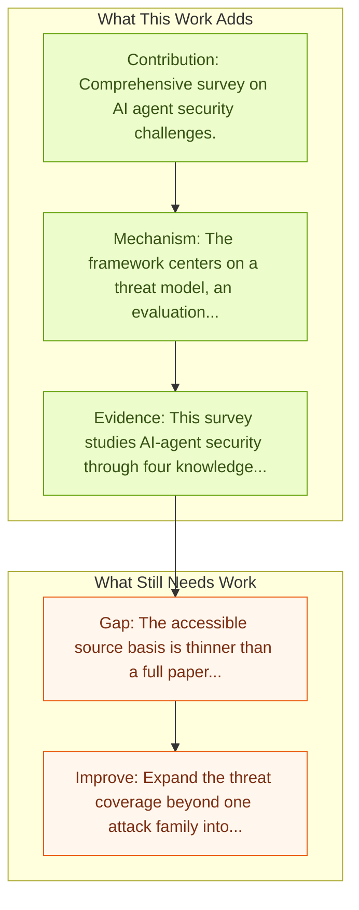

# AI Agents Under Threat: Key Security Challenges and Future Pathways

Entry report generated on 2026-03-28 (Asia/Tokyo). This report is based on the repository entry, linked source metadata, and audit-time cross-checks.

## Snapshot

| Field | Detail |
| --- | --- |
| Repo entry | AI Agents Under Threat: Key Security Challenges and Future Pathways |
| Actual target | [AI Agents Under Threat: Key Security Challenges and Future Pathways](https://dl.acm.org/doi/10.1145/3716628) |
| Section | Safety and Security |
| Source location | `papers/safety/README.md:214` |
| Primary link type | `link` |
| Audit status | `script-blocked` |
| Date / venue | ACM Computing Surveys 2025 |
| Authors | Zehang Deng, Yongjian Guo, Changzhou Han, Wanlun Ma, Junwu Xiong, Sheng Wen, Yang Xiang |
| Focus tags | `survey` `security` `comprehensive` |
| Center of gravity | safety |

## Quick Read

| Lens | Read |
| --- | --- |
| Problem pressure | Comprehensive survey on AI agent security challenges. |
| Most novel move | The paper turns general security concern into an operational agent-risk story centered on agent threat models and misuse evaluation. |
| Strongest evidence | This survey studies AI-agent security through four knowledge gaps: unpredictable multi-step inputs, opaque internal execution, variable... |
| Main caveat | The accessible source basis is thinner than a full paper review, so some claims rest on project metadata, repo notes, or abstract-level... |

## Visual Frame

```mermaid
flowchart LR
  Problem["Problem: Comprehensive survey on AI agent security challenges."] --> Novelty["Novelty: The paper turns general security concern into an operational..."]
  Novelty --> Framework["Framework: The framework centers on a threat model, an evaluation..."]
  Framework --> Evidence["Evidence: This survey studies AI-agent security through four knowledge..."]
  Evidence --> Gap["Gap: The accessible source basis is thinner than a full paper..."]
  Gap --> Next["Next: Expand the threat coverage beyond one attack family into..."]
  classDef insight fill:#dbeafe,stroke:#2563eb,color:#0f172a;
  classDef risk fill:#fee2e2,stroke:#dc2626,color:#7f1d1d;
  classDef next fill:#dcfce7,stroke:#16a34a,color:#14532d;
  class Problem,Novelty,Framework insight;
  class Evidence insight;
  class Gap risk;
  class Next next;
```

## Analysis Map

## Executive Summary

Comprehensive survey on AI agent security challenges. This survey studies AI-agent security through four knowledge gaps: unpredictable multi-step inputs, opaque internal execution, variable operating environments, and interaction with untrusted external entities. Its value is not a new defense but a structured threat map that explains why agent security is harder than single-turn LLM safety. The survey also highlights how existing defenses remain incomplete once agents begin planning, tool use, and long-horizon interaction.

## Novelty

- The paper turns general security concern into an operational agent-risk story centered on agent threat models and misuse evaluation.
- This survey studies AI-agent security through four knowledge gaps: unpredictable multi-step inputs, opaque internal execution, variable operating environments, and interaction with untrusted external entities.
- Its value is not a new defense but a structured threat map that explains why agent security is harder than single-turn LLM safety.

## Core Contributions

- Comprehensive survey on AI agent security challenges.
- This survey studies AI-agent security through four knowledge gaps: unpredictable multi-step inputs, opaque internal execution, variable operating environments, and interaction with untrusted external entities.
- Its value is not a new defense but a structured threat map that explains why agent security is harder than single-turn LLM safety.
- The survey also highlights how existing defenses remain incomplete once agents begin planning, tool use, and long-horizon interaction.
- Turns agent safety into concrete scenarios, attack surfaces, or measurable guardrail objectives.

## Framework and Operating Logic

- The framework centers on a threat model, an evaluation setup, and a concrete criterion for attack or defense success.
- This survey studies AI-agent security through four knowledge gaps: unpredictable multi-step inputs, opaque internal execution, variable operating environments, and interaction with untrusted external entities.
- Its value is not a new defense but a structured threat map that explains why agent security is harder than single-turn LLM safety.

## Evidence and Claimed Results

- This survey studies AI-agent security through four knowledge gaps: unpredictable multi-step inputs, opaque internal execution, variable operating environments, and interaction with untrusted external entities.
- Its value is not a new defense but a structured threat map that explains why agent security is harder than single-turn LLM safety.
- The survey also highlights how existing defenses remain incomplete once agents begin planning, tool use, and long-horizon interaction.

## Gaps and Limitations

- The accessible source basis is thinner than a full paper review, so some claims rest on project metadata, repo notes, or abstract-level evidence rather than a complete methods read.
- One attack family or benchmark never exhausts the deployment threat surface for computer-use agents.
- Transfer remains uncertain across stacks, especially once the interface shifts toward long-horizon transfer, recovery behavior, and distribution shift.

## How To Improve

- Expand the threat coverage beyond one attack family into cross-platform, human-in-the-loop, and defense-cost scenarios.
- Connect the benchmark or analysis to deployable mitigations such as takeover triggers, isolation policies, and audit logging.
- Measure the usability cost of safety controls so defenses can be judged as systems decisions, not only as refusals.

## Why It Matters

- This entry matters because stronger computer-use capability without a matching safety story creates an immediate operational risk.
- It gives the repo a concrete threat or guardrail lens instead of only capability metrics.

## Connections In This Repo

- [JARVIS or Ultron? Safety and Security Threats of CUAs](jarvis-or-ultron-safety-and-security-threats-of-cuas.md) - shared concern with adversarial behavior, guardrails, or deployment risk.
- [JARVIS or Ultron? Safety and Security Threats of Computer-Using Agents](../survey-papers/jarvis-or-ultron-safety-and-security-threats-of-computer-using-agents.md) - shared concern with adversarial behavior, guardrails, or deployment risk.
- [Large Language Model-Brained GUI Agents: A Survey](../survey-papers/large-language-model-brained-gui-agents-a-survey.md) - the survey provides context for the safety and security issues highlighted here.
- [GUI Agents: A Survey](../survey-papers/gui-agents-a-survey.md) - the survey provides context for the safety and security issues highlighted here.

## Source Basis

- Primary basis: Companion arXiv survey metadata used to deepen the ACM entry.
- Audit access note: The linked page was script-blocked, so the report relies on repo notes and accessible public metadata.
