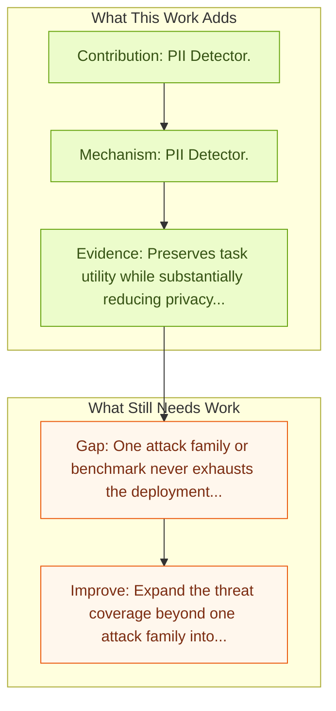

# Anonymization-Enhanced Privacy Protection for Mobile GUI Agents: Available but Invisible

Entry report generated on 2026-03-28 (Asia/Tokyo). This report is based on the repository entry, linked source metadata, and audit-time cross-checks.

## Snapshot

| Field | Detail |
| --- | --- |
| Repo entry | Anonymization-Enhanced Privacy Protection for Mobile GUI Agents: Available but Invisible |
| Actual target | [Anonymization-Enhanced Privacy Protection for Mobile GUI Agents: Available but Invisible](https://arxiv.org/abs/2602.10139) |
| Section | Safety and Security |
| Source location | `papers/safety/README.md:168` |
| Primary link type | `link` |
| Audit status | `ok` |
| Date / venue | February 2026 |
| Authors | Lepeng Zhao, Zhenhua Zou, Shuo Li, Zhuotao Liu |
| Focus tags | `privacy`, `mobile`, `defense`, `security` |
| Center of gravity | `privacy`, `mobile`, `defense` |

## Quick Read

| Lens | Read |
| --- | --- |
| Problem pressure | Available-but-invisible privacy framework for cloud-backed mobile GUI agents. |
| Most novel move | The paper turns general security concern into an operational agent-risk story centered on privacy, mobile, defense. |
| Strongest evidence | Preserves task utility while substantially reducing privacy leakage on AndroidLab and PrivScreen. |
| Main caveat | One attack family or benchmark never exhausts the deployment threat surface for computer-use agents. |

## Visual Frame

```mermaid
flowchart LR
  Problem["Problem: Available-but-invisible privacy framework for cloud-backed..."] --> Novelty["Novelty: The paper turns general security concern into an operational..."]
  Novelty --> Framework["Framework: PII Detector."]
  Framework --> Evidence["Evidence: Preserves task utility while substantially reducing privacy..."]
  Evidence --> Gap["Gap: One attack family or benchmark never exhausts the deployment..."]
  Gap --> Next["Next: Expand the threat coverage beyond one attack family into..."]
  classDef insight fill:#dbeafe,stroke:#2563eb,color:#0f172a;
  classDef risk fill:#fee2e2,stroke:#dc2626,color:#7f1d1d;
  classDef next fill:#dcfce7,stroke:#16a34a,color:#14532d;
  class Problem,Novelty,Framework insight;
  class Evidence insight;
  class Gap risk;
  class Next next;
```

## Analysis Map

## Executive Summary

Available-but-invisible privacy framework for cloud-backed mobile GUI agents. Mobile Graphical User Interface (GUI) agents have demonstrated strong capabilities in automating complex smartphone tasks by leveraging multimodal large language models (MLLMs) and system-level control interfaces. However, this paradigm introduces significant privacy risks, as agents typically capture and process entire screen contents, thereby exposing sensitive personal data such as phone numbers, addresses, messages, and financial information. Existing defenses either reduce UI exposure, obfuscate only task-irrelevant content, or rely on user authorization, but none can protect task-critical sensitive information while preserving seamless agent usability.

## Novelty

- The paper turns general security concern into an operational agent-risk story centered on privacy, mobile, defense.
- It also stands out for UI Transformer.
- It also stands out for secure Interaction Proxy.

## Core Contributions

- PII Detector.
- UI Transformer.
- Secure Interaction Proxy.
- Privacy Gatekeeper.
- Preserves task utility while substantially reducing privacy leakage on AndroidLab and PrivScreen.

## Framework and Operating Logic

- PII Detector.
- UI Transformer.
- Secure Interaction Proxy.
- Privacy Gatekeeper.

## Evidence and Claimed Results

- Preserves task utility while substantially reducing privacy leakage on AndroidLab and PrivScreen.
- Reports the best privacy-utility trade-off among the compared protection methods.
- ## Jailbreak Research
- Our system detects sensitive UI content using a PII-aware recognition model and replaces it with deterministic, type-preserving placeholders (e.g., PHONE_NUMBER#a1b2c) that retain semantic categories while removing identifying details.
- Code available at: https://github.com/one-step-beh1nd/gui_privacy_protection

## Gaps and Limitations

- One attack family or benchmark never exhausts the deployment threat surface for computer-use agents.
- Transfer remains uncertain across stacks, especially once the interface shifts toward mobile interfaces, app transitions, and version drift.

## How To Improve

- Expand the threat coverage beyond one attack family into cross-platform, human-in-the-loop, and defense-cost scenarios.
- Connect the benchmark or analysis to deployable mitigations such as takeover triggers, isolation policies, and audit logging.
- Measure the usability cost of safety controls so defenses can be judged as systems decisions, not only as refusals.

## Why It Matters

- This entry matters because stronger computer-use capability without a matching safety story creates an immediate operational risk.
- It gives the repo a concrete threat or guardrail lens instead of only capability metrics.

## Connections In This Repo

- [EIA: Environmental Injection Attack](eia-environmental-injection-attack.md) - shared concern with adversarial behavior, guardrails, or deployment risk.
- [LLM-Powered GUI Agents in Phone Automation](../survey-papers/llm-powered-gui-agents-in-phone-automation.md) - shared focus on mobile GUI control and cross-app interaction constraints.
- [JARVIS or Ultron? Safety and Security Threats of Computer-Using Agents](../survey-papers/jarvis-or-ultron-safety-and-security-threats-of-computer-using-agents.md) - shared concern with adversarial behavior, guardrails, or deployment risk.
- [AppAgent: Multimodal Agents as Smartphone Users](../models-and-architectures/appagent-multimodal-agents-as-smartphone-users.md) - shared focus on mobile GUI control and cross-app interaction constraints.

## Source Basis

- Primary basis: Primary arXiv abstract metadata was fetched live from the linked paper page.
- Audit access note: Metadata resolved cleanly during the audit.
