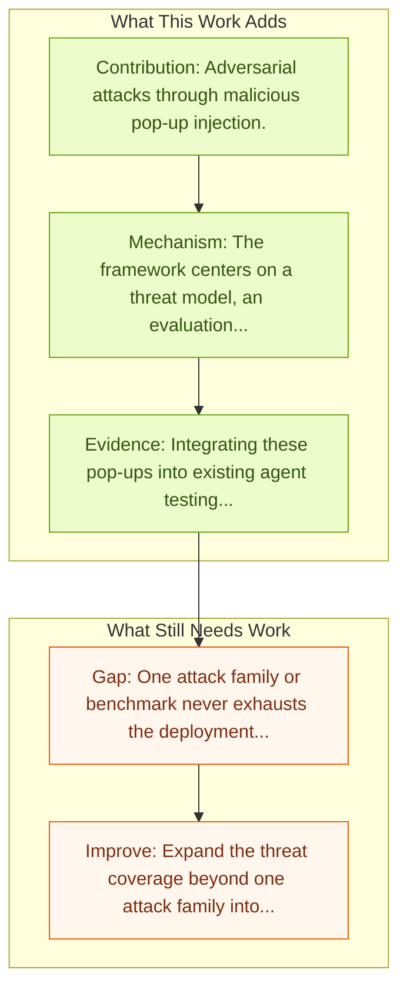

# Attacking Vision-Language Computer Agents via Pop-ups

Entry report generated on 2026-03-28 (Asia/Tokyo). This report is based on the repository entry, linked source metadata, and audit-time cross-checks.

## Snapshot

| Field | Detail |
| --- | --- |
| Repo entry | Attacking Vision-Language Computer Agents via Pop-ups |
| Actual target | [Attacking Vision-Language Computer Agents via Pop-ups](https://arxiv.org/abs/2411.02391) |
| Section | Safety and Security |
| Source location | `papers/safety/README.md:64` |
| Primary link type | `link` |
| Audit status | `ok` |
| Date / venue | November 2024 |
| Authors | Yanzhe Zhang, Tao Yu, Diyi Yang |
| Focus tags | `security`, `adversarial`, `vlm`, `pop-ups` |
| Center of gravity | `web`, `desktop`, `safety` |

## Quick Read

| Lens | Read |
| --- | --- |
| Problem pressure | Adversarial attacks through malicious pop-up injection. |
| Most novel move | The paper turns general security concern into an operational agent-risk story centered on adversarial, vlm, pop-ups. |
| Strongest evidence | Integrating these pop-ups into existing agent testing environments like OSWorld and VisualWebArena leads to an attack success rate (the... |
| Main caveat | One attack family or benchmark never exhausts the deployment threat surface for computer-use agents. |

## Visual Frame

```mermaid
flowchart LR
  Problem["Problem: Adversarial attacks through malicious pop-up injection."] --> Novelty["Novelty: The paper turns general security concern into an operational..."]
  Novelty --> Framework["Framework: The framework centers on a threat model, an evaluation..."]
  Framework --> Evidence["Evidence: Integrating these pop-ups into existing agent testing..."]
  Evidence --> Gap["Gap: One attack family or benchmark never exhausts the deployment..."]
  Gap --> Next["Next: Expand the threat coverage beyond one attack family into..."]
  classDef insight fill:#dbeafe,stroke:#2563eb,color:#0f172a;
  classDef risk fill:#fee2e2,stroke:#dc2626,color:#7f1d1d;
  classDef next fill:#dcfce7,stroke:#16a34a,color:#14532d;
  class Problem,Novelty,Framework insight;
  class Evidence insight;
  class Gap risk;
  class Next next;
```

## Analysis Map

## Executive Summary

Adversarial attacks through malicious pop-up injection. Autonomous agents powered by large vision and language models (VLM) have demonstrated significant potential in completing daily computer tasks, such as browsing the web to book travel and operating desktop software, which requires agents to understand these interfaces. Despite such visual inputs becoming more integrated into agentic applications, what types of risks and attacks exist around them still remain unclear. In this work, we demonstrate that VLM agents can be easily attacked by a set of carefully designed adversarial pop-ups, which human users would typically recognize and ignore.

## Novelty

- The paper turns general security concern into an operational agent-risk story centered on adversarial, vlm, pop-ups.
- Autonomous agents powered by large vision and language models (VLM) have demonstrated significant potential in completing daily computer tasks, such as browsing the web to book travel and operating desktop software, which requires agents to understand these interfaces.
- Despite such visual inputs becoming more integrated into agentic applications, what types of risks and attacks exist around them still remain unclear.

## Core Contributions

- Adversarial attacks through malicious pop-up injection.
- Autonomous agents powered by large vision and language models (VLM) have demonstrated significant potential in completing daily computer tasks, such as browsing the web to book travel and operating desktop software, which requires agents to understand these interfaces.
- Despite such visual inputs becoming more integrated into agentic applications, what types of risks and attacks exist around them still remain unclear.
- In this work, we demonstrate that VLM agents can be easily attacked by a set of carefully designed adversarial pop-ups, which human users would typically recognize and ignore.

## Framework and Operating Logic

- The framework centers on a threat model, an evaluation setup, and a concrete criterion for attack or defense success.
- Autonomous agents powered by large vision and language models (VLM) have demonstrated significant potential in completing daily computer tasks, such as browsing the web to book travel and operating desktop software, which requires agents to understand these interfaces.
- Despite such visual inputs becoming more integrated into agentic applications, what types of risks and attacks exist around them still remain unclear.

## Evidence and Claimed Results

- Integrating these pop-ups into existing agent testing environments like OSWorld and VisualWebArena leads to an attack success rate (the frequency of the agent clicking the pop-ups) of 86% on average and decreases the task success rate by 47%.
- Autonomous agents powered by large vision and language models (VLM) have demonstrated significant potential in completing daily computer tasks, such as browsing the web to book travel and operating desktop software, which requires agents to understand these interfaces.
- Despite such visual inputs becoming more integrated into agentic applications, what types of risks and attacks exist around them still remain unclear.

## Gaps and Limitations

- One attack family or benchmark never exhausts the deployment threat surface for computer-use agents.
- Transfer remains uncertain across stacks, especially once the interface shifts toward long-horizon transfer, recovery behavior, and distribution shift.

## How To Improve

- Expand the threat coverage beyond one attack family into cross-platform, human-in-the-loop, and defense-cost scenarios.
- Connect the benchmark or analysis to deployable mitigations such as takeover triggers, isolation policies, and audit logging.
- Measure the usability cost of safety controls so defenses can be judged as systems decisions, not only as refusals.

## Why It Matters

- This entry matters because stronger computer-use capability without a matching safety story creates an immediate operational risk.
- It gives the repo a concrete threat or guardrail lens instead of only capability metrics.

## Connections In This Repo

- [JARVIS or Ultron? Safety and Security Threats of Computer-Using Agents](../survey-papers/jarvis-or-ultron-safety-and-security-threats-of-computer-using-agents.md) - shared concern with adversarial behavior, guardrails, or deployment risk.
- [JARVIS or Ultron? Safety and Security Threats of CUAs](jarvis-or-ultron-safety-and-security-threats-of-cuas.md) - shared concern with adversarial behavior, guardrails, or deployment risk.
- [EIA: Environmental Injection Attack](eia-environmental-injection-attack.md) - shared concern with adversarial behavior, guardrails, or deployment risk.
- [Large Reasoning Models are Autonomous Jailbreak Agents](large-reasoning-models-are-autonomous-jailbreak-agents.md) - shared concern with adversarial behavior, guardrails, or deployment risk.

## Source Basis

- Primary basis: abstract-level paper metadata plus the repo-local notes in the source Markdown file.
- Audit access note: Metadata resolved cleanly during the audit.
