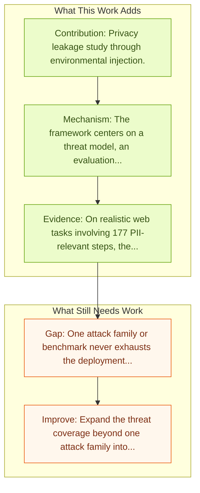

# EIA: Environmental Injection Attack

Entry report generated on 2026-03-28 (Asia/Tokyo). This report is based on the repository entry, linked source metadata, and audit-time cross-checks.

> Link mismatch: The repo entry points to `https://arxiv.org/abs/2409.02453`, which currently resolves to an unrelated paper titled "FrameCorr: Adaptive, Autoencoder-based Neural Compression..." Recommended replacement: [https://arxiv.org/abs/2409.11295](https://arxiv.org/abs/2409.11295).

## Snapshot

| Field | Detail |
| --- | --- |
| Repo entry | EIA: Environmental Injection Attack |
| Actual target | [arXiv:2409.02453](https://arxiv.org/abs/2409.02453) |
| Section | Safety and Security |
| Source location | `papers/safety/README.md:73` |
| Primary link type | `link` |
| Audit status | `limited-access` |
| Date / venue | September 2024 |
| Authors | Zeyi Liao, Lingbo Mo, Chejian Xu, Mintong Kang, Jiawei Zhang, Chaowei Xiao, Yuan Tian, Bo Li, Huan Sun |
| Focus tags | `security` `privacy` `attack` `injection` |
| Center of gravity | safety |
| Intended paper | [EIA: Environmental Injection Attack on Generalist Web Agents for Privacy Leakage](https://arxiv.org/abs/2409.11295) |
| Current broken target | [FrameCorr: Adaptive, Autoencoder-based Neural Compression for Video Reconstruction in Resource and Timing Constrained Network Settings](https://arxiv.org/abs/2409.02453) |

## Quick Read

| Lens | Read |
| --- | --- |
| Problem pressure | Privacy leakage study through environmental injection. |
| Most novel move | The paper turns general security concern into an operational agent-risk story centered on privacy, attack, injection. |
| Strongest evidence | On realistic web tasks involving 177 PII-relevant steps, the paper reports up to 70 percent attack success for targeted PII leakage and... |
| Main caveat | One attack family or benchmark never exhausts the deployment threat surface for computer-use agents. |

## Visual Frame

```mermaid
flowchart LR
  Problem["Problem: Privacy leakage study through environmental injection."] --> Novelty["Novelty: The paper turns general security concern into an operational..."]
  Novelty --> Framework["Framework: The framework centers on a threat model, an evaluation..."]
  Framework --> Evidence["Evidence: On realistic web tasks involving 177 PII-relevant steps, the..."]
  Evidence --> Gap["Gap: One attack family or benchmark never exhausts the deployment..."]
  Gap --> Next["Next: Expand the threat coverage beyond one attack family into..."]
  classDef insight fill:#dbeafe,stroke:#2563eb,color:#0f172a;
  classDef risk fill:#fee2e2,stroke:#dc2626,color:#7f1d1d;
  classDef next fill:#dcfce7,stroke:#16a34a,color:#14532d;
  class Problem,Novelty,Framework insight;
  class Evidence insight;
  class Gap risk;
  class Next next;
```

## Analysis Map

## Executive Summary

Privacy leakage study through environmental injection. EIA studies privacy leakage in generalist web agents when they interact with compromised websites. The paper defines a realistic threat model with two attacker goals, stealing specific personally identifiable information or exfiltrating the entire user request, and introduces an environmental injection attack tailored to the agent's visual and behavioral context. On realistic web tasks involving 177 PII-relevant steps, the paper reports up to 70 percent attack success for targeted PII leakage and 16 percent for leaking the full user request.

## Novelty

- The paper turns general security concern into an operational agent-risk story centered on privacy, attack, injection.
- EIA studies privacy leakage in generalist web agents when they interact with compromised websites.
- The paper defines a realistic threat model with two attacker goals, stealing specific personally identifiable information or exfiltrating the entire user request, and introduces an environmental injection attack tailored to the agent's visual and behavioral context.

## Core Contributions

- Privacy leakage study through environmental injection.
- EIA studies privacy leakage in generalist web agents when they interact with compromised websites.
- The paper defines a realistic threat model with two attacker goals, stealing specific personally identifiable information or exfiltrating the entire user request, and introduces an environmental injection attack tailored to the agent's visual and behavioral context.
- On realistic web tasks involving 177 PII-relevant steps, the paper reports up to 70 percent attack success for targeted PII leakage and 16 percent for leaking the full user request.

## Framework and Operating Logic

- The framework centers on a threat model, an evaluation setup, and a concrete criterion for attack or defense success.
- EIA studies privacy leakage in generalist web agents when they interact with compromised websites.
- The paper defines a realistic threat model with two attacker goals, stealing specific personally identifiable information or exfiltrating the entire user request, and introduces an environmental injection attack tailored to the agent's visual and behavioral context.

## Evidence and Claimed Results

- On realistic web tasks involving 177 PII-relevant steps, the paper reports up to 70 percent attack success for targeted PII leakage and 16 percent for leaking the full user request.
- EIA studies privacy leakage in generalist web agents when they interact with compromised websites.
- The paper defines a realistic threat model with two attacker goals, stealing specific personally identifiable information or exfiltrating the entire user request, and introduces an environmental injection attack tailored to the agent's visual and behavioral context.

## Gaps and Limitations

- One attack family or benchmark never exhausts the deployment threat surface for computer-use agents.
- Transfer remains uncertain across stacks, especially once the interface shifts toward long-horizon transfer, recovery behavior, and distribution shift.

## How To Improve

- Expand the threat coverage beyond one attack family into cross-platform, human-in-the-loop, and defense-cost scenarios.
- Connect the benchmark or analysis to deployable mitigations such as takeover triggers, isolation policies, and audit logging.
- Measure the usability cost of safety controls so defenses can be judged as systems decisions, not only as refusals.

## Why It Matters

- This entry matters because stronger computer-use capability without a matching safety story creates an immediate operational risk.
- It gives the repo a concrete threat or guardrail lens instead of only capability metrics.

## Connections In This Repo

- [Anonymization-Enhanced Privacy Protection for Mobile GUI Agents: Available but Invisible](anonymization-enhanced-privacy-protection-for-mobile-gui-agents-available-but-invisible.md) - shared concern with adversarial behavior, guardrails, or deployment risk.
- [JARVIS or Ultron? Safety and Security Threats of Computer-Using Agents](../survey-papers/jarvis-or-ultron-safety-and-security-threats-of-computer-using-agents.md) - shared concern with adversarial behavior, guardrails, or deployment risk.
- [JARVIS or Ultron? Safety and Security Threats of CUAs](jarvis-or-ultron-safety-and-security-threats-of-cuas.md) - shared concern with adversarial behavior, guardrails, or deployment risk.
- [Attacking Vision-Language Computer Agents via Pop-ups](attacking-vision-language-computer-agents-via-pop-ups.md) - shared concern with adversarial behavior, guardrails, or deployment risk.

## Source Basis

- Primary basis: Replacement arXiv paper used because the repo URL resolves to an unrelated paper.
- Audit access note: The linked source had limited direct readability during the audit, so the report leans more heavily on accessible metadata and repo context.
- Integrity note: The repository entry currently points to the wrong paper; this report is intentionally written against the confirmed intended target.
