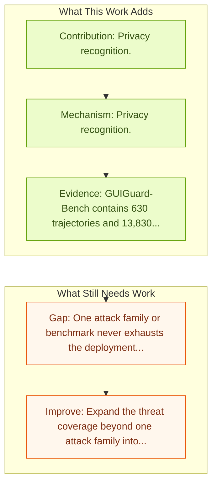

# GUIGuard: Toward a General Framework for Privacy-Preserving GUI Agents

Entry report generated on 2026-03-28 (Asia/Tokyo). This report is based on the repository entry, linked source metadata, and audit-time cross-checks.

## Snapshot

| Field | Detail |
| --- | --- |
| Repo entry | GUIGuard: Toward a General Framework for Privacy-Preserving GUI Agents |
| Actual target | [GUIGuard: Toward a General Framework for Privacy-Preserving GUI Agents](https://arxiv.org/abs/2601.18842) |
| Section | Safety and Security |
| Source location | `papers/safety/README.md:132` |
| Primary link type | `link` |
| Audit status | `ok` |
| Date / venue | January 2026 |
| Authors | Yanxi Wang, Zhiling Zhang, Wenbo Zhou, Weiming Zhang, Jie Zhang, Qiannan Zhu, Yu Shi, Shuxin Zheng, Jiyan He |
| Focus tags | `safety`, `privacy`, `benchmark`, `cross-platform` |
| Center of gravity | `privacy`, `cross-platform` |

## Quick Read

| Lens | Read |
| --- | --- |
| Problem pressure | Privacy-preserving GUI agent framework coupled with a benchmark for recognition, protection, and task completion. |
| Most novel move | The paper turns general security concern into an operational agent-risk story centered on privacy, cross-platform, framework components. |
| Strongest evidence | GUIGuard-Bench contains 630 trajectories and 13,830 screenshots with region-level privacy annotations. |
| Main caveat | One attack family or benchmark never exhausts the deployment threat surface for computer-use agents. |

## Visual Frame

```mermaid
flowchart LR
  Problem["Problem: Privacy-preserving GUI agent framework coupled with a..."] --> Novelty["Novelty: The paper turns general security concern into an operational..."]
  Novelty --> Framework["Framework: Privacy recognition."]
  Framework --> Evidence["Evidence: GUIGuard-Bench contains 630 trajectories and 13,830..."]
  Evidence --> Gap["Gap: One attack family or benchmark never exhausts the deployment..."]
  Gap --> Next["Next: Expand the threat coverage beyond one attack family into..."]
  classDef insight fill:#dbeafe,stroke:#2563eb,color:#0f172a;
  classDef risk fill:#fee2e2,stroke:#dc2626,color:#7f1d1d;
  classDef next fill:#dcfce7,stroke:#16a34a,color:#14532d;
  class Problem,Novelty,Framework insight;
  class Evidence insight;
  class Gap risk;
  class Next next;
```

## Analysis Map

## Executive Summary

Privacy-preserving GUI agent framework coupled with a benchmark for recognition, protection, and task completion. GUI agents enable end-to-end automation through direct perception of and interaction with on-screen interfaces. However, these agents frequently access interfaces containing sensitive personal information, and screenshots are often transmitted to remote models, creating substantial privacy risks. These risks are particularly severe in GUI workflows: GUIs expose richer, more accessible private information, and privacy risks depend on interaction trajectories across sequential scenes.

## Novelty

- The paper turns general security concern into an operational agent-risk story centered on privacy, cross-platform, framework components.
- It also stands out for privacy protection.
- It also stands out for task execution under protection.

## Core Contributions

- Privacy recognition.
- Privacy protection.
- Task execution under protection.
- Reported privacy recognition remains weak, reaching only 13.3% on Android and 1.4% on PC for the strongest tested models.
- GUIGuard-Bench contains 630 trajectories and 13,830 screenshots with region-level privacy annotations.

## Framework and Operating Logic

- Privacy recognition.
- Privacy protection.
- Task execution under protection.

## Evidence and Claimed Results

- GUIGuard-Bench contains 630 trajectories and 13,830 screenshots with region-level privacy annotations.
- Reported privacy recognition remains weak, reaching only 13.3% on Android and 1.4% on PC for the strongest tested models.
- We propose GUIGuard, a three-stage framework for privacy-preserving GUI agents: (1) privacy recognition, (2) privacy protection, and (3) task execution under protection.
- We further construct GUIGuard-Bench, a cross-platform benchmark with 630 trajectories and 13,830 screenshots, annotated with region-level privacy grounding and fine-grained labels of risk level, privacy category, and task necessity.
- Evaluations reveal that existing agents exhibit limited privacy recognition, with state-of-the-art models achieving only 13.3% accuracy on Android and 1.4% on PC.

## Gaps and Limitations

- One attack family or benchmark never exhausts the deployment threat surface for computer-use agents.
- Transfer remains uncertain across stacks, especially once the interface shifts toward long-horizon transfer, recovery behavior, and distribution shift.

## How To Improve

- Expand the threat coverage beyond one attack family into cross-platform, human-in-the-loop, and defense-cost scenarios.
- Connect the benchmark or analysis to deployable mitigations such as takeover triggers, isolation policies, and audit logging.
- Measure the usability cost of safety controls so defenses can be judged as systems decisions, not only as refusals.

## Why It Matters

- This entry matters because stronger computer-use capability without a matching safety story creates an immediate operational risk.
- It gives the repo a concrete threat or guardrail lens instead of only capability metrics.

## Connections In This Repo

- [AgentHarm: LLM Agent Safety Benchmark](agentharm-llm-agent-safety-benchmark.md) - shared concern with adversarial behavior, guardrails, or deployment risk.
- [OS-Harm: A Benchmark for Measuring Safety of Computer Use Agents](os-harm-a-benchmark-for-measuring-safety-of-computer-use-agents.md) - shared concern with adversarial behavior, guardrails, or deployment risk.
- [OmniACT](../benchmarks-and-datasets/omniact.md) - shared evaluative role in defining what progress means.
- [MMBench-GUI: Hierarchical Multi-Platform Evaluation Framework for GUI Agents](../benchmarks-and-datasets/mmbench-gui-hierarchical-multi-platform-evaluation-framework-for-gui-agents.md) - shared evaluative role in defining what progress means.

## Source Basis

- Primary basis: Primary arXiv abstract metadata was fetched live from the linked paper page.
- Audit access note: Metadata resolved cleanly during the audit.
