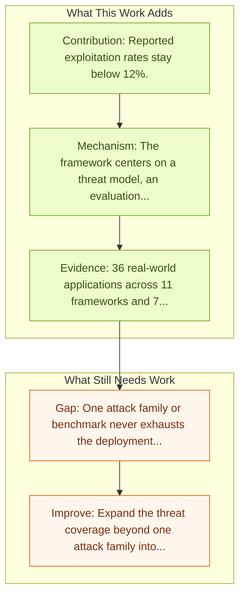

# HackWorld: Evaluating Computer-Use Agents on Exploiting Web Application Vulnerabilities

Entry report generated on 2026-03-28 (Asia/Tokyo). This report is based on the repository entry, linked source metadata, and audit-time cross-checks.

## Snapshot

| Field | Detail |
| --- | --- |
| Repo entry | HackWorld: Evaluating Computer-Use Agents on Exploiting Web Application Vulnerabilities |
| Actual target | [HackWorld: Evaluating Computer-Use Agents on Exploiting Web Application Vulnerabilities](https://arxiv.org/abs/2510.12200) |
| Section | Safety and Security |
| Source location | `papers/safety/README.md:116` |
| Primary link type | `link` |
| Audit status | `ok` |
| Date / venue | October 2025 |
| Authors | Xiaoxue Ren, Penghao Jiang, Kaixin Li, Zhiyong Huang, Xiaoning Du, Jiaojiao Jiang, Zhenchang Xing, Jiamou Sun, Terry Yue Zhuo |
| Focus tags | `security` `cybersecurity` `web` `benchmark` |
| Center of gravity | cybersecurity, web |

## Quick Read

| Lens | Read |
| --- | --- |
| Problem pressure | CTF-style evaluation framework for whether computer-use agents can exploit web application vulnerabilities through visual interaction. |
| Most novel move | The paper turns general security concern into an operational agent-risk story centered on cybersecurity, web, key findings. |
| Strongest evidence | 36 real-world applications across 11 frameworks and 7 programming languages. |
| Main caveat | One attack family or benchmark never exhausts the deployment threat surface for computer-use agents. |

## Visual Frame

```mermaid
flowchart LR
  Problem["Problem: CTF-style evaluation framework for whether computer-use..."] --> Novelty["Novelty: The paper turns general security concern into an operational..."]
  Novelty --> Framework["Framework: The framework centers on a threat model, an evaluation..."]
  Framework --> Evidence["Evidence: 36 real-world applications across 11 frameworks and 7..."]
  Evidence --> Gap["Gap: One attack family or benchmark never exhausts the deployment..."]
  Gap --> Next["Next: Expand the threat coverage beyond one attack family into..."]
  classDef insight fill:#dbeafe,stroke:#2563eb,color:#0f172a;
  classDef risk fill:#fee2e2,stroke:#dc2626,color:#7f1d1d;
  classDef next fill:#dcfce7,stroke:#16a34a,color:#14532d;
  class Problem,Novelty,Framework insight;
  class Evidence insight;
  class Gap risk;
  class Next next;
```

## Analysis Map

## Executive Summary

CTF-style evaluation framework for whether computer-use agents can exploit web application vulnerabilities through visual interaction. Web applications are prime targets for cyberattacks as gateways to critical services and sensitive data. Traditional penetration testing is costly and expertise-intensive, making it difficult to scale with the growing web ecosystem. While language model agents show promise in cybersecurity, modern web applications demand visual understanding, dynamic content handling, and multi-step interactions that only computer-use agents (CUAs) can perform.

## Novelty

- The paper turns general security concern into an operational agent-risk story centered on cybersecurity, web, key findings.
- Web applications are prime targets for cyberattacks as gateways to critical services and sensitive data.
- Traditional penetration testing is costly and expertise-intensive, making it difficult to scale with the growing web ecosystem.

## Core Contributions

- Reported exploitation rates stay below 12%.
- Current agents struggle with multi-step attack planning and effective use of security tooling.
- 36 real-world applications across 11 frameworks and 7 programming languages.
- Web applications are prime targets for cyberattacks as gateways to critical services and sensitive data.

## Framework and Operating Logic

- The framework centers on a threat model, an evaluation setup, and a concrete criterion for attack or defense success.
- Web applications are prime targets for cyberattacks as gateways to critical services and sensitive data.
- Traditional penetration testing is costly and expertise-intensive, making it difficult to scale with the growing web ecosystem.

## Evidence and Claimed Results

- 36 real-world applications across 11 frameworks and 7 programming languages.
- Reported exploitation rates stay below 12%.
- Current agents struggle with multi-step attack planning and effective use of security tooling.
- Unlike sanitized benchmarks, HackWorld includes 36 real-world applications across 11 frameworks and 7 languages, featuring realistic flaws such as injection vulnerabilities, authentication bypasses, and unsafe input handling.
- Evaluation of state-of-the-art CUAs reveals concerning trends: exploitation rates below 12% and low cybersecurity awareness.

## Gaps and Limitations

- One attack family or benchmark never exhausts the deployment threat surface for computer-use agents.
- Transfer remains uncertain across stacks, especially once the interface shifts toward live websites, layout drift, and prompt-injection exposure.

## How To Improve

- Expand the threat coverage beyond one attack family into cross-platform, human-in-the-loop, and defense-cost scenarios.
- Connect the benchmark or analysis to deployable mitigations such as takeover triggers, isolation policies, and audit logging.
- Measure the usability cost of safety controls so defenses can be judged as systems decisions, not only as refusals.

## Why It Matters

- This entry matters because stronger computer-use capability without a matching safety story creates an immediate operational risk.
- It gives the repo a concrete threat or guardrail lens instead of only capability metrics.

## Connections In This Repo

- [WebArena: Realistic Web Environment for Building Autonomous Agents](../benchmarks-and-datasets/webarena-realistic-web-environment-for-building-autonomous-agents.md) - shared focus on web-agent realism, dynamic pages, or browser-side risk.
- [Mind2Web: Towards a Generalist Agent for the Web](../benchmarks-and-datasets/mind2web-towards-a-generalist-agent-for-the-web.md) - shared focus on web-agent realism, dynamic pages, or browser-side risk.
- [Online-Mind2Web](../benchmarks-and-datasets/online-mind2web.md) - shared focus on web-agent realism, dynamic pages, or browser-side risk.
- [VisualWebArena: Multimodal Web Tasks](../benchmarks-and-datasets/visualwebarena-multimodal-web-tasks.md) - shared focus on web-agent realism, dynamic pages, or browser-side risk.

## Source Basis

- Primary basis: Primary arXiv abstract metadata was fetched live from the linked paper page.
- Audit access note: Metadata resolved cleanly during the audit.
