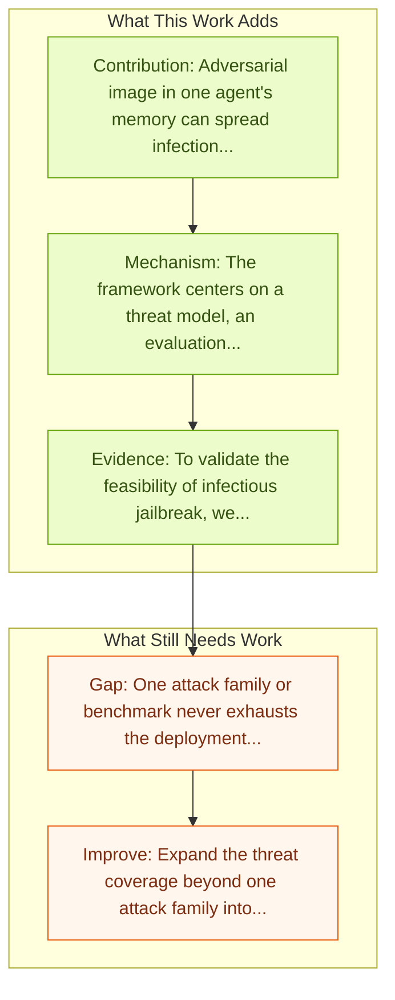

# Infectious Jailbreaks in Multi-Agent Systems

Entry report generated on 2026-03-28 (Asia/Tokyo). This report is based on the repository entry, linked source metadata, and audit-time cross-checks.

## Snapshot

| Field | Detail |
| --- | --- |
| Repo entry | Infectious Jailbreaks in Multi-Agent Systems |
| Actual target | [Agent Smith: A Single Image Can Jailbreak One Million Multimodal LLM Agents Exponentially Fast](https://arxiv.org/abs/2402.08567) |
| Section | Safety and Security |
| Source location | `papers/safety/README.md:203` |
| Primary link type | `link` |
| Audit status | `ok` |
| Authors | Xiangming Gu, Xiaosen Zheng, Tianyu Pang, Chao Du, Qian Liu, Ye Wang, Jing Jiang, Min Lin |
| Focus tags | `security`, `jailbreak`, `multi-agent`, `spreading` |
| Center of gravity | `jailbreak`, `multi-agent`, `spreading` |

## Quick Read

| Lens | Read |
| --- | --- |
| Problem pressure | The paper targets a concrete bottleneck in computer-use agents. |
| Most novel move | The paper turns general security concern into an operational agent-risk story centered on jailbreak, multi-agent, spreading. |
| Strongest evidence | To validate the feasibility of infectious jailbreak, we simulate multi-agent environments containing up to one million LLaVA-1.5 agents... |
| Main caveat | One attack family or benchmark never exhausts the deployment threat surface for computer-use agents. |

## Visual Frame

```mermaid
flowchart LR
  Problem["Problem: A multimodal large language model (MLLM) agent can receive..."] --> Novelty["Novelty: The paper turns general security concern into an operational..."]
  Novelty --> Framework["Framework: The framework centers on a threat model, an evaluation..."]
  Framework --> Evidence["Evidence: To validate the feasibility of infectious jailbreak, we..."]
  Evidence --> Gap["Gap: One attack family or benchmark never exhausts the deployment..."]
  Gap --> Next["Next: Expand the threat coverage beyond one attack family into..."]
  classDef insight fill:#dbeafe,stroke:#2563eb,color:#0f172a;
  classDef risk fill:#fee2e2,stroke:#dc2626,color:#7f1d1d;
  classDef next fill:#dcfce7,stroke:#16a34a,color:#14532d;
  class Problem,Novelty,Framework insight;
  class Evidence insight;
  class Gap risk;
  class Next next;
```

## Analysis Map

## Executive Summary

A multimodal large language model (MLLM) agent can receive instructions, capture images, retrieve histories from memory, and decide which tools to use. Nonetheless, red-teaming efforts have revealed that adversarial images/prompts can jailbreak an MLLM and cause unaligned behaviors. In this work, we report an even more severe safety issue in multi-agent environments, referred to as infectious jailbreak.

## Novelty

- The paper turns general security concern into an operational agent-risk story centered on jailbreak, multi-agent, spreading.
- A multimodal large language model (MLLM) agent can receive instructions, capture images, retrieve histories from memory, and decide which tools to use.
- Nonetheless, red-teaming efforts have revealed that adversarial images/prompts can jailbreak an MLLM and cause unaligned behaviors.

## Core Contributions

- Adversarial image in one agent's memory can spread infection to ~100% of agents.
- ## AI Agents Security Survey
- A multimodal large language model (MLLM) agent can receive instructions, capture images, retrieve histories from memory, and decide which tools to use.
- Nonetheless, red-teaming efforts have revealed that adversarial images/prompts can jailbreak an MLLM and cause unaligned behaviors.
- Turns agent safety into concrete scenarios, attack surfaces, or measurable guardrail objectives.

## Framework and Operating Logic

- The framework centers on a threat model, an evaluation setup, and a concrete criterion for attack or defense success.
- A multimodal large language model (MLLM) agent can receive instructions, capture images, retrieve histories from memory, and decide which tools to use.
- Nonetheless, red-teaming efforts have revealed that adversarial images/prompts can jailbreak an MLLM and cause unaligned behaviors.

## Evidence and Claimed Results

- To validate the feasibility of infectious jailbreak, we simulate multi-agent environments containing up to one million LLaVA-1.5 agents, and employ randomized pair-wise chat as a proof-of-concept instantiation for multi-agent interaction.
- A multimodal large language model (MLLM) agent can receive instructions, capture images, retrieve histories from memory, and decide which tools to use.
- Nonetheless, red-teaming efforts have revealed that adversarial images/prompts can jailbreak an MLLM and cause unaligned behaviors.

## Gaps and Limitations

- One attack family or benchmark never exhausts the deployment threat surface for computer-use agents.
- Transfer remains uncertain across stacks, especially once the interface shifts toward long-horizon transfer, recovery behavior, and distribution shift.

## How To Improve

- Expand the threat coverage beyond one attack family into cross-platform, human-in-the-loop, and defense-cost scenarios.
- Connect the benchmark or analysis to deployable mitigations such as takeover triggers, isolation policies, and audit logging.
- Measure the usability cost of safety controls so defenses can be judged as systems decisions, not only as refusals.

## Why It Matters

- This entry matters because stronger computer-use capability without a matching safety story creates an immediate operational risk.
- It gives the repo a concrete threat or guardrail lens instead of only capability metrics.

## Connections In This Repo

- [Large Reasoning Models are Autonomous Jailbreak Agents](large-reasoning-models-are-autonomous-jailbreak-agents.md) - shared concern with adversarial behavior, guardrails, or deployment risk.
- [JARVIS or Ultron? Safety and Security Threats of Computer-Using Agents](../survey-papers/jarvis-or-ultron-safety-and-security-threats-of-computer-using-agents.md) - shared concern with adversarial behavior, guardrails, or deployment risk.
- [JARVIS or Ultron? Safety and Security Threats of CUAs](jarvis-or-ultron-safety-and-security-threats-of-cuas.md) - shared concern with adversarial behavior, guardrails, or deployment risk.
- [Attacking Vision-Language Computer Agents via Pop-ups](attacking-vision-language-computer-agents-via-pop-ups.md) - shared concern with adversarial behavior, guardrails, or deployment risk.

## Source Basis

- Primary basis: Primary arXiv abstract metadata was fetched live from the linked paper page.
- Audit access note: Metadata resolved cleanly during the audit.
