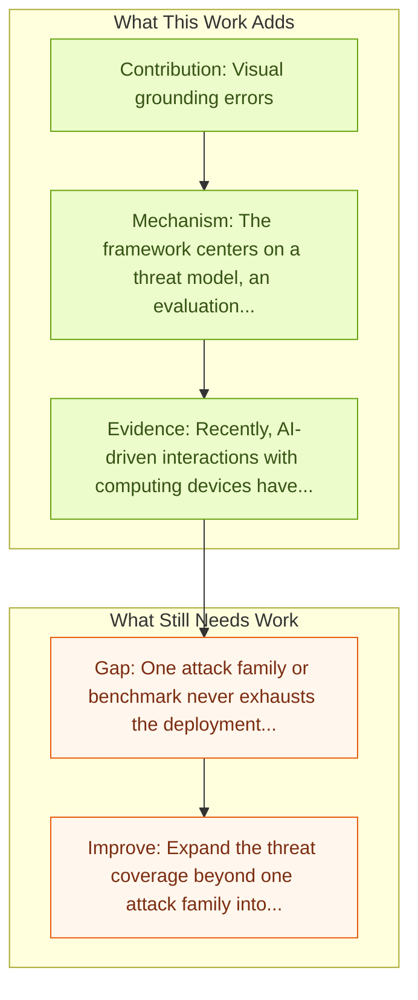

# JARVIS or Ultron? Safety and Security Threats of CUAs

Entry report generated on 2026-03-28 (Asia/Tokyo). This report is based on the repository entry, linked source metadata, and audit-time cross-checks.

## Snapshot

| Field | Detail |
| --- | --- |
| Repo entry | JARVIS or Ultron? Safety and Security Threats of CUAs |
| Actual target | [A Survey on the Safety and Security Threats of Computer-Using Agents: JARVIS or Ultron?](https://arxiv.org/abs/2505.10924) |
| Section | Safety and Security |
| Source location | `papers/safety/README.md:35` |
| Primary link type | `link` |
| Audit status | `ok` |
| Date / venue | May 2025 |
| Authors | Ada Chen, Yongjiang Wu, Junyuan Zhang, Jingyu Xiao, Shu Yang, Jen-tse Huang, Kun Wang, Wenxuan Wang, Shuai Wang |
| Focus tags | `survey` `safety` `security` `comprehensive` |
| Center of gravity | web, desktop, mobile |

## Quick Read

| Lens | Read |
| --- | --- |
| Problem pressure | Comprehensive survey on CUA-specific threats. |
| Most novel move | The paper turns general security concern into an operational agent-risk story centered on vulnerability categories, attack types. |
| Strongest evidence | Recently, AI-driven interactions with computing devices have advanced from basic prototype tools to sophisticated, LLM-based systems... |
| Main caveat | One attack family or benchmark never exhausts the deployment threat surface for computer-use agents. |

## Visual Frame

```mermaid
flowchart LR
  Problem["Problem: Comprehensive survey on CUA-specific threats."] --> Novelty["Novelty: The paper turns general security concern into an operational..."]
  Novelty --> Framework["Framework: The framework centers on a threat model, an evaluation..."]
  Framework --> Evidence["Evidence: Recently, AI-driven interactions with computing devices have..."]
  Evidence --> Gap["Gap: One attack family or benchmark never exhausts the deployment..."]
  Gap --> Next["Next: Expand the threat coverage beyond one attack family into..."]
  classDef insight fill:#dbeafe,stroke:#2563eb,color:#0f172a;
  classDef risk fill:#fee2e2,stroke:#dc2626,color:#7f1d1d;
  classDef next fill:#dcfce7,stroke:#16a34a,color:#14532d;
  class Problem,Novelty,Framework insight;
  class Evidence insight;
  class Gap risk;
  class Next next;
```

## Analysis Map

## Executive Summary

Comprehensive survey on CUA-specific threats. Recently, AI-driven interactions with computing devices have advanced from basic prototype tools to sophisticated, LLM-based systems that emulate human-like operations in graphical user interfaces. We are now witnessing the emergence of \emph{Computer-Using Agents} (CUAs), capable of autonomously performing tasks such as navigating desktop applications, web pages, and mobile apps. However, as these agents grow in capability, they also introduce novel safety and security risks.

## Code and Supporting Artifacts

- Code repository: no dedicated code link is currently tracked in the repo entry.

## Novelty

- The paper turns general security concern into an operational agent-risk story centered on vulnerability categories, attack types.
- Recently, AI-driven interactions with computing devices have advanced from basic prototype tools to sophisticated, LLM-based systems that emulate human-like operations in graphical user interfaces.
- We are now witnessing the emergence of \emph{Computer-Using Agents} (CUAs), capable of autonomously performing tasks such as navigating desktop applications, web pages, and mobile apps.

## Core Contributions

- Visual grounding errors
- Response delays
- UI interpretation pitfalls
- Adversarial attacks adapted to GUI environments
- Jailbreak strategies with heightened severity

## Framework and Operating Logic

- The framework centers on a threat model, an evaluation setup, and a concrete criterion for attack or defense success.
- Recently, AI-driven interactions with computing devices have advanced from basic prototype tools to sophisticated, LLM-based systems that emulate human-like operations in graphical user interfaces.
- We are now witnessing the emergence of \emph{Computer-Using Agents} (CUAs), capable of autonomously performing tasks such as navigating desktop applications, web pages, and mobile apps.

## Evidence and Claimed Results

- Recently, AI-driven interactions with computing devices have advanced from basic prototype tools to sophisticated, LLM-based systems that emulate human-like operations in graphical user interfaces.
- We are now witnessing the emergence of \emph{Computer-Using Agents} (CUAs), capable of autonomously performing tasks such as navigating desktop applications, web pages, and mobile apps.
- However, as these agents grow in capability, they also introduce novel safety and security risks.

## Gaps and Limitations

- One attack family or benchmark never exhausts the deployment threat surface for computer-use agents.
- Transfer remains uncertain across stacks, especially once the interface shifts toward long-horizon transfer, recovery behavior, and distribution shift.

## How To Improve

- Expand the threat coverage beyond one attack family into cross-platform, human-in-the-loop, and defense-cost scenarios.
- Connect the benchmark or analysis to deployable mitigations such as takeover triggers, isolation policies, and audit logging.
- Measure the usability cost of safety controls so defenses can be judged as systems decisions, not only as refusals.

## Why It Matters

- This entry matters because stronger computer-use capability without a matching safety story creates an immediate operational risk.
- It gives the repo a concrete threat or guardrail lens instead of only capability metrics.

## Connections In This Repo

- [JARVIS or Ultron? Safety and Security Threats of Computer-Using Agents](../survey-papers/jarvis-or-ultron-safety-and-security-threats-of-computer-using-agents.md) - shared concern with adversarial behavior, guardrails, or deployment risk.
- [AI Agents Under Threat: Key Security Challenges and Future Pathways](ai-agents-under-threat-key-security-challenges-and-future-pathways.md) - shared concern with adversarial behavior, guardrails, or deployment risk.
- [Large Language Model-Brained GUI Agents: A Survey](../survey-papers/large-language-model-brained-gui-agents-a-survey.md) - the survey provides context for the safety and security issues highlighted here.
- [GUI Agents: A Survey](../survey-papers/gui-agents-a-survey.md) - the survey provides context for the safety and security issues highlighted here.

## Source Basis

- Primary basis: abstract-level paper metadata plus the repo-local notes in the source Markdown file.
- Audit access note: Metadata resolved cleanly during the audit.
