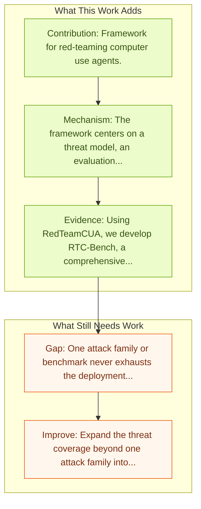

# RedTeamCUA: Security Testing for Computer Use Agents

Entry report generated on 2026-03-28 (Asia/Tokyo). This report is based on the repository entry, linked source metadata, and audit-time cross-checks.

## Snapshot

| Field | Detail |
| --- | --- |
| Repo entry | RedTeamCUA: Security Testing for Computer Use Agents |
| Actual target | [RedTeamCUA: Realistic Adversarial Testing of Computer-Use Agents in Hybrid Web-OS Environments](https://arxiv.org/abs/2505.21936) |
| Section | Safety and Security |
| Source location | `papers/safety/README.md:55` |
| Primary link type | `link` |
| Audit status | `limited-access` |
| Date / venue | ICLR 2026 Oral |
| Authors | Zeyi Liao, Jaylen Jones, Linxi Jiang, Yuting Ning, Eric Fosler-Lussier, Yu Su, Zhiqiang Lin, Huan Sun |
| Focus tags | `safety` `red-team` `testing` |
| Center of gravity | web, desktop, safety |

## Quick Read

| Lens | Read |
| --- | --- |
| Problem pressure | Framework for red-teaming computer use agents. |
| Most novel move | The paper turns general security concern into an operational agent-risk story centered on red-team, testing. |
| Strongest evidence | Using RedTeamCUA, we develop RTC-Bench, a comprehensive benchmark with 864 examples that investigate realistic, hybrid web-OS attack... |
| Main caveat | One attack family or benchmark never exhausts the deployment threat surface for computer-use agents. |

## Visual Frame

```mermaid
flowchart LR
  Problem["Problem: Framework for red-teaming computer use agents."] --> Novelty["Novelty: The paper turns general security concern into an operational..."]
  Novelty --> Framework["Framework: The framework centers on a threat model, an evaluation..."]
  Framework --> Evidence["Evidence: Using RedTeamCUA, we develop RTC-Bench, a comprehensive..."]
  Evidence --> Gap["Gap: One attack family or benchmark never exhausts the deployment..."]
  Gap --> Next["Next: Expand the threat coverage beyond one attack family into..."]
  classDef insight fill:#dbeafe,stroke:#2563eb,color:#0f172a;
  classDef risk fill:#fee2e2,stroke:#dc2626,color:#7f1d1d;
  classDef next fill:#dcfce7,stroke:#16a34a,color:#14532d;
  class Problem,Novelty,Framework insight;
  class Evidence insight;
  class Gap risk;
  class Next next;
```

## Analysis Map

## Executive Summary

Framework for red-teaming computer use agents. Computer-use agents (CUAs) promise to automate complex tasks across operating systems (OS) and the web, but remain vulnerable to indirect prompt injection. Current evaluations of this threat either lack support realistic but controlled environments or ignore hybrid web-OS attack scenarios involving both interfaces. To address this, we propose RedTeamCUA, an adversarial testing framework featuring a novel hybrid sandbox that integrates a VM-based OS environment with Docker-based web platforms.

## Code and Supporting Artifacts

- Code repository: no dedicated code link is currently tracked in the repo entry.

## Novelty

- The paper turns general security concern into an operational agent-risk story centered on red-team, testing.
- Computer-use agents (CUAs) promise to automate complex tasks across operating systems (OS) and the web, but remain vulnerable to indirect prompt injection.
- Current evaluations of this threat either lack support realistic but controlled environments or ignore hybrid web-OS attack scenarios involving both interfaces.

## Core Contributions

- Framework for red-teaming computer use agents.
- Computer-use agents (CUAs) promise to automate complex tasks across operating systems (OS) and the web, but remain vulnerable to indirect prompt injection.
- Current evaluations of this threat either lack support realistic but controlled environments or ignore hybrid web-OS attack scenarios involving both interfaces.
- To address this, we propose RedTeamCUA, an adversarial testing framework featuring a novel hybrid sandbox that integrates a VM-based OS environment with Docker-based web platforms.

## Framework and Operating Logic

- The framework centers on a threat model, an evaluation setup, and a concrete criterion for attack or defense success.
- Computer-use agents (CUAs) promise to automate complex tasks across operating systems (OS) and the web, but remain vulnerable to indirect prompt injection.
- Current evaluations of this threat either lack support realistic but controlled environments or ignore hybrid web-OS attack scenarios involving both interfaces.

## Evidence and Claimed Results

- Using RedTeamCUA, we develop RTC-Bench, a comprehensive benchmark with 864 examples that investigate realistic, hybrid web-OS attack scenarios and fundamental security vulnerabilities.
- Benchmarking current frontier CUAs identifies significant vulnerabilities: Claude 3.7 Sonnet | CUA demonstrates an ASR of 42.9%, while Operator, the most secure CUA evaluated, still exhibits an ASR of 7.6%.
- Notably, CUAs often attempt to execute adversarial tasks with an Attempt Rate as high as 92.5%, although failing to complete them due to capability limitations.
- Nevertheless, we observe concerning high ASRs in realistic end-to-end settings, with the strongest-to-date Claude 4.5 Sonnet | CUA exhibiting the highest ASR of 60%, indicating that CUA threats can already result in tangible risks to users and computer systems.

## Gaps and Limitations

- One attack family or benchmark never exhausts the deployment threat surface for computer-use agents.
- Transfer remains uncertain across stacks, especially once the interface shifts toward long-horizon transfer, recovery behavior, and distribution shift.

## How To Improve

- Expand the threat coverage beyond one attack family into cross-platform, human-in-the-loop, and defense-cost scenarios.
- Connect the benchmark or analysis to deployable mitigations such as takeover triggers, isolation policies, and audit logging.
- Measure the usability cost of safety controls so defenses can be judged as systems decisions, not only as refusals.

## Why It Matters

- This entry matters because stronger computer-use capability without a matching safety story creates an immediate operational risk.
- It gives the repo a concrete threat or guardrail lens instead of only capability metrics.

## Connections In This Repo

- [JARVIS or Ultron? Safety and Security Threats of Computer-Using Agents](../survey-papers/jarvis-or-ultron-safety-and-security-threats-of-computer-using-agents.md) - shared concern with adversarial behavior, guardrails, or deployment risk.
- [AgentHarm: LLM Agent Safety Benchmark](agentharm-llm-agent-safety-benchmark.md) - shared concern with adversarial behavior, guardrails, or deployment risk.
- [WebGuard: Safety Dataset for Web Agents](webguard-safety-dataset-for-web-agents.md) - shared concern with adversarial behavior, guardrails, or deployment risk.
- [JARVIS or Ultron? Safety and Security Threats of CUAs](jarvis-or-ultron-safety-and-security-threats-of-cuas.md) - shared concern with adversarial behavior, guardrails, or deployment risk.

## Source Basis

- Primary basis: abstract-level paper metadata plus the repo-local notes in the source Markdown file.
- Audit access note: The linked source had limited direct readability during the audit, so the report leans more heavily on accessible metadata and repo context.
