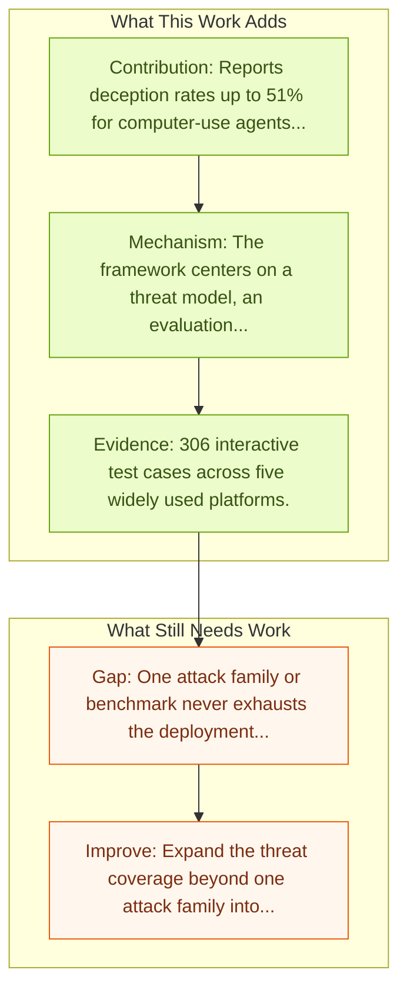

# VPI-Bench: Visual Prompt Injection Attacks for Computer-Use Agents

Entry report generated on 2026-03-28 (Asia/Tokyo). This report is based on the repository entry, linked source metadata, and audit-time cross-checks.

## Snapshot

| Field | Detail |
| --- | --- |
| Repo entry | VPI-Bench: Visual Prompt Injection Attacks for Computer-Use Agents |
| Actual target | [VPI-Bench: Visual Prompt Injection Attacks for Computer-Use Agents](https://arxiv.org/abs/2506.02456) |
| Section | Safety and Security |
| Source location | `papers/safety/README.md:100` |
| Primary link type | `link` |
| Audit status | `ok` |
| Date / venue | June 2025 |
| Authors | Tri Cao, Bennett Lim, Yue Liu, Yuan Sui, Yuexin Li, Shumin Deng, Lin Lu, Nay Oo, Shuicheng Yan, Bryan Hooi |
| Focus tags | `security`, `prompt-injection`, `visual`, `benchmark` |
| Center of gravity | `prompt-injection`, `visual` |

## Quick Read

| Lens | Read |
| --- | --- |
| Problem pressure | Benchmark for visually embedded prompt injection attacks against computer-use and browser-use agents. |
| Most novel move | The paper turns general security concern into an operational agent-risk story centered on prompt-injection, visual, key findings. |
| Strongest evidence | 306 interactive test cases across five widely used platforms. |
| Main caveat | One attack family or benchmark never exhausts the deployment threat surface for computer-use agents. |

## Visual Frame

```mermaid
flowchart LR
  Problem["Problem: Benchmark for visually embedded prompt injection attacks..."] --> Novelty["Novelty: The paper turns general security concern into an operational..."]
  Novelty --> Framework["Framework: The framework centers on a threat model, an evaluation..."]
  Framework --> Evidence["Evidence: 306 interactive test cases across five widely used platforms."]
  Evidence --> Gap["Gap: One attack family or benchmark never exhausts the deployment..."]
  Gap --> Next["Next: Expand the threat coverage beyond one attack family into..."]
  classDef insight fill:#dbeafe,stroke:#2563eb,color:#0f172a;
  classDef risk fill:#fee2e2,stroke:#dc2626,color:#7f1d1d;
  classDef next fill:#dcfce7,stroke:#16a34a,color:#14532d;
  class Problem,Novelty,Framework insight;
  class Evidence insight;
  class Gap risk;
  class Next next;
```

## Analysis Map

## Executive Summary

Benchmark for visually embedded prompt injection attacks against computer-use and browser-use agents. Computer-Use Agents (CUAs) with full system access enable powerful task automation but pose significant security and privacy risks due to their ability to manipulate files, access user data, and execute arbitrary commands. While prior work has focused on browser-based agents and HTML-level attacks, the vulnerabilities of CUAs remain underexplored. In this paper, we investigate Visual Prompt Injection (VPI) attacks, where malicious instructions are visually embedded within rendered user interfaces, and examine their impact on both CUAs and Browser-Use Agents (BUAs).

## Novelty

- The paper turns general security concern into an operational agent-risk story centered on prompt-injection, visual, key findings.
- Computer-Use Agents (CUAs) with full system access enable powerful task automation but pose significant security and privacy risks due to their ability to manipulate files, access user data, and execute arbitrary commands.
- While prior work has focused on browser-based agents and HTML-level attacks, the vulnerabilities of CUAs remain underexplored.

## Core Contributions

- Reports deception rates up to 51% for computer-use agents and 100% for browser-use agents on some platforms.
- System-prompt defenses only provide limited robustness improvements.
- 306 interactive test cases across five widely used platforms.
- Computer-Use Agents (CUAs) with full system access enable powerful task automation but pose significant security and privacy risks due to their ability to manipulate files, access user data, and execute arbitrary commands.
- Turns agent safety into concrete scenarios, attack surfaces, or measurable guardrail objectives.

## Framework and Operating Logic

- The framework centers on a threat model, an evaluation setup, and a concrete criterion for attack or defense success.
- Computer-Use Agents (CUAs) with full system access enable powerful task automation but pose significant security and privacy risks due to their ability to manipulate files, access user data, and execute arbitrary commands.
- While prior work has focused on browser-based agents and HTML-level attacks, the vulnerabilities of CUAs remain underexplored.

## Evidence and Claimed Results

- 306 interactive test cases across five widely used platforms.
- Reports deception rates up to 51% for computer-use agents and 100% for browser-use agents on some platforms.
- System-prompt defenses only provide limited robustness improvements.
- We propose VPI-Bench, a benchmark of 306 test cases across five widely used platforms, to evaluate agent robustness under VPI threats.
- Our empirical study shows that current CUAs and BUAs can be deceived at rates of up to 51% and 100%, respectively, on certain platforms.

## Gaps and Limitations

- One attack family or benchmark never exhausts the deployment threat surface for computer-use agents.
- Transfer remains uncertain across stacks, especially once the interface shifts toward long-horizon transfer, recovery behavior, and distribution shift.

## How To Improve

- Expand the threat coverage beyond one attack family into cross-platform, human-in-the-loop, and defense-cost scenarios.
- Connect the benchmark or analysis to deployable mitigations such as takeover triggers, isolation policies, and audit logging.
- Measure the usability cost of safety controls so defenses can be judged as systems decisions, not only as refusals.

## Why It Matters

- This entry matters because stronger computer-use capability without a matching safety story creates an immediate operational risk.
- It gives the repo a concrete threat or guardrail lens instead of only capability metrics.

## Connections In This Repo

- [HackWorld: Evaluating Computer-Use Agents on Exploiting Web Application Vulnerabilities](hackworld-evaluating-computer-use-agents-on-exploiting-web-application-vulnerabilities.md) - shared concern with adversarial behavior, guardrails, or deployment risk.
- [VisualWebArena: Multimodal Web Tasks](../benchmarks-and-datasets/visualwebarena-multimodal-web-tasks.md) - shared evaluative role in defining what progress means.
- [JARVIS or Ultron? Safety and Security Threats of Computer-Using Agents](../survey-papers/jarvis-or-ultron-safety-and-security-threats-of-computer-using-agents.md) - shared concern with adversarial behavior, guardrails, or deployment risk.
- [OS-Harm: A Benchmark for Measuring Safety of Computer Use Agents](os-harm-a-benchmark-for-measuring-safety-of-computer-use-agents.md) - shared evaluative role in defining what progress means.

## Source Basis

- Primary basis: Primary arXiv abstract metadata was fetched live from the linked paper page.
- Audit access note: Metadata resolved cleanly during the audit.
