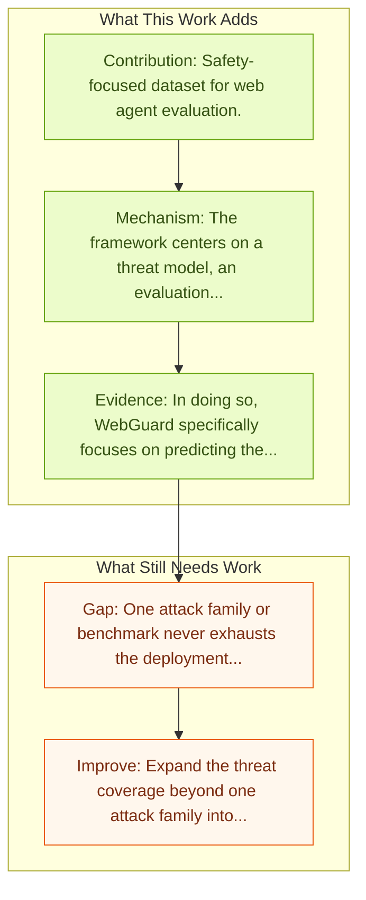

# WebGuard: Safety Dataset for Web Agents

Entry report generated on 2026-03-28 (Asia/Tokyo). This report is based on the repository entry, linked source metadata, and audit-time cross-checks.

## Snapshot

| Field | Detail |
| --- | --- |
| Repo entry | WebGuard: Safety Dataset for Web Agents |
| Actual target | [WebGuard: Building a Generalizable Guardrail for Web Agents](https://arxiv.org/abs/2507.14293) |
| Section | Safety and Security |
| Source location | `papers/safety/README.md:24` |
| Primary link type | `link` |
| Audit status | `ok` |
| Date / venue | July 2025 |
| Authors | Boyuan Zheng, Zeyi Liao, Scott Salisbury, Zeyuan Liu, Michael Lin, Qinyuan Zheng, Zifan Wang, Xiang Deng, Dawn Song, Huan Sun, Yu Su |
| Focus tags | `safety` `dataset` `web` |
| Center of gravity | web, safety |

## Quick Read

| Lens | Read |
| --- | --- |
| Problem pressure | Safety-focused dataset for web agent evaluation. |
| Most novel move | The paper turns general security concern into an operational agent-risk story centered on web. |
| Strongest evidence | In doing so, WebGuard specifically focuses on predicting the outcome of state-changing actions and contains 4,939 human-annotated... |
| Main caveat | One attack family or benchmark never exhausts the deployment threat surface for computer-use agents. |

## Visual Frame

```mermaid
flowchart LR
  Problem["Problem: Safety-focused dataset for web agent evaluation."] --> Novelty["Novelty: The paper turns general security concern into an operational..."]
  Novelty --> Framework["Framework: The framework centers on a threat model, an evaluation..."]
  Framework --> Evidence["Evidence: In doing so, WebGuard specifically focuses on predicting the..."]
  Evidence --> Gap["Gap: One attack family or benchmark never exhausts the deployment..."]
  Gap --> Next["Next: Expand the threat coverage beyond one attack family into..."]
  classDef insight fill:#dbeafe,stroke:#2563eb,color:#0f172a;
  classDef risk fill:#fee2e2,stroke:#dc2626,color:#7f1d1d;
  classDef next fill:#dcfce7,stroke:#16a34a,color:#14532d;
  class Problem,Novelty,Framework insight;
  class Evidence insight;
  class Gap risk;
  class Next next;
```

## Analysis Map

## Executive Summary

Safety-focused dataset for web agent evaluation. The rapid development of autonomous web agents powered by Large Language Models (LLMs), while greatly elevating efficiency, exposes the frontier risk of taking unintended or harmful actions. This situation underscores an urgent need for effective safety measures, akin to access controls for human users. To address this critical challenge, we introduce WebGuard, the first comprehensive dataset designed to support the assessment of web agent action risks and facilitate the development of guardrails for real-world online environments.

## Novelty

- The paper turns general security concern into an operational agent-risk story centered on web.
- The rapid development of autonomous web agents powered by Large Language Models (LLMs), while greatly elevating efficiency, exposes the frontier risk of taking unintended or harmful actions.
- This situation underscores an urgent need for effective safety measures, akin to access controls for human users.

## Core Contributions

- Safety-focused dataset for web agent evaluation.
- The rapid development of autonomous web agents powered by Large Language Models (LLMs), while greatly elevating efficiency, exposes the frontier risk of taking unintended or harmful actions.
- This situation underscores an urgent need for effective safety measures, akin to access controls for human users.
- To address this critical challenge, we introduce WebGuard, the first comprehensive dataset designed to support the assessment of web agent action risks and facilitate the development of guardrails for real-world online environments.
- Turns agent safety into concrete scenarios, attack surfaces, or measurable guardrail objectives.

## Framework and Operating Logic

- The framework centers on a threat model, an evaluation setup, and a concrete criterion for attack or defense success.
- The rapid development of autonomous web agents powered by Large Language Models (LLMs), while greatly elevating efficiency, exposes the frontier risk of taking unintended or harmful actions.
- This situation underscores an urgent need for effective safety measures, akin to access controls for human users.

## Evidence and Claimed Results

- In doing so, WebGuard specifically focuses on predicting the outcome of state-changing actions and contains 4,939 human-annotated actions from 193 websites across 22 diverse domains, including often-overlooked long-tail websites.
- Our initial evaluations reveal a concerning deficiency: even frontier LLMs achieve less than 60% accuracy in predicting action outcomes and less than 60% recall in lagging HIGH-risk actions, highlighting the risks of deploying current-generation agents without dedicated safeguards.
- We conduct comprehensive evaluations across multiple generalization settings and find that a fine-tuned Qwen2.5VL-7B model yields a substantial improvement in performance, boosting accuracy from 37% to 80% and HIGH-risk action recall from 20% to 76%.

## Gaps and Limitations

- One attack family or benchmark never exhausts the deployment threat surface for computer-use agents.
- Transfer remains uncertain across stacks, especially once the interface shifts toward live websites, layout drift, and prompt-injection exposure.

## How To Improve

- Expand the threat coverage beyond one attack family into cross-platform, human-in-the-loop, and defense-cost scenarios.
- Connect the benchmark or analysis to deployable mitigations such as takeover triggers, isolation policies, and audit logging.
- Measure the usability cost of safety controls so defenses can be judged as systems decisions, not only as refusals.

## Why It Matters

- This entry matters because stronger computer-use capability without a matching safety story creates an immediate operational risk.
- It gives the repo a concrete threat or guardrail lens instead of only capability metrics.

## Connections In This Repo

- [Mind2Web: Towards a Generalist Agent for the Web](../benchmarks-and-datasets/mind2web-towards-a-generalist-agent-for-the-web.md) - shared focus on web-agent realism, dynamic pages, or browser-side risk.
- [AgentTrek Trajectories](../benchmarks-and-datasets/agenttrek-trajectories.md) - shared focus on web-agent realism, dynamic pages, or browser-side risk.
- [JARVIS or Ultron? Safety and Security Threats of Computer-Using Agents](../survey-papers/jarvis-or-ultron-safety-and-security-threats-of-computer-using-agents.md) - shared concern with adversarial behavior, guardrails, or deployment risk.
- [WebArena: Realistic Web Environment for Building Autonomous Agents](../benchmarks-and-datasets/webarena-realistic-web-environment-for-building-autonomous-agents.md) - shared focus on web-agent realism, dynamic pages, or browser-side risk.

## Source Basis

- Primary basis: abstract-level paper metadata plus the repo-local notes in the source Markdown file.
- Audit access note: Metadata resolved cleanly during the audit.
