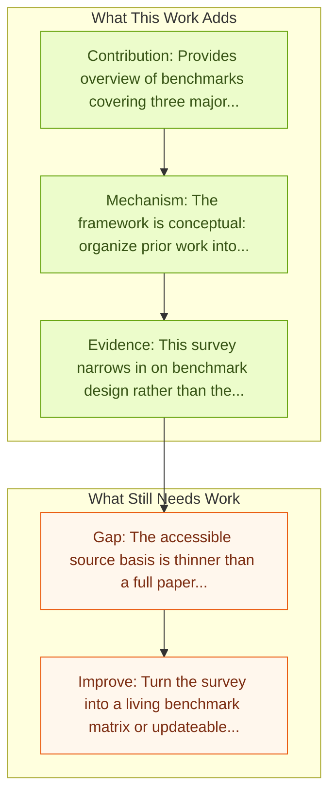

# A Survey on Benchmarks of LLM-based GUI Agents

Entry report generated on 2026-03-28 (Asia/Tokyo). This report is based on the repository entry, linked source metadata, and audit-time cross-checks.

## Snapshot

| Field | Detail |
| --- | --- |
| Repo entry | A Survey on Benchmarks of LLM-based GUI Agents |
| Actual target | [A Survey on Benchmarks of LLM-based GUI Agents](https://www.techrxiv.org/doi/pdf/10.36227/techrxiv.176591818.87526814) |
| Section | Survey Papers |
| Source location | `papers/surveys/README.md:89` |
| Primary link type | `link` |
| Audit status | `script-blocked` |
| Date / venue | 2025 |
| Focus tags | `survey`, `benchmarks`, `evaluation` |
| Center of gravity | `surveys` |

## Quick Read

| Lens | Read |
| --- | --- |
| Problem pressure | Provides overview of benchmarks covering three major categories: 1. Grounding and QA tasks 2. Navigation and multi-step reasoning tasks... |
| Most novel move | The novelty is synthetic rather than model-side: the paper tries to stabilize a fast-moving literature around benchmarks. |
| Strongest evidence | This survey narrows in on benchmark design rather than the full GUI-agent stack. |
| Main caveat | The accessible source basis is thinner than a full paper review, so some claims rest on project metadata, repo notes, or abstract-level... |

## Visual Frame

```mermaid
flowchart LR
  Problem["Problem: Provides overview of benchmarks covering three major..."] --> Novelty["Novelty: The novelty is synthetic rather than model-side: the paper..."]
  Novelty --> Framework["Framework: The framework is conceptual: organize prior work into..."]
  Framework --> Evidence["Evidence: This survey narrows in on benchmark design rather than the..."]
  Evidence --> Gap["Gap: The accessible source basis is thinner than a full paper..."]
  Gap --> Next["Next: Turn the survey into a living benchmark matrix or updateable..."]
  classDef insight fill:#dbeafe,stroke:#2563eb,color:#0f172a;
  classDef risk fill:#fee2e2,stroke:#dc2626,color:#7f1d1d;
  classDef next fill:#dcfce7,stroke:#16a34a,color:#14532d;
  class Problem,Novelty,Framework insight;
  class Evidence insight;
  class Gap risk;
  class Next next;
```

## Analysis Map

## Executive Summary

Provides overview of benchmarks covering three major categories: 1. Grounding and QA tasks 2. Navigation and multi-step reasoning tasks 3. Open-world environments This survey narrows in on benchmark design rather than the full GUI-agent stack. It organizes evaluation resources into three major families: grounding and question answering tasks, navigation and multi-step reasoning tasks, and open-world computer environments. That focus makes it a useful companion to broader surveys because it surfaces how different benchmarks reward different capabilities and where current evaluation still misses real deployment complexity.

## Novelty

- The novelty is synthetic rather than model-side: the paper tries to stabilize a fast-moving literature around benchmarks.
- This survey narrows in on benchmark design rather than the full GUI-agent stack.
- It organizes evaluation resources into three major families: grounding and question answering tasks, navigation and multi-step reasoning tasks, and open-world computer environments.

## Core Contributions

- Provides overview of benchmarks covering three major categories: 1. Grounding and QA tasks 2. Navigation and multi-step reasoning tasks 3. Open-world environments
- This survey narrows in on benchmark design rather than the full GUI-agent stack.
- It organizes evaluation resources into three major families: grounding and question answering tasks, navigation and multi-step reasoning tasks, and open-world computer environments.
- That focus makes it a useful companion to broader surveys because it surfaces how different benchmarks reward different capabilities and where current evaluation still misses real deployment complexity.

## Framework and Operating Logic

- The framework is conceptual: organize prior work into categories, then compare assumptions, metrics, and open problems.
- This survey narrows in on benchmark design rather than the full GUI-agent stack.
- It organizes evaluation resources into three major families: grounding and question answering tasks, navigation and multi-step reasoning tasks, and open-world computer environments.

## Evidence and Claimed Results

- This survey narrows in on benchmark design rather than the full GUI-agent stack.
- It organizes evaluation resources into three major families: grounding and question answering tasks, navigation and multi-step reasoning tasks, and open-world computer environments.
- That focus makes it a useful companion to broader surveys because it surfaces how different benchmarks reward different capabilities and where current evaluation still misses real deployment complexity.

## Gaps and Limitations

- The accessible source basis is thinner than a full paper review, so some claims rest on project metadata, repo notes, or abstract-level evidence rather than a complete methods read.
- As a survey, it depends on literature coverage and taxonomy quality more than on new experimental validation.
- Fast-moving agent releases can age the benchmark map or architecture taxonomy quickly.

## How To Improve

- Turn the survey into a living benchmark matrix or updateable appendix so it stays useful as the field changes.
- Separate capability, safety, and deployment-readiness lenses more sharply so the taxonomy can guide applied system design.
- Add clearer links between benchmark choice and the failure modes practitioners should expect in real deployments.

## Why It Matters

- This entry matters because the repository is large enough that a good field map saves readers from rediscovering the same bottlenecks paper by paper.
- It also helps turn the repo from a list of links into a navigable research landscape.

## Connections In This Repo

- [How Smart Is Your GUI Agent? A Framework for the Future of Software Interaction](how-smart-is-your-gui-agent-a-framework-for-the-future-of-software-interaction.md) - this report helps frame the survey papers side of the repo.
- [WebVoyager: End-to-End Web Agent with LMMs](../benchmarks-and-datasets/webvoyager-end-to-end-web-agent-with-lmms.md) - this report helps frame the benchmarks and datasets side of the repo.
- [A3: Android Agent Arena](../benchmarks-and-datasets/a3-android-agent-arena.md) - this report helps frame the benchmarks and datasets side of the repo.
- [Computer Agent Arena: Toward Human-Centric Evaluation and Analysis of Computer-Use Agents](../benchmarks-and-datasets/computer-agent-arena-toward-human-centric-evaluation-and-analysis-of-computer-use-agents.md) - this report helps frame the benchmarks and datasets side of the repo.

## Source Basis

- Primary basis: Accessible abstract-level signals were limited, so the report leans on repo notes and public index metadata.
- Audit access note: The linked page was script-blocked, so the report relies on repo notes and accessible public metadata.
