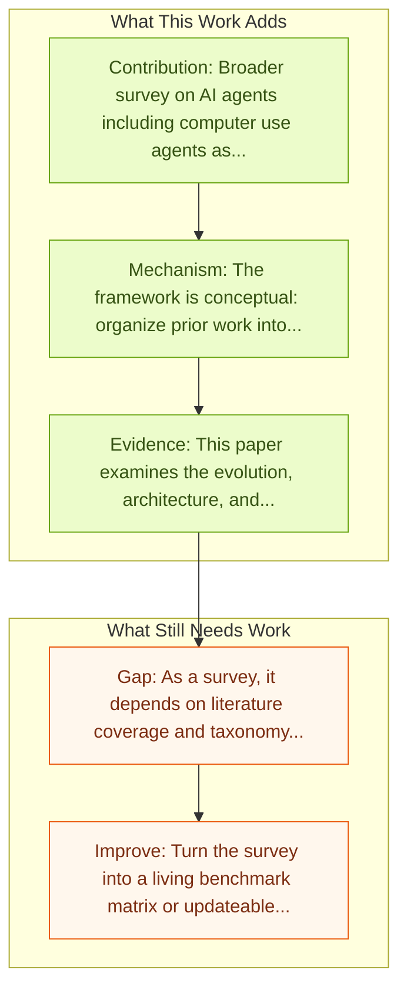

# AI Agents: Evolution, Architecture, and Real-World Applications

Entry report generated on 2026-03-28 (Asia/Tokyo). This report is based on the repository entry, linked source metadata, and audit-time cross-checks.

## Snapshot

| Field | Detail |
| --- | --- |
| Repo entry | AI Agents: Evolution, Architecture, and Real-World Applications |
| Actual target | [AI Agents: Evolution, Architecture, and Real-World Applications](https://arxiv.org/abs/2503.12687) |
| Section | Survey Papers |
| Source location | `papers/surveys/README.md:102` |
| Primary link type | `link` |
| Audit status | `ok` |
| Date / venue | March 2025 |
| Authors | Naveen Krishnan |
| Focus tags | `survey` `architecture` `applications` |
| Center of gravity | safety |

## Quick Read

| Lens | Read |
| --- | --- |
| Problem pressure | Broader survey on AI agents including computer use agents as a key application area. |
| Most novel move | The novelty is synthetic rather than model-side: the paper tries to stabilize a fast-moving literature around architecture, applications. |
| Strongest evidence | This paper examines the evolution, architecture, and practical applications of AI agents from their early, rule-based incarnations to... |
| Main caveat | As a survey, it depends on literature coverage and taxonomy quality more than on new experimental validation. |

## Visual Frame

```mermaid
flowchart LR
  Problem["Problem: Broader survey on AI agents including computer use agents as..."] --> Novelty["Novelty: The novelty is synthetic rather than model-side: the paper..."]
  Novelty --> Framework["Framework: The framework is conceptual: organize prior work into..."]
  Framework --> Evidence["Evidence: This paper examines the evolution, architecture, and..."]
  Evidence --> Gap["Gap: As a survey, it depends on literature coverage and taxonomy..."]
  Gap --> Next["Next: Turn the survey into a living benchmark matrix or updateable..."]
  classDef insight fill:#dbeafe,stroke:#2563eb,color:#0f172a;
  classDef risk fill:#fee2e2,stroke:#dc2626,color:#7f1d1d;
  classDef next fill:#dcfce7,stroke:#16a34a,color:#14532d;
  class Problem,Novelty,Framework insight;
  class Evidence insight;
  class Gap risk;
  class Next next;
```

## Analysis Map

## Executive Summary

Broader survey on AI agents including computer use agents as a key application area. This paper examines the evolution, architecture, and practical applications of AI agents from their early, rule-based incarnations to modern sophisticated systems that integrate large language models with dedicated modules for perception, planning, and tool use. Emphasizing both theoretical foundations and real-world deployments, the paper reviews key agent paradigms, discusses limitations of current evaluation benchmarks, and proposes a holistic evaluation framework that balances task effectiveness, efficiency, robustness, and safety. Applications across enterprise, personal assistance, and specialized domains are analyzed, with insights into future research directions for more resilient and adaptive AI agent systems.

## Novelty

- The novelty is synthetic rather than model-side: the paper tries to stabilize a fast-moving literature around architecture, applications.
- This paper examines the evolution, architecture, and practical applications of AI agents from their early, rule-based incarnations to modern sophisticated systems that integrate large language models with dedicated modules for perception, planning, and tool use.
- Emphasizing both theoretical foundations and real-world deployments, the paper reviews key agent paradigms, discusses limitations of current evaluation benchmarks, and proposes a holistic evaluation framework that balances task effectiveness, efficiency, robustness, and safety.

## Core Contributions

- Broader survey on AI agents including computer use agents as a key application area.
- This paper examines the evolution, architecture, and practical applications of AI agents from their early, rule-based incarnations to modern sophisticated systems that integrate large language models with dedicated modules for perception, planning, and tool use.
- Emphasizing both theoretical foundations and real-world deployments, the paper reviews key agent paradigms, discusses limitations of current evaluation benchmarks, and proposes a holistic evaluation framework that balances task effectiveness, efficiency, robustness, and safety.
- Applications across enterprise, personal assistance, and specialized domains are analyzed, with insights into future research directions for more resilient and adaptive AI agent systems.

## Framework and Operating Logic

- The framework is conceptual: organize prior work into categories, then compare assumptions, metrics, and open problems.
- This paper examines the evolution, architecture, and practical applications of AI agents from their early, rule-based incarnations to modern sophisticated systems that integrate large language models with dedicated modules for perception, planning, and tool use.
- Emphasizing both theoretical foundations and real-world deployments, the paper reviews key agent paradigms, discusses limitations of current evaluation benchmarks, and proposes a holistic evaluation framework that balances task effectiveness, efficiency, robustness, and safety.

## Evidence and Claimed Results

- This paper examines the evolution, architecture, and practical applications of AI agents from their early, rule-based incarnations to modern sophisticated systems that integrate large language models with dedicated modules for perception, planning, and tool use.
- Emphasizing both theoretical foundations and real-world deployments, the paper reviews key agent paradigms, discusses limitations of current evaluation benchmarks, and proposes a holistic evaluation framework that balances task effectiveness, efficiency, robustness, and safety.
- Applications across enterprise, personal assistance, and specialized domains are analyzed, with insights into future research directions for more resilient and adaptive AI agent systems.

## Gaps and Limitations

- As a survey, it depends on literature coverage and taxonomy quality more than on new experimental validation.
- Fast-moving agent releases can age the benchmark map or architecture taxonomy quickly.

## How To Improve

- Turn the survey into a living benchmark matrix or updateable appendix so it stays useful as the field changes.
- Separate capability, safety, and deployment-readiness lenses more sharply so the taxonomy can guide applied system design.
- Add clearer links between benchmark choice and the failure modes practitioners should expect in real deployments.

## Why It Matters

- This entry matters because the repository is large enough that a good field map saves readers from rediscovering the same bottlenecks paper by paper.
- It also helps turn the repo from a list of links into a navigable research landscape.

## Connections In This Repo

- [JARVIS or Ultron? Safety and Security Threats of CUAs](../safety-and-security/jarvis-or-ultron-safety-and-security-threats-of-cuas.md) - this report helps frame the safety and security side of the repo.
- [AI Agents Under Threat: Key Security Challenges and Future Pathways](../safety-and-security/ai-agents-under-threat-key-security-challenges-and-future-pathways.md) - this report helps frame the safety and security side of the repo.
- [Large Language Model-Brained GUI Agents: A Survey](large-language-model-brained-gui-agents-a-survey.md) - this report helps frame the survey papers side of the repo.
- [GUI Agents: A Survey](gui-agents-a-survey.md) - this report helps frame the survey papers side of the repo.

## Source Basis

- Primary basis: abstract-level paper metadata plus the repo-local notes in the source Markdown file.
- Audit access note: Metadata resolved cleanly during the audit.
