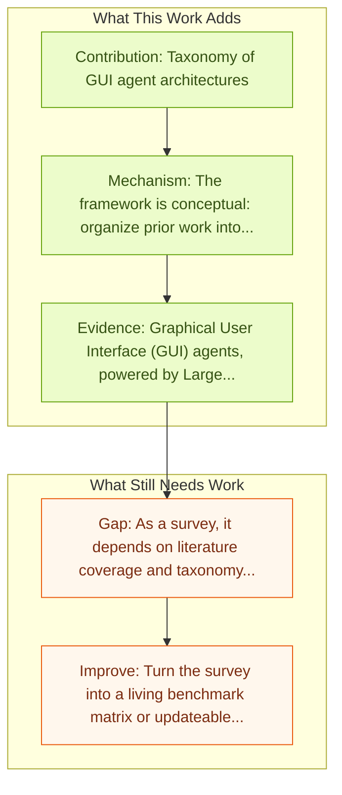

# GUI Agents: A Survey

Entry report generated on 2026-03-28 (Asia/Tokyo). This report is based on the repository entry, linked source metadata, and audit-time cross-checks.

## Snapshot

| Field | Detail |
| --- | --- |
| Repo entry | GUI Agents: A Survey |
| Actual target | [GUI Agents: A Survey](https://arxiv.org/abs/2412.13501) |
| Section | Survey Papers |
| Source location | `papers/surveys/README.md:24` |
| Primary link type | `link` |
| Audit status | `ok` |
| Date / venue | ACL 2025 Findings |
| Authors | Dang Nguyen, Jian Chen, Yu Wang, Gang Wu, Namyong Park, Zhengmian Hu, Hanjia Lyu, Junda Wu, Ryan Aponte, Yu Xia, Xintong Li, Jing Shi, Hongjie Chen, Viet Dac Lai, Zhouhang Xie, Sungchul Kim, Ruiyi Zhang, Tong Yu, Mehrab Tanjim, Nesreen K. Ahmed, Puneet Mathur, Seunghyun Yoon, Lina Yao, Branislav Kveton, Jihyung Kil, Thien Huu Nguyen, Trung Bui, Tianyi Zhou, Ryan A. Rossi, Franck Dernoncourt |
| Focus tags | `survey` `comprehensive` `taxonomy` |
| Center of gravity | desktop |

## Quick Read

| Lens | Read |
| --- | --- |
| Problem pressure | Provides a comprehensive overview that categorizes benchmarks, evaluation metrics, architectures, and training methods for GUI agents. |
| Most novel move | The novelty is synthetic rather than model-side: the paper tries to stabilize a fast-moving literature around taxonomy, key contributions. |
| Strongest evidence | Graphical User Interface (GUI) agents, powered by Large Foundation Models, have emerged as a transformative approach to automating... |
| Main caveat | As a survey, it depends on literature coverage and taxonomy quality more than on new experimental validation. |

## Visual Frame

```mermaid
flowchart LR
  Problem["Problem: Provides a comprehensive overview that categorizes..."] --> Novelty["Novelty: The novelty is synthetic rather than model-side: the paper..."]
  Novelty --> Framework["Framework: The framework is conceptual: organize prior work into..."]
  Framework --> Evidence["Evidence: Graphical User Interface (GUI) agents, powered by Large..."]
  Evidence --> Gap["Gap: As a survey, it depends on literature coverage and taxonomy..."]
  Gap --> Next["Next: Turn the survey into a living benchmark matrix or updateable..."]
  classDef insight fill:#dbeafe,stroke:#2563eb,color:#0f172a;
  classDef risk fill:#fee2e2,stroke:#dc2626,color:#7f1d1d;
  classDef next fill:#dcfce7,stroke:#16a34a,color:#14532d;
  class Problem,Novelty,Framework insight;
  class Evidence insight;
  class Gap risk;
  class Next next;
```

## Analysis Map

## Executive Summary

Provides a comprehensive overview that categorizes benchmarks, evaluation metrics, architectures, and training methods for GUI agents. Graphical User Interface (GUI) agents, powered by Large Foundation Models, have emerged as a transformative approach to automating human-computer interaction. These agents autonomously interact with digital systems or software applications via GUIs, emulating human actions such as clicking, typing, and navigating visual elements across diverse platforms. Motivated by the growing interest and fundamental importance of GUI agents, we provide a comprehensive survey that categorizes their benchmarks, evaluation metrics, architectures, and training methods.

## Novelty

- The novelty is synthetic rather than model-side: the paper tries to stabilize a fast-moving literature around taxonomy, key contributions.
- Graphical User Interface (GUI) agents, powered by Large Foundation Models, have emerged as a transformative approach to automating human-computer interaction.
- These agents autonomously interact with digital systems or software applications via GUIs, emulating human actions such as clicking, typing, and navigating visual elements across diverse platforms.

## Core Contributions

- Taxonomy of GUI agent architectures
- Comparison of evaluation benchmarks
- Analysis of training paradigms
- Discussion of challenges and future directions

## Framework and Operating Logic

- The framework is conceptual: organize prior work into categories, then compare assumptions, metrics, and open problems.
- Graphical User Interface (GUI) agents, powered by Large Foundation Models, have emerged as a transformative approach to automating human-computer interaction.
- These agents autonomously interact with digital systems or software applications via GUIs, emulating human actions such as clicking, typing, and navigating visual elements across diverse platforms.

## Evidence and Claimed Results

- Graphical User Interface (GUI) agents, powered by Large Foundation Models, have emerged as a transformative approach to automating human-computer interaction.
- These agents autonomously interact with digital systems or software applications via GUIs, emulating human actions such as clicking, typing, and navigating visual elements across diverse platforms.
- Motivated by the growing interest and fundamental importance of GUI agents, we provide a comprehensive survey that categorizes their benchmarks, evaluation metrics, architectures, and training methods.

## Gaps and Limitations

- As a survey, it depends on literature coverage and taxonomy quality more than on new experimental validation.
- Fast-moving agent releases can age the benchmark map or architecture taxonomy quickly.

## How To Improve

- Turn the survey into a living benchmark matrix or updateable appendix so it stays useful as the field changes.
- Separate capability, safety, and deployment-readiness lenses more sharply so the taxonomy can guide applied system design.
- Add clearer links between benchmark choice and the failure modes practitioners should expect in real deployments.

## Why It Matters

- This entry matters because the repository is large enough that a good field map saves readers from rediscovering the same bottlenecks paper by paper.
- It also helps turn the repo from a list of links into a navigable research landscape.

## Connections In This Repo

- [JARVIS or Ultron? Safety and Security Threats of CUAs](../safety-and-security/jarvis-or-ultron-safety-and-security-threats-of-cuas.md) - this report helps frame the safety and security side of the repo.
- [AI Agents Under Threat: Key Security Challenges and Future Pathways](../safety-and-security/ai-agents-under-threat-key-security-challenges-and-future-pathways.md) - this report helps frame the safety and security side of the repo.
- [Large Language Model-Brained GUI Agents: A Survey](large-language-model-brained-gui-agents-a-survey.md) - this report helps frame the survey papers side of the repo.
- [AMEX: Android Multi-annotation EXpo](../benchmarks-and-datasets/amex-android-multi-annotation-expo.md) - this report helps frame the benchmarks and datasets side of the repo.

## Source Basis

- Primary basis: abstract-level paper metadata plus the repo-local notes in the source Markdown file.
- Audit access note: Metadata resolved cleanly during the audit.
