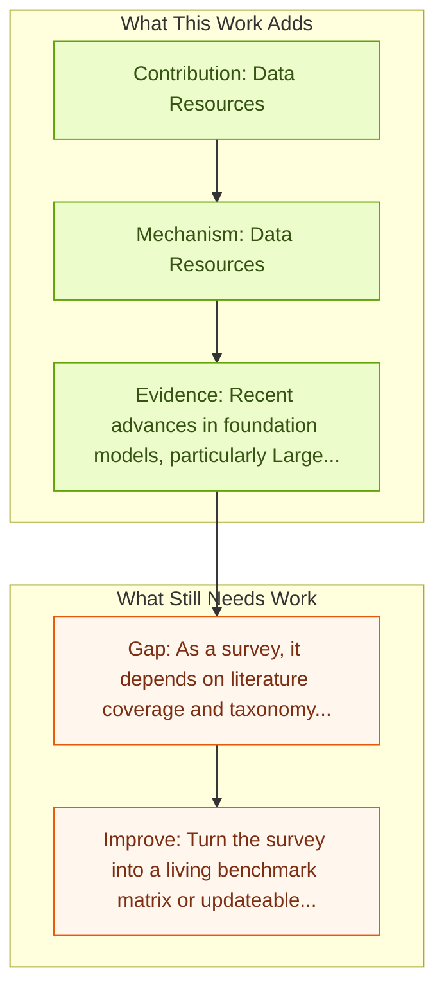

# GUI Agents with Foundation Models: A Comprehensive Survey

Entry report generated on 2026-03-28 (Asia/Tokyo). This report is based on the repository entry, linked source metadata, and audit-time cross-checks.

## Snapshot

| Field | Detail |
| --- | --- |
| Repo entry | GUI Agents with Foundation Models: A Comprehensive Survey |
| Actual target | [GUI Agents with Foundation Models: A Comprehensive Survey](https://arxiv.org/abs/2411.04890) |
| Section | Survey Papers |
| Source location | `papers/surveys/README.md:40` |
| Primary link type | `link` |
| Audit status | `limited-access` |
| Date / venue | November 2024 |
| Authors | Shuai Wang, Weiwen Liu, Jingxuan Chen, Yuqi Zhou, Weinan Gan, Xingshan Zeng, Yuhan Che, Shuai Yu, Xinlong Hao, Kun Shao, Bin Wang, Chuhan Wu, Yasheng Wang, Ruiming Tang, Jianye Hao |
| Focus tags | `survey` `foundation-models` `framework` |
| Center of gravity | surveys |

## Quick Read

| Lens | Read |
| --- | --- |
| Problem pressure | Consolidates recent research on (M)LLM-based GUI agents, highlighting key innovations in data resources, frameworks, and applications. |
| Most novel move | The novelty is synthetic rather than model-side: the paper tries to stabilize a fast-moving literature around foundation-models... |
| Strongest evidence | Recent advances in foundation models, particularly Large Language Models (LLMs) and Multimodal Large Language Models (MLLMs), have... |
| Main caveat | As a survey, it depends on literature coverage and taxonomy quality more than on new experimental validation. |

## Visual Frame

```mermaid
flowchart LR
  Problem["Problem: Consolidates recent research on (M)LLM-based GUI agents..."] --> Novelty["Novelty: The novelty is synthetic rather than model-side: the paper..."]
  Novelty --> Framework["Framework: Data Resources"]
  Framework --> Evidence["Evidence: Recent advances in foundation models, particularly Large..."]
  Evidence --> Gap["Gap: As a survey, it depends on literature coverage and taxonomy..."]
  Gap --> Next["Next: Turn the survey into a living benchmark matrix or updateable..."]
  classDef insight fill:#dbeafe,stroke:#2563eb,color:#0f172a;
  classDef risk fill:#fee2e2,stroke:#dc2626,color:#7f1d1d;
  classDef next fill:#dcfce7,stroke:#16a34a,color:#14532d;
  class Problem,Novelty,Framework insight;
  class Evidence insight;
  class Gap risk;
  class Next next;
```

## Analysis Map

## Executive Summary

Consolidates recent research on (M)LLM-based GUI agents, highlighting key innovations in data resources, frameworks, and applications. Recent advances in foundation models, particularly Large Language Models (LLMs) and Multimodal Large Language Models (MLLMs), have facilitated the development of intelligent agents capable of performing complex tasks. By leveraging the ability of (M)LLMs to process and interpret Graphical User Interfaces (GUIs), these agents can autonomously execute user instructions, simulating human-like interactions such as clicking and typing. This survey consolidates recent research on (M)LLM-based GUI agents, highlighting key innovations in data resources, frameworks, and applications.

## Novelty

- The novelty is synthetic rather than model-side: the paper tries to stabilize a fast-moving literature around foundation-models, framework, framework components.
- It also stands out for agent Frameworks.
- It also stands out for applications.

## Core Contributions

- Data Resources
- Agent Frameworks
- Applications
- Challenges
- Provides a structured taxonomy that helps compare papers that would otherwise look incomparable.

## Framework and Operating Logic

- Data Resources
- Agent Frameworks
- Applications
- Challenges

## Evidence and Claimed Results

- Recent advances in foundation models, particularly Large Language Models (LLMs) and Multimodal Large Language Models (MLLMs), have facilitated the development of intelligent agents capable of performing complex tasks.
- By leveraging the ability of (M)LLMs to process and interpret Graphical User Interfaces (GUIs), these agents can autonomously execute user instructions, simulating human-like interactions such as clicking and typing.
- This survey consolidates recent research on (M)LLM-based GUI agents, highlighting key innovations in data resources, frameworks, and applications.

## Gaps and Limitations

- As a survey, it depends on literature coverage and taxonomy quality more than on new experimental validation.
- Fast-moving agent releases can age the benchmark map or architecture taxonomy quickly.

## How To Improve

- Turn the survey into a living benchmark matrix or updateable appendix so it stays useful as the field changes.
- Separate capability, safety, and deployment-readiness lenses more sharply so the taxonomy can guide applied system design.
- Add clearer links between benchmark choice and the failure modes practitioners should expect in real deployments.

## Why It Matters

- This entry matters because the repository is large enough that a good field map saves readers from rediscovering the same bottlenecks paper by paper.
- It also helps turn the repo from a list of links into a navigable research landscape.

## Connections In This Repo

- [How Smart Is Your GUI Agent? A Framework for the Future of Software Interaction](how-smart-is-your-gui-agent-a-framework-for-the-future-of-software-interaction.md) - this report helps frame the survey papers side of the repo.
- [JARVIS or Ultron? Safety and Security Threats of CUAs](../safety-and-security/jarvis-or-ultron-safety-and-security-threats-of-cuas.md) - this report helps frame the safety and security side of the repo.
- [AI Agents Under Threat: Key Security Challenges and Future Pathways](../safety-and-security/ai-agents-under-threat-key-security-challenges-and-future-pathways.md) - this report helps frame the safety and security side of the repo.
- [Large Language Model-Brained GUI Agents: A Survey](large-language-model-brained-gui-agents-a-survey.md) - this report helps frame the survey papers side of the repo.

## Source Basis

- Primary basis: abstract-level paper metadata plus the repo-local notes in the source Markdown file.
- Audit access note: The linked source had limited direct readability during the audit, so the report leans more heavily on accessible metadata and repo context.
