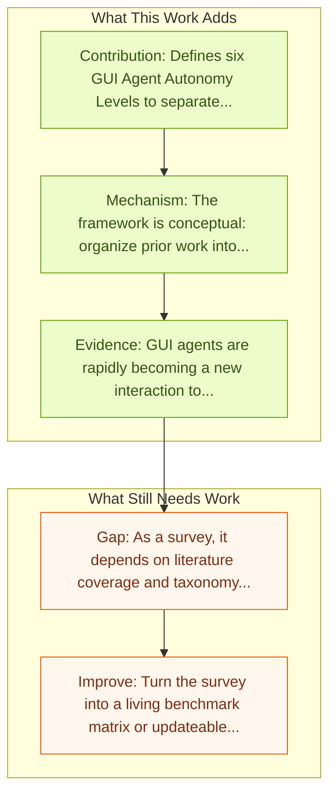

# How Smart Is Your GUI Agent? A Framework for the Future of Software Interaction

Entry report generated on 2026-03-28 (Asia/Tokyo). This report is based on the repository entry, linked source metadata, and audit-time cross-checks.

## Snapshot

| Field | Detail |
| --- | --- |
| Repo entry | How Smart Is Your GUI Agent? A Framework for the Future of Software Interaction |
| Actual target | [How Smart Is Your GUI Agent? A Framework for the Future of Software Interaction](https://arxiv.org/abs/2602.11514) |
| Section | Survey Papers |
| Source location | `papers/surveys/README.md:112` |
| Primary link type | `link` |
| Audit status | `ok` |
| Date / venue | February 2026 |
| Authors | Sidong Feng, Chunyang Chen |
| Focus tags | `survey` `autonomy` `framework` `evaluation` |
| Center of gravity | autonomy, framework |

## Quick Read

| Lens | Read |
| --- | --- |
| Problem pressure | Conceptual framework that introduces GUI Agent Autonomy Levels (GAL) for computer-use systems. |
| Most novel move | The novelty is synthetic rather than model-side: the paper tries to stabilize a fast-moving literature around autonomy, framework, key... |
| Strongest evidence | GUI agents are rapidly becoming a new interaction to software, allowing people to navigate web, desktop and mobile rather than execute... |
| Main caveat | As a survey, it depends on literature coverage and taxonomy quality more than on new experimental validation. |

## Visual Frame

```mermaid
flowchart LR
  Problem["Problem: Conceptual framework that introduces GUI Agent Autonomy..."] --> Novelty["Novelty: The novelty is synthetic rather than model-side: the paper..."]
  Novelty --> Framework["Framework: The framework is conceptual: organize prior work into..."]
  Framework --> Evidence["Evidence: GUI agents are rapidly becoming a new interaction to..."]
  Evidence --> Gap["Gap: As a survey, it depends on literature coverage and taxonomy..."]
  Gap --> Next["Next: Turn the survey into a living benchmark matrix or updateable..."]
  classDef insight fill:#dbeafe,stroke:#2563eb,color:#0f172a;
  classDef risk fill:#fee2e2,stroke:#dc2626,color:#7f1d1d;
  classDef next fill:#dcfce7,stroke:#16a34a,color:#14532d;
  class Problem,Novelty,Framework insight;
  class Evidence insight;
  class Gap risk;
  class Next next;
```

## Analysis Map

## Executive Summary

Conceptual framework that introduces GUI Agent Autonomy Levels (GAL) for computer-use systems. GUI agents are rapidly becoming a new interaction to software, allowing people to navigate web, desktop and mobile rather than execute them click by click. Yet ``agent'' is described with radically different degrees of autonomy, obscuring capability, responsibility and risk. We call for conceptual clarity through GUI Agent Autonomy Levels (GAL), a six-level framework that makes autonomy explicit and helps benchmark progress toward trustworthy software interaction. Its main contribution is a field map, taxonomy, and synthesis rather than a new model.

## Novelty

- The novelty is synthetic rather than model-side: the paper tries to stabilize a fast-moving literature around autonomy, framework, key contributions.
- GUI agents are rapidly becoming a new interaction to software, allowing people to navigate web, desktop and mobile rather than execute them click by click.
- Yet ``agent'' is described with radically different degrees of autonomy, obscuring capability, responsibility and risk.

## Core Contributions

- Defines six GUI Agent Autonomy Levels to separate capability, responsibility, and risk.
- Makes autonomy explicit across web, desktop, and mobile software interaction.
- Reframes benchmark design and deployment trust as autonomy-level questions, not only model-quality questions.
- ## Additional Resources
- Provides a structured taxonomy that helps compare papers that would otherwise look incomparable.

## Framework and Operating Logic

- The framework is conceptual: organize prior work into categories, then compare assumptions, metrics, and open problems.
- GUI agents are rapidly becoming a new interaction to software, allowing people to navigate web, desktop and mobile rather than execute them click by click.
- Yet ``agent'' is described with radically different degrees of autonomy, obscuring capability, responsibility and risk.

## Evidence and Claimed Results

- GUI agents are rapidly becoming a new interaction to software, allowing people to navigate web, desktop and mobile rather than execute them click by click.
- Yet ``agent'' is described with radically different degrees of autonomy, obscuring capability, responsibility and risk.
- We call for conceptual clarity through GUI Agent Autonomy Levels (GAL), a six-level framework that makes autonomy explicit and helps benchmark progress toward trustworthy software interaction.

## Gaps and Limitations

- As a survey, it depends on literature coverage and taxonomy quality more than on new experimental validation.
- Fast-moving agent releases can age the benchmark map or architecture taxonomy quickly.

## How To Improve

- Turn the survey into a living benchmark matrix or updateable appendix so it stays useful as the field changes.
- Separate capability, safety, and deployment-readiness lenses more sharply so the taxonomy can guide applied system design.
- Add clearer links between benchmark choice and the failure modes practitioners should expect in real deployments.

## Why It Matters

- This entry matters because the repository is large enough that a good field map saves readers from rediscovering the same bottlenecks paper by paper.
- It also helps turn the repo from a list of links into a navigable research landscape.

## Connections In This Repo

- [GUI Agents with Foundation Models: A Comprehensive Survey](gui-agents-with-foundation-models-a-comprehensive-survey.md) - this report helps frame the survey papers side of the repo.
- [A Survey on Benchmarks of LLM-based GUI Agents](a-survey-on-benchmarks-of-llm-based-gui-agents.md) - this report helps frame the survey papers side of the repo.
- [WebVoyager: End-to-End Web Agent with LMMs](../benchmarks-and-datasets/webvoyager-end-to-end-web-agent-with-lmms.md) - this report helps frame the benchmarks and datasets side of the repo.
- [A3: Android Agent Arena](../benchmarks-and-datasets/a3-android-agent-arena.md) - this report helps frame the benchmarks and datasets side of the repo.

## Source Basis

- Primary basis: Primary arXiv abstract metadata was fetched live from the linked paper page.
- Audit access note: Metadata resolved cleanly during the audit.
