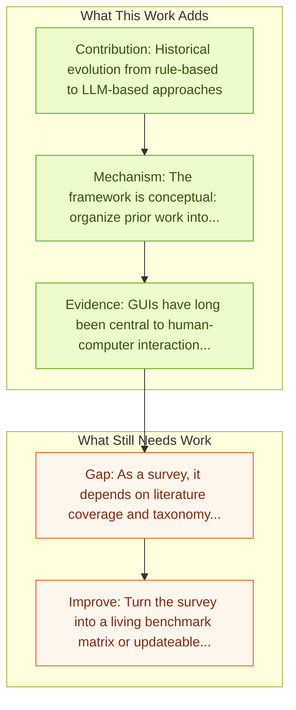

# Large Language Model-Brained GUI Agents: A Survey

Entry report generated on 2026-03-28 (Asia/Tokyo). This report is based on the repository entry, linked source metadata, and audit-time cross-checks.

## Snapshot

| Field | Detail |
| --- | --- |
| Repo entry | Large Language Model-Brained GUI Agents: A Survey |
| Actual target | [Large Language Model-Brained GUI Agents: A Survey](https://arxiv.org/abs/2411.18279) |
| Section | Survey Papers |
| Source location | `papers/surveys/README.md:7` |
| Primary link type | `link` |
| Audit status | `limited-access` |
| Date / venue | November 2024 (Updated May 2025) |
| Authors | Chaoyun Zhang, Shilin He, Jiaxu Qian, Bowen Li, Liqun Li, Si Qin, Yu Kang, Minghua Ma |
| Focus tags | `survey`, `llm`, `gui`, `comprehensive` |
| Center of gravity | `web`, `desktop`, `mobile` |

## Quick Read

| Lens | Read |
| --- | --- |
| Problem pressure | This comprehensive survey explores the historical evolution, core components, and advanced techniques of LLM-brained GUI agents. These... |
| Most novel move | The novelty is synthetic rather than model-side: the paper tries to stabilize a fast-moving literature around llm, gui, key topics covered. |
| Strongest evidence | GUIs have long been central to human-computer interaction, providing an intuitive and visually-driven way to access and interact with... |
| Main caveat | As a survey, it depends on literature coverage and taxonomy quality more than on new experimental validation. |

## Visual Frame

```mermaid
flowchart LR
  Problem["Problem: This comprehensive survey explores the historical evolution..."] --> Novelty["Novelty: The novelty is synthetic rather than model-side: the paper..."]
  Novelty --> Framework["Framework: The framework is conceptual: organize prior work into..."]
  Framework --> Evidence["Evidence: GUIs have long been central to human-computer interaction..."]
  Evidence --> Gap["Gap: As a survey, it depends on literature coverage and taxonomy..."]
  Gap --> Next["Next: Turn the survey into a living benchmark matrix or updateable..."]
  classDef insight fill:#dbeafe,stroke:#2563eb,color:#0f172a;
  classDef risk fill:#fee2e2,stroke:#dc2626,color:#7f1d1d;
  classDef next fill:#dcfce7,stroke:#16a34a,color:#14532d;
  class Problem,Novelty,Framework insight;
  class Evidence insight;
  class Gap risk;
  class Next next;
```

## Analysis Map

## Executive Summary

This comprehensive survey explores the historical evolution, core components, and advanced techniques of LLM-brained GUI agents. These agents can interpret complex GUI elements and autonomously execute actions based on natural language instructions. GUIs have long been central to human-computer interaction, providing an intuitive and visually-driven way to access and interact with digital systems. The advent of LLMs, particularly multimodal models, has ushered in a new era of GUI automation. They have demonstrated exceptional capabilities in natural language understanding, code generation, and visual processing.

## Novelty

- The novelty is synthetic rather than model-side: the paper tries to stabilize a fast-moving literature around llm, gui, key topics covered.
- GUIs have long been central to human-computer interaction, providing an intuitive and visually-driven way to access and interact with digital systems.
- The advent of LLMs, particularly multimodal models, has ushered in a new era of GUI automation.

## Core Contributions

- Historical evolution from rule-based to LLM-based approaches
- Core components: perception, planning, action
- Training methods and data collection
- Evaluation benchmarks
- Applications across web, mobile, desktop

## Framework and Operating Logic

- The framework is conceptual: organize prior work into categories, then compare assumptions, metrics, and open problems.
- GUIs have long been central to human-computer interaction, providing an intuitive and visually-driven way to access and interact with digital systems.
- The advent of LLMs, particularly multimodal models, has ushered in a new era of GUI automation.

## Evidence and Claimed Results

- GUIs have long been central to human-computer interaction, providing an intuitive and visually-driven way to access and interact with digital systems.
- The advent of LLMs, particularly multimodal models, has ushered in a new era of GUI automation.
- They have demonstrated exceptional capabilities in natural language understanding, code generation, and visual processing.

## Gaps and Limitations

- As a survey, it depends on literature coverage and taxonomy quality more than on new experimental validation.
- Fast-moving agent releases can age the benchmark map or architecture taxonomy quickly.

## How To Improve

- Turn the survey into a living benchmark matrix or updateable appendix so it stays useful as the field changes.
- Separate capability, safety, and deployment-readiness lenses more sharply so the taxonomy can guide applied system design.
- Add clearer links between benchmark choice and the failure modes practitioners should expect in real deployments.

## Why It Matters

- This entry matters because the repository is large enough that a good field map saves readers from rediscovering the same bottlenecks paper by paper.
- It also helps turn the repo from a list of links into a navigable research landscape.

## Connections In This Repo

- [JARVIS or Ultron? Safety and Security Threats of CUAs](../safety-and-security/jarvis-or-ultron-safety-and-security-threats-of-cuas.md) - this report helps frame the safety and security side of the repo.
- [AI Agents Under Threat: Key Security Challenges and Future Pathways](../safety-and-security/ai-agents-under-threat-key-security-challenges-and-future-pathways.md) - this report helps frame the safety and security side of the repo.
- [GUI Agents: A Survey](gui-agents-a-survey.md) - this report helps frame the survey papers side of the repo.
- [AMEX: Android Multi-annotation EXpo](../benchmarks-and-datasets/amex-android-multi-annotation-expo.md) - this report helps frame the benchmarks and datasets side of the repo.

## Source Basis

- Primary basis: abstract-level paper metadata plus the repo-local notes in the source Markdown file.
- Audit access note: The linked source had limited direct readability during the audit, so the report leans more heavily on accessible metadata and repo context.
