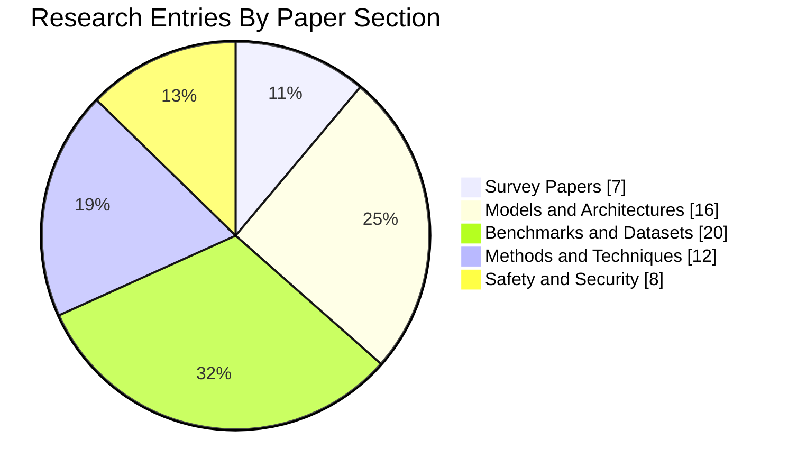
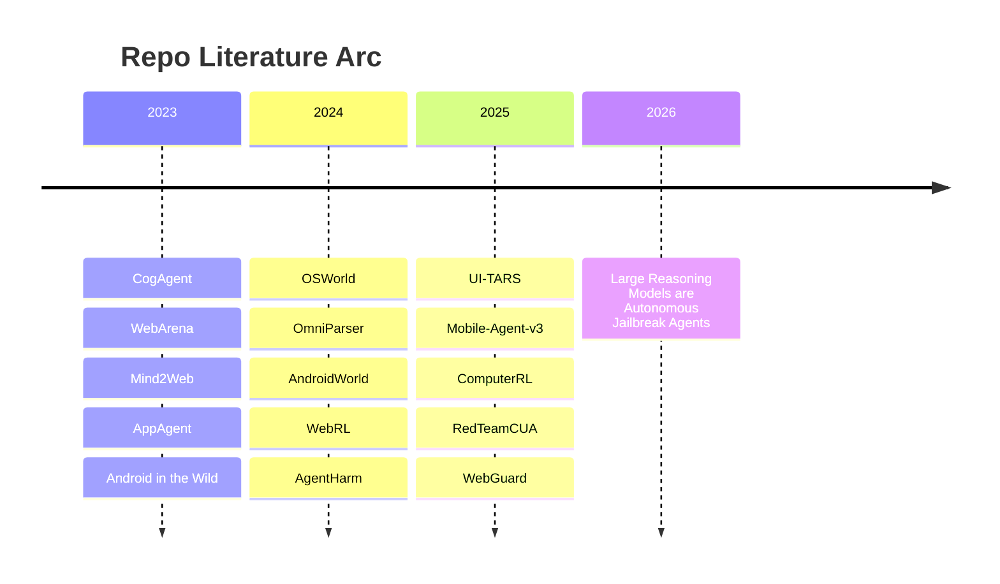
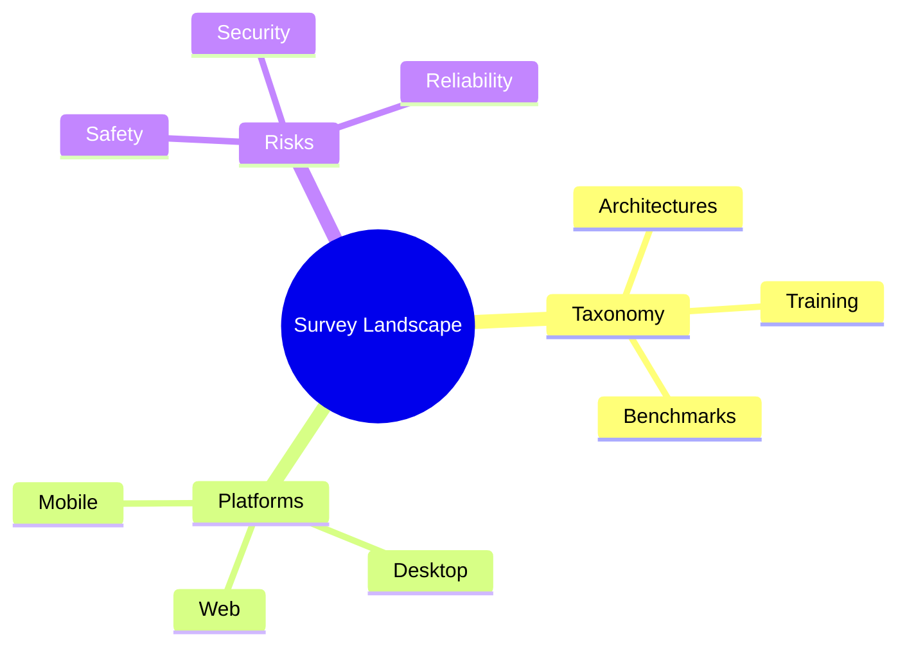
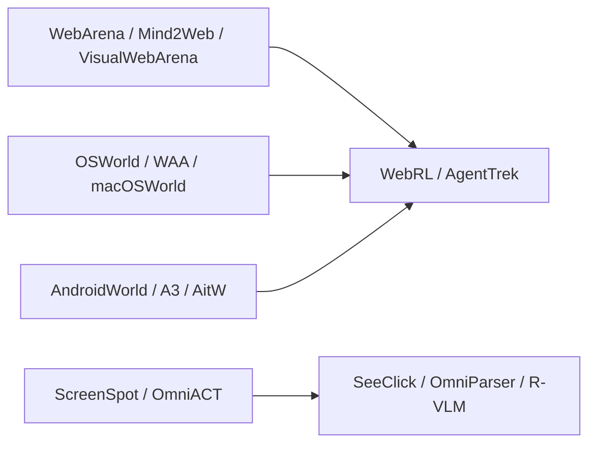
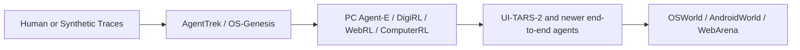
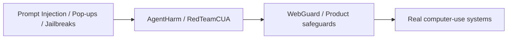

# Per-Paper Deep Report

Audit date: 2026-03-28 (Asia/Tokyo)

This file expands the link audit into **57 formal paper/document entries** plus **6 research-adjacent entries** (project pages or code-only artifacts) taken from the `papers/*/README.md` files. Each entry includes a summary, repo-level findings, limitations, and direct connections to other entries in this repository.

## Visual Index

## Reading Guide

- `Repo entry`: the title as it appears in this repository.
- `Actual target`: the paper or artifact the URL currently resolves to.
- `Audit status`: whether the paper page resolved directly, was project-only, or had access limits.
- `Repo-curated findings`: the strongest concrete details already encoded in the repository entry.
- `Limitations`: explicit where the repo entry gave them; otherwise labeled as an inference from scope.
- `Connections`: specific nearby papers or entries in this repository that help place the paper in context.

## Survey Papers

### Large Language Model-Brained GUI Agents: A Survey

| Field | Detail |
| --- | --- |
| Repo entry | Large Language Model-Brained GUI Agents: A Survey |
| Actual target | [Large Language Model-Brained GUI Agents: A Survey](https://arxiv.org/abs/2411.18279) |
| Source | `papers/surveys/README.md:7` |
| Audit status | `limited-access` |
| Date / venue | November 2024 (Updated May 2025) |
| Tags | `survey`, `llm`, `gui`, `comprehensive` |

**Summary**

GUIs have long been central to human-computer interaction, providing an intuitive and visually-driven way to access and interact with digital systems. The advent of LLMs, particularly multimodal models, has ushered in a new era of GUI automation. They have demonstrated exceptional capabilities in natural language understanding, code generation, and visual processing. This has paved the way for a new generation of LLM-brained GUI agents capable of interpreting complex GUI elements and autonomously executing actions based on natural language instructions. These agents represent a paradigm shift, enabling users to perform intricate, multi-step tasks through simple conversational commands. Their applications span across web navigation, mobile app interactions, and desktop automation, offering a transformative user experience that revolutionizes how individuals interact with software. This emerging field is rapidly advancing, with significant progress in both research and industry. To provide a structured understanding of this trend, this paper presents a comprehensive survey of LLM-brained GUI agents, exploring their historical evolution, core components, and advanced techniques. We address research questions such as existing GUI agent frameworks, the collection and utilization of data for training specialized GUI agents, the development of large action models tailored for GUI tasks, and the evaluation metrics and benchmarks necessary to assess their effectiveness. Additionally, we examine emerging applications powered by these agents. Through a detailed analysis, this survey identifies key research gaps and outlines a roadmap for future advancements in the field. By consolidating foundational knowledge and state-of-the-art developments, this work aims to guide both researchers and practitioners in overcoming challenges and unlocking the full potential of LLM-brained GUI agents.

**Repo-curated findings**

- Key Topics Covered: Historical evolution from rule-based to LLM-based approaches
- Key Topics Covered: Core components: perception, planning, action
- Key Topics Covered: Training methods and data collection
- Key Topics Covered: Evaluation benchmarks

**Limitations**

- Inferred limitation: this is a synthesis layer, so it is better for orientation than for measuring one concrete agent, benchmark, or training recipe.

**Connections**

- [UI-TARS: Pioneering Automated GUI Interaction with Native Agents](https://arxiv.org/abs/2501.12326) - one representative end-to-end native agent model covered by the broader survey landscape.
- [OSWorld: Multimodal Agents for Open-Ended Tasks in Real Computer Environments](https://arxiv.org/abs/2404.07972) - a representative benchmark family that many surveys organize around.
- [AgentHarm: LLM Agent Safety Benchmark](https://arxiv.org/abs/2410.09024) - a representative safety line that newer surveys increasingly need to account for.

**Audit access note**: <urlopen error _ssl.c:1112: The handshake operation timed out>

---

### GUI Agents: A Survey

| Field | Detail |
| --- | --- |
| Repo entry | GUI Agents: A Survey |
| Actual target | [GUI Agents: A Survey](https://arxiv.org/abs/2412.13501) |
| Source | `papers/surveys/README.md:24` |
| Audit status | `ok` |
| Date / venue | ACL 2025 Findings |
| Tags | `survey`, `comprehensive`, `taxonomy` |

**Summary**

Graphical User Interface (GUI) agents, powered by Large Foundation Models, have emerged as a transformative approach to automating human-computer interaction. These agents autonomously interact with digital systems or software applications via GUIs, emulating human actions such as clicking, typing, and navigating visual elements across diverse platforms. Motivated by the growing interest and fundamental importance of GUI agents, we provide a comprehensive survey that categorizes their benchmarks, evaluation metrics, architectures, and training methods. We propose a unified framework that delineates their perception, reasoning, planning, and acting capabilities. Furthermore, we identify important open challenges and discuss key future directions. Finally, this work serves as a basis for practitioners and researchers to gain an intuitive understanding of current progress, techniques, benchmarks, and critical open problems that remain to be addressed.

**Repo-curated findings**

- Key Contributions: Taxonomy of GUI agent architectures
- Key Contributions: Comparison of evaluation benchmarks
- Key Contributions: Analysis of training paradigms
- Key Contributions: Discussion of challenges and future directions

**Limitations**

- Inferred limitation: this is a synthesis layer, so it is better for orientation than for measuring one concrete agent, benchmark, or training recipe.

**Connections**

- [UI-TARS: Pioneering Automated GUI Interaction with Native Agents](https://arxiv.org/abs/2501.12326) - one representative end-to-end native agent model covered by the broader survey landscape.
- [OSWorld: Multimodal Agents for Open-Ended Tasks in Real Computer Environments](https://arxiv.org/abs/2404.07972) - a representative benchmark family that many surveys organize around.
- [AgentHarm: LLM Agent Safety Benchmark](https://arxiv.org/abs/2410.09024) - a representative safety line that newer surveys increasingly need to account for.
- [AgentTrek: Agent Trajectory Synthesis via Web Tutorials](https://arxiv.org/abs/2412.09605) - shared focus on trajectories, data generation, or RL training.

**Audit access note**: Metadata or content resolved during the audit.

---

### GUI Agents with Foundation Models: A Comprehensive Survey

| Field | Detail |
| --- | --- |
| Repo entry | GUI Agents with Foundation Models: A Comprehensive Survey |
| Actual target | [GUI Agents with Foundation Models: A Comprehensive Survey](https://arxiv.org/abs/2411.04890) |
| Source | `papers/surveys/README.md:40` |
| Audit status | `limited-access` |
| Date / venue | November 2024 |
| Tags | `survey`, `foundation-models`, `framework` |

**Summary**

Recent advances in foundation models, particularly Large Language Models (LLMs) and Multimodal Large Language Models (MLLMs), have facilitated the development of intelligent agents capable of performing complex tasks. By leveraging the ability of (M)LLMs to process and interpret Graphical User Interfaces (GUIs), these agents can autonomously execute user instructions, simulating human-like interactions such as clicking and typing. This survey consolidates recent research on (M)LLM-based GUI agents, highlighting key innovations in data resources, frameworks, and applications. We begin by reviewing representative datasets and benchmarks, followed by an overview of a generalized, unified framework that encapsulates the essential components of prior studies, supported by a detailed taxonomy. Additionally, we explore relevant commercial applications. Drawing insights from existing work, we identify key challenges and propose future research directions. We hope this survey will inspire further advancements in the field of (M)LLM-based GUI agents.

**Repo-curated findings**

- Framework Components: Data Resources
- Framework Components: Agent Frameworks
- Framework Components: Applications
- Framework Components: Challenges

**Limitations**

- Inferred limitation: this is a synthesis layer, so it is better for orientation than for measuring one concrete agent, benchmark, or training recipe.

**Connections**

- [UI-TARS: Pioneering Automated GUI Interaction with Native Agents](https://arxiv.org/abs/2501.12326) - one representative end-to-end native agent model covered by the broader survey landscape.
- [OSWorld: Multimodal Agents for Open-Ended Tasks in Real Computer Environments](https://arxiv.org/abs/2404.07972) - a representative benchmark family that many surveys organize around.
- [AgentHarm: LLM Agent Safety Benchmark](https://arxiv.org/abs/2410.09024) - a representative safety line that newer surveys increasingly need to account for.

**Audit access note**: <urlopen error _ssl.c:1112: The handshake operation timed out>

---

### LLM-Powered GUI Agents in Phone Automation

| Field | Detail |
| --- | --- |
| Repo entry | LLM-Powered GUI Agents in Phone Automation |
| Actual target | [LLM-Powered GUI Agents in Phone Automation: Surveying Progress and Prospects](https://arxiv.org/abs/2504.19838) |
| Source | `papers/surveys/README.md:56` |
| Audit status | `ok` |
| Date / venue | January 2025 |
| Tags | `survey`, `mobile`, `phone`, `automation` |

**Summary**

With the rapid rise of large language models (LLMs), phone automation has undergone transformative changes. This paper systematically reviews LLM-driven phone GUI agents, highlighting their evolution from script-based automation to intelligent, adaptive systems. We first contextualize key challenges, (i) limited generality, (ii) high maintenance overhead, and (iii) weak intent comprehension, and show how LLMs address these issues through advanced language understanding, multimodal perception, and robust decision-making. We then propose a taxonomy covering fundamental agent frameworks (single-agent, multi-agent, plan-then-act), modeling approaches (prompt engineering, training-based), and essential datasets and benchmarks. Furthermore, we detail task-specific architectures, supervised fine-tuning, and reinforcement learning strategies that bridge user intent and GUI operations. Finally, we discuss open challenges such as dataset diversity, on-device deployment efficiency, user-centric adaptation, and security concerns, offering forward-looking insights into this rapidly evolving field. By providing a structured overview and identifying pressing research gaps, this paper serves as a definitive reference for researchers and practitioners seeking to harness LLMs in designing scalable, user-friendly phone GUI agents. The collection of papers reviewed in this survey will be hosted and regularly updated on the GitHub repository: https://github.com/PhoneLLM/Awesome-LLM-Powered-Phone-GUI-Agents

**Repo-curated findings**

- Topics Covered: Agent frameworks for mobile
- Topics Covered: Modeling approaches
- Topics Covered: Essential datasets
- Topics Covered: LLM enhancements for GUI tasks

**Limitations**

- Inferred limitation: this is a synthesis layer, so it is better for orientation than for measuring one concrete agent, benchmark, or training recipe.

**Connections**

- [UI-TARS: Pioneering Automated GUI Interaction with Native Agents](https://arxiv.org/abs/2501.12326) - one representative end-to-end native agent model covered by the broader survey landscape.
- [OSWorld: Multimodal Agents for Open-Ended Tasks in Real Computer Environments](https://arxiv.org/abs/2404.07972) - a representative benchmark family that many surveys organize around.
- [AgentHarm: LLM Agent Safety Benchmark](https://arxiv.org/abs/2410.09024) - a representative safety line that newer surveys increasingly need to account for.
- [AppAgent: Multimodal Agents as Smartphone Users](https://arxiv.org/abs/2312.13771) - shared phone/mobile GUI setting.

**Audit access note**: Metadata or content resolved during the audit.

---

### JARVIS or Ultron? Safety and Security Threats of Computer-Using Agents

| Field | Detail |
| --- | --- |
| Repo entry | JARVIS or Ultron? Safety and Security Threats of Computer-Using Agents |
| Actual target | [A Survey on the Safety and Security Threats of Computer-Using Agents: JARVIS or Ultron?](https://arxiv.org/abs/2505.10924) |
| Source | `papers/surveys/README.md:72` |
| Audit status | `ok` |
| Date / venue | May 2025 |
| Tags | `survey`, `safety`, `security`, `threats` |
| Shared URL contexts | JARVIS or Ultron? Safety and Security Threats of Computer-Using Agents, JARVIS or Ultron? Safety and Security Threats of CUAs |

**Summary**

Recently, AI-driven interactions with computing devices have advanced from basic prototype tools to sophisticated, LLM-based systems that emulate human-like operations in graphical user interfaces. We are now witnessing the emergence of \emph{Computer-Using Agents} (CUAs), capable of autonomously performing tasks such as navigating desktop applications, web pages, and mobile apps. However, as these agents grow in capability, they also introduce novel safety and security risks. Vulnerabilities in LLM-driven reasoning, with the added complexity of integrating multiple software components and multimodal inputs, further complicate the security landscape. In this paper, we present a systematization of knowledge on the safety and security threats of CUAs. We conduct a comprehensive literature review and distill our findings along four research objectives: \textit{\textbf{(i)}} define the CUA that suits safety analysis; \textit{\textbf{(ii)} } categorize current safety threats among CUAs; \textit{\textbf{(iii)}} propose a comprehensive taxonomy of existing defensive strategies; \textit{\textbf{(iv)}} summarize prevailing benchmarks, datasets, and evaluation metrics used to assess the safety and performance of CUAs. Building on these insights, our work provides future researchers with a structured foundation for exploring unexplored vulnerabilities and offers practitioners actionable guidance in designing and deploying secure Computer-Using Agents.

**Repo-curated findings**

- Threat Categories: Visual grounding errors
- Threat Categories: Response delays
- Threat Categories: UI interpretation pitfalls
- Threat Categories: Adversarial attacks

**Limitations**

- Inferred limitation: this is a synthesis layer, so it is better for orientation than for measuring one concrete agent, benchmark, or training recipe.

**Connections**

- [UI-TARS: Pioneering Automated GUI Interaction with Native Agents](https://arxiv.org/abs/2501.12326) - one representative end-to-end native agent model covered by the broader survey landscape.
- [OSWorld: Multimodal Agents for Open-Ended Tasks in Real Computer Environments](https://arxiv.org/abs/2404.07972) - a representative benchmark family that many surveys organize around.
- [AgentHarm: LLM Agent Safety Benchmark](https://arxiv.org/abs/2410.09024) - a representative safety line that newer surveys increasingly need to account for.
- [Windows Agent Arena (WAA)](https://arxiv.org/abs/2409.08264) - shared desktop or OS-level control setting.

**Audit access note**: Metadata or content resolved during the audit.

---

### A Survey on Benchmarks of LLM-based GUI Agents

| Field | Detail |
| --- | --- |
| Repo entry | A Survey on Benchmarks of LLM-based GUI Agents |
| Actual target | [A Survey on Benchmarks of LLM-based GUI Agents](https://www.techrxiv.org/doi/pdf/10.36227/techrxiv.176591818.87526814) |
| Source | `papers/surveys/README.md:89` |
| Audit status | `script-blocked` |
| Date / venue | 2025 |
| Tags | `survey`, `benchmarks`, `evaluation` |

**Summary**

Provides overview of benchmarks covering three major categories:

**Repo-curated findings**

- Grounding and QA tasks
- Navigation and multi-step reasoning tasks
- Open-world environments

**Limitations**

- Inferred limitation: this is a synthesis layer, so it is better for orientation than for measuring one concrete agent, benchmark, or training recipe.

**Connections**

- [UI-TARS: Pioneering Automated GUI Interaction with Native Agents](https://arxiv.org/abs/2501.12326) - one representative end-to-end native agent model covered by the broader survey landscape.
- [OSWorld: Multimodal Agents for Open-Ended Tasks in Real Computer Environments](https://arxiv.org/abs/2404.07972) - a representative benchmark family that many surveys organize around.
- [AgentHarm: LLM Agent Safety Benchmark](https://arxiv.org/abs/2410.09024) - a representative safety line that newer surveys increasingly need to account for.

**Audit access note**: TechRxiv PDF blocks simple scripted fetches, so this entry relies on the repo summary rather than full PDF extraction.

---

### AI Agents: Evolution, Architecture, and Real-World Applications

| Field | Detail |
| --- | --- |
| Repo entry | AI Agents: Evolution, Architecture, and Real-World Applications |
| Actual target | [AI Agents: Evolution, Architecture, and Real-World Applications](https://arxiv.org/abs/2503.12687) |
| Source | `papers/surveys/README.md:102` |
| Audit status | `ok` |
| Date / venue | March 2025 |
| Tags | `survey`, `architecture`, `applications` |

**Summary**

This paper examines the evolution, architecture, and practical applications of AI agents from their early, rule-based incarnations to modern sophisticated systems that integrate large language models with dedicated modules for perception, planning, and tool use. Emphasizing both theoretical foundations and real-world deployments, the paper reviews key agent paradigms, discusses limitations of current evaluation benchmarks, and proposes a holistic evaluation framework that balances task effectiveness, efficiency, robustness, and safety. Applications across enterprise, personal assistance, and specialized domains are analyzed, with insights into future research directions for more resilient and adaptive AI agent systems.

**Repo-curated findings**

- Broader survey on AI agents including computer use agents as a key application area.

**Limitations**

- Inferred limitation: this is a synthesis layer, so it is better for orientation than for measuring one concrete agent, benchmark, or training recipe.

**Connections**

- [UI-TARS: Pioneering Automated GUI Interaction with Native Agents](https://arxiv.org/abs/2501.12326) - one representative end-to-end native agent model covered by the broader survey landscape.
- [OSWorld: Multimodal Agents for Open-Ended Tasks in Real Computer Environments](https://arxiv.org/abs/2404.07972) - a representative benchmark family that many surveys organize around.
- [AgentHarm: LLM Agent Safety Benchmark](https://arxiv.org/abs/2410.09024) - a representative safety line that newer surveys increasingly need to account for.
- [Windows Agent Arena (WAA)](https://arxiv.org/abs/2409.08264) - shared desktop or OS-level control setting.

**Audit access note**: Metadata or content resolved during the audit.

---

## Models and Architectures

### UI-TARS: Pioneering Automated GUI Interaction with Native Agents

| Field | Detail |
| --- | --- |
| Repo entry | UI-TARS: Pioneering Automated GUI Interaction with Native Agents |
| Actual target | [UI-TARS: Pioneering Automated GUI Interaction with Native Agents](https://arxiv.org/abs/2501.12326) |
| Source | `papers/models/README.md:9` |
| Audit status | `ok` |
| Date / venue | January 2025 |
| Tags | `model`, `bytedance`, `sota`, `end-to-end` |

**Summary**

This paper introduces UI-TARS, a native GUI agent model that solely perceives the screenshots as input and performs human-like interactions (e.g., keyboard and mouse operations). Unlike prevailing agent frameworks that depend on heavily wrapped commercial models (e.g., GPT-4o) with expert-crafted prompts and workflows, UI-TARS is an end-to-end model that outperforms these sophisticated frameworks. Experiments demonstrate its superior performance: UI-TARS achieves SOTA performance in 10+ GUI agent benchmarks evaluating perception, grounding, and GUI task execution. Notably, in the OSWorld benchmark, UI-TARS achieves scores of 24.6 with 50 steps and 22.7 with 15 steps, outperforming Claude (22.0 and 14.9 respectively). In AndroidWorld, UI-TARS achieves 46.6, surpassing GPT-4o (34.5). UI-TARS incorporates several key innovations: (1) Enhanced Perception: leveraging a large-scale dataset of GUI screenshots for context-aware understanding of UI elements and precise captioning; (2) Unified Action Modeling, which standardizes actions into a unified space across platforms and achieves precise grounding and interaction through large-scale action traces; (3) System-2 Reasoning, which incorporates deliberate reasoning into multi-step decision making, involving multiple reasoning patterns such as task decomposition, reflection thinking, milestone recognition, etc. (4) Iterative Training with Reflective Online Traces, which addresses the data bottleneck by automatically collecting, filtering, and reflectively refining new interaction traces on hundreds of virtual machines. Through iterative training and reflection tuning, UI-TARS continuously learns from its mistakes and adapts to unforeseen situations with minimal human intervention. We also analyze the evolution path of GUI agents to guide the further development of this domain.

**Repo-curated findings**

- Key Innovations: **Enhanced Perception**: Large-scale dataset of GUI screenshots for context-aware understanding
- Key Innovations: **Unified Action Modeling**: Standardized actions across platforms
- Key Innovations: **System-2 Reasoning**: Deliberate reasoning with task decomposition, reflection, milestone recognition
- Key Innovations: **Iterative Training**: Reflective online traces collection on virtual machines

**Limitations**

- Inferred limitation: the paper scope appears narrower than “general computer use,” so results should be read in the context of the specific platform and benchmarks it targets.

**Connections**

- [SeeClick: Harnessing GUI Grounding for Advanced Visual GUI Agents](https://arxiv.org/abs/2401.10935) - shared UI localization or perception bottleneck.
- [OmniParser: Pure Vision Based GUI Agent](https://arxiv.org/abs/2408.00203) - shared UI localization or perception bottleneck.
- [R-VLM: Region-Aware VLM for Precise GUI Grounding](https://arxiv.org/abs/2507.05673) - shared UI localization or perception bottleneck.
- [GUI-Actor: Coordinate-Free Visual Grounding](https://microsoft.github.io/GUI-Actor/) - shared UI localization or perception bottleneck.

**Audit access note**: Metadata or content resolved during the audit.

---

### UI-TARS-2: Advancing GUI Agent with Multi-Turn RL

| Field | Detail |
| --- | --- |
| Repo entry | UI-TARS-2: Advancing GUI Agent with Multi-Turn RL |
| Actual target | [UI-TARS-2 Technical Report: Advancing GUI Agent with Multi-Turn Reinforcement Learning](https://arxiv.org/abs/2509.02544) |
| Source | `papers/models/README.md:28` |
| Audit status | `ok` |
| Date / venue | September 2025 |
| Tags | `model`, `reinforcement-learning`, `multi-turn` |

**Summary**

The development of autonomous agents for graphical user interfaces (GUIs) presents major challenges in artificial intelligence. While recent advances in native agent models have shown promise by unifying perception, reasoning, action, and memory through end-to-end learning, open problems remain in data scalability, multi-turn reinforcement learning (RL), the limitations of GUI-only operation, and environment stability. In this technical report, we present UI-TARS-2, a native GUI-centered agent model that addresses these challenges through a systematic training methodology: a data flywheel for scalable data generation, a stabilized multi-turn RL framework, a hybrid GUI environment that integrates file systems and terminals, and a unified sandbox platform for large-scale rollouts. Empirical evaluation demonstrates that UI-TARS-2 achieves significant improvements over its predecessor UI-TARS-1.5. On GUI benchmarks, it reaches 88.2 on Online-Mind2Web, 47.5 on OSWorld, 50.6 on WindowsAgentArena, and 73.3 on AndroidWorld, outperforming strong baselines such as Claude and OpenAI agents. In game environments, it attains a mean normalized score of 59.8 across a 15-game suite-roughly 60% of human-level performance-and remains competitive with frontier proprietary models (e.g., OpenAI o3) on LMGame-Bench. Additionally, the model can generalize to long-horizon information-seeking tasks and software engineering benchmarks, highlighting its robustness across diverse agent tasks. Detailed analyses of training dynamics further provide insights into achieving stability and efficiency in large-scale agent RL. These results underscore UI-TARS-2's potential to advance the state of GUI agents and exhibit strong generalization to real-world interactive scenarios.

**Repo-curated findings**

- Extension using multi-turn reinforcement learning for improved performance.

**Limitations**

- Inferred limitation: the paper scope appears narrower than “general computer use,” so results should be read in the context of the specific platform and benchmarks it targets.

**Connections**

- [AgentTrek: Agent Trajectory Synthesis via Web Tutorials](https://arxiv.org/abs/2412.09605) - shared focus on trajectories, data generation, or RL training.
- [OS-Genesis: Automating GUI Agent Trajectory Construction](https://arxiv.org/abs/2412.19723) - shared focus on trajectories, data generation, or RL training.
- [PC Agent-E: Efficient Agent Training for Computer Use](https://arxiv.org/abs/2505.13909) - shared focus on trajectories, data generation, or RL training.
- [DigiRL: Training In-The-Wild Device-Control](https://arxiv.org/abs/2406.11896) - shared focus on trajectories, data generation, or RL training.

**Audit access note**: Metadata or content resolved during the audit.

---

### CogAgent: A Visual Language Model for GUI Agents

| Field | Detail |
| --- | --- |
| Repo entry | CogAgent: A Visual Language Model for GUI Agents |
| Actual target | [CogAgent: A Visual Language Model for GUI Agents](https://arxiv.org/abs/2312.08914) |
| Source | `papers/models/README.md:37` |
| Audit status | `ok` |
| Date / venue | December 2023 |
| Tags | `model`, `vlm`, `18b`, `cross-platform` |

**Summary**

People are spending an enormous amount of time on digital devices through graphical user interfaces (GUIs), e.g., computer or smartphone screens. Large language models (LLMs) such as ChatGPT can assist people in tasks like writing emails, but struggle to understand and interact with GUIs, thus limiting their potential to increase automation levels. In this paper, we introduce CogAgent, an 18-billion-parameter visual language model (VLM) specializing in GUI understanding and navigation. By utilizing both low-resolution and high-resolution image encoders, CogAgent supports input at a resolution of 1120*1120, enabling it to recognize tiny page elements and text. As a generalist visual language model, CogAgent achieves the state of the art on five text-rich and four general VQA benchmarks, including VQAv2, OK-VQA, Text-VQA, ST-VQA, ChartQA, infoVQA, DocVQA, MM-Vet, and POPE. CogAgent, using only screenshots as input, outperforms LLM-based methods that consume extracted HTML text on both PC and Android GUI navigation tasks -- Mind2Web and AITW, advancing the state of the art. The model and codes are available at https://github.com/THUDM/CogVLM, with a new version of CogAgent-9B-20241220 available at https://github.com/THUDM/CogAgent.

**Repo-curated findings**

- Capabilities: Leading performance on text-rich VQA
- Capabilities: GUI navigation benchmarks across PC and Android
- Capabilities: High-resolution image understanding (1120x1120)

**Limitations**

- Inferred limitation: the paper scope appears narrower than “general computer use,” so results should be read in the context of the specific platform and benchmarks it targets.

**Connections**

- [ComputerRL: End-to-End Online RL for Computer Use Agents](https://arxiv.org/abs/2508.14040) - models and training methods meet here when better interaction data improves end-to-end agents.
- [OSWorld: Multimodal Agents for Open-Ended Tasks in Real Computer Environments](https://arxiv.org/abs/2404.07972) - this benchmark family is a common proving ground for model progress.

**Audit access note**: Metadata or content resolved during the audit.

---

### ShowUI: Vision-Language-Action Model for GUI Visual Agent

| Field | Detail |
| --- | --- |
| Repo entry | ShowUI: Vision-Language-Action Model for GUI Visual Agent |
| Actual target | [ShowUI: One Vision-Language-Action Model for GUI Visual Agent](https://openaccess.thecvf.com/content/CVPR2025/papers/Lin_ShowUI_One_Vision-Language-Action_Model_for_GUI_Visual_Agent_CVPR_2025_paper.pdf) |
| Source | `papers/models/README.md:52` |
| Audit status | `ok-meta` |
| Date / venue | CVPR 2025 |
| Tags | `model`, `vla`, `efficient` |

**Summary**

Vision-Language-Action model with novel UI-guided visual token selection strategy.

**Repo-curated findings**

- Features: Efficient visual modeling through UI-guided token selection
- Features: Interleaved vision-language-action streaming
- Features: Unified handling of different GUI tasks

**Limitations**

- Inferred limitation: the paper scope appears narrower than “general computer use,” so results should be read in the context of the specific platform and benchmarks it targets.

**Connections**

- [ComputerRL: End-to-End Online RL for Computer Use Agents](https://arxiv.org/abs/2508.14040) - models and training methods meet here when better interaction data improves end-to-end agents.
- [OSWorld: Multimodal Agents for Open-Ended Tasks in Real Computer Environments](https://arxiv.org/abs/2404.07972) - this benchmark family is a common proving ground for model progress.

**Audit access note**: The PDF resolves, but this audit only used lightweight metadata plus the repo-curated notes instead of a full paper parse.

---

### ScreenAgent: A VLM-driven Computer Control Agent

| Field | Detail |
| --- | --- |
| Repo entry | ScreenAgent: A VLM-driven Computer Control Agent |
| Actual target | [ScreenAgent: A Vision Language Model-driven Computer Control Agent](https://arxiv.org/abs/2402.07945) |
| Source | `papers/models/README.md:66` |
| Audit status | `ok` |
| Date / venue | IJCAI 2024 |
| Tags | `model`, `vlm`, `control`, `pipeline` |

**Summary**

Existing Large Language Models (LLM) can invoke a variety of tools and APIs to complete complex tasks. The computer, as the most powerful and universal tool, could potentially be controlled directly by a trained LLM agent. Powered by the computer, we can hopefully build a more generalized agent to assist humans in various daily digital works. In this paper, we construct an environment for a Vision Language Model (VLM) agent to interact with a real computer screen. Within this environment, the agent can observe screenshots and manipulate the Graphics User Interface (GUI) by outputting mouse and keyboard actions. We also design an automated control pipeline that includes planning, acting, and reflecting phases, guiding the agent to continuously interact with the environment and complete multi-step tasks. Additionally, we construct the ScreenAgent Dataset, which collects screenshots and action sequences when completing a variety of daily computer tasks. Finally, we trained a model, ScreenAgent, which achieved computer control capabilities comparable to GPT-4V and demonstrated more precise UI positioning capabilities. Our attempts could inspire further research on building a generalist LLM agent. The code is available at \url{https://github.com/niuzaisheng/ScreenAgent}.

**Repo-curated findings**

- Pipeline Phases: Planning
- Pipeline Phases: Acting
- Pipeline Phases: Reflecting

**Limitations**

- Inferred limitation: this entry is strongest on perception or grounding, not necessarily on full long-horizon task completion.

**Connections**

- [OSWorld: Multimodal Agents for Open-Ended Tasks in Real Computer Environments](https://arxiv.org/abs/2404.07972) - shared desktop or OS-level control setting.
- [Windows Agent Arena (WAA)](https://arxiv.org/abs/2409.08264) - shared desktop or OS-level control setting.
- [macOSWorld](https://arxiv.org/abs/2506.04135) - shared desktop or OS-level control setting.
- [ComputerRL: End-to-End Online RL for Computer Use Agents](https://arxiv.org/abs/2508.14040) - shared desktop or OS-level control setting.

**Audit access note**: Metadata or content resolved during the audit.

---

### OmniParser: Pure Vision Based GUI Agent

| Field | Detail |
| --- | --- |
| Repo entry | OmniParser: Pure Vision Based GUI Agent |
| Actual target | [OmniParser for Pure Vision Based GUI Agent](https://arxiv.org/abs/2408.00203) |
| Source | `papers/models/README.md:81` |
| Audit status | `ok` |
| Date / venue | August 2024 |
| Tags | `model`, `grounding`, `microsoft`, `parsing` |

**Summary**

The recent success of large vision language models shows great potential in driving the agent system operating on user interfaces. However, we argue that the power multimodal models like GPT-4V as a general agent on multiple operating systems across different applications is largely underestimated due to the lack of a robust screen parsing technique capable of: 1) reliably identifying interactable icons within the user interface, and 2) understanding the semantics of various elements in a screenshot and accurately associate the intended action with the corresponding region on the screen. To fill these gaps, we introduce \textsc{OmniParser}, a comprehensive method for parsing user interface screenshots into structured elements, which significantly enhances the ability of GPT-4V to generate actions that can be accurately grounded in the corresponding regions of the interface. We first curated an interactable icon detection dataset using popular webpages and an icon description dataset. These datasets were utilized to fine-tune specialized models: a detection model to parse interactable regions on the screen and a caption model to extract the functional semantics of the detected elements. \textsc{OmniParser} significantly improves GPT-4V's performance on ScreenSpot benchmark. And on Mind2Web and AITW benchmark, \textsc{OmniParser} with screenshot only input outperforms the GPT-4V baselines requiring additional information outside of screenshot.

**Repo-curated findings**

- Performance: OmniParser+GPT-4o: 39.6 on ScreenSpot Pro (vs GPT-4o's 0.8)

**Limitations**

- Inferred limitation: this entry is strongest on perception or grounding, not necessarily on full long-horizon task completion.

**Connections**

- [SeeClick: Harnessing GUI Grounding for Advanced Visual GUI Agents](https://arxiv.org/abs/2401.10935) - shared UI localization or perception bottleneck.
- [R-VLM: Region-Aware VLM for Precise GUI Grounding](https://arxiv.org/abs/2507.05673) - shared UI localization or perception bottleneck.
- [GUI-Actor: Coordinate-Free Visual Grounding](https://microsoft.github.io/GUI-Actor/) - shared UI localization or perception bottleneck.
- [ScreenSpot / ScreenSpot-Pro](https://arxiv.org/abs/2401.10935) - shared UI localization or perception bottleneck.

**Audit access note**: Metadata or content resolved during the audit.

---

### SeeClick: Harnessing GUI Grounding for Advanced Visual GUI Agents

| Field | Detail |
| --- | --- |
| Repo entry | SeeClick: Harnessing GUI Grounding for Advanced Visual GUI Agents |
| Actual target | [SeeClick: Harnessing GUI Grounding for Advanced Visual GUI Agents](https://arxiv.org/abs/2401.10935) |
| Source | `papers/models/README.md:99` |
| Audit status | `ok` |
| Date / venue | ACL 2024 |
| Tags | `model`, `grounding`, `screenspot` |
| Shared URL contexts | SeeClick: Harnessing GUI Grounding for Advanced Visual GUI Agents, ScreenSpot / ScreenSpot-Pro |

**Summary**

Graphical User Interface (GUI) agents are designed to automate complex tasks on digital devices, such as smartphones and desktops. Most existing GUI agents interact with the environment through extracted structured data, which can be notably lengthy (e.g., HTML) and occasionally inaccessible (e.g., on desktops). To alleviate this issue, we propose a novel visual GUI agent -- SeeClick, which only relies on screenshots for task automation. In our preliminary study, we have discovered a key challenge in developing visual GUI agents: GUI grounding -- the capacity to accurately locate screen elements based on instructions. To tackle this challenge, we propose to enhance SeeClick with GUI grounding pre-training and devise a method to automate the curation of GUI grounding data. Along with the efforts above, we have also created ScreenSpot, the first realistic GUI grounding benchmark that encompasses mobile, desktop, and web environments. After pre-training, SeeClick demonstrates significant improvement in ScreenSpot over various baselines. Moreover, comprehensive evaluations on three widely used benchmarks consistently support our finding that advancements in GUI grounding directly correlate with enhanced performance in downstream GUI agent tasks. The model, data and code are available at https://github.com/njucckevin/SeeClick.

**Repo-curated findings**

- Contributions: ScreenSpot benchmark creation
- Contributions: Automated GUI grounding data curation
- Contributions: Cross-platform capabilities (mobile, desktop, web)

**Limitations**

- Inferred limitation: this entry is strongest on perception or grounding, not necessarily on full long-horizon task completion.

**Connections**

- [OmniParser: Pure Vision Based GUI Agent](https://arxiv.org/abs/2408.00203) - shared UI localization or perception bottleneck.
- [R-VLM: Region-Aware VLM for Precise GUI Grounding](https://arxiv.org/abs/2507.05673) - shared UI localization or perception bottleneck.
- [GUI-Actor: Coordinate-Free Visual Grounding](https://microsoft.github.io/GUI-Actor/) - shared UI localization or perception bottleneck.
- [ScreenSpot / ScreenSpot-Pro](https://arxiv.org/abs/2401.10935) - shared UI localization or perception bottleneck.

**Audit access note**: Metadata or content resolved during the audit.

---

### AppAgent: Multimodal Agents as Smartphone Users

| Field | Detail |
| --- | --- |
| Repo entry | AppAgent: Multimodal Agents as Smartphone Users |
| Actual target | [AppAgent: Multimodal Agents as Smartphone Users](https://arxiv.org/abs/2312.13771) |
| Source | `papers/models/README.md:116` |
| Audit status | `ok` |
| Date / venue | CHI 2025 |
| Tags | `model`, `mobile`, `android`, `learning` |

**Summary**

Recent advancements in large language models (LLMs) have led to the creation of intelligent agents capable of performing complex tasks. This paper introduces a novel LLM-based multimodal agent framework designed to operate smartphone applications. Our framework enables the agent to operate smartphone applications through a simplified action space, mimicking human-like interactions such as tapping and swiping. This novel approach bypasses the need for system back-end access, thereby broadening its applicability across diverse apps. Central to our agent's functionality is its innovative learning method. The agent learns to navigate and use new apps either through autonomous exploration or by observing human demonstrations. This process generates a knowledge base that the agent refers to for executing complex tasks across different applications. To demonstrate the practicality of our agent, we conducted extensive testing over 50 tasks in 10 different applications, including social media, email, maps, shopping, and sophisticated image editing tools. The results affirm our agent's proficiency in handling a diverse array of high-level tasks.

**Repo-curated findings**

- Approach: Two phases: Exploration and Deployment
- Approach: Learns through autonomous exploration or human demonstrations
- Approach: Generates knowledge base for task execution

**Limitations**

- Inferred limitation: this entry is likely strongest in mobile environments and may not transfer cleanly to desktop or open-web settings.

**Connections**

- [Mobile-Agent-v3: Fundamental Agents for GUI Automation](https://arxiv.org/abs/2508.15144) - shared phone/mobile GUI setting.
- [AutoGLM: Autonomous Foundation Agents for GUIs](https://arxiv.org/abs/2411.00820) - shared phone/mobile GUI setting.
- [AndroidWorld: Dynamic Benchmarking Environment](https://arxiv.org/abs/2405.14573) - shared phone/mobile GUI setting.
- [Android in the Wild (AitW)](https://arxiv.org/abs/2307.10088) - shared phone/mobile GUI setting.

**Audit access note**: Metadata or content resolved during the audit.

---

### Mobile-Agent-v3: Fundamental Agents for GUI Automation

| Field | Detail |
| --- | --- |
| Repo entry | Mobile-Agent-v3: Fundamental Agents for GUI Automation |
| Actual target | [Mobile-Agent-v3: Fundamental Agents for GUI Automation](https://arxiv.org/abs/2508.15144) |
| Source | `papers/models/README.md:132` |
| Audit status | `ok` |
| Date / venue | August 2025 |
| Tags | `model`, `mobile`, `multi-agent`, `sota` |

**Summary**

This paper introduces GUI-Owl, a foundational GUI agent model that achieves state-of-the-art performance among open-source end-to-end models on ten GUI benchmarks across desktop and mobile environments, covering grounding, question answering, planning, decision-making, and procedural knowledge. GUI-Owl-7B achieves 66.4 on AndroidWorld and 29.4 on OSWorld. Building on this, we propose Mobile-Agent-v3, a general-purpose GUI agent framework that further improves performance to 73.3 on AndroidWorld and 37.7 on OSWorld, setting a new state-of-the-art for open-source GUI agent frameworks. GUI-Owl incorporates three key innovations: (1) Large-scale Environment Infrastructure: a cloud-based virtual environment spanning Android, Ubuntu, macOS, and Windows, enabling our Self-Evolving GUI Trajectory Production framework. This generates high-quality interaction data via automated query generation and correctness validation, leveraging GUI-Owl to refine trajectories iteratively, forming a self-improving loop. It supports diverse data pipelines and reduces manual annotation. (2) Diverse Foundational Agent Capabilities: by integrating UI grounding, planning, action semantics, and reasoning patterns, GUI-Owl supports end-to-end decision-making and can act as a modular component in multi-agent systems. (3) Scalable Environment RL: we develop a scalable reinforcement learning framework with fully asynchronous training for real-world alignment. We also introduce Trajectory-aware Relative Policy Optimization (TRPO) for online RL, achieving 34.9 on OSWorld. GUI-Owl and Mobile-Agent-v3 are open-sourced at https://github.com/X-PLUG/MobileAgent.

**Repo-curated findings**

- Performance: AndroidWorld: 73.3
- Performance: OSWorld-Verified: 37.7

**Limitations**

- Inferred limitation: this entry is likely strongest in mobile environments and may not transfer cleanly to desktop or open-web settings.

**Connections**

- [AppAgent: Multimodal Agents as Smartphone Users](https://arxiv.org/abs/2312.13771) - shared phone/mobile GUI setting.
- [AutoGLM: Autonomous Foundation Agents for GUIs](https://arxiv.org/abs/2411.00820) - shared phone/mobile GUI setting.
- [AndroidWorld: Dynamic Benchmarking Environment](https://arxiv.org/abs/2405.14573) - shared phone/mobile GUI setting.
- [Android in the Wild (AitW)](https://arxiv.org/abs/2307.10088) - shared phone/mobile GUI setting.

**Audit access note**: Metadata or content resolved during the audit.

---

### AutoGLM: Autonomous Foundation Agents for GUIs

| Field | Detail |
| --- | --- |
| Repo entry | AutoGLM: Autonomous Foundation Agents for GUIs |
| Actual target | [AutoGLM: Autonomous Foundation Agents for GUIs](https://arxiv.org/abs/2411.00820) |
| Source | `papers/models/README.md:147` |
| Audit status | `ok` |
| Date / venue | November 2024 |
| Tags | `model`, `mobile`, `chatglm`, `open-source` |
| Shared URL contexts | AutoGLM: Autonomous Foundation Agents for GUIs, GUI Odyssey: Cross-app Mobile Navigation |

**Summary**

We present AutoGLM, a new series in the ChatGLM family, designed to serve as foundation agents for autonomous control of digital devices through Graphical User Interfaces (GUIs). While foundation models excel at acquiring human knowledge, they often struggle with decision-making in dynamic real-world environments, limiting their progress toward artificial general intelligence. This limitation underscores the importance of developing foundation agents capable of learning through autonomous environmental interactions by reinforcing existing models. Focusing on Web Browser and Phone as representative GUI scenarios, we have developed AutoGLM as a practical foundation agent system for real-world GUI interactions. Our approach integrates a comprehensive suite of techniques and infrastructures to create deployable agent systems suitable for user delivery. Through this development, we have derived two key insights: First, the design of an appropriate "intermediate interface" for GUI control is crucial, enabling the separation of planning and grounding behaviors, which require distinct optimization for flexibility and accuracy respectively. Second, we have developed a novel progressive training framework that enables self-evolving online curriculum reinforcement learning for AutoGLM. Our evaluations demonstrate AutoGLM's effectiveness across multiple domains. For web browsing, AutoGLM achieves a 55.2% success rate on VAB-WebArena-Lite (improving to 59.1% with a second attempt) and 96.2% on OpenTable evaluation tasks. In Android device control, AutoGLM attains a 36.2% success rate on AndroidLab (VAB-Mobile) and 89.7% on common tasks in popular Chinese APPs.

**Repo-curated findings**

- Open-source phone agent framework built on ChatGLM family.

**Limitations**

- Inferred limitation: this entry is likely strongest in mobile environments and may not transfer cleanly to desktop or open-web settings.

**Connections**

- [AppAgent: Multimodal Agents as Smartphone Users](https://arxiv.org/abs/2312.13771) - shared phone/mobile GUI setting.
- [Mobile-Agent-v3: Fundamental Agents for GUI Automation](https://arxiv.org/abs/2508.15144) - shared phone/mobile GUI setting.
- [AndroidWorld: Dynamic Benchmarking Environment](https://arxiv.org/abs/2405.14573) - shared phone/mobile GUI setting.
- [Android in the Wild (AitW)](https://arxiv.org/abs/2307.10088) - shared phone/mobile GUI setting.

**Audit access note**: Metadata or content resolved during the audit.

---

### AgentCPM-GUI: On-device Mobile Agent

| Field | Detail |
| --- | --- |
| Repo entry | AgentCPM-GUI: On-device Mobile Agent |
| Actual target | [AgentCPM-GUI: On-device Mobile Agent](https://github.com/OpenBMB/AgentCPM-GUI) |
| Source | `papers/models/README.md:161` |
| Audit status | `code-only` |
| Date / venue | 2025 |
| Tags | `model`, `mobile`, `on-device`, `8b` |

**Summary**

8B-parameter on-device GUI agent for Android.

**Repo-curated findings**

- Training Pipeline: Grounding-aware pre-training (12M samples)
- Training Pipeline: Supervised fine-tuning (55K trajectories)
- Training Pipeline: RL fine-tuning with GRPO

**Limitations**

- Inferred limitation: the repo does not link a primary paper document here, so this entry is more useful as a project or artifact pointer than as a standalone research citation.

**Connections**

- [AppAgent: Multimodal Agents as Smartphone Users](https://arxiv.org/abs/2312.13771) - shared phone/mobile GUI setting.
- [Mobile-Agent-v3: Fundamental Agents for GUI Automation](https://arxiv.org/abs/2508.15144) - shared phone/mobile GUI setting.
- [AutoGLM: Autonomous Foundation Agents for GUIs](https://arxiv.org/abs/2411.00820) - shared phone/mobile GUI setting.
- [AndroidWorld: Dynamic Benchmarking Environment](https://arxiv.org/abs/2405.14573) - shared phone/mobile GUI setting.

**Audit access note**: This entry is represented by a GitHub repository rather than a paper link in the repo.

---

### Ferret-UI: Grounded Mobile UI Understanding

| Field | Detail |
| --- | --- |
| Repo entry | Ferret-UI: Grounded Mobile UI Understanding |
| Actual target | [Ferret-UI: Grounded Mobile UI Understanding with Multimodal LLMs](https://arxiv.org/abs/2404.05719) |
| Source | `papers/models/README.md:176` |
| Audit status | `ok` |
| Date / venue | April 2024 |
| Tags | `model`, `mobile`, `grounding`, `apple` |

**Summary**

Recent advancements in multimodal large language models (MLLMs) have been noteworthy, yet, these general-domain MLLMs often fall short in their ability to comprehend and interact effectively with user interface (UI) screens. In this paper, we present Ferret-UI, a new MLLM tailored for enhanced understanding of mobile UI screens, equipped with referring, grounding, and reasoning capabilities. Given that UI screens typically exhibit a more elongated aspect ratio and contain smaller objects of interest (e.g., icons, texts) than natural images, we incorporate "any resolution" on top of Ferret to magnify details and leverage enhanced visual features. Specifically, each screen is divided into 2 sub-images based on the original aspect ratio (i.e., horizontal division for portrait screens and vertical division for landscape screens). Both sub-images are encoded separately before being sent to LLMs. We meticulously gather training samples from an extensive range of elementary UI tasks, such as icon recognition, find text, and widget listing. These samples are formatted for instruction-following with region annotations to facilitate precise referring and grounding. To augment the model's reasoning ability, we further compile a dataset for advanced tasks, including detailed description, perception/interaction conversations, and function inference. After training on the curated datasets, Ferret-UI exhibits outstanding comprehension of UI screens and the capability to execute open-ended instructions. For model evaluation, we establish a comprehensive benchmark encompassing all the aforementioned tasks. Ferret-UI excels not only beyond most open-source UI MLLMs, but also surpasses GPT-4V on all the elementary UI tasks.

**Repo-curated findings**

- Mobile UI understanding with grounding capabilities.

**Limitations**

- Inferred limitation: this entry is strongest on perception or grounding, not necessarily on full long-horizon task completion.

**Connections**

- [AppAgent: Multimodal Agents as Smartphone Users](https://arxiv.org/abs/2312.13771) - shared phone/mobile GUI setting.
- [Mobile-Agent-v3: Fundamental Agents for GUI Automation](https://arxiv.org/abs/2508.15144) - shared phone/mobile GUI setting.
- [AutoGLM: Autonomous Foundation Agents for GUIs](https://arxiv.org/abs/2411.00820) - shared phone/mobile GUI setting.
- [AndroidWorld: Dynamic Benchmarking Environment](https://arxiv.org/abs/2405.14573) - shared phone/mobile GUI setting.

**Audit access note**: Metadata or content resolved during the audit.

---

### Qwen2.5-VL Technical Report

| Field | Detail |
| --- | --- |
| Repo entry | Qwen2.5-VL Technical Report |
| Actual target | [Qwen2.5-VL Technical Report](https://arxiv.org/abs/2502.13923) |
| Source | `papers/models/README.md:188` |
| Audit status | `limited-access` |
| Date / venue | February 2025 |
| Tags | `model`, `vlm`, `agent-capable`, `reasoning` |

**Summary**

We introduce Qwen2.5-VL, the latest flagship model of Qwen vision-language series, which demonstrates significant advancements in both foundational capabilities and innovative functionalities. Qwen2.5-VL achieves a major leap forward in understanding and interacting with the world through enhanced visual recognition, precise object localization, robust document parsing, and long-video comprehension. A standout feature of Qwen2.5-VL is its ability to localize objects using bounding boxes or points accurately. It provides robust structured data extraction from invoices, forms, and tables, as well as detailed analysis of charts, diagrams, and layouts. To handle complex inputs, Qwen2.5-VL introduces dynamic resolution processing and absolute time encoding, enabling it to process images of varying sizes and videos of extended durations (up to hours) with second-level event localization. This allows the model to natively perceive spatial scales and temporal dynamics without relying on traditional normalization techniques. By training a native dynamic-resolution Vision Transformer (ViT) from scratch and incorporating Window Attention, we reduce computational overhead while maintaining native resolution. As a result, Qwen2.5-VL excels not only in static image and document understanding but also as an interactive visual agent capable of reasoning, tool usage, and task execution in real-world scenarios such as operating computers and mobile devices. Qwen2.5-VL is available in three sizes, addressing diverse use cases from edge AI to high-performance computing. The flagship Qwen2.5-VL-72B model matches state-of-the-art models like GPT-4o and Claude 3.5 Sonnet, particularly excelling in document and diagram understanding. Additionally, Qwen2.5-VL maintains robust linguistic performance, preserving the core language competencies of the Qwen2.5 LLM.

**Repo-curated findings**

- Agent Capabilities: Computer use and phone use
- Agent Capabilities: Tool usage in real-world scenarios
- Agent Capabilities: Operating computers and mobile devices

**Limitations**

- Inferred limitation: the paper scope appears narrower than “general computer use,” so results should be read in the context of the specific platform and benchmarks it targets.

**Connections**

- [ComputerRL: End-to-End Online RL for Computer Use Agents](https://arxiv.org/abs/2508.14040) - models and training methods meet here when better interaction data improves end-to-end agents.
- [OSWorld: Multimodal Agents for Open-Ended Tasks in Real Computer Environments](https://arxiv.org/abs/2404.07972) - this benchmark family is a common proving ground for model progress.

**Audit access note**: <urlopen error _ssl.c:1112: The handshake operation timed out>

---

### AGUVIS: Unified Pure Vision Agents for GUI Interaction

| Field | Detail |
| --- | --- |
| Repo entry | AGUVIS: Unified Pure Vision Agents for GUI Interaction |
| Actual target | [Aguvis: Unified Pure Vision Agents for Autonomous GUI Interaction](https://arxiv.org/abs/2412.04454) |
| Source | `papers/models/README.md:204` |
| Audit status | `ok` |
| Date / venue | December 2024 |
| Tags | `model`, `vision-only`, `unified`, `cross-platform` |

**Summary**

Automating GUI tasks remains challenging due to reliance on textual representations, platform-specific action spaces, and limited reasoning capabilities. We introduce Aguvis, a unified vision-based framework for autonomous GUI agents that directly operates on screen images, standardizes cross-platform interactions and incorporates structured reasoning via inner monologue. To enable this, we construct Aguvis Data Collection, a large-scale dataset with multimodal grounding and reasoning annotations, and develop a two-stage training pipeline that separates GUI grounding from planning and reasoning. Experiments show that Aguvis achieves state-of-the-art performance across offline and real-world online benchmarks, marking the first fully autonomous vision-based GUI agent that operates without closed-source models. We open-source all datasets, models, and training recipes at https://aguvis-project.github.io to advance future research.

**Repo-curated findings**

- Features: Image-based observations only
- Features: Consistent action space across platforms
- Features: Large-scale trajectory dataset

**Limitations**

- Inferred limitation: the paper scope appears narrower than “general computer use,” so results should be read in the context of the specific platform and benchmarks it targets.

**Connections**

- [ComputerRL: End-to-End Online RL for Computer Use Agents](https://arxiv.org/abs/2508.14040) - models and training methods meet here when better interaction data improves end-to-end agents.
- [OSWorld: Multimodal Agents for Open-Ended Tasks in Real Computer Environments](https://arxiv.org/abs/2404.07972) - this benchmark family is a common proving ground for model progress.

**Audit access note**: Metadata or content resolved during the audit.

---

### R-VLM: Region-Aware VLM for Precise GUI Grounding

| Field | Detail |
| --- | --- |
| Repo entry | R-VLM: Region-Aware VLM for Precise GUI Grounding |
| Actual target | [R-VLM: Region-Aware Vision Language Model for Precise GUI Grounding](https://arxiv.org/abs/2507.05673) |
| Source | `papers/models/README.md:218` |
| Audit status | `limited-access` |
| Date / venue | July 2025 |
| Tags | `model`, `grounding`, `region-aware` |

**Summary**

Visual agent models for automating human activities on Graphical User Interfaces (GUIs) have emerged as a promising research direction, driven by advances in large Vision Language Models (VLMs). A critical challenge in GUI automation is the precise grounding of interface elements across diverse platforms. Existing vision-only GUI agents directly ground elements from large and cluttered screenshots, requiring them to process substantial irrelevant information that compromises their accuracy. In addition, these approaches typically employ basic cross-entropy loss for learning grounding objectives, which fails to effectively capture grounding quality compared to established object detection metrics like Intersection-over-Union (IoU). To address these issues, we introduce R-VLM, a novel GUI grounding approach that leverages zoomed-in region proposals for precise element localization. We also propose an IoU-aware objective function that facilitates model convergence toward high IoU predictions. Our approach bridges the gap between VLMs and conventional object detection techniques, improving the state-of-the-art grounding accuracy by 13% across diverse GUI platforms on the GUI grounding benchmarks ScreenSpot and AgentStudio. In addition, our R-VLM approach shows 3.2-9.7% absolute accuracy improvements in GUI navigation tasks on the AITW and Mind2Web benchmarks.

**Repo-curated findings**

- Addresses GUI element grounding across diverse platforms by reducing irrelevant information processing.

**Limitations**

- Inferred limitation: this entry is strongest on perception or grounding, not necessarily on full long-horizon task completion.

**Connections**

- [SeeClick: Harnessing GUI Grounding for Advanced Visual GUI Agents](https://arxiv.org/abs/2401.10935) - shared UI localization or perception bottleneck.
- [OmniParser: Pure Vision Based GUI Agent](https://arxiv.org/abs/2408.00203) - shared UI localization or perception bottleneck.
- [GUI-Actor: Coordinate-Free Visual Grounding](https://microsoft.github.io/GUI-Actor/) - shared UI localization or perception bottleneck.
- [ScreenSpot / ScreenSpot-Pro](https://arxiv.org/abs/2401.10935) - shared UI localization or perception bottleneck.

**Audit access note**: <urlopen error _ssl.c:1112: The handshake operation timed out>

---

### GUI-Actor: Coordinate-Free Visual Grounding

| Field | Detail |
| --- | --- |
| Repo entry | GUI-Actor: Coordinate-Free Visual Grounding |
| Actual target | [GUI-Actor: Coordinate-Free Visual Grounding for GUI Agents](https://microsoft.github.io/GUI-Actor/) |
| Source | `papers/models/README.md:227` |
| Audit status | `project-page` |
| Date / venue | June 2025 |
| Tags | `model`, `grounding`, `coordinate-free`, `microsoft` |

**Summary**

Novel approach to GUI grounding without explicit coordinates.

**Repo-curated findings**

- Novel approach to GUI grounding without explicit coordinates.

**Limitations**

- Inferred limitation: this entry is strongest on perception or grounding, not necessarily on full long-horizon task completion.

**Connections**

- [SeeClick: Harnessing GUI Grounding for Advanced Visual GUI Agents](https://arxiv.org/abs/2401.10935) - shared UI localization or perception bottleneck.
- [OmniParser: Pure Vision Based GUI Agent](https://arxiv.org/abs/2408.00203) - shared UI localization or perception bottleneck.
- [R-VLM: Region-Aware VLM for Precise GUI Grounding](https://arxiv.org/abs/2507.05673) - shared UI localization or perception bottleneck.
- [ScreenSpot / ScreenSpot-Pro](https://arxiv.org/abs/2401.10935) - shared UI localization or perception bottleneck.

**Audit access note**: The repo points to a project page rather than a paper PDF or abstract page.

---

## Benchmarks and Datasets

### OSWorld: Multimodal Agents for Open-Ended Tasks in Real Computer Environments

| Field | Detail |
| --- | --- |
| Repo entry | OSWorld: Multimodal Agents for Open-Ended Tasks in Real Computer Environments |
| Actual target | [OSWorld: Benchmarking Multimodal Agents for Open-Ended Tasks in Real Computer Environments](https://arxiv.org/abs/2404.07972) |
| Source | `papers/benchmarks/README.md:7` |
| Audit status | `ok` |
| Date / venue | NeurIPS 2024 |
| Tags | `benchmark`, `desktop`, `multimodal`, `open-ended` |

**Summary**

Autonomous agents that accomplish complex computer tasks with minimal human interventions have the potential to transform human-computer interaction, significantly enhancing accessibility and productivity. However, existing benchmarks either lack an interactive environment or are limited to environments specific to certain applications or domains, failing to reflect the diverse and complex nature of real-world computer use, thereby limiting the scope of tasks and agent scalability. To address this issue, we introduce OSWorld, the first-of-its-kind scalable, real computer environment for multimodal agents, supporting task setup, execution-based evaluation, and interactive learning across various operating systems such as Ubuntu, Windows, and macOS. OSWorld can serve as a unified, integrated computer environment for assessing open-ended computer tasks that involve arbitrary applications. Building upon OSWorld, we create a benchmark of 369 computer tasks involving real web and desktop apps in open domains, OS file I/O, and workflows spanning multiple applications. Each task example is derived from real-world computer use cases and includes a detailed initial state setup configuration and a custom execution-based evaluation script for reliable, reproducible evaluation. Extensive evaluation of state-of-the-art LLM/VLM-based agents on OSWorld reveals significant deficiencies in their ability to serve as computer assistants. While humans can accomplish over 72.36% of the tasks, the best model achieves only 12.24% success, primarily struggling with GUI grounding and operational knowledge. Comprehensive analysis using OSWorld provides valuable insights for developing multimodal generalist agents that were not possible with previous benchmarks. Our code, environment, baseline models, and data are publicly available at https://os-world.github.io.

**Repo-curated findings**

- Statistics: 369 computer tasks
- Statistics: Supports Ubuntu, Windows, macOS
- Statistics: Real web and desktop apps
- Statistics: OS file I/O and multi-app workflows

**Limitations**

- Human: 72.36%
- Best Model: 12.24%

**Connections**

- [Windows Agent Arena (WAA)](https://arxiv.org/abs/2409.08264) - shared desktop or OS-level control setting.
- [macOSWorld](https://arxiv.org/abs/2506.04135) - shared desktop or OS-level control setting.
- [ComputerRL: End-to-End Online RL for Computer Use Agents](https://arxiv.org/abs/2508.14040) - shared desktop or OS-level control setting.
- [UFO: Windows OS UI Agent via GPT-4V](https://arxiv.org/abs/2402.07939) - shared desktop or OS-level control setting.

**Audit access note**: Metadata or content resolved during the audit.

---

### Windows Agent Arena (WAA)

| Field | Detail |
| --- | --- |
| Repo entry | Windows Agent Arena (WAA) |
| Actual target | [Windows Agent Arena: Evaluating Multi-Modal OS Agents at Scale](https://arxiv.org/abs/2409.08264) |
| Source | `papers/benchmarks/README.md:28` |
| Audit status | `ok` |
| Date / venue | 2024-09-12 |
| Tags | `benchmark`, `windows`, `desktop`, `scalable` |

**Summary**

Large language models (LLMs) show remarkable potential to act as computer agents, enhancing human productivity and software accessibility in multi-modal tasks that require planning and reasoning. However, measuring agent performance in realistic environments remains a challenge since: (i) most benchmarks are limited to specific modalities or domains (e.g. text-only, web navigation, Q&A, coding) and (ii) full benchmark evaluations are slow (on order of magnitude of days) given the multi-step sequential nature of tasks. To address these challenges, we introduce the Windows Agent Arena: a reproducible, general environment focusing exclusively on the Windows operating system (OS) where agents can operate freely within a real Windows OS and use the same wide range of applications, tools, and web browsers available to human users when solving tasks. We adapt the OSWorld framework (Xie et al., 2024) to create 150+ diverse Windows tasks across representative domains that require agent abilities in planning, screen understanding, and tool usage. Our benchmark is scalable and can be seamlessly parallelized in Azure for a full benchmark evaluation in as little as 20 minutes. To demonstrate Windows Agent Arena's capabilities, we also introduce a new multi-modal agent, Navi. Our agent achieves a success rate of 19.5% in the Windows domain, compared to 74.5% performance of an unassisted human. Navi also demonstrates strong performance on another popular web-based benchmark, Mind2Web. We offer extensive quantitative and qualitative analysis of Navi's performance, and provide insights into the opportunities for future research in agent development and data generation using Windows Agent Arena. Webpage: https://microsoft.github.io/WindowsAgentArena Code: https://github.com/microsoft/WindowsAgentArena

**Repo-curated findings**

- Statistics: 154 diverse tasks
- Statistics: 10+ applications (LibreOffice, Edge, VS Code, VLC, etc.)
- Performance Gap: Human: 74.5%
- Performance Gap: Best AI Agent: 19.5%

**Limitations**

- Human: 74.5%
- Best AI Agent: 19.5%

**Connections**

- [OSWorld: Multimodal Agents for Open-Ended Tasks in Real Computer Environments](https://arxiv.org/abs/2404.07972) - shared desktop or OS-level control setting.
- [macOSWorld](https://arxiv.org/abs/2506.04135) - shared desktop or OS-level control setting.
- [ComputerRL: End-to-End Online RL for Computer Use Agents](https://arxiv.org/abs/2508.14040) - shared desktop or OS-level control setting.
- [UFO: Windows OS UI Agent via GPT-4V](https://arxiv.org/abs/2402.07939) - shared desktop or OS-level control setting.

**Audit access note**: Metadata or content resolved during the audit.

---

### macOSWorld

| Field | Detail |
| --- | --- |
| Repo entry | macOSWorld |
| Actual target | [macOSWorld: A Multilingual Interactive Benchmark for GUI Agents](https://arxiv.org/abs/2506.04135) |
| Source | `papers/benchmarks/README.md:51` |
| Audit status | `limited-access` |
| Date / venue | June 2025 |
| Tags | `benchmark`, `macos`, `desktop` |

**Summary**

Graphical User Interface (GUI) agents show promising capabilities for automating computer-use tasks and facilitating accessibility, but existing interactive benchmarks are mostly English-only, covering web-use or Windows, Linux, and Android environments, but not macOS. macOS is a major OS with distinctive GUI patterns and exclusive applications. To bridge the gaps, we present macOSWorld, the first comprehensive benchmark for evaluating GUI agents on macOS. macOSWorld features 202 multilingual interactive tasks across 30 applications (28 macOS-exclusive), with task instructions and OS interfaces offered in 5 languages (English, Chinese, Arabic, Japanese, and Russian). As GUI agents are shown to be vulnerable to deception attacks, macOSWorld also includes a dedicated safety benchmarking subset. Our evaluation on six GUI agents reveals a dramatic gap: proprietary computer-use agents lead at above 30% success rate, while open-source lightweight research models lag at below 5\%, highlighting the need for macOS domain adaptation. Multilingual benchmarks also expose common weaknesses, especially in Arabic, with a 28.8% average degradation compared to English. Results from safety benchmarking also highlight that deception attacks are more general and demand immediate attention. Project page: https://macos-world.github.io.

**Repo-curated findings**

- Benchmark specifically for macOS desktop environment.

**Limitations**

- Inferred limitation: benchmark results are only as general as the platform, task mix, evaluator design, and environment stability represented in the benchmark.

**Connections**

- [OSWorld: Multimodal Agents for Open-Ended Tasks in Real Computer Environments](https://arxiv.org/abs/2404.07972) - shared desktop or OS-level control setting.
- [Windows Agent Arena (WAA)](https://arxiv.org/abs/2409.08264) - shared desktop or OS-level control setting.
- [ComputerRL: End-to-End Online RL for Computer Use Agents](https://arxiv.org/abs/2508.14040) - shared desktop or OS-level control setting.
- [UFO: Windows OS UI Agent via GPT-4V](https://arxiv.org/abs/2402.07939) - shared desktop or OS-level control setting.

**Audit access note**: <urlopen error _ssl.c:1112: The handshake operation timed out>

---

### WebArena: Realistic Web Environment for Building Autonomous Agents

| Field | Detail |
| --- | --- |
| Repo entry | WebArena: Realistic Web Environment for Building Autonomous Agents |
| Actual target | [WebArena: A Realistic Web Environment for Building Autonomous Agents](https://arxiv.org/abs/2307.13854) |
| Source | `papers/benchmarks/README.md:62` |
| Audit status | `limited-access` |
| Date / venue | 2023 |
| Tags | `benchmark`, `web`, `realistic` |

**Summary**

With advances in generative AI, there is now potential for autonomous agents to manage daily tasks via natural language commands. However, current agents are primarily created and tested in simplified synthetic environments, leading to a disconnect with real-world scenarios. In this paper, we build an environment for language-guided agents that is highly realistic and reproducible. Specifically, we focus on agents that perform tasks on the web, and create an environment with fully functional websites from four common domains: e-commerce, social forum discussions, collaborative software development, and content management. Our environment is enriched with tools (e.g., a map) and external knowledge bases (e.g., user manuals) to encourage human-like task-solving. Building upon our environment, we release a set of benchmark tasks focusing on evaluating the functional correctness of task completions. The tasks in our benchmark are diverse, long-horizon, and designed to emulate tasks that humans routinely perform on the internet. We experiment with several baseline agents, integrating recent techniques such as reasoning before acting. The results demonstrate that solving complex tasks is challenging: our best GPT-4-based agent only achieves an end-to-end task success rate of 14.41%, significantly lower than the human performance of 78.24%. These results highlight the need for further development of robust agents, that current state-of-the-art large language models are far from perfect performance in these real-life tasks, and that WebArena can be used to measure such progress.

**Repo-curated findings**

- Current SOTA: CUA (OpenAI): 58.1% (vs Human 78.2%)

**Limitations**

- Inferred limitation: benchmark results are only as general as the platform, task mix, evaluator design, and environment stability represented in the benchmark.

**Connections**

- [Mind2Web: Towards a Generalist Agent for the Web](https://arxiv.org/abs/2306.06070) - shared web-agent task surface or training/evaluation dependency.
- [VisualWebArena: Multimodal Web Tasks](https://arxiv.org/abs/2401.13649) - shared web-agent task surface or training/evaluation dependency.
- [WebVoyager: End-to-End Web Agent with LMMs](https://arxiv.org/abs/2401.13919) - shared web-agent task surface or training/evaluation dependency.
- [Online-Mind2Web](https://arxiv.org/abs/2504.01382) - shared web-agent task surface or training/evaluation dependency.

**Audit access note**: <urlopen error _ssl.c:1112: The handshake operation timed out>

---

### Mind2Web: Towards a Generalist Agent for the Web

| Field | Detail |
| --- | --- |
| Repo entry | Mind2Web: Towards a Generalist Agent for the Web |
| Actual target | [Mind2Web: Towards a Generalist Agent for the Web](https://arxiv.org/abs/2306.06070) |
| Source | `papers/benchmarks/README.md:73` |
| Audit status | `ok` |
| Date / venue | NeurIPS 2023 Spotlight |
| Tags | `benchmark`, `dataset`, `web`, `generalist` |

**Summary**

We introduce Mind2Web, the first dataset for developing and evaluating generalist agents for the web that can follow language instructions to complete complex tasks on any website. Existing datasets for web agents either use simulated websites or only cover a limited set of websites and tasks, thus not suitable for generalist web agents. With over 2,000 open-ended tasks collected from 137 websites spanning 31 domains and crowdsourced action sequences for the tasks, Mind2Web provides three necessary ingredients for building generalist web agents: 1) diverse domains, websites, and tasks, 2) use of real-world websites instead of simulated and simplified ones, and 3) a broad spectrum of user interaction patterns. Based on Mind2Web, we conduct an initial exploration of using large language models (LLMs) for building generalist web agents. While the raw HTML of real-world websites are often too large to be fed to LLMs, we show that first filtering it with a small LM significantly improves the effectiveness and efficiency of LLMs. Our solution demonstrates a decent level of performance, even on websites or entire domains the model has never seen before, but there is still a substantial room to improve towards truly generalizable agents. We open-source our dataset, model implementation, and trained models (https://osu-nlp-group.github.io/Mind2Web) to facilitate further research on building a generalist agent for the web.

**Repo-curated findings**

- Statistics: 2,000+ open-ended tasks
- Statistics: 137 websites
- Statistics: 31 domains
- Statistics: Crowdsourced action sequences

**Limitations**

- Inferred limitation: benchmark results are only as general as the platform, task mix, evaluator design, and environment stability represented in the benchmark.

**Connections**

- [WebArena: Realistic Web Environment for Building Autonomous Agents](https://arxiv.org/abs/2307.13854) - shared web-agent task surface or training/evaluation dependency.
- [VisualWebArena: Multimodal Web Tasks](https://arxiv.org/abs/2401.13649) - shared web-agent task surface or training/evaluation dependency.
- [WebVoyager: End-to-End Web Agent with LMMs](https://arxiv.org/abs/2401.13919) - shared web-agent task surface or training/evaluation dependency.
- [Online-Mind2Web](https://arxiv.org/abs/2504.01382) - shared web-agent task surface or training/evaluation dependency.

**Audit access note**: Metadata or content resolved during the audit.

---

### Online-Mind2Web

| Field | Detail |
| --- | --- |
| Repo entry | Online-Mind2Web |
| Actual target | [An Illusion of Progress? Assessing the Current State of Web Agents](https://arxiv.org/abs/2504.01382) |
| Source | `papers/benchmarks/README.md:90` |
| Audit status | `ok` |
| Date / venue | 2025 |
| Tags | `benchmark`, `web`, `live-sites` |

**Summary**

As digitalization and cloud technologies evolve, the web is becoming increasingly important in the modern society. Autonomous web agents based on large language models (LLMs) hold a great potential in work automation. It is therefore important to accurately measure and monitor the progression of their capabilities. In this work, we conduct a comprehensive and rigorous assessment of the current state of web agents. Our results depict a very different picture of the competency of current agents, suggesting over-optimism in previously reported results. This gap can be attributed to shortcomings in existing benchmarks. We introduce Online-Mind2Web, an online evaluation benchmark consisting of 300 diverse and realistic tasks spanning 136 websites. It enables us to evaluate web agents under a setting that approximates how real users use these agents. To facilitate more scalable evaluation and development, we also develop a novel LLM-as-a-Judge automatic evaluation method and show that it can achieve around 85% agreement with human judgment, substantially higher than existing methods. Finally, we present the first comprehensive comparative analysis of current web agents, highlighting both their strengths and limitations to inspire future research.

**Repo-curated findings**

- Improvements over Mind2Web: 300 diverse tasks across 136 websites
- Improvements over Mind2Web: Live website evaluation (vs cached pages)
- Improvements over Mind2Web: Handles cookies, pop-ups, changing layouts

**Limitations**

- Inferred limitation: benchmark results are only as general as the platform, task mix, evaluator design, and environment stability represented in the benchmark.

**Connections**

- [WebArena: Realistic Web Environment for Building Autonomous Agents](https://arxiv.org/abs/2307.13854) - shared web-agent task surface or training/evaluation dependency.
- [Mind2Web: Towards a Generalist Agent for the Web](https://arxiv.org/abs/2306.06070) - shared web-agent task surface or training/evaluation dependency.
- [VisualWebArena: Multimodal Web Tasks](https://arxiv.org/abs/2401.13649) - shared web-agent task surface or training/evaluation dependency.
- [WebVoyager: End-to-End Web Agent with LMMs](https://arxiv.org/abs/2401.13919) - shared web-agent task surface or training/evaluation dependency.

**Audit access note**: Metadata or content resolved during the audit.

---

### VisualWebArena: Multimodal Web Tasks

| Field | Detail |
| --- | --- |
| Repo entry | VisualWebArena: Multimodal Web Tasks |
| Actual target | [VisualWebArena: Evaluating Multimodal Agents on Realistic Visual Web Tasks](https://arxiv.org/abs/2401.13649) |
| Source | `papers/benchmarks/README.md:102` |
| Audit status | `ok` |
| Date / venue | January 2024 |
| Tags | `benchmark`, `web`, `multimodal`, `visual` |

**Summary**

Autonomous agents capable of planning, reasoning, and executing actions on the web offer a promising avenue for automating computer tasks. However, the majority of existing benchmarks primarily focus on text-based agents, neglecting many natural tasks that require visual information to effectively solve. Given that most computer interfaces cater to human perception, visual information often augments textual data in ways that text-only models struggle to harness effectively. To bridge this gap, we introduce VisualWebArena, a benchmark designed to assess the performance of multimodal web agents on realistic \textit{visually grounded tasks}. VisualWebArena comprises of a set of diverse and complex web-based tasks that evaluate various capabilities of autonomous multimodal agents. To perform on this benchmark, agents need to accurately process image-text inputs, interpret natural language instructions, and execute actions on websites to accomplish user-defined objectives. We conduct an extensive evaluation of state-of-the-art LLM-based autonomous agents, including several multimodal models. Through extensive quantitative and qualitative analysis, we identify several limitations of text-only LLM agents, and reveal gaps in the capabilities of state-of-the-art multimodal language agents. VisualWebArena provides a framework for evaluating multimodal autonomous language agents, and offers insights towards building stronger autonomous agents for the web. Our code, baseline models, and data is publicly available at https://jykoh.com/vwa.

**Repo-curated findings**

- Extends WebArena with multimodal visual tasks.

**Limitations**

- Inferred limitation: benchmark results are only as general as the platform, task mix, evaluator design, and environment stability represented in the benchmark.

**Connections**

- [WebArena: Realistic Web Environment for Building Autonomous Agents](https://arxiv.org/abs/2307.13854) - shared web-agent task surface or training/evaluation dependency.
- [Mind2Web: Towards a Generalist Agent for the Web](https://arxiv.org/abs/2306.06070) - shared web-agent task surface or training/evaluation dependency.
- [WebVoyager: End-to-End Web Agent with LMMs](https://arxiv.org/abs/2401.13919) - shared web-agent task surface or training/evaluation dependency.
- [Online-Mind2Web](https://arxiv.org/abs/2504.01382) - shared web-agent task surface or training/evaluation dependency.

**Audit access note**: Metadata or content resolved during the audit.

---

### WebVoyager: End-to-End Web Agent with LMMs

| Field | Detail |
| --- | --- |
| Repo entry | WebVoyager: End-to-End Web Agent with LMMs |
| Actual target | [WebVoyager: Building an End-to-End Web Agent with Large Multimodal Models](https://arxiv.org/abs/2401.13919) |
| Source | `papers/benchmarks/README.md:111` |
| Audit status | `limited-access` |
| Date / venue | January 2024 |
| Tags | `benchmark`, `web`, `evaluation`, `end-to-end` |

**Summary**

The rapid advancement of large language models (LLMs) has led to a new era marked by the development of autonomous applications in real-world scenarios, which drives innovation in creating advanced web agents. Existing web agents typically only handle one input modality and are evaluated only in simplified web simulators or static web snapshots, greatly limiting their applicability in real-world scenarios. To bridge this gap, we introduce WebVoyager, an innovative Large Multimodal Model (LMM) powered web agent that can complete user instructions end-to-end by interacting with real-world websites. Moreover, we establish a new benchmark by compiling real-world tasks from 15 popular websites and introduce an automatic evaluation protocol leveraging multimodal understanding abilities of GPT-4V to evaluate open-ended web agents. We show that WebVoyager achieves a 59.1% task success rate on our benchmark, significantly surpassing the performance of both GPT-4 (All Tools) and the WebVoyager (text-only) setups, underscoring the exceptional capability of WebVoyager. The proposed automatic evaluation metric achieves 85.3% agreement with human judgment, indicating its effectiveness in providing reliable and accurate assessments of web agents.

**Repo-curated findings**

- Known Limitations: Limited task/website coverage
- Known Limitations: Shortcut solutions possible (51% via Google Search)
- Known Limitations: Low LLM-as-Judge agreement with humans

**Limitations**

- Limited task/website coverage
- Shortcut solutions possible (51% via Google Search)
- Low LLM-as-Judge agreement with humans

**Connections**

- [WebArena: Realistic Web Environment for Building Autonomous Agents](https://arxiv.org/abs/2307.13854) - shared web-agent task surface or training/evaluation dependency.
- [Mind2Web: Towards a Generalist Agent for the Web](https://arxiv.org/abs/2306.06070) - shared web-agent task surface or training/evaluation dependency.
- [VisualWebArena: Multimodal Web Tasks](https://arxiv.org/abs/2401.13649) - shared web-agent task surface or training/evaluation dependency.
- [Online-Mind2Web](https://arxiv.org/abs/2504.01382) - shared web-agent task surface or training/evaluation dependency.

**Audit access note**: <urlopen error _ssl.c:1112: The handshake operation timed out>

---

### WebCanvas: Online Web Agent Benchmarking

| Field | Detail |
| --- | --- |
| Repo entry | WebCanvas: Online Web Agent Benchmarking |
| Actual target | [WebCanvas: Benchmarking Web Agents in Online Environments](https://arxiv.org/abs/2406.12373) |
| Source | `papers/benchmarks/README.md:123` |
| Audit status | `limited-access` |
| Date / venue | June 2024 |
| Tags | `benchmark`, `web`, `online`, `dynamic` |

**Summary**

For web agents to be practically useful, they must adapt to the continuously evolving web environment characterized by frequent updates to user interfaces and content. However, most existing benchmarks only capture the static aspects of the web. To bridge this gap, we introduce WebCanvas, an innovative online evaluation framework for web agents that effectively addresses the dynamic nature of web interactions. WebCanvas contains three main components to facilitate realistic assessments: (1) A novel evaluation metric which reliably capture critical intermediate actions or states necessary for task completions while disregarding noise caused by insignificant events or changed web-elements. (2) A benchmark dataset called Mind2Web-Live, a refined version of original Mind2Web static dataset containing 542 tasks with 2439 intermediate evaluation states; (3) Lightweight and generalizable annotation tools and testing pipelines that enables the community to collect and maintain the high-quality, up-to-date dataset. Building on WebCanvas, we open-source an agent framework with extensible modules for reasoning, providing a foundation for the community to conduct online inference and evaluations. Our best-performing agent achieves a task success rate of 23.1% and a task completion rate of 48.8% on the Mind2Web-Live test set. Additionally, we analyze the performance discrepancies across various websites, domains, and experimental environments. We encourage the community to contribute further insights on online agent evaluation, thereby advancing this field of research.

**Repo-curated findings**

- Real-time web benchmarking with live sites.

**Limitations**

- Inferred limitation: benchmark results are only as general as the platform, task mix, evaluator design, and environment stability represented in the benchmark.

**Connections**

- [WebArena: Realistic Web Environment for Building Autonomous Agents](https://arxiv.org/abs/2307.13854) - shared web-agent task surface or training/evaluation dependency.
- [Mind2Web: Towards a Generalist Agent for the Web](https://arxiv.org/abs/2306.06070) - shared web-agent task surface or training/evaluation dependency.
- [VisualWebArena: Multimodal Web Tasks](https://arxiv.org/abs/2401.13649) - shared web-agent task surface or training/evaluation dependency.
- [WebVoyager: End-to-End Web Agent with LMMs](https://arxiv.org/abs/2401.13919) - shared web-agent task surface or training/evaluation dependency.

**Audit access note**: <urlopen error _ssl.c:1112: The handshake operation timed out>

---

### AndroidWorld: Dynamic Benchmarking Environment

| Field | Detail |
| --- | --- |
| Repo entry | AndroidWorld: Dynamic Benchmarking Environment |
| Actual target | [AndroidWorld: A Dynamic Benchmarking Environment for Autonomous Agents](https://arxiv.org/abs/2405.14573) |
| Source | `papers/benchmarks/README.md:134` |
| Audit status | `limited-access` |
| Date / venue | May 2024 |
| Tags | `benchmark`, `android`, `mobile`, `dynamic` |

**Summary**

Autonomous agents that execute human tasks by controlling computers can enhance human productivity and application accessibility. However, progress in this field will be driven by realistic and reproducible benchmarks. We present AndroidWorld, a fully functional Android environment that provides reward signals for 116 programmatic tasks across 20 real-world Android apps. Unlike existing interactive environments, which provide a static test set, AndroidWorld dynamically constructs tasks that are parameterized and expressed in natural language in unlimited ways, thus enabling testing on a much larger and more realistic suite of tasks. To ensure reproducibility, each task includes dedicated initialization, success-checking, and tear-down logic, which modifies and inspects the device's system state. We experiment with baseline agents to test AndroidWorld and provide initial results on the benchmark. Our best agent can complete 30.6% of AndroidWorld's tasks, leaving ample room for future work. Furthermore, we adapt a popular desktop web agent to work on Android, which we find to be less effective on mobile, suggesting future research is needed to achieve universal, cross-platform agents. Finally, we also conduct a robustness analysis, showing that task variations can significantly affect agent performance, demonstrating that without such testing, agent performance metrics may not fully reflect practical challenges. AndroidWorld and the experiments in this paper are available at github.com/google-research/android_world.

**Repo-curated findings**

- Current SOTA: UI-TARS: 46.6
- Current SOTA: Mobile-Agent-v3: 73.3

**Limitations**

- Inferred limitation: benchmark results are only as general as the platform, task mix, evaluator design, and environment stability represented in the benchmark.

**Connections**

- [AppAgent: Multimodal Agents as Smartphone Users](https://arxiv.org/abs/2312.13771) - shared phone/mobile GUI setting.
- [Mobile-Agent-v3: Fundamental Agents for GUI Automation](https://arxiv.org/abs/2508.15144) - shared phone/mobile GUI setting.
- [AutoGLM: Autonomous Foundation Agents for GUIs](https://arxiv.org/abs/2411.00820) - shared phone/mobile GUI setting.
- [Android in the Wild (AitW)](https://arxiv.org/abs/2307.10088) - shared phone/mobile GUI setting.

**Audit access note**: <urlopen error _ssl.c:1112: The handshake operation timed out>

---

### Android in the Wild (AitW)

| Field | Detail |
| --- | --- |
| Repo entry | Android in the Wild (AitW) |
| Actual target | [Android in the Wild: A Large-Scale Dataset for Android Device Control](https://arxiv.org/abs/2307.10088) |
| Source | `papers/benchmarks/README.md:147` |
| Audit status | `ok` |
| Date / venue | July 2023 |
| Tags | `dataset`, `android`, `real-world` |

**Summary**

There is a growing interest in device-control systems that can interpret human natural language instructions and execute them on a digital device by directly controlling its user interface. We present a dataset for device-control research, Android in the Wild (AITW), which is orders of magnitude larger than current datasets. The dataset contains human demonstrations of device interactions, including the screens and actions, and corresponding natural language instructions. It consists of 715k episodes spanning 30k unique instructions, four versions of Android (v10-13),and eight device types (Pixel 2 XL to Pixel 6) with varying screen resolutions. It contains multi-step tasks that require semantic understanding of language and visual context. This dataset poses a new challenge: actions available through the user interface must be inferred from their visual appearance. And, instead of simple UI element-based actions, the action space consists of precise gestures (e.g., horizontal scrolls to operate carousel widgets). We organize our dataset to encourage robustness analysis of device-control systems, i.e., how well a system performs in the presence of new task descriptions, new applications, or new platform versions. We develop two agents and report performance across the dataset. The dataset is available at https://github.com/google-research/google-research/tree/master/android_in_the_wild.

**Repo-curated findings**

- Real-world device control scenarios for Android.

**Limitations**

- Inferred limitation: benchmark results are only as general as the platform, task mix, evaluator design, and environment stability represented in the benchmark.

**Connections**

- [AppAgent: Multimodal Agents as Smartphone Users](https://arxiv.org/abs/2312.13771) - shared phone/mobile GUI setting.
- [Mobile-Agent-v3: Fundamental Agents for GUI Automation](https://arxiv.org/abs/2508.15144) - shared phone/mobile GUI setting.
- [AutoGLM: Autonomous Foundation Agents for GUIs](https://arxiv.org/abs/2411.00820) - shared phone/mobile GUI setting.
- [AndroidWorld: Dynamic Benchmarking Environment](https://arxiv.org/abs/2405.14573) - shared phone/mobile GUI setting.

**Audit access note**: Metadata or content resolved during the audit.

---

### AMEX: Android Multi-annotation EXpo

| Field | Detail |
| --- | --- |
| Repo entry | AMEX: Android Multi-annotation EXpo |
| Actual target | [AMEX: Android Multi-annotation Expo Dataset for Mobile GUI Agents](https://arxiv.org/abs/2407.17490) |
| Source | `papers/benchmarks/README.md:156` |
| Audit status | `ok` |
| Date / venue | July 2024 |
| Tags | `dataset`, `android`, `annotations`, `comprehensive` |

**Summary**

AI agents have drawn increasing attention mostly on their ability to perceive environments, understand tasks, and autonomously achieve goals. To advance research on AI agents in mobile scenarios, we introduce the Android Multi-annotation EXpo (AMEX), a comprehensive, large-scale dataset designed for generalist mobile GUI-control agents which are capable of completing tasks by directly interacting with the graphical user interface (GUI) on mobile devices. AMEX comprises over 104K high-resolution screenshots from popular mobile applications, which are annotated at multiple levels. Unlike existing GUI-related datasets, e.g., Rico, AitW, etc., AMEX includes three levels of annotations: GUI interactive element grounding, GUI screen and element functionality descriptions, and complex natural language instructions with stepwise GUI-action chains. We develop this dataset from a more instructive and detailed perspective, complementing the general settings of existing datasets. Additionally, we finetune a baseline model SPHINX Agent and illustrate the effectiveness of AMEX.The project is available at https://yxchai.com/AMEX/.

**Repo-curated findings**

- Statistics: 104K+ high-resolution screenshots
- Statistics: 110 popular mobile applications
- Statistics: Multi-level annotations:
- Statistics: GUI element grounding

**Limitations**

- Inferred limitation: benchmark results are only as general as the platform, task mix, evaluator design, and environment stability represented in the benchmark.

**Connections**

- [AppAgent: Multimodal Agents as Smartphone Users](https://arxiv.org/abs/2312.13771) - shared phone/mobile GUI setting.
- [Mobile-Agent-v3: Fundamental Agents for GUI Automation](https://arxiv.org/abs/2508.15144) - shared phone/mobile GUI setting.
- [AutoGLM: Autonomous Foundation Agents for GUIs](https://arxiv.org/abs/2411.00820) - shared phone/mobile GUI setting.
- [AndroidWorld: Dynamic Benchmarking Environment](https://arxiv.org/abs/2405.14573) - shared phone/mobile GUI setting.

**Audit access note**: Metadata or content resolved during the audit.

---

### A3: Android Agent Arena

| Field | Detail |
| --- | --- |
| Repo entry | A3: Android Agent Arena |
| Actual target | [A3: Android Agent Arena for Mobile GUI Agents with Essential-State Procedural Evaluation](https://arxiv.org/abs/2501.01149) |
| Source | `papers/benchmarks/README.md:171` |
| Audit status | `ok` |
| Date / venue | January 2025 |
| Tags | `benchmark`, `android`, `evaluation`, `practical` |

**Summary**

The advancement of Large Language Models (LLMs) and Multimodal Large Language Models (MLLMs) has catalyzed the development of mobile graphic user interface (GUI) AI agents, which is designed to autonomously perform tasks on mobile devices. However, a significant gap persists in mobile GUI agent evaluation, where existing benchmarks predominantly rely on either static frame assessments such as AndroidControl or offline static apps such as AndroidWorld and thus fail to capture agent performance in dynamic, real-world online mobile apps. To address this gap, we present Android Agent Arena (A3), a novel "essential-state" based procedural evaluation system for mobile GUI agents. A3 introduces a benchmark of 100 tasks derived from 20 widely-used, dynamic online apps across 20 categories from the Google Play Store, ensuring evaluation comprehension. A3 also presents a novel "essential-state" based procedural evaluation method that leverages MLLMs as reward models to progressively verify task completion and process achievement. This evaluation approach address the limitations of traditional function based evaluation methods on online dynamic apps. Furthermore, A3 includes a toolkit to streamline Android device interaction, reset online environment and apps and facilitate data collection from both human and agent demonstrations. The complete A3 system, including the benchmark and tools, will be publicly released to provide a robust foundation for future research and development in mobile GUI agents.

**Repo-curated findings**

- Features: 21 widely used third-party apps
- Features: 201 representative user tasks
- Features: Automated LLM-based evaluation

**Limitations**

- Inferred limitation: benchmark results are only as general as the platform, task mix, evaluator design, and environment stability represented in the benchmark.

**Connections**

- [AppAgent: Multimodal Agents as Smartphone Users](https://arxiv.org/abs/2312.13771) - shared phone/mobile GUI setting.
- [Mobile-Agent-v3: Fundamental Agents for GUI Automation](https://arxiv.org/abs/2508.15144) - shared phone/mobile GUI setting.
- [AutoGLM: Autonomous Foundation Agents for GUIs](https://arxiv.org/abs/2411.00820) - shared phone/mobile GUI setting.
- [AndroidWorld: Dynamic Benchmarking Environment](https://arxiv.org/abs/2405.14573) - shared phone/mobile GUI setting.

**Audit access note**: Metadata or content resolved during the audit.

---

### MobileAgentBench

| Field | Detail |
| --- | --- |
| Repo entry | MobileAgentBench |
| Actual target | [MobileAgentBench: An Efficient and User-Friendly Benchmark for Mobile LLM Agents](https://arxiv.org/abs/2406.08184) |
| Source | `papers/benchmarks/README.md:183` |
| Audit status | `limited-access` |
| Date / venue | June 2024 |
| Tags | `benchmark`, `mobile`, `efficiency` |

**Summary**

Large language model (LLM)-based mobile agents are increasingly popular due to their capability to interact directly with mobile phone Graphic User Interfaces (GUIs) and their potential to autonomously manage daily tasks. Despite their promising prospects in both academic and industrial sectors, little research has focused on benchmarking the performance of existing mobile agents, due to the inexhaustible states of apps and the vague definition of feasible action sequences. To address this challenge, we propose an efficient and user-friendly benchmark, MobileAgentBench, designed to alleviate the burden of extensive manual testing. We initially define 100 tasks across 10 open-source apps, categorized by multiple levels of difficulty. Subsequently, we evaluate several existing mobile agents, including AppAgent and MobileAgent, to thoroughly and systematically compare their performance. All materials are accessible on our project webpage: https://MobileAgentBench.github.io, contributing to the advancement of both academic and industrial fields.

**Repo-curated findings**

- Statistics: 100 tasks across 10 open-source apps
- Statistics: Systematic comparison of AppAgent, MobileAgent, etc.

**Limitations**

- Inferred limitation: benchmark results are only as general as the platform, task mix, evaluator design, and environment stability represented in the benchmark.

**Connections**

- [AppAgent: Multimodal Agents as Smartphone Users](https://arxiv.org/abs/2312.13771) - shared phone/mobile GUI setting.
- [Mobile-Agent-v3: Fundamental Agents for GUI Automation](https://arxiv.org/abs/2508.15144) - shared phone/mobile GUI setting.
- [AutoGLM: Autonomous Foundation Agents for GUIs](https://arxiv.org/abs/2411.00820) - shared phone/mobile GUI setting.
- [AndroidWorld: Dynamic Benchmarking Environment](https://arxiv.org/abs/2405.14573) - shared phone/mobile GUI setting.

**Audit access note**: <urlopen error _ssl.c:1112: The handshake operation timed out>

---

### GUI Odyssey: Cross-app Mobile Navigation

| Field | Detail |
| --- | --- |
| Repo entry | GUI Odyssey: Cross-app Mobile Navigation |
| Actual target | [AutoGLM: Autonomous Foundation Agents for GUIs](https://arxiv.org/abs/2411.00820) |
| Source | `papers/benchmarks/README.md:194` |
| Audit status | `ok` |
| Date / venue | 2024 |
| Tags | `benchmark`, `mobile`, `cross-app`, `navigation` |
| Shared URL contexts | AutoGLM: Autonomous Foundation Agents for GUIs, GUI Odyssey: Cross-app Mobile Navigation |

> Link mismatch: The URL currently resolves to AutoGLM rather than a GUI Odyssey paper. See [maintenance-findings.md](./maintenance-findings.md) for the confirmed replacement target.

**Summary**

We present AutoGLM, a new series in the ChatGLM family, designed to serve as foundation agents for autonomous control of digital devices through Graphical User Interfaces (GUIs). While foundation models excel at acquiring human knowledge, they often struggle with decision-making in dynamic real-world environments, limiting their progress toward artificial general intelligence. This limitation underscores the importance of developing foundation agents capable of learning through autonomous environmental interactions by reinforcing existing models. Focusing on Web Browser and Phone as representative GUI scenarios, we have developed AutoGLM as a practical foundation agent system for real-world GUI interactions. Our approach integrates a comprehensive suite of techniques and infrastructures to create deployable agent systems suitable for user delivery. Through this development, we have derived two key insights: First, the design of an appropriate "intermediate interface" for GUI control is crucial, enabling the separation of planning and grounding behaviors, which require distinct optimization for flexibility and accuracy respectively. Second, we have developed a novel progressive training framework that enables self-evolving online curriculum reinforcement learning for AutoGLM. Our evaluations demonstrate AutoGLM's effectiveness across multiple domains. For web browsing, AutoGLM achieves a 55.2% success rate on VAB-WebArena-Lite (improving to 59.1% with a second attempt) and 96.2% on OpenTable evaluation tasks. In Android device control, AutoGLM attains a 36.2% success rate on AndroidLab (VAB-Mobile) and 89.7% on common tasks in popular Chinese APPs.

**Repo-curated findings**

- Cross-application navigation benchmark for mobile.

**Limitations**

- Inferred limitation: benchmark results are only as general as the platform, task mix, evaluator design, and environment stability represented in the benchmark.

**Connections**

- [AppAgent: Multimodal Agents as Smartphone Users](https://arxiv.org/abs/2312.13771) - shared phone/mobile GUI setting.
- [Mobile-Agent-v3: Fundamental Agents for GUI Automation](https://arxiv.org/abs/2508.15144) - shared phone/mobile GUI setting.
- [AutoGLM: Autonomous Foundation Agents for GUIs](https://arxiv.org/abs/2411.00820) - shared phone/mobile GUI setting.
- [AndroidWorld: Dynamic Benchmarking Environment](https://arxiv.org/abs/2405.14573) - shared phone/mobile GUI setting.

**Audit access note**: Metadata or content resolved during the audit.

---

### ScreenSpot / ScreenSpot-Pro

| Field | Detail |
| --- | --- |
| Repo entry | ScreenSpot / ScreenSpot-Pro |
| Actual target | [SeeClick: Harnessing GUI Grounding for Advanced Visual GUI Agents](https://arxiv.org/abs/2401.10935) |
| Source | `papers/benchmarks/README.md:205` |
| Audit status | `ok` |
| Date / venue | 2024/2025 |
| Tags | `benchmark`, `grounding`, `high-res`, `professional` |
| Shared URL contexts | SeeClick: Harnessing GUI Grounding for Advanced Visual GUI Agents, ScreenSpot / ScreenSpot-Pro |

**Summary**

Graphical User Interface (GUI) agents are designed to automate complex tasks on digital devices, such as smartphones and desktops. Most existing GUI agents interact with the environment through extracted structured data, which can be notably lengthy (e.g., HTML) and occasionally inaccessible (e.g., on desktops). To alleviate this issue, we propose a novel visual GUI agent -- SeeClick, which only relies on screenshots for task automation. In our preliminary study, we have discovered a key challenge in developing visual GUI agents: GUI grounding -- the capacity to accurately locate screen elements based on instructions. To tackle this challenge, we propose to enhance SeeClick with GUI grounding pre-training and devise a method to automate the curation of GUI grounding data. Along with the efforts above, we have also created ScreenSpot, the first realistic GUI grounding benchmark that encompasses mobile, desktop, and web environments. After pre-training, SeeClick demonstrates significant improvement in ScreenSpot over various baselines. Moreover, comprehensive evaluations on three widely used benchmarks consistently support our finding that advancements in GUI grounding directly correlate with enhanced performance in downstream GUI agent tasks. The model, data and code are available at https://github.com/njucckevin/SeeClick.

**Repo-curated findings**

- Mobile, desktop, web environments
- ScreenSpot-Pro: 1,581 tasks across 23 applications
- ScreenSpot-Pro: Professional, high-resolution environments
- ScreenSpot-Pro: Industry-focused

**Limitations**

- Inferred limitation: benchmark results are only as general as the platform, task mix, evaluator design, and environment stability represented in the benchmark.

**Connections**

- [SeeClick: Harnessing GUI Grounding for Advanced Visual GUI Agents](https://arxiv.org/abs/2401.10935) - shared UI localization or perception bottleneck.
- [OmniParser: Pure Vision Based GUI Agent](https://arxiv.org/abs/2408.00203) - shared UI localization or perception bottleneck.
- [R-VLM: Region-Aware VLM for Precise GUI Grounding](https://arxiv.org/abs/2507.05673) - shared UI localization or perception bottleneck.
- [GUI-Actor: Coordinate-Free Visual Grounding](https://microsoft.github.io/GUI-Actor/) - shared UI localization or perception bottleneck.

**Audit access note**: Metadata or content resolved during the audit.

---

### OmniACT

| Field | Detail |
| --- | --- |
| Repo entry | OmniACT |
| Actual target | [OmniACT: A Dataset and Benchmark for Enabling Multimodal Generalist Autonomous Agents for Desktop and Web](https://arxiv.org/abs/2402.17553) |
| Source | `papers/benchmarks/README.md:222` |
| Audit status | `limited-access` |
| Date / venue | February 2024 |
| Tags | `benchmark`, `desktop`, `web`, `cross-platform` |

**Summary**

For decades, human-computer interaction has fundamentally been manual. Even today, almost all productive work done on the computer necessitates human input at every step. Autonomous virtual agents represent an exciting step in automating many of these menial tasks. Virtual agents would empower users with limited technical proficiency to harness the full possibilities of computer systems. They could also enable the efficient streamlining of numerous computer tasks, ranging from calendar management to complex travel bookings, with minimal human intervention. In this paper, we introduce OmniACT, the first-of-a-kind dataset and benchmark for assessing an agent's capability to generate executable programs to accomplish computer tasks. Our scope extends beyond traditional web automation, covering a diverse range of desktop applications. The dataset consists of fundamental tasks such as "Play the next song", as well as longer horizon tasks such as "Send an email to John Doe mentioning the time and place to meet". Specifically, given a pair of screen image and a visually-grounded natural language task, the goal is to generate a script capable of fully executing the task. We run several strong baseline language model agents on our benchmark. The strongest baseline, GPT-4, performs the best on our benchmark However, its performance level still reaches only 15% of the human proficiency in generating executable scripts capable of completing the task, demonstrating the challenge of our task for conventional web agents. Our benchmark provides a platform to measure and evaluate the progress of language model agents in automating computer tasks and motivates future work towards building multimodal models that bridge large language models and the visual grounding of computer screens.

**Repo-curated findings**

- Benchmark for desktop and web agents.

**Limitations**

- Inferred limitation: benchmark results are only as general as the platform, task mix, evaluator design, and environment stability represented in the benchmark.

**Connections**

- [WebArena: Realistic Web Environment for Building Autonomous Agents](https://arxiv.org/abs/2307.13854) - shared web-agent task surface or training/evaluation dependency.
- [Mind2Web: Towards a Generalist Agent for the Web](https://arxiv.org/abs/2306.06070) - shared web-agent task surface or training/evaluation dependency.
- [VisualWebArena: Multimodal Web Tasks](https://arxiv.org/abs/2401.13649) - shared web-agent task surface or training/evaluation dependency.
- [WebVoyager: End-to-End Web Agent with LMMs](https://arxiv.org/abs/2401.13919) - shared web-agent task surface or training/evaluation dependency.

**Audit access note**: <urlopen error _ssl.c:1112: The handshake operation timed out>

---

### ScreenSuite (HuggingFace)

| Field | Detail |
| --- | --- |
| Repo entry | ScreenSuite (HuggingFace) |
| Actual target | [ScreenSuite](https://github.com/huggingface/screensuite) |
| Source | `papers/benchmarks/README.md:231` |
| Audit status | `code-only` |
| Date / venue | Not stated in the local entry |
| Tags | `benchmark`, `comprehensive`, `unified` |

**Summary**

Most comprehensive benchmarking suite for GUI agents.

**Repo-curated findings**

- Includes: ScreenSpot-v1, v2, Pro
- Includes: OSWorld
- Includes: Multiple other benchmarks

**Limitations**

- Inferred limitation: the repo does not link a primary paper document here, so this entry is more useful as a project or artifact pointer than as a standalone research citation.

**Connections**

- [SeeClick: Harnessing GUI Grounding for Advanced Visual GUI Agents](https://arxiv.org/abs/2401.10935) - shared UI localization or perception bottleneck.
- [OmniParser: Pure Vision Based GUI Agent](https://arxiv.org/abs/2408.00203) - shared UI localization or perception bottleneck.
- [R-VLM: Region-Aware VLM for Precise GUI Grounding](https://arxiv.org/abs/2507.05673) - shared UI localization or perception bottleneck.
- [GUI-Actor: Coordinate-Free Visual Grounding](https://microsoft.github.io/GUI-Actor/) - shared UI localization or perception bottleneck.

**Audit access note**: This entry is represented by a GitHub repository rather than a paper link in the repo.

---

### AgentTrek Trajectories

| Field | Detail |
| --- | --- |
| Repo entry | AgentTrek Trajectories |
| Actual target | [AgentTrek: Agent Trajectory Synthesis via Guiding Replay with Web Tutorials](https://agenttrek.github.io/) |
| Source | `papers/benchmarks/README.md:273` |
| Audit status | `project-page` |
| Date / venue | Not stated in the local entry |
| Tags | `dataset`, `trajectories`, `web` |

**Summary**

Cost: $0.55 per high-quality trajectory (fully automated).

**Repo-curated findings**

- Cost: $0.55 per high-quality trajectory (fully automated).

**Limitations**

- Inferred limitation: benchmark results are only as general as the platform, task mix, evaluator design, and environment stability represented in the benchmark.

**Connections**

- [WebArena: Realistic Web Environment for Building Autonomous Agents](https://arxiv.org/abs/2307.13854) - shared web-agent task surface or training/evaluation dependency.
- [Mind2Web: Towards a Generalist Agent for the Web](https://arxiv.org/abs/2306.06070) - shared web-agent task surface or training/evaluation dependency.
- [VisualWebArena: Multimodal Web Tasks](https://arxiv.org/abs/2401.13649) - shared web-agent task surface or training/evaluation dependency.
- [WebVoyager: End-to-End Web Agent with LMMs](https://arxiv.org/abs/2401.13919) - shared web-agent task surface or training/evaluation dependency.

**Audit access note**: This is a project/site link paired with the AgentTrek paper elsewhere in the repo.

---

### OS-Genesis Trajectories

| Field | Detail |
| --- | --- |
| Repo entry | OS-Genesis Trajectories |
| Actual target | [OS-Genesis: Automating GUI Agent Trajectory Construction via Reverse Task Synthesis](https://qiushisun.github.io/OS-Genesis-Home/) |
| Source | `papers/benchmarks/README.md:281` |
| Audit status | `project-page` |
| Date / venue | Not stated in the local entry |
| Tags | `dataset`, `trajectories`, `reverse-synthesis` |

**Summary**

Reverse task synthesis for trajectory generation.

**Repo-curated findings**

- Reverse task synthesis for trajectory generation.

**Limitations**

- Inferred limitation: benchmark results are only as general as the platform, task mix, evaluator design, and environment stability represented in the benchmark.

**Connections**

- [AgentTrek: Agent Trajectory Synthesis via Web Tutorials](https://arxiv.org/abs/2412.09605) - shared focus on trajectories, data generation, or RL training.
- [OS-Genesis: Automating GUI Agent Trajectory Construction](https://arxiv.org/abs/2412.19723) - shared focus on trajectories, data generation, or RL training.
- [PC Agent-E: Efficient Agent Training for Computer Use](https://arxiv.org/abs/2505.13909) - shared focus on trajectories, data generation, or RL training.
- [DigiRL: Training In-The-Wild Device-Control](https://arxiv.org/abs/2406.11896) - shared focus on trajectories, data generation, or RL training.

**Audit access note**: This is a project/site link paired with the OS-Genesis paper elsewhere in the repo.

---

## Methods and Techniques

### ComputerRL: End-to-End Online RL for Computer Use Agents

| Field | Detail |
| --- | --- |
| Repo entry | ComputerRL: End-to-End Online RL for Computer Use Agents |
| Actual target | [ComputerRL: Scaling End-to-End Online Reinforcement Learning for Computer Use Agents](https://arxiv.org/abs/2508.14040) |
| Source | `papers/methods/README.md:7` |
| Audit status | `ok` |
| Date / venue | August 2025 |
| Tags | `method`, `reinforcement-learning`, `desktop`, `distributed` |

**Summary**

We introduce ComputerRL, a framework for autonomous desktop intelligence that enables agents to operate complex digital workspaces skillfully. ComputerRL features the API-GUI paradigm, which unifies programmatic API calls and direct GUI interaction to address the inherent mismatch between machine agents and human-centric desktop environments. Scaling end-to-end RL training is crucial for improvement and generalization across diverse desktop tasks; however, it remains challenging due to environmental inefficiency and instability during extended training. To support scalable and robust training, we develop a distributed RL infrastructure capable of orchestrating thousands of parallel virtual desktop environments to accelerate large-scale online RL. Furthermore, we propose Entropulse, a training strategy that alternates reinforcement learning with supervised fine-tuning, effectively mitigating entropy collapse during extended training runs. We employ ComputerRL on open models GLM-4-9B-0414 and GLM-4.1V-9B-Thinking, and evaluate them on the OSWorld benchmark. The AutoGLM-OS-9B achieves a new state-of-the-art accuracy of 48.9%, demonstrating significant improvements for general agents in desktop automation. Our code and the new OfficeWorld benchmark are available at https://github.com/thudm/ComputerRL. The algorithm and framework are adopted in building AutoGLM (Liu et al., 2024b).

**Repo-curated findings**

- Framework for autonomous desktop intelligence.

**Limitations**

- Inferred limitation: method claims depend heavily on the quality of training data, reward design, and the environments used for evaluation.

**Connections**

- [OSWorld: Multimodal Agents for Open-Ended Tasks in Real Computer Environments](https://arxiv.org/abs/2404.07972) - shared desktop or OS-level control setting.
- [Windows Agent Arena (WAA)](https://arxiv.org/abs/2409.08264) - shared desktop or OS-level control setting.
- [macOSWorld](https://arxiv.org/abs/2506.04135) - shared desktop or OS-level control setting.
- [UFO: Windows OS UI Agent via GPT-4V](https://arxiv.org/abs/2402.07939) - shared desktop or OS-level control setting.

**Audit access note**: Metadata or content resolved during the audit.

---

### WebRL: Self-Evolving Online Curriculum RL for Web Agents

| Field | Detail |
| --- | --- |
| Repo entry | WebRL: Self-Evolving Online Curriculum RL for Web Agents |
| Actual target | [WebRL: Training LLM Web Agents via Self-Evolving Online Curriculum Reinforcement Learning](https://arxiv.org/abs/2411.02337) |
| Source | `papers/methods/README.md:21` |
| Audit status | `ok` |
| Date / venue | November 2024 |
| Tags | `method`, `reinforcement-learning`, `web`, `curriculum` |

**Summary**

Large language models (LLMs) have shown remarkable potential as autonomous agents, particularly in web-based tasks. However, existing LLM web agents heavily rely on expensive proprietary LLM APIs, while open LLMs lack the necessary decision-making capabilities. This paper introduces WebRL, a self-evolving online curriculum reinforcement learning framework designed to train high-performance web agents using open LLMs. WebRL addresses three key challenges in building LLM web agents, including the scarcity of training tasks, sparse feedback signals, and policy distribution drift in online learning. Specifically, WebRL incorporates 1) a self-evolving curriculum that generates new tasks from unsuccessful attempts, 2) a robust outcome-supervised reward model (ORM), and 3) adaptive reinforcement learning strategies to ensure consistent improvements. We apply WebRL to transform open Llama-3.1 and GLM-4 models into proficient web agents. On WebArena-Lite, WebRL improves the success rate of Llama-3.1-8B from 4.8% to 42.4%, and from 6.1% to 43% for GLM-4-9B. These open models significantly surpass the performance of GPT-4-Turbo (17.6%) and GPT-4o (13.9%) and outperform previous state-of-the-art web agents trained on open LLMs (AutoWebGLM, 18.2%). Our findings demonstrate WebRL's effectiveness in bridging the gap between open and proprietary LLM-based web agents, paving the way for more accessible and powerful autonomous web interaction systems.

**Repo-curated findings**

- Addresses Three Challenges: Scarcity of training tasks
- Addresses Three Challenges: Sparse feedback signals
- Addresses Three Challenges: Policy distribution drift in online learning
- Solutions: Self-evolving curriculum from unsuccessful attempts

**Limitations**

- Scarcity of training tasks
- Sparse feedback signals
- Policy distribution drift in online learning

**Connections**

- [WebArena: Realistic Web Environment for Building Autonomous Agents](https://arxiv.org/abs/2307.13854) - shared web-agent task surface or training/evaluation dependency.
- [Mind2Web: Towards a Generalist Agent for the Web](https://arxiv.org/abs/2306.06070) - shared web-agent task surface or training/evaluation dependency.
- [VisualWebArena: Multimodal Web Tasks](https://arxiv.org/abs/2401.13649) - shared web-agent task surface or training/evaluation dependency.
- [WebVoyager: End-to-End Web Agent with LMMs](https://arxiv.org/abs/2401.13919) - shared web-agent task surface or training/evaluation dependency.

**Audit access note**: Metadata or content resolved during the audit.

---

### DigiRL: Training In-The-Wild Device-Control

| Field | Detail |
| --- | --- |
| Repo entry | DigiRL: Training In-The-Wild Device-Control |
| Actual target | [DigiRL: Training In-The-Wild Device-Control Agents with Autonomous Reinforcement Learning](https://arxiv.org/abs/2406.11896) |
| Source | `papers/methods/README.md:40` |
| Audit status | `ok` |
| Date / venue | NeurIPS 2024 |
| Tags | `method`, `reinforcement-learning`, `mobile`, `android` |

**Summary**

Training corpuses for vision language models (VLMs) typically lack sufficient amounts of decision-centric data. This renders off-the-shelf VLMs sub-optimal for decision-making tasks such as in-the-wild device control through graphical user interfaces (GUIs). While training with static demonstrations has shown some promise, we show that such methods fall short for controlling real GUIs due to their failure to deal with real-world stochasticity and non-stationarity not captured in static observational data. This paper introduces a novel autonomous RL approach, called DigiRL, for training in-the-wild device control agents through fine-tuning a pre-trained VLM in two stages: offline RL to initialize the model, followed by offline-to-online RL. To do this, we build a scalable and parallelizable Android learning environment equipped with a VLM-based evaluator and develop a simple yet effective RL approach for learning in this domain. Our approach runs advantage-weighted RL with advantage estimators enhanced to account for stochasticity along with an automatic curriculum for deriving maximal learning signal. We demonstrate the effectiveness of DigiRL using the Android-in-the-Wild (AitW) dataset, where our 1.3B VLM trained with RL achieves a 49.5% absolute improvement -- from 17.7 to 67.2% success rate -- over supervised fine-tuning with static human demonstration data. These results significantly surpass not only the prior best agents, including AppAgent with GPT-4V (8.3% success rate) and the 17B CogAgent trained with AitW data (38.5%), but also the prior best autonomous RL approach based on filtered behavior cloning (57.8%), thereby establishing a new state-of-the-art for digital agents for in-the-wild device control.

**Repo-curated findings**

- Training Pipeline: Offline RL stage
- Training Pipeline: Offline-to-online RL transition

**Limitations**

- Inferred limitation: method claims depend heavily on the quality of training data, reward design, and the environments used for evaluation.

**Connections**

- [AppAgent: Multimodal Agents as Smartphone Users](https://arxiv.org/abs/2312.13771) - shared phone/mobile GUI setting.
- [Mobile-Agent-v3: Fundamental Agents for GUI Automation](https://arxiv.org/abs/2508.15144) - shared phone/mobile GUI setting.
- [AutoGLM: Autonomous Foundation Agents for GUIs](https://arxiv.org/abs/2411.00820) - shared phone/mobile GUI setting.
- [AndroidWorld: Dynamic Benchmarking Environment](https://arxiv.org/abs/2405.14573) - shared phone/mobile GUI setting.

**Audit access note**: Metadata or content resolved during the audit.

---

### AgentTrek: Agent Trajectory Synthesis via Web Tutorials

| Field | Detail |
| --- | --- |
| Repo entry | AgentTrek: Agent Trajectory Synthesis via Web Tutorials |
| Actual target | [AgentTrek: Agent Trajectory Synthesis via Guiding Replay with Web Tutorials](https://arxiv.org/abs/2412.09605) |
| Source | `papers/methods/README.md:57` |
| Audit status | `ok` |
| Date / venue | December 2024 |
| Tags | `method`, `data-synthesis`, `trajectories`, `web` |

**Summary**

Graphical User Interface (GUI) agents can automate complex tasks across digital environments, but their development is hindered by the scarcity of high-quality trajectory data for training. Existing approaches rely on expensive human annotation, making them unsustainable at scale. We propose AgentTrek, a scalable data synthesis pipeline that generates web agent trajectories by leveraging publicly available tutorials. Our three-stage method: (1) automatically harvests and filters tutorial-like texts from the internet using a specialized classification model, (2) transforms these texts into structured task specifications with step-by-step instructions, and (3) employs a visual-language model (VLM) agent to execute these instructions in real environments, while a VLM-based evaluator verifies trajectory correctness. The synthesized trajectories encompass multiple modalities, including text-based HTML observations with function-calling API actions, and vision-based screenshot observations with pixel-level actions. This multimodal data, enriched with chain-of-thought reasoning, enables agents to achieve state-of-the-art performance on both textual web browsing benchmarks (e.g., WebArena) and visual web grounding and browsing benchmarks (e.g., ScreenSpot Web and Multimodal Mind2Web). Furthermore, our fully automated approach significantly reduces data collection costs, achieving a cost of just $0.55 per high-quality trajectory without human annotators. Our work demonstrates that guided replay using web tutorials is a practical and scalable strategy for training advanced GUI agents, paving the way for more capable and autonomous digital assistants.

**Repo-curated findings**

- Pipeline: Harvest and filter tutorial texts from internet
- Pipeline: Transform to structured task specifications
- Pipeline: VLM agent executes in real environments
- Pipeline: VLM evaluator verifies trajectory correctness

**Limitations**

- Inferred limitation: method claims depend heavily on the quality of training data, reward design, and the environments used for evaluation.

**Connections**

- [WebArena: Realistic Web Environment for Building Autonomous Agents](https://arxiv.org/abs/2307.13854) - shared web-agent task surface or training/evaluation dependency.
- [Mind2Web: Towards a Generalist Agent for the Web](https://arxiv.org/abs/2306.06070) - shared web-agent task surface or training/evaluation dependency.
- [VisualWebArena: Multimodal Web Tasks](https://arxiv.org/abs/2401.13649) - shared web-agent task surface or training/evaluation dependency.
- [WebVoyager: End-to-End Web Agent with LMMs](https://arxiv.org/abs/2401.13919) - shared web-agent task surface or training/evaluation dependency.

**Audit access note**: Metadata or content resolved during the audit.

---

### OS-Genesis: Automating GUI Agent Trajectory Construction

| Field | Detail |
| --- | --- |
| Repo entry | OS-Genesis: Automating GUI Agent Trajectory Construction |
| Actual target | [OS-Genesis: Automating GUI Agent Trajectory Construction via Reverse Task Synthesis](https://arxiv.org/abs/2412.19723) |
| Source | `papers/methods/README.md:75` |
| Audit status | `ok` |
| Date / venue | December 2024 |
| Tags | `method`, `data-synthesis`, `reverse-task`, `trajectories` |

**Summary**

Graphical User Interface (GUI) agents powered by Vision-Language Models (VLMs) have demonstrated human-like computer control capability. Despite their utility in advancing digital automation, a critical bottleneck persists: collecting high-quality trajectory data for training. Common practices for collecting such data rely on human supervision or synthetic data generation through executing pre-defined tasks, which are either resource-intensive or unable to guarantee data quality. Moreover, these methods suffer from limited data diversity and significant gaps between synthetic data and real-world environments. To address these challenges, we propose OS-Genesis, a novel GUI data synthesis pipeline that reverses the conventional trajectory collection process. Instead of relying on pre-defined tasks, OS-Genesis enables agents first to perceive environments and perform step-wise interactions, then retrospectively derive high-quality tasks to enable trajectory-level exploration. A trajectory reward model is then employed to ensure the quality of the generated trajectories. We demonstrate that training GUI agents with OS-Genesis significantly improves their performance on highly challenging online benchmarks. In-depth analysis further validates OS-Genesis's efficiency and its superior data quality and diversity compared to existing synthesis methods. Our codes, data, and checkpoints are available at https://qiushisun.github.io/OS-Genesis-Home/.

**Repo-curated findings**

- Approach: Agents perceive environments and perform step-wise interactions
- Approach: Retrospectively derive high-quality tasks
- Approach: Trajectory reward model ensures quality

**Limitations**

- Inferred limitation: method claims depend heavily on the quality of training data, reward design, and the environments used for evaluation.

**Connections**

- [AgentTrek: Agent Trajectory Synthesis via Web Tutorials](https://arxiv.org/abs/2412.09605) - shared focus on trajectories, data generation, or RL training.
- [PC Agent-E: Efficient Agent Training for Computer Use](https://arxiv.org/abs/2505.13909) - shared focus on trajectories, data generation, or RL training.
- [DigiRL: Training In-The-Wild Device-Control](https://arxiv.org/abs/2406.11896) - shared focus on trajectories, data generation, or RL training.
- [ComputerRL: End-to-End Online RL for Computer Use Agents](https://arxiv.org/abs/2508.14040) - shared focus on trajectories, data generation, or RL training.

**Audit access note**: Metadata or content resolved during the audit.

---

### PC Agent-E: Efficient Agent Training for Computer Use

| Field | Detail |
| --- | --- |
| Repo entry | PC Agent-E: Efficient Agent Training for Computer Use |
| Actual target | [Efficient Agent Training for Computer Use](https://arxiv.org/abs/2505.13909) |
| Source | `papers/methods/README.md:90` |
| Audit status | `ok` |
| Date / venue | May 2025 |
| Tags | `method`, `efficient-training`, `data-efficient` |

**Summary**

Scaling up high-quality trajectory data has long been a critical bottleneck for developing human-like computer use agents. We introduce PC Agent-E, an efficient agent training framework that significantly reduces reliance on large-scale human demonstrations. Starting with just 312 human-annotated computer use trajectories, we further augment them by synthesizing diverse alternative action decisions with Claude 3.7 Sonnet. Trained on these enriched trajectories, our PC Agent-E model achieved a remarkable 141 relative improvement, and even surpassed the Claude 3.7 Sonnet by 10% in relative terms on WindowsAgentArena-V2, an improved benchmark we also released. By integrating robust human computer use skills with automated AI data synthesis capabilities, our method not only brought substantial improvements over training on human trajectories alone, but also significantly surpassed direct distillation from Claude 3.7 Sonnet. Code, data and models are available at https://github.com/GAIR-NLP/PC-Agent-E

**Repo-curated findings**

- Approach: Starting with 312 human-annotated trajectories
- Approach: Synthesize diverse action decisions with Claude 3.7 Sonnet
- Approach: Significantly reduces reliance on large-scale demonstrations

**Limitations**

- Inferred limitation: method claims depend heavily on the quality of training data, reward design, and the environments used for evaluation.

**Connections**

- [OSWorld: Multimodal Agents for Open-Ended Tasks in Real Computer Environments](https://arxiv.org/abs/2404.07972) - shared desktop or OS-level control setting.
- [Windows Agent Arena (WAA)](https://arxiv.org/abs/2409.08264) - shared desktop or OS-level control setting.
- [macOSWorld](https://arxiv.org/abs/2506.04135) - shared desktop or OS-level control setting.
- [ComputerRL: End-to-End Online RL for Computer Use Agents](https://arxiv.org/abs/2508.14040) - shared desktop or OS-level control setting.

**Audit access note**: Metadata or content resolved during the audit.

---

### SeeAct: GPT-4V Web Agent via Visual Grounding

| Field | Detail |
| --- | --- |
| Repo entry | SeeAct: GPT-4V Web Agent via Visual Grounding |
| Actual target | [GPT-4V(ision) is a Generalist Web Agent, if Grounded](https://arxiv.org/abs/2401.01614) |
| Source | `papers/methods/README.md:106` |
| Audit status | `ok` |
| Date / venue | January 2024 |
| Tags | `method`, `grounding`, `web`, `gpt-4v` |

**Summary**

The recent development on large multimodal models (LMMs), especially GPT-4V(ision) and Gemini, has been quickly expanding the capability boundaries of multimodal models beyond traditional tasks like image captioning and visual question answering. In this work, we explore the potential of LMMs like GPT-4V as a generalist web agent that can follow natural language instructions to complete tasks on any given website. We propose SEEACT, a generalist web agent that harnesses the power of LMMs for integrated visual understanding and acting on the web. We evaluate on the recent MIND2WEB benchmark. In addition to standard offline evaluation on cached websites, we enable a new online evaluation setting by developing a tool that allows running web agents on live websites. We show that GPT-4V presents a great potential for web agents -- it can successfully complete 51.1 of the tasks on live websites if we manually ground its textual plans into actions on the websites. This substantially outperforms text-only LLMs like GPT-4 or smaller models (FLAN-T5 and BLIP-2) specifically fine-tuned for web agents. However, grounding still remains a major challenge. Existing LMM grounding strategies like set-of-mark prompting turns out to be not effective for web agents, and the best grounding strategy we develop in this paper leverages both the HTML structure and visuals. Yet, there is still a substantial gap with oracle grounding, leaving ample room for further improvement. All code, data, and evaluation tools are available at https://github.com/OSU-NLP-Group/SeeAct.

**Repo-curated findings**

- Approach: Generates action descriptions from screenshots
- Approach: Converts to executable actions with grounding techniques

**Limitations**

- Inferred limitation: method claims depend heavily on the quality of training data, reward design, and the environments used for evaluation.

**Connections**

- [WebArena: Realistic Web Environment for Building Autonomous Agents](https://arxiv.org/abs/2307.13854) - shared web-agent task surface or training/evaluation dependency.
- [Mind2Web: Towards a Generalist Agent for the Web](https://arxiv.org/abs/2306.06070) - shared web-agent task surface or training/evaluation dependency.
- [VisualWebArena: Multimodal Web Tasks](https://arxiv.org/abs/2401.13649) - shared web-agent task surface or training/evaluation dependency.
- [WebVoyager: End-to-End Web Agent with LMMs](https://arxiv.org/abs/2401.13919) - shared web-agent task surface or training/evaluation dependency.

**Audit access note**: Metadata or content resolved during the audit.

---

### Ponder & Press: Advancing VLM Grounding

| Field | Detail |
| --- | --- |
| Repo entry | Ponder & Press: Advancing VLM Grounding |
| Actual target | [Multipartite entanglement](https://arxiv.org/abs/2409.04566) |
| Source | `papers/methods/README.md:119` |
| Audit status | `ok` |
| Date / venue | September 2024 |
| Tags | `method`, `grounding`, `dual-model` |

> Link mismatch: The URL currently resolves to an unrelated paper titled "Multipartite entanglement." See [maintenance-findings.md](./maintenance-findings.md) for the confirmed replacement target.

**Summary**

In this contribution we present a concise introduction to quantum entanglement in multipartite systems. After a brief comparison between bipartite systems and the simplest non-trivial multipartite scenario involving three parties, we review mathematically rigorous definitions of separability and entanglement between several subsystems, as well as their transformations and measures.

**Repo-curated findings**

- Dual-model approach for GUI automation.

**Limitations**

- Inferred limitation: method claims depend heavily on the quality of training data, reward design, and the environments used for evaluation.

**Connections**

- [SeeClick: Harnessing GUI Grounding for Advanced Visual GUI Agents](https://arxiv.org/abs/2401.10935) - shared UI localization or perception bottleneck.
- [OmniParser: Pure Vision Based GUI Agent](https://arxiv.org/abs/2408.00203) - shared UI localization or perception bottleneck.
- [R-VLM: Region-Aware VLM for Precise GUI Grounding](https://arxiv.org/abs/2507.05673) - shared UI localization or perception bottleneck.
- [GUI-Actor: Coordinate-Free Visual Grounding](https://microsoft.github.io/GUI-Actor/) - shared UI localization or perception bottleneck.

**Audit access note**: Metadata or content resolved during the audit.

---

### GUI-Reflection: Self-Reflection for GUI Agents

| Field | Detail |
| --- | --- |
| Repo entry | GUI-Reflection: Self-Reflection for GUI Agents |
| Actual target | [GUI-Reflection: Self-Reflection for GUI Agents](https://penghao-wu.github.io/GUI_Reflection) |
| Source | `papers/methods/README.md:132` |
| Audit status | `project-page` |
| Date / venue | 2025 |
| Tags | `method`, `self-reflection`, `error-correction` |

**Summary**

Self-reflection mechanism for GUI agents to improve performance.

**Repo-curated findings**

- Self-reflection mechanism for GUI agents to improve performance.

**Limitations**

- Inferred limitation: the repo does not link a primary paper document here, so this entry is more useful as a project or artifact pointer than as a standalone research citation.

**Connections**

- [UI-TARS-2: Advancing GUI Agent with Multi-Turn RL](https://arxiv.org/abs/2509.02544) - this model line is directly aligned with the RL-heavy method trend.
- [OSWorld: Multimodal Agents for Open-Ended Tasks in Real Computer Environments](https://arxiv.org/abs/2404.07972) - methods need realistic environments to show value.

**Audit access note**: The repo points to a project page rather than a paper PDF or abstract page.

---

### Chain-of-Agents: Multi-Agent Collaboration

| Field | Detail |
| --- | --- |
| Repo entry | Chain-of-Agents: Multi-Agent Collaboration |
| Actual target | [Chain-of-Agents: End-to-End Agent Foundation Models via Multi-Agent Distillation and Agentic RL](https://arxiv.org/abs/2508.13167) |
| Source | `papers/methods/README.md:143` |
| Audit status | `ok` |
| Date / venue | August 2025 |
| Tags | `method`, `multi-agent`, `collaboration` |

**Summary**

Recent advances in large language models (LLMs) and multi-agent systems have demonstrated remarkable capabilities in complex problem-solving tasks such as deep research, vibe coding, and mathematical reasoning. However, most existing multi-agent systems are built upon manual prompt/workflow engineering with sophisticated agent frameworks, making them computationally inefficient, less capable, and can not benefit from data-centric learning. In this work, we introduce Chain-of-Agents (CoA), a novel paradigm of LLM reasoning that enables native end-to-end complex problem-solving in the same way as a multi-agent system (i.e., multi-turn problem solving with multiple tools and multiple agents) within one model. In chain-of-agents problem-solving, the model dynamically activates different tool agents and role-playing agents to simulate multi-agent collaboration in an end-to-end fashion. To elicit end-to-end chain-of-agents problem-solving abilities in LLMs, we introduce a multi-agent distillation framework to distill state-of-the-art multi-agent systems into chain-of-agents trajectories for agentic supervised fine-tuning. We then use agentic reinforcement learning on verifiable agentic tasks to further improve the models' capabilities on chain-of-agents problem solving. We call the resulting models Agent Foundation Models (AFMs). Our empirical studies demonstrate that AFM establishes new state-of-the-art performance across diverse benchmarks in both web agent and code agent settings. We make the entire research, including the model weights, code for training and evaluation, and the training data, fully open-sourced, which offers a solid starting point for future research on agent models and agentic RL.

**Repo-curated findings**

- Multi-agent collaboration for complex GUI tasks.

**Limitations**

- Inferred limitation: method claims depend heavily on the quality of training data, reward design, and the environments used for evaluation.

**Connections**

- [AgentTrek: Agent Trajectory Synthesis via Web Tutorials](https://arxiv.org/abs/2412.09605) - shared focus on trajectories, data generation, or RL training.
- [OS-Genesis: Automating GUI Agent Trajectory Construction](https://arxiv.org/abs/2412.19723) - shared focus on trajectories, data generation, or RL training.
- [PC Agent-E: Efficient Agent Training for Computer Use](https://arxiv.org/abs/2505.13909) - shared focus on trajectories, data generation, or RL training.
- [DigiRL: Training In-The-Wild Device-Control](https://arxiv.org/abs/2406.11896) - shared focus on trajectories, data generation, or RL training.

**Audit access note**: Metadata or content resolved during the audit.

---

### Magentic-One: Multi-Agent with Human-in-Loop

| Field | Detail |
| --- | --- |
| Repo entry | Magentic-One: Multi-Agent with Human-in-Loop |
| Actual target | [Magentic-One: A Generalist Multi-Agent System for Solving Complex Tasks](https://arxiv.org/abs/2411.04468) |
| Source | `papers/methods/README.md:152` |
| Audit status | `ok` |
| Date / venue | November 2024 |
| Tags | `method`, `multi-agent`, `human-in-loop`, `microsoft` |

**Summary**

Modern AI agents, driven by advances in large foundation models, promise to enhance our productivity and transform our lives by augmenting our knowledge and capabilities. To achieve this vision, AI agents must effectively plan, perform multi-step reasoning and actions, respond to novel observations, and recover from errors, to successfully complete complex tasks across a wide range of scenarios. In this work, we introduce Magentic-One, a high-performing open-source agentic system for solving such tasks. Magentic-One uses a multi-agent architecture where a lead agent, the Orchestrator, plans, tracks progress, and re-plans to recover from errors. Throughout task execution, the Orchestrator directs other specialized agents to perform tasks as needed, such as operating a web browser, navigating local files, or writing and executing Python code. We show that Magentic-One achieves statistically competitive performance to the state-of-the-art on three diverse and challenging agentic benchmarks: GAIA, AssistantBench, and WebArena. Magentic-One achieves these results without modification to core agent capabilities or to how they collaborate, demonstrating progress towards generalist agentic systems. Moreover, Magentic-One's modular design allows agents to be added or removed from the team without additional prompt tuning or training, easing development and making it extensible to future scenarios. We provide an open-source implementation of Magentic-One, and we include AutoGenBench, a standalone tool for agentic evaluation. AutoGenBench provides built-in controls for repetition and isolation to run agentic benchmarks in a rigorous and contained manner -- which is important when agents' actions have side-effects. Magentic-One, AutoGenBench and detailed empirical performance evaluations of Magentic-One, including ablations and error analysis are available at https://aka.ms/magentic-one

**Repo-curated findings**

- Multi-agent orchestrator system with human oversight.

**Limitations**

- Inferred limitation: method claims depend heavily on the quality of training data, reward design, and the environments used for evaluation.

**Connections**

- [UI-TARS-2: Advancing GUI Agent with Multi-Turn RL](https://arxiv.org/abs/2509.02544) - this model line is directly aligned with the RL-heavy method trend.
- [OSWorld: Multimodal Agents for Open-Ended Tasks in Real Computer Environments](https://arxiv.org/abs/2404.07972) - methods need realistic environments to show value.

**Audit access note**: Metadata or content resolved during the audit.

---

### UFO: Windows OS UI Agent via GPT-4V

| Field | Detail |
| --- | --- |
| Repo entry | UFO: Windows OS UI Agent via GPT-4V |
| Actual target | [UFO: A UI-Focused Agent for Windows OS Interaction](https://arxiv.org/abs/2402.07939) |
| Source | `papers/methods/README.md:164` |
| Audit status | `ok` |
| Date / venue | February 2024 |
| Tags | `method`, `windows`, `gpt-4v`, `microsoft` |

**Summary**

We introduce UFO, an innovative UI-Focused agent to fulfill user requests tailored to applications on Windows OS, harnessing the capabilities of GPT-Vision. UFO employs a dual-agent framework to meticulously observe and analyze the graphical user interface (GUI) and control information of Windows applications. This enables the agent to seamlessly navigate and operate within individual applications and across them to fulfill user requests, even when spanning multiple applications. The framework incorporates a control interaction module, facilitating action grounding without human intervention and enabling fully automated execution. Consequently, UFO transforms arduous and time-consuming processes into simple tasks achievable solely through natural language commands. We conducted testing of UFO across 9 popular Windows applications, encompassing a variety of scenarios reflective of users' daily usage. The results, derived from both quantitative metrics and real-case studies, underscore the superior effectiveness of UFO in fulfilling user requests. To the best of our knowledge, UFO stands as the first UI agent specifically tailored for task completion within the Windows OS environment. The open-source code for UFO is available on https://github.com/microsoft/UFO.

**Repo-curated findings**

- Features: Dynamic task plan generation
- Features: Prompt-based action execution
- Features: Generalization across web tasks

**Limitations**

- Inferred limitation: method claims depend heavily on the quality of training data, reward design, and the environments used for evaluation.

**Connections**

- [OSWorld: Multimodal Agents for Open-Ended Tasks in Real Computer Environments](https://arxiv.org/abs/2404.07972) - shared desktop or OS-level control setting.
- [Windows Agent Arena (WAA)](https://arxiv.org/abs/2409.08264) - shared desktop or OS-level control setting.
- [macOSWorld](https://arxiv.org/abs/2506.04135) - shared desktop or OS-level control setting.
- [ComputerRL: End-to-End Online RL for Computer Use Agents](https://arxiv.org/abs/2508.14040) - shared desktop or OS-level control setting.

**Audit access note**: Metadata or content resolved during the audit.

---

## Safety and Security

### AgentHarm: LLM Agent Safety Benchmark

| Field | Detail |
| --- | --- |
| Repo entry | AgentHarm: LLM Agent Safety Benchmark |
| Actual target | [AgentHarm: A Benchmark for Measuring Harmfulness of LLM Agents](https://arxiv.org/abs/2410.09024) |
| Source | `papers/safety/README.md:7` |
| Audit status | `ok` |
| Date / venue | October 2024 |
| Tags | `safety`, `benchmark`, `jailbreak`, `multi-step` |

**Summary**

The robustness of LLMs to jailbreak attacks, where users design prompts to circumvent safety measures and misuse model capabilities, has been studied primarily for LLMs acting as simple chatbots. Meanwhile, LLM agents -- which use external tools and can execute multi-stage tasks -- may pose a greater risk if misused, but their robustness remains underexplored. To facilitate research on LLM agent misuse, we propose a new benchmark called AgentHarm. The benchmark includes a diverse set of 110 explicitly malicious agent tasks (440 with augmentations), covering 11 harm categories including fraud, cybercrime, and harassment. In addition to measuring whether models refuse harmful agentic requests, scoring well on AgentHarm requires jailbroken agents to maintain their capabilities following an attack to complete a multi-step task. We evaluate a range of leading LLMs, and find (1) leading LLMs are surprisingly compliant with malicious agent requests without jailbreaking, (2) simple universal jailbreak templates can be adapted to effectively jailbreak agents, and (3) these jailbreaks enable coherent and malicious multi-step agent behavior and retain model capabilities. To enable simple and reliable evaluation of attacks and defenses for LLM-based agents, we publicly release AgentHarm at https://huggingface.co/datasets/ai-safety-institute/AgentHarm.

**Repo-curated findings**

- Metrics: HarmScore
- Metrics: RefusalRate
- Key Findings: Exposes vulnerabilities in multi-turn agentic settings
- Key Findings: Single-turn chatbot defenses don't transfer well

**Limitations**

- Inferred limitation: the paper likely captures a narrow slice of the threat surface rather than exhausting all failure modes for computer-use agents.

**Connections**

- [WebGuard: Safety Dataset for Web Agents](https://arxiv.org/abs/2507.14293) - shared focus on agent misuse, attacks, or guardrails.
- [JARVIS or Ultron? Safety and Security Threats of CUAs](https://arxiv.org/abs/2505.10924) - shared focus on agent misuse, attacks, or guardrails.
- [RedTeamCUA: Security Testing for Computer Use Agents](https://arxiv.org/abs/2505.21936) - shared focus on agent misuse, attacks, or guardrails.
- [Attacking Vision-Language Computer Agents via Pop-ups](https://arxiv.org/abs/2411.02391) - shared focus on agent misuse, attacks, or guardrails.

**Audit access note**: Metadata or content resolved during the audit.

---

### WebGuard: Safety Dataset for Web Agents

| Field | Detail |
| --- | --- |
| Repo entry | WebGuard: Safety Dataset for Web Agents |
| Actual target | [WebGuard: Building a Generalizable Guardrail for Web Agents](https://arxiv.org/abs/2507.14293) |
| Source | `papers/safety/README.md:24` |
| Audit status | `ok` |
| Date / venue | July 2025 |
| Tags | `safety`, `dataset`, `web` |

**Summary**

The rapid development of autonomous web agents powered by Large Language Models (LLMs), while greatly elevating efficiency, exposes the frontier risk of taking unintended or harmful actions. This situation underscores an urgent need for effective safety measures, akin to access controls for human users. To address this critical challenge, we introduce WebGuard, the first comprehensive dataset designed to support the assessment of web agent action risks and facilitate the development of guardrails for real-world online environments. In doing so, WebGuard specifically focuses on predicting the outcome of state-changing actions and contains 4,939 human-annotated actions from 193 websites across 22 diverse domains, including often-overlooked long-tail websites. These actions are categorized using a novel three-tier risk schema: SAFE, LOW, and HIGH. The dataset includes designated training and test splits to support evaluation under diverse generalization settings. Our initial evaluations reveal a concerning deficiency: even frontier LLMs achieve less than 60% accuracy in predicting action outcomes and less than 60% recall in lagging HIGH-risk actions, highlighting the risks of deploying current-generation agents without dedicated safeguards. We therefore investigate fine-tuning specialized guardrail models using WebGuard. We conduct comprehensive evaluations across multiple generalization settings and find that a fine-tuned Qwen2.5VL-7B model yields a substantial improvement in performance, boosting accuracy from 37% to 80% and HIGH-risk action recall from 20% to 76%. Despite these improvements, the performance still falls short of the reliability required for high-stakes deployment, where guardrails must approach near-perfect accuracy and recall.

**Repo-curated findings**

- Safety-focused dataset for web agent evaluation.

**Limitations**

- Inferred limitation: the paper likely captures a narrow slice of the threat surface rather than exhausting all failure modes for computer-use agents.

**Connections**

- [WebArena: Realistic Web Environment for Building Autonomous Agents](https://arxiv.org/abs/2307.13854) - shared web-agent task surface or training/evaluation dependency.
- [Mind2Web: Towards a Generalist Agent for the Web](https://arxiv.org/abs/2306.06070) - shared web-agent task surface or training/evaluation dependency.
- [VisualWebArena: Multimodal Web Tasks](https://arxiv.org/abs/2401.13649) - shared web-agent task surface or training/evaluation dependency.
- [WebVoyager: End-to-End Web Agent with LMMs](https://arxiv.org/abs/2401.13919) - shared web-agent task surface or training/evaluation dependency.

**Audit access note**: Metadata or content resolved during the audit.

---

### JARVIS or Ultron? Safety and Security Threats of CUAs

| Field | Detail |
| --- | --- |
| Repo entry | JARVIS or Ultron? Safety and Security Threats of CUAs |
| Actual target | [A Survey on the Safety and Security Threats of Computer-Using Agents: JARVIS or Ultron?](https://arxiv.org/abs/2505.10924) |
| Source | `papers/safety/README.md:35` |
| Audit status | `ok` |
| Date / venue | May 2025 |
| Tags | `survey`, `safety`, `security`, `comprehensive` |
| Shared URL contexts | JARVIS or Ultron? Safety and Security Threats of Computer-Using Agents, JARVIS or Ultron? Safety and Security Threats of CUAs |

**Summary**

Recently, AI-driven interactions with computing devices have advanced from basic prototype tools to sophisticated, LLM-based systems that emulate human-like operations in graphical user interfaces. We are now witnessing the emergence of \emph{Computer-Using Agents} (CUAs), capable of autonomously performing tasks such as navigating desktop applications, web pages, and mobile apps. However, as these agents grow in capability, they also introduce novel safety and security risks. Vulnerabilities in LLM-driven reasoning, with the added complexity of integrating multiple software components and multimodal inputs, further complicate the security landscape. In this paper, we present a systematization of knowledge on the safety and security threats of CUAs. We conduct a comprehensive literature review and distill our findings along four research objectives: \textit{\textbf{(i)}} define the CUA that suits safety analysis; \textit{\textbf{(ii)} } categorize current safety threats among CUAs; \textit{\textbf{(iii)}} propose a comprehensive taxonomy of existing defensive strategies; \textit{\textbf{(iv)}} summarize prevailing benchmarks, datasets, and evaluation metrics used to assess the safety and performance of CUAs. Building on these insights, our work provides future researchers with a structured foundation for exploring unexplored vulnerabilities and offers practitioners actionable guidance in designing and deploying secure Computer-Using Agents.

**Repo-curated findings**

- Vulnerability Categories: Visual grounding errors
- Vulnerability Categories: Response delays
- Vulnerability Categories: UI interpretation pitfalls
- Attack Types: Adversarial attacks adapted to GUI environments

**Limitations**

- Inferred limitation: the paper likely captures a narrow slice of the threat surface rather than exhausting all failure modes for computer-use agents.

**Connections**

- [OSWorld: Multimodal Agents for Open-Ended Tasks in Real Computer Environments](https://arxiv.org/abs/2404.07972) - shared desktop or OS-level control setting.
- [Windows Agent Arena (WAA)](https://arxiv.org/abs/2409.08264) - shared desktop or OS-level control setting.
- [macOSWorld](https://arxiv.org/abs/2506.04135) - shared desktop or OS-level control setting.
- [ComputerRL: End-to-End Online RL for Computer Use Agents](https://arxiv.org/abs/2508.14040) - shared desktop or OS-level control setting.

**Audit access note**: Metadata or content resolved during the audit.

---

### RedTeamCUA: Security Testing for Computer Use Agents

| Field | Detail |
| --- | --- |
| Repo entry | RedTeamCUA: Security Testing for Computer Use Agents |
| Actual target | [RedTeamCUA: Realistic Adversarial Testing of Computer-Use Agents in Hybrid Web-OS Environments](https://arxiv.org/abs/2505.21936) |
| Source | `papers/safety/README.md:55` |
| Audit status | `limited-access` |
| Date / venue | May 2025 |
| Tags | `safety`, `red-team`, `testing` |

**Summary**

Computer-use agents (CUAs) promise to automate complex tasks across operating systems (OS) and the web, but remain vulnerable to indirect prompt injection. Current evaluations of this threat either lack support realistic but controlled environments or ignore hybrid web-OS attack scenarios involving both interfaces. To address this, we propose RedTeamCUA, an adversarial testing framework featuring a novel hybrid sandbox that integrates a VM-based OS environment with Docker-based web platforms. Our sandbox supports key features tailored for red teaming, such as flexible adversarial scenario configuration, and a setting that decouples adversarial evaluation from navigational limitations of CUAs by initializing tests directly at the point of an adversarial injection. Using RedTeamCUA, we develop RTC-Bench, a comprehensive benchmark with 864 examples that investigate realistic, hybrid web-OS attack scenarios and fundamental security vulnerabilities. Benchmarking current frontier CUAs identifies significant vulnerabilities: Claude 3.7 Sonnet | CUA demonstrates an ASR of 42.9%, while Operator, the most secure CUA evaluated, still exhibits an ASR of 7.6%. Notably, CUAs often attempt to execute adversarial tasks with an Attempt Rate as high as 92.5%, although failing to complete them due to capability limitations. Nevertheless, we observe concerning high ASRs in realistic end-to-end settings, with the strongest-to-date Claude 4.5 Sonnet | CUA exhibiting the highest ASR of 60%, indicating that CUA threats can already result in tangible risks to users and computer systems. Overall, RedTeamCUA provides an essential framework for advancing realistic, controlled, and systematic analysis of CUA vulnerabilities, highlighting the urgent need for robust defenses to indirect prompt injection prior to real-world deployment.

**Repo-curated findings**

- Framework for red-teaming computer use agents.

**Limitations**

- Inferred limitation: the paper likely captures a narrow slice of the threat surface rather than exhausting all failure modes for computer-use agents.

**Connections**

- [WebArena: Realistic Web Environment for Building Autonomous Agents](https://arxiv.org/abs/2307.13854) - shared web-agent task surface or training/evaluation dependency.
- [Mind2Web: Towards a Generalist Agent for the Web](https://arxiv.org/abs/2306.06070) - shared web-agent task surface or training/evaluation dependency.
- [VisualWebArena: Multimodal Web Tasks](https://arxiv.org/abs/2401.13649) - shared web-agent task surface or training/evaluation dependency.
- [WebVoyager: End-to-End Web Agent with LMMs](https://arxiv.org/abs/2401.13919) - shared web-agent task surface or training/evaluation dependency.

**Audit access note**: <urlopen error _ssl.c:1112: The handshake operation timed out>

---

### Attacking Vision-Language Computer Agents via Pop-ups

| Field | Detail |
| --- | --- |
| Repo entry | Attacking Vision-Language Computer Agents via Pop-ups |
| Actual target | [Attacking Vision-Language Computer Agents via Pop-ups](https://arxiv.org/abs/2411.02391) |
| Source | `papers/safety/README.md:64` |
| Audit status | `ok` |
| Date / venue | November 2024 |
| Tags | `security`, `adversarial`, `vlm`, `pop-ups` |

**Summary**

Autonomous agents powered by large vision and language models (VLM) have demonstrated significant potential in completing daily computer tasks, such as browsing the web to book travel and operating desktop software, which requires agents to understand these interfaces. Despite such visual inputs becoming more integrated into agentic applications, what types of risks and attacks exist around them still remain unclear. In this work, we demonstrate that VLM agents can be easily attacked by a set of carefully designed adversarial pop-ups, which human users would typically recognize and ignore. This distraction leads agents to click these pop-ups instead of performing their tasks as usual. Integrating these pop-ups into existing agent testing environments like OSWorld and VisualWebArena leads to an attack success rate (the frequency of the agent clicking the pop-ups) of 86% on average and decreases the task success rate by 47%. Basic defense techniques, such as asking the agent to ignore pop-ups or including an advertisement notice, are ineffective against the attack.

**Repo-curated findings**

- Adversarial attacks through malicious pop-up injection.

**Limitations**

- Inferred limitation: the paper likely captures a narrow slice of the threat surface rather than exhausting all failure modes for computer-use agents.

**Connections**

- [OSWorld: Multimodal Agents for Open-Ended Tasks in Real Computer Environments](https://arxiv.org/abs/2404.07972) - shared desktop or OS-level control setting.
- [Windows Agent Arena (WAA)](https://arxiv.org/abs/2409.08264) - shared desktop or OS-level control setting.
- [macOSWorld](https://arxiv.org/abs/2506.04135) - shared desktop or OS-level control setting.
- [ComputerRL: End-to-End Online RL for Computer Use Agents](https://arxiv.org/abs/2508.14040) - shared desktop or OS-level control setting.

**Audit access note**: Metadata or content resolved during the audit.

---

### EIA: Environmental Injection Attack

| Field | Detail |
| --- | --- |
| Repo entry | EIA: Environmental Injection Attack |
| Actual target | [FrameCorr: Adaptive, Autoencoder-based Neural Compression for Video Reconstruction in Resource and Timing Constrained Network Settings](https://arxiv.org/abs/2409.02453) |
| Source | `papers/safety/README.md:73` |
| Audit status | `limited-access` |
| Date / venue | September 2024 |
| Tags | `security`, `privacy`, `attack`, `injection` |

> Link mismatch: The URL currently resolves to an unrelated paper titled "FrameCorr: Adaptive, Autoencoder-based Neural Compression..." See [maintenance-findings.md](./maintenance-findings.md) for the confirmed replacement target.

**Summary**

Despite the growing adoption of video processing via Internet of Things (IoT) devices due to their cost-effectiveness, transmitting captured data to nearby servers poses challenges due to varying timing constraints and scarcity of network bandwidth. Existing video compression methods face difficulties in recovering compressed data when incomplete data is provided. Here, we introduce FrameCorr, a deep-learning based solution that utilizes previously received data to predict the missing segments of a frame, enabling the reconstruction of a frame from partially received data.

**Repo-curated findings**

- Privacy leakage study through environmental injection.

**Limitations**

- Inferred limitation: the paper likely captures a narrow slice of the threat surface rather than exhausting all failure modes for computer-use agents.

**Connections**

- [AgentHarm: LLM Agent Safety Benchmark](https://arxiv.org/abs/2410.09024) - shared focus on agent misuse, attacks, or guardrails.
- [WebGuard: Safety Dataset for Web Agents](https://arxiv.org/abs/2507.14293) - shared focus on agent misuse, attacks, or guardrails.
- [JARVIS or Ultron? Safety and Security Threats of CUAs](https://arxiv.org/abs/2505.10924) - shared focus on agent misuse, attacks, or guardrails.
- [RedTeamCUA: Security Testing for Computer Use Agents](https://arxiv.org/abs/2505.21936) - shared focus on agent misuse, attacks, or guardrails.

**Audit access note**: <urlopen error _ssl.c:1112: The handshake operation timed out>

---

### Large Reasoning Models are Autonomous Jailbreak Agents

| Field | Detail |
| --- | --- |
| Repo entry | Large Reasoning Models are Autonomous Jailbreak Agents |
| Actual target | [Large Reasoning Models are Autonomous Jailbreak Agents](https://www.nature.com/articles/s41467-026-69010-1) |
| Source | `papers/safety/README.md:84` |
| Audit status | `limited-access` |
| Date / venue | Nature Communications 2026 |
| Tags | `security`, `jailbreak`, `lrm`, `autonomous` |

**Summary**

Large reasoning models as jailbreak vectors.

**Repo-curated findings**

- Findings: LRMs simplify and scale jailbreaking
- Findings: Makes jailbreaking accessible to non-experts
- Findings: 97.14% overall jailbreak success rate across 4 LRMs tested

**Limitations**

- Inferred limitation: the paper likely captures a narrow slice of the threat surface rather than exhausting all failure modes for computer-use agents.

**Connections**

- [AgentHarm: LLM Agent Safety Benchmark](https://arxiv.org/abs/2410.09024) - shared focus on agent misuse, attacks, or guardrails.
- [WebGuard: Safety Dataset for Web Agents](https://arxiv.org/abs/2507.14293) - shared focus on agent misuse, attacks, or guardrails.
- [JARVIS or Ultron? Safety and Security Threats of CUAs](https://arxiv.org/abs/2505.10924) - shared focus on agent misuse, attacks, or guardrails.
- [RedTeamCUA: Security Testing for Computer Use Agents](https://arxiv.org/abs/2505.21936) - shared focus on agent misuse, attacks, or guardrails.

**Audit access note**: Nature page timed out during scripted fetch; this entry relies on the title and repo-local summary.

---

### AI Agents Under Threat: Key Security Challenges and Future Pathways

| Field | Detail |
| --- | --- |
| Repo entry | AI Agents Under Threat: Key Security Challenges and Future Pathways |
| Actual target | [AI Agents Under Threat: Key Security Challenges and Future Pathways](https://dl.acm.org/doi/10.1145/3716628) |
| Source | `papers/safety/README.md:107` |
| Audit status | `script-blocked` |
| Date / venue | ACM Computing Surveys 2025 |
| Tags | `survey`, `security`, `comprehensive` |

**Summary**

Comprehensive survey on AI agent security challenges.

**Repo-curated findings**

- Comprehensive survey on AI agent security challenges.

**Limitations**

- Inferred limitation: the paper likely captures a narrow slice of the threat surface rather than exhausting all failure modes for computer-use agents.

**Connections**

- [AgentHarm: LLM Agent Safety Benchmark](https://arxiv.org/abs/2410.09024) - shared focus on agent misuse, attacks, or guardrails.
- [WebGuard: Safety Dataset for Web Agents](https://arxiv.org/abs/2507.14293) - shared focus on agent misuse, attacks, or guardrails.
- [JARVIS or Ultron? Safety and Security Threats of CUAs](https://arxiv.org/abs/2505.10924) - shared focus on agent misuse, attacks, or guardrails.
- [RedTeamCUA: Security Testing for Computer Use Agents](https://arxiv.org/abs/2505.21936) - shared focus on agent misuse, attacks, or guardrails.

**Audit access note**: ACM blocks simple scripted fetches, so this entry relies on the title and repo-local summary.

---
