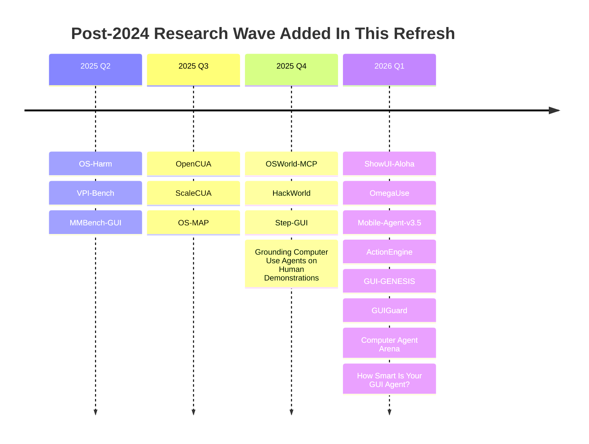
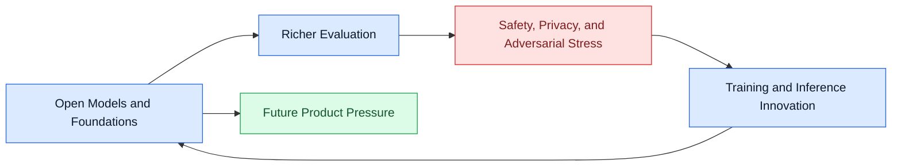

# Post-2024 Research Refresh

Refresh date: 2026-03-28 (Asia/Tokyo)

This report records a targeted search for computer-use-agent research published after 2024 that was not yet represented on the repository front page. The refresh used primary sources first, mainly [arXiv](https://arxiv.org/) and [OpenReview](https://openreview.net/), then translated the missing papers into main-page entries plus per-paper reports.

## Snapshot

| Field | Detail |
| --- | --- |
| Search window | 2025-01-01 through 2026-03-28 |
| Primary source types | arXiv abstracts, OpenReview abstracts, linked project pages when needed |
| New research entries added | 21 |
| Older tracked entries surfaced on main page | 7 |
| Paper report coverage after refresh | `89/89` |
| Main objective | Close post-2024 research gaps without diluting the repo with generic non-CUA agent papers |

## What Was Searched

- Exact-title searches for post-2024 computer-use, GUI-agent, desktop-agent, mobile-agent, and web-agent papers.
- Benchmark-oriented searches for tool use, human preference, breadth-depth evaluation, and cross-platform agent assessment.
- Safety-oriented searches for prompt injection, privacy, misuse, unintended behavior, and offensive-security evaluation in computer-use settings.
- Follow-up comparison against the repository's current `papers/*/README.md` files and the main [README](../../README.md) tables.

## Added Research

### Surveys and Framing

- [How Smart Is Your GUI Agent? A Framework for the Future of Software Interaction](https://arxiv.org/abs/2602.11514) -> [report](./papers/survey-papers/how-smart-is-your-gui-agent-a-framework-for-the-future-of-software-interaction.md)
  Introduces GUI Agent Autonomy Levels, which helps separate benchmark score, autonomy level, and deployment responsibility.

### Models and Architectures

- [Step-GUI Technical Report](https://arxiv.org/abs/2512.15431) -> [report](./papers/models-and-architectures/step-gui-technical-report.md)
  Strong 2025 model family centered on calibrated step rewards, GUI-MCP, and practical mobile deployment.
- [OpenCUA: Open Foundations for Computer-Use Agents](https://arxiv.org/abs/2508.09123) -> [report](./papers/models-and-architectures/opencua-open-foundations-for-computer-use-agents.md)
  Major open-foundation push with AgentNet, annotation infrastructure, and strong OSWorld-Verified results.
- [ScaleCUA: Scaling Open-Source Computer Use Agents with Cross-Platform Data](https://arxiv.org/abs/2509.15221) -> [report](./papers/models-and-architectures/scalecua-scaling-open-source-computer-use-agents-with-cross-platform-data.md)
  Makes the scaling-law story explicit for CUAs: more cross-platform data, better open models.
- [Mobile-Agent-v3.5: Multi-platform Fundamental GUI Agents](https://arxiv.org/abs/2602.16855) -> [report](./papers/models-and-architectures/mobile-agent-v3-5-multi-platform-fundamental-gui-agents.md)
  Extends the GUI-Owl line into a true multi-platform open model family with tool, memory, and RL emphasis.
- [ShowUI-Aloha: Human-Taught GUI Agent](https://arxiv.org/abs/2601.07181) -> [report](./papers/models-and-architectures/showui-aloha-human-taught-gui-agent.md)
  Turns raw human screen recordings into a scalable teaching signal for desktop GUI agents.
- [OmegaUse: Building a General-Purpose GUI Agent for Autonomous Task Execution](https://arxiv.org/abs/2601.20380) -> [report](./papers/models-and-architectures/omegause-building-a-general-purpose-gui-agent-for-autonomous-task-execution.md)
  Pairs synthetic data generation with SFT plus GRPO and a MoE backbone for desktop-plus-mobile control.

### Benchmarks and Datasets

- [MMBench-GUI: Hierarchical Multi-Platform Evaluation Framework for GUI Agents](https://arxiv.org/abs/2507.19478) -> [report](./papers/benchmarks-and-datasets/mmbench-gui-hierarchical-multi-platform-evaluation-framework-for-gui-agents.md)
  Important because it makes efficiency, not just eventual success, part of GUI-agent evaluation.
- [OS-MAP: How Far Can Computer-Using Agents Go in Breadth and Depth?](https://arxiv.org/abs/2507.19132) -> [report](./papers/benchmarks-and-datasets/os-map-how-far-can-computer-using-agents-go-in-breadth-and-depth.md)
  Adds a structured performance-generalization matrix tied to real user demand hierarchies.
- [OSWorld-MCP: Benchmarking MCP Tool Invocation In Computer-Use Agents](https://arxiv.org/abs/2510.24563) -> [report](./papers/benchmarks-and-datasets/osworld-mcp-benchmarking-mcp-tool-invocation-in-computer-use-agents.md)
  Matters because computer-use evaluation is no longer just GUI clicking; it now includes tool invocation quality.
- [Computer Agent Arena: Toward Human-Centric Evaluation and Analysis of Computer-Use Agents](https://openreview.net/forum?id=3x4SDbXbgl) -> [report](./papers/benchmarks-and-datasets/computer-agent-arena-toward-human-centric-evaluation-and-analysis-of-computer-use-agents.md)
  Brings human preference into the loop and shows static leaderboard order is not the whole story.
- [CUA-Suite: Expert Trajectories and Pixel-Precise Grounding for Computer-use Agents](https://openreview.net/forum?id=IgTUGrZfMr) -> [report](./papers/benchmarks-and-datasets/cua-suite-expert-trajectories-and-pixel-precise-grounding-for-computer-use-agents.md)
  Dense desktop grounding and expert trajectories make it a valuable data asset for stronger office-style agents.

### Methods and Techniques

- [Grounding Computer Use Agents on Human Demonstrations](https://arxiv.org/abs/2511.07332) -> [report](./papers/methods-and-techniques/grounding-computer-use-agents-on-human-demonstrations.md)
  Strengthens the repo's desktop-grounding thread with expert-driven GroundCUA data and GroundNext models.
- [ActionEngine: From Reactive to Programmatic GUI Agents via State Machine Memory](https://arxiv.org/abs/2602.20502) -> [report](./papers/methods-and-techniques/actionengine-from-reactive-to-programmatic-gui-agents-via-state-machine-memory.md)
  Especially notable for the shift from one-step-at-a-time execution toward program synthesis plus memory.
- [GUI-GENESIS: Automated Synthesis of Efficient Environments with Verifiable Rewards for GUI Agent Post-Training](https://arxiv.org/abs/2602.14093) -> [report](./papers/methods-and-techniques/gui-genesis-automated-synthesis-of-efficient-environments-with-verifiable-rewards-for-gui-agent-post-training.md)
  Pushes post-training toward automatically synthesized environments with deterministic rewards.

### Safety and Security

- [OS-Harm: A Benchmark for Measuring Safety of Computer Use Agents](https://arxiv.org/abs/2506.14866) -> [report](./papers/safety-and-security/os-harm-a-benchmark-for-measuring-safety-of-computer-use-agents.md)
  A direct answer to the question, "Can a capable CUA also be a harmful one?"
- [VPI-Bench: Visual Prompt Injection Attacks for Computer-Use Agents](https://arxiv.org/abs/2506.02456) -> [report](./papers/safety-and-security/vpi-bench-visual-prompt-injection-attacks-for-computer-use-agents.md)
  Extends prompt-injection thinking from HTML-only surfaces into rendered GUI environments.
- [HackWorld: Evaluating Computer-Use Agents on Exploiting Web Application Vulnerabilities](https://arxiv.org/abs/2510.12200) -> [report](./papers/safety-and-security/hackworld-evaluating-computer-use-agents-on-exploiting-web-application-vulnerabilities.md)
  Introduces offensive-security evaluation pressure rather than only benign task completion.
- [GUIGuard: Toward a General Framework for Privacy-Preserving GUI Agents](https://arxiv.org/abs/2601.18842) -> [report](./papers/safety-and-security/guiguard-toward-a-general-framework-for-privacy-preserving-gui-agents.md)
  Elevates privacy recognition itself into a first-class bottleneck for practical GUI agents.
- [When Benign Inputs Lead to Severe Harms: Eliciting Unsafe Unintended Behaviors of Computer-Use Agents](https://arxiv.org/abs/2602.08235) -> [report](./papers/safety-and-security/when-benign-inputs-lead-to-severe-harms-eliciting-unsafe-unintended-behaviors-of-computer-use-agents.md)
  Important because it surfaces harmful behavior without requiring obviously malicious user prompts.
- [Anonymization-Enhanced Privacy Protection for Mobile GUI Agents: Available but Invisible](https://arxiv.org/abs/2602.10139) -> [report](./papers/safety-and-security/anonymization-enhanced-privacy-protection-for-mobile-gui-agents-available-but-invisible.md)
  Adds a concrete privacy-defense pattern for cloud-backed mobile GUI agents.

## What Changed In The Repo

- The main [README](../../README.md) paper tables now include the new post-2024 entries and also expose several older tracked papers that had been missing from the front page.
- The paper dossier now covers every tracked paper entry in [papers/README.md](./papers/README.md), bringing paper-report coverage to `89/89`.
- Newly added or newly surfaced older entries now have dedicated per-paper reports with novelty, contributions, framework, gaps, improvement paths, and Mermaid figures.

## Cross-Cutting Insights

- Open computer-use foundations are becoming real.
  OpenCUA, ScaleCUA, Step-GUI, Mobile-Agent-v3.5, and OmegaUse all push toward bigger open datasets, broader OS coverage, and stronger end-to-end native models.
- Benchmarking is splitting into at least four layers.
  The field now measures static capability, online efficiency, tool invocation, and human preference, not just one binary success rate.
- Safety work is broadening beyond prompt injection.
  The newer cluster spans misuse, privacy leakage, privacy protection, unintended behavior elicitation, and offensive cyber evaluation.
- Training is moving away from pure imitation.
  ActionEngine and GUI-GENESIS show a shift toward memory, synthesis, repair, and environment construction rather than only trace replay.

## Limitations

- This refresh is targeted, not exhaustive. It prioritizes papers that are directly about computer-use agents, GUI agents, desktop/mobile/web GUI control, or CUA-specific safety and evaluation.
- Some related general web-agent or agent-systems papers were intentionally excluded when their connection to computer use was too indirect.
- OpenReview coverage is thinner than arXiv coverage because some pages expose less structured public metadata.
- A few older tracked entries also needed report/main-page cleanup during this pass, so this document records both new research additions and consistency repairs.
