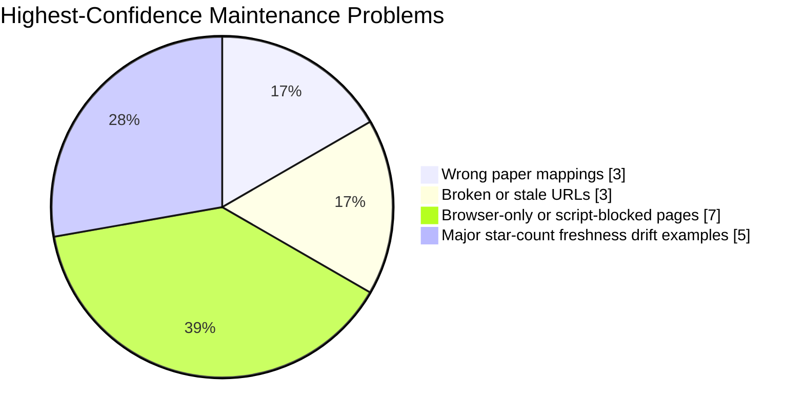
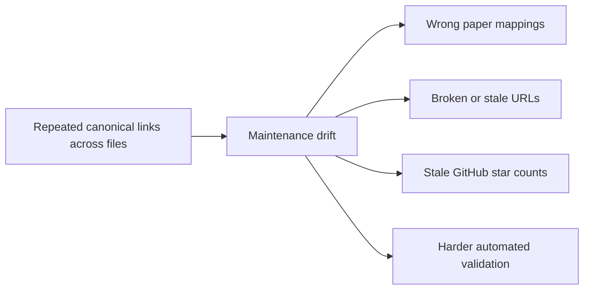

# Link Maintenance Findings

Audit date: 2026-03-27 (Asia/Shanghai)

This file captures the highest-confidence link integrity issues found during the audit, plus a few freshness issues that make the repository harder to trust over time.

## Visual Snapshot

## Confirmed Wrong Paper Mappings

These are not just renamed papers. The current arXiv URLs resolve to different papers than the local entry titles describe.

| Local entry | Current URL | Observed target | Recommended replacement |
| --- | --- | --- | --- |
| `GUI Odyssey: Cross-app Mobile Navigation` in `README.md:87` and `papers/benchmarks/README.md:196` | `https://arxiv.org/abs/2411.00820` | Resolves to **AutoGLM: Autonomous Foundation Agents for GUIs** | `https://arxiv.org/abs/2406.08451` |
| `Ponder & Press: Advancing VLM Grounding` in `README.md:108` and `papers/methods/README.md:121` | `https://arxiv.org/abs/2409.04566` | Resolves to **Multipartite entanglement** | `https://arxiv.org/abs/2412.01268` |
| `EIA: Environmental Injection Attack` in `README.md:123` and `papers/safety/README.md:75` | `https://arxiv.org/abs/2409.02453` | Resolves to **FrameCorr: Adaptive, Autoencoder-based Neural Compression...** | `https://arxiv.org/abs/2409.11295` |

## Broken Or Stale URLs

| Entry | Current URL | Status | Suggested action |
| --- | --- | --- | --- |
| `AutoGLM` GitHub link in `frameworks/README.md:156` and repeated elsewhere | `https://github.com/THUDM/AutoGLM` | HTTP 404 | Replace with the current official repository if one exists, or remove the GitHub link and keep the paper/model-hub references only. |
| `Claude can now use computers` in `resources/README.md:77` | `https://www.anthropic.com/news/claude-computer-use-ga` | HTTP 404 | Replace with a current Anthropic announcement URL or point directly to the living docs page. |
| `alphaXiv Benchmarks` in `resources/README.md:158` | `https://www.alphaxiv.org/benchmarks` | HTTP 404 | Remove or replace with a working benchmark hub. |

## Browser-Only Or Script-Blocked Pages

These pages may still be live and useful, but they are brittle for automation or periodic validation.

| URL | Observed issue |
| --- | --- |
| `https://openai.com/index/introducing-operator/` | Cloudflare/browser challenge blocks lightweight scripted fetches. |
| `https://openai.com/index/computer-using-agent/` | Cloudflare/browser challenge blocks lightweight scripted fetches. |
| `https://openai.com/index/new-tools-for-building-agents/` | Cloudflare/browser challenge blocks lightweight scripted fetches. |
| `https://www.gatesnotes.com/AI-agents` | 403 to simple scripted fetches. |
| `https://www.techrxiv.org/doi/pdf/10.36227/techrxiv.176591818.87526814` | 403 to simple scripted fetches. |
| `https://dl.acm.org/doi/10.1145/3716628` | 403 to simple scripted fetches. |
| Several Medium, VentureBeat, and DataCamp links | 403 or rate-limit behavior under simple scripted access. |

These are not necessarily repository errors, but they do make automated validation harder.

## Freshness Drift

Several framework star counts in the repo are now materially out of date relative to current GitHub metadata gathered during the audit.

| Repository | Local note | Current stars at audit time |
| --- | --- | --- |
| `bytedance/UI-TARS-desktop` | `15k+` | `29,127` |
| `browser-use/browser-use` | `10k+` | `84,728` |
| `browserbase/stagehand` | `5k+` | `21,721` |
| `Skyvern-AI/skyvern` | `3k+` | `20,975` |
| `X-PLUG/MobileAgent` | `3k+` | `8,320` |

The counts are still directionally useful, but they are no longer accurate enough to serve as a current ecosystem signal.

## Structural Cause Of Drift

- Many canonical links are repeated across `README.md`, category-specific `papers/*/README.md`, `products/README.md`, `frameworks/README.md`, and `resources/README.md`.
- This repetition improves discoverability but makes corrections easy to miss. For example, a single wrong arXiv mapping can survive in multiple places, and product links can go stale in one resource file even when the main list still looks healthy.

## Suggested Next Cleanup Pass

1. Fix the three confirmed wrong arXiv links first.
2. Remove or replace the three confirmed broken/stale URLs.
3. Decide whether star counts should be updated periodically or removed entirely to reduce maintenance cost.
4. Consider keeping canonical link metadata in one machine-readable source so the overview pages can reuse it without duplicating URLs by hand.
