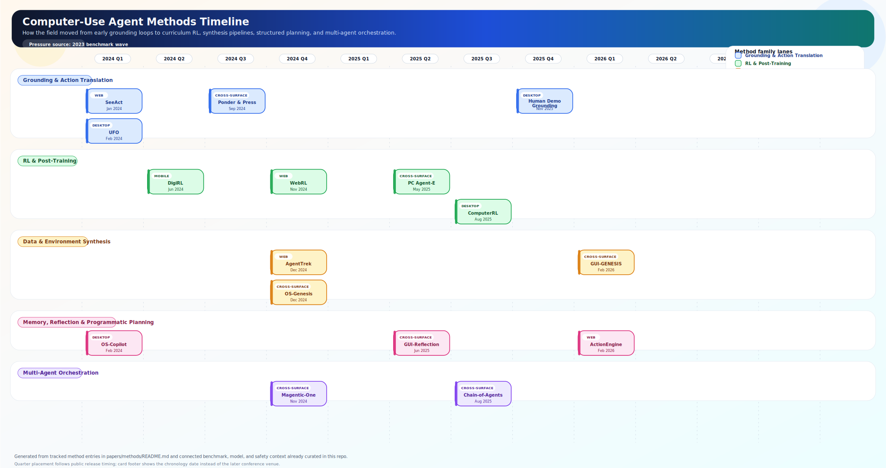

# Methods Timeline for Computer Use Agents

Generated on 2026-03-28 (Asia/Shanghai) from the tracked method entries in `papers/methods/README.md`, then connected to benchmark, model, and safety reports already present in this repository.

## How To Read This

- The figure groups methods into five lanes: grounding, RL/post-training, data synthesis, planning/memory, and multi-agent orchestration.
- Placement is based on when the work surfaced publicly, using preprint timing when available so the chronology stays comparable across later conference acceptances; the card footer therefore shows the chronology date rather than a later conference venue.
- Each row in the timeline table links the method paper to the benchmark pressure, model wave, and safety lens that best explain why that method mattered.

## Phase Shifts

- Before the method wave, benchmark pressure was set by [WebArena: Realistic Web Environment for Building Autonomous Agents](papers/benchmarks-and-datasets/webarena-realistic-web-environment-for-building-autonomous-agents.md), [Mind2Web: Towards a Generalist Agent for the Web](papers/benchmarks-and-datasets/mind2web-towards-a-generalist-agent-for-the-web.md), [Android in the Wild (AitW)](papers/benchmarks-and-datasets/android-in-the-wild-aitw.md). Those 2023 tasks explain why later methods obsess over web realism, mobile control, and long-horizon interaction.
- 2024 is the first-control-loop phase: SeeAct, UFO, OS-Copilot, DigiRL, and Ponder & Press define the early playbook for grounding, mobile RL, and Windows/web interaction.
- 2025 is the scaling phase: WebRL, AgentTrek, OS-Genesis, GUI-Reflection, PC Agent-E, Chain-of-Agents, and ComputerRL all try to solve the same bottleneck from different angles: too little high-quality interaction data and too little online adaptation.
- 2026 pushes methods toward explicit structure: ActionEngine turns GUI execution into state-machine memory, GUI-GENESIS synthesizes verifiable training environments, and human-demonstration grounding pushes richer desktop supervision into the training loop.

## Family Counts

| Family | Count |
| --- | --- |
| Grounding & Action Translation | 4 |
| RL & Post-Training | 4 |
| Data & Environment Synthesis | 3 |
| Memory, Reflection & Programmatic Planning | 3 |
| Multi-Agent Orchestration | 2 |

## Timeline Table

| Phase | When | Method | Family | Key move | Benchmark pressure | Adjacent model wave | Safety lens | Report |
| --- | --- | --- | --- | --- | --- | --- | --- | --- |
| 2024 H1: first control loops | 2024-01 | [SeeAct: GPT-4V Web Agent via Visual Grounding](papers/methods-and-techniques/seeact-gpt-4v-web-agent-via-visual-grounding.md) | Grounding & Action Translation | Generates action descriptions from screenshots | [VisualWebArena: Multimodal Web Tasks](papers/benchmarks-and-datasets/visualwebarena-multimodal-web-tasks.md) [WebVoyager: End-to-End Web Agent with LMMs](papers/benchmarks-and-datasets/webvoyager-end-to-end-web-agent-with-lmms.md) | [SeeClick: Harnessing GUI Grounding for Advanced Visual GUI Agents](papers/models-and-architectures/seeclick-harnessing-gui-grounding-for-advanced-visual-gui-agents.md) [Ferret-UI: Grounded Mobile UI Understanding](papers/models-and-architectures/ferret-ui-grounded-mobile-ui-understanding.md) | [WebGuard: Safety Dataset for Web Agents](papers/safety-and-security/webguard-safety-dataset-for-web-agents.md) | [Open](papers/methods-and-techniques/seeact-gpt-4v-web-agent-via-visual-grounding.md) |
| 2024 H1: first control loops | 2024-02 | [OS-Copilot: Towards Generalist Computer Agents](papers/methods-and-techniques/os-copilot-towards-generalist-computer-agents.md) | Memory, Reflection & Programmatic Planning | PC interaction with self-improvement capabilities. | [OmniACT](papers/benchmarks-and-datasets/omniact.md) [OSWorld: Multimodal Agents for Open-Ended Tasks in Real Computer Environments](papers/benchmarks-and-datasets/osworld-multimodal-agents-for-open-ended-tasks-in-real-computer-environments.md) | [OpenCUA: Open Foundations for Computer-Use Agents](papers/models-and-architectures/opencua-open-foundations-for-computer-use-agents.md) [ShowUI-Aloha: Human-Taught GUI Agent](papers/models-and-architectures/showui-aloha-human-taught-gui-agent.md) | [OS-Harm: A Benchmark for Measuring Safety of Computer Use Agents](papers/safety-and-security/os-harm-a-benchmark-for-measuring-safety-of-computer-use-agents.md) | [Open](papers/methods-and-techniques/os-copilot-towards-generalist-computer-agents.md) |
| 2024 H1: first control loops | 2024-02 | [UFO: Windows OS UI Agent via GPT-4V](papers/methods-and-techniques/ufo-windows-os-ui-agent-via-gpt-4v.md) | Grounding & Action Translation | Dynamic task plan generation | [Windows Agent Arena (WAA)](papers/benchmarks-and-datasets/windows-agent-arena-waa.md) [OmniACT](papers/benchmarks-and-datasets/omniact.md) | [OmniParser: Pure Vision Based GUI Agent](papers/models-and-architectures/omniparser-pure-vision-based-gui-agent.md) [GUI-Actor: Coordinate-Free Visual Grounding](papers/models-and-architectures/gui-actor-coordinate-free-visual-grounding.md) | [Infectious Jailbreaks in Multi-Agent Systems](papers/safety-and-security/infectious-jailbreaks-in-multi-agent-systems.md) | [Open](papers/methods-and-techniques/ufo-windows-os-ui-agent-via-gpt-4v.md) |
| 2024 H1: first control loops | 2024-06 | [DigiRL: Training In-The-Wild Device-Control](papers/methods-and-techniques/digirl-training-in-the-wild-device-control.md) | RL & Post-Training | Offline RL stage | [AndroidWorld: Dynamic Benchmarking Environment](papers/benchmarks-and-datasets/androidworld-dynamic-benchmarking-environment.md) [MobileAgentBench](papers/benchmarks-and-datasets/mobileagentbench.md) | [AppAgent: Multimodal Agents as Smartphone Users](papers/models-and-architectures/appagent-multimodal-agents-as-smartphone-users.md) [Ferret-UI: Grounded Mobile UI Understanding](papers/models-and-architectures/ferret-ui-grounded-mobile-ui-understanding.md) | [Anonymization-Enhanced Privacy Protection for Mobile GUI Agents: Available but Invisible](papers/safety-and-security/anonymization-enhanced-privacy-protection-for-mobile-gui-agents-available-but-invisible.md) | [Open](papers/methods-and-techniques/digirl-training-in-the-wild-device-control.md) |
| 2024 H2: grounding and orchestration | 2024-09 | [Ponder & Press: Advancing VLM Grounding](papers/methods-and-techniques/ponder-press-advancing-vlm-grounding.md) | Grounding & Action Translation | Interpreter: General-purpose MLLM for high-level instruction translation | [ScreenSpot / ScreenSpot-Pro](papers/benchmarks-and-datasets/screenspot-screenspot-pro.md) [CUA-Suite: Expert Trajectories and Pixel-Precise Grounding for Computer-use Agents](papers/benchmarks-and-datasets/cua-suite-expert-trajectories-and-pixel-precise-grounding-for-computer-use-agents.md) | [OmniParser: Pure Vision Based GUI Agent](papers/models-and-architectures/omniparser-pure-vision-based-gui-agent.md) [Ferret-UI: Grounded Mobile UI Understanding](papers/models-and-architectures/ferret-ui-grounded-mobile-ui-understanding.md) | [EIA: Environmental Injection Attack](papers/safety-and-security/eia-environmental-injection-attack.md) | [Open](papers/methods-and-techniques/ponder-press-advancing-vlm-grounding.md) |
| 2024 H2: grounding and orchestration | 2024-11 | [Magentic-One: Multi-Agent with Human-in-Loop](papers/methods-and-techniques/magentic-one-multi-agent-with-human-in-loop.md) | Multi-Agent Orchestration | Multi-agent orchestrator system with human oversight. | [GUI Odyssey: Cross-app Mobile Navigation](papers/benchmarks-and-datasets/gui-odyssey-cross-app-mobile-navigation.md) [Windows Agent Arena (WAA)](papers/benchmarks-and-datasets/windows-agent-arena-waa.md) | [OmniParser: Pure Vision Based GUI Agent](papers/models-and-architectures/omniparser-pure-vision-based-gui-agent.md) [GUI-Actor: Coordinate-Free Visual Grounding](papers/models-and-architectures/gui-actor-coordinate-free-visual-grounding.md) | [Infectious Jailbreaks in Multi-Agent Systems](papers/safety-and-security/infectious-jailbreaks-in-multi-agent-systems.md) | [Open](papers/methods-and-techniques/magentic-one-multi-agent-with-human-in-loop.md) |
| 2024 H2: grounding and orchestration | 2024-11 | [WebRL: Self-Evolving Online Curriculum RL for Web Agents](papers/methods-and-techniques/webrl-self-evolving-online-curriculum-rl-for-web-agents.md) | RL & Post-Training | Scarcity of training tasks | [Online-Mind2Web](papers/benchmarks-and-datasets/online-mind2web.md) [WebCanvas: Online Web Agent Benchmarking](papers/benchmarks-and-datasets/webcanvas-online-web-agent-benchmarking.md) | [UI-TARS-2: Advancing GUI Agent with Multi-Turn RL](papers/models-and-architectures/ui-tars-2-advancing-gui-agent-with-multi-turn-rl.md) [AutoGLM: Autonomous Foundation Agents for GUIs](papers/models-and-architectures/autoglm-autonomous-foundation-agents-for-guis.md) | [WebGuard: Safety Dataset for Web Agents](papers/safety-and-security/webguard-safety-dataset-for-web-agents.md) | [Open](papers/methods-and-techniques/webrl-self-evolving-online-curriculum-rl-for-web-agents.md) |
| 2024 H2: grounding and orchestration | 2024-12 | [AgentTrek: Agent Trajectory Synthesis via Web Tutorials](papers/methods-and-techniques/agenttrek-agent-trajectory-synthesis-via-web-tutorials.md) | Data & Environment Synthesis | Harvest and filter tutorial texts from internet | [AgentTrek Trajectories](papers/benchmarks-and-datasets/agenttrek-trajectories.md) [Online-Mind2Web](papers/benchmarks-and-datasets/online-mind2web.md) | [AGUVIS: Unified Pure Vision Agents for GUI Interaction](papers/models-and-architectures/aguvis-unified-pure-vision-agents-for-gui-interaction.md) [UI-TARS: Pioneering Automated GUI Interaction with Native Agents](papers/models-and-architectures/ui-tars-pioneering-automated-gui-interaction-with-native-agents.md) | [WebGuard: Safety Dataset for Web Agents](papers/safety-and-security/webguard-safety-dataset-for-web-agents.md) | [Open](papers/methods-and-techniques/agenttrek-agent-trajectory-synthesis-via-web-tutorials.md) |
| 2024 H2: grounding and orchestration | 2024-12 | [OS-Genesis: Automating GUI Agent Trajectory Construction](papers/methods-and-techniques/os-genesis-automating-gui-agent-trajectory-construction.md) | Data & Environment Synthesis | Agents perceive environments and perform step-wise interactions | [AgentTrek Trajectories](papers/benchmarks-and-datasets/agenttrek-trajectories.md) [OS-Genesis Trajectories](papers/benchmarks-and-datasets/os-genesis-trajectories.md) | [AGUVIS: Unified Pure Vision Agents for GUI Interaction](papers/models-and-architectures/aguvis-unified-pure-vision-agents-for-gui-interaction.md) [UI-TARS: Pioneering Automated GUI Interaction with Native Agents](papers/models-and-architectures/ui-tars-pioneering-automated-gui-interaction-with-native-agents.md) | [Attacking Vision-Language Computer Agents via Pop-ups](papers/safety-and-security/attacking-vision-language-computer-agents-via-pop-ups.md) | [Open](papers/methods-and-techniques/os-genesis-automating-gui-agent-trajectory-construction.md) |
| 2025 H1: data and curriculum scaling | 2025-05 | [PC Agent-E: Efficient Agent Training for Computer Use](papers/methods-and-techniques/pc-agent-e-efficient-agent-training-for-computer-use.md) | RL & Post-Training | Starting with 312 human-annotated trajectories | [macOSWorld](papers/benchmarks-and-datasets/macosworld.md) [Online-Mind2Web](papers/benchmarks-and-datasets/online-mind2web.md) | [ShowUI: Vision-Language-Action Model for GUI Visual Agent](papers/models-and-architectures/showui-vision-language-action-model-for-gui-visual-agent.md) [AgentCPM-GUI: On-device Mobile Agent](papers/models-and-architectures/agentcpm-gui-on-device-mobile-agent.md) | [JARVIS or Ultron? Safety and Security Threats of CUAs](papers/safety-and-security/jarvis-or-ultron-safety-and-security-threats-of-cuas.md) | [Open](papers/methods-and-techniques/pc-agent-e-efficient-agent-training-for-computer-use.md) |
| 2025 H1: data and curriculum scaling | 2025-06 | [GUI-Reflection: Self-Reflection for GUI Agents](papers/methods-and-techniques/gui-reflection-self-reflection-for-gui-agents.md) | Memory, Reflection & Programmatic Planning | Self-reflection mechanism for GUI agents to improve performance. | [macOSWorld](papers/benchmarks-and-datasets/macosworld.md) [MMBench-GUI: Hierarchical Multi-Platform Evaluation Framework for GUI Agents](papers/benchmarks-and-datasets/mmbench-gui-hierarchical-multi-platform-evaluation-framework-for-gui-agents.md) | [ShowUI: Vision-Language-Action Model for GUI Visual Agent](papers/models-and-architectures/showui-vision-language-action-model-for-gui-visual-agent.md) [AgentCPM-GUI: On-device Mobile Agent](papers/models-and-architectures/agentcpm-gui-on-device-mobile-agent.md) | [OS-Harm: A Benchmark for Measuring Safety of Computer Use Agents](papers/safety-and-security/os-harm-a-benchmark-for-measuring-safety-of-computer-use-agents.md) | [Open](papers/methods-and-techniques/gui-reflection-self-reflection-for-gui-agents.md) |
| 2025 H2: open-foundation training push | 2025-08 | [Chain-of-Agents: Multi-Agent Collaboration](papers/methods-and-techniques/chain-of-agents-multi-agent-collaboration.md) | Multi-Agent Orchestration | Multi-agent collaboration for complex GUI tasks. | [MMBench-GUI: Hierarchical Multi-Platform Evaluation Framework for GUI Agents](papers/benchmarks-and-datasets/mmbench-gui-hierarchical-multi-platform-evaluation-framework-for-gui-agents.md) [OS-MAP: How Far Can Computer-Using Agents Go in Breadth and Depth?](papers/benchmarks-and-datasets/os-map-how-far-can-computer-using-agents-go-in-breadth-and-depth.md) | [Mobile-Agent-v3: Fundamental Agents for GUI Automation](papers/models-and-architectures/mobile-agent-v3-fundamental-agents-for-gui-automation.md) [OpenCUA: Open Foundations for Computer-Use Agents](papers/models-and-architectures/opencua-open-foundations-for-computer-use-agents.md) | [Infectious Jailbreaks in Multi-Agent Systems](papers/safety-and-security/infectious-jailbreaks-in-multi-agent-systems.md) | [Open](papers/methods-and-techniques/chain-of-agents-multi-agent-collaboration.md) |
| 2025 H2: open-foundation training push | 2025-08 | [ComputerRL: End-to-End Online RL for Computer Use Agents](papers/methods-and-techniques/computerrl-end-to-end-online-rl-for-computer-use-agents.md) | RL & Post-Training | API-GUI Paradigm: Unifies programmatic API calls and direct GUI interaction | [OS-MAP: How Far Can Computer-Using Agents Go in Breadth and Depth?](papers/benchmarks-and-datasets/os-map-how-far-can-computer-using-agents-go-in-breadth-and-depth.md) [macOSWorld](papers/benchmarks-and-datasets/macosworld.md) | [OpenCUA: Open Foundations for Computer-Use Agents](papers/models-and-architectures/opencua-open-foundations-for-computer-use-agents.md) [ShowUI-Aloha: Human-Taught GUI Agent](papers/models-and-architectures/showui-aloha-human-taught-gui-agent.md) | [OS-Harm: A Benchmark for Measuring Safety of Computer Use Agents](papers/safety-and-security/os-harm-a-benchmark-for-measuring-safety-of-computer-use-agents.md) | [Open](papers/methods-and-techniques/computerrl-end-to-end-online-rl-for-computer-use-agents.md) |
| 2025 H2: open-foundation training push | 2025-11 | [Grounding Computer Use Agents on Human Demonstrations](papers/methods-and-techniques/grounding-computer-use-agents-on-human-demonstrations.md) | Grounding & Action Translation | Covers 87 applications with 56K screenshots and more than 3.56M human-verified annotations. | [CUA-Suite: Expert Trajectories and Pixel-Precise Grounding for Computer-use Agents](papers/benchmarks-and-datasets/cua-suite-expert-trajectories-and-pixel-precise-grounding-for-computer-use-agents.md) [OSWorld-MCP: Benchmarking MCP Tool Invocation In Computer-Use Agents](papers/benchmarks-and-datasets/osworld-mcp-benchmarking-mcp-tool-invocation-in-computer-use-agents.md) | [ShowUI-Aloha: Human-Taught GUI Agent](papers/models-and-architectures/showui-aloha-human-taught-gui-agent.md) [OmegaUse: Building a General-Purpose GUI Agent for Autonomous Task Execution](papers/models-and-architectures/omegause-building-a-general-purpose-gui-agent-for-autonomous-task-execution.md) | [OS-Harm: A Benchmark for Measuring Safety of Computer Use Agents](papers/safety-and-security/os-harm-a-benchmark-for-measuring-safety-of-computer-use-agents.md) | [Open](papers/methods-and-techniques/grounding-computer-use-agents-on-human-demonstrations.md) |
| 2026: programmatic and post-training wave | 2026-02 | [ActionEngine: From Reactive to Programmatic GUI Agents via State Machine Memory](papers/methods-and-techniques/actionengine-from-reactive-to-programmatic-gui-agents-via-state-machine-memory.md) | Memory, Reflection & Programmatic Planning | Crawling Agent constructs an updatable GUI state-machine memory through offline exploration. | [Online-Mind2Web](papers/benchmarks-and-datasets/online-mind2web.md) [AgentTrek Trajectories](papers/benchmarks-and-datasets/agenttrek-trajectories.md) | [Mobile-Agent-v3.5: Multi-platform Fundamental GUI Agents](papers/models-and-architectures/mobile-agent-v3-5-multi-platform-fundamental-gui-agents.md) [ShowUI-Aloha: Human-Taught GUI Agent](papers/models-and-architectures/showui-aloha-human-taught-gui-agent.md) | [HackWorld: Evaluating Computer-Use Agents on Exploiting Web Application Vulnerabilities](papers/safety-and-security/hackworld-evaluating-computer-use-agents-on-exploiting-web-application-vulnerabilities.md) | [Open](papers/methods-and-techniques/actionengine-from-reactive-to-programmatic-gui-agents-via-state-machine-memory.md) |
| 2026: programmatic and post-training wave | 2026-02 | [GUI-GENESIS: Automated Synthesis of Efficient Environments with Verifiable Rewards for GUI Agent Post-Training](papers/methods-and-techniques/gui-genesis-automated-synthesis-of-efficient-environments-with-verifiable-rewards-for-gui-agent-post-training.md) | Data & Environment Synthesis | Reconstructs real applications into lightweight web environments using multimodal code models. | [OSWorld-MCP: Benchmarking MCP Tool Invocation In Computer-Use Agents](papers/benchmarks-and-datasets/osworld-mcp-benchmarking-mcp-tool-invocation-in-computer-use-agents.md) [Computer Agent Arena: Toward Human-Centric Evaluation and Analysis of Computer-Use Agents](papers/benchmarks-and-datasets/computer-agent-arena-toward-human-centric-evaluation-and-analysis-of-computer-use-agents.md) | [Mobile-Agent-v3.5: Multi-platform Fundamental GUI Agents](papers/models-and-architectures/mobile-agent-v3-5-multi-platform-fundamental-gui-agents.md) [ShowUI-Aloha: Human-Taught GUI Agent](papers/models-and-architectures/showui-aloha-human-taught-gui-agent.md) | [When Benign Inputs Lead to Severe Harms: Eliciting Unsafe Unintended Behaviors of Computer-Use Agents](papers/safety-and-security/when-benign-inputs-lead-to-severe-harms-eliciting-unsafe-unintended-behaviors-of-computer-use-agents.md) | [Open](papers/methods-and-techniques/gui-genesis-automated-synthesis-of-efficient-environments-with-verifiable-rewards-for-gui-agent-post-training.md) |

## Lane Notes

### Grounding & Action Translation
- [SeeAct: GPT-4V Web Agent via Visual Grounding](papers/methods-and-techniques/seeact-gpt-4v-web-agent-via-visual-grounding.md), [UFO: Windows OS UI Agent via GPT-4V](papers/methods-and-techniques/ufo-windows-os-ui-agent-via-gpt-4v.md), [Ponder & Press: Advancing VLM Grounding](papers/methods-and-techniques/ponder-press-advancing-vlm-grounding.md), [Grounding Computer Use Agents on Human Demonstrations](papers/methods-and-techniques/grounding-computer-use-agents-on-human-demonstrations.md). This lane converts perception into reliable action proposals, moving from GPT-4V prompting toward more explicit grounding and demonstration-backed action models.

### RL & Post-Training
- [DigiRL: Training In-The-Wild Device-Control](papers/methods-and-techniques/digirl-training-in-the-wild-device-control.md), [WebRL: Self-Evolving Online Curriculum RL for Web Agents](papers/methods-and-techniques/webrl-self-evolving-online-curriculum-rl-for-web-agents.md), [PC Agent-E: Efficient Agent Training for Computer Use](papers/methods-and-techniques/pc-agent-e-efficient-agent-training-for-computer-use.md), [ComputerRL: End-to-End Online RL for Computer Use Agents](papers/methods-and-techniques/computerrl-end-to-end-online-rl-for-computer-use-agents.md). This lane tries to break the static-demo bottleneck by using online interaction, curriculum construction, or more efficient post-training loops.

### Data & Environment Synthesis
- [AgentTrek: Agent Trajectory Synthesis via Web Tutorials](papers/methods-and-techniques/agenttrek-agent-trajectory-synthesis-via-web-tutorials.md), [OS-Genesis: Automating GUI Agent Trajectory Construction](papers/methods-and-techniques/os-genesis-automating-gui-agent-trajectory-construction.md), [GUI-GENESIS: Automated Synthesis of Efficient Environments with Verifiable Rewards for GUI Agent Post-Training](papers/methods-and-techniques/gui-genesis-automated-synthesis-of-efficient-environments-with-verifiable-rewards-for-gui-agent-post-training.md). This lane attacks the data scarcity problem by generating trajectories, reverse-synthesizing tasks, or rebuilding light-weight training environments with verifiable rewards.

### Memory, Reflection & Programmatic Planning
- [OS-Copilot: Towards Generalist Computer Agents](papers/methods-and-techniques/os-copilot-towards-generalist-computer-agents.md), [GUI-Reflection: Self-Reflection for GUI Agents](papers/methods-and-techniques/gui-reflection-self-reflection-for-gui-agents.md), [ActionEngine: From Reactive to Programmatic GUI Agents via State Machine Memory](papers/methods-and-techniques/actionengine-from-reactive-to-programmatic-gui-agents-via-state-machine-memory.md). This lane shifts from reactive clicking toward recovery behavior, persistent state, and explicit planning structures.

### Multi-Agent Orchestration
- [Magentic-One: Multi-Agent with Human-in-Loop](papers/methods-and-techniques/magentic-one-multi-agent-with-human-in-loop.md), [Chain-of-Agents: Multi-Agent Collaboration](papers/methods-and-techniques/chain-of-agents-multi-agent-collaboration.md). This lane explores decomposition into specialized agents or human-supervised orchestrators for harder long-horizon tasks.

## Cross-Cutting Takeaways

- Benchmark design and method design co-evolve. The timeline makes it clear that OSWorld, WebArena, AndroidWorld, and newer live-site or human-centric benchmarks are not side material; they are the pressure that explains the method wave.
- The field broadens over time. Early methods are mostly about getting actions grounded at all; later methods care more about scaling data, stabilizing RL, building persistent memory, or coordinating multiple agents.
- Safety lags capability but starts to intersect the method timeline in 2025-2026. AgentHarm, OS-Harm, RedTeamCUA, and VPI-Bench arrive after capability scaling is already underway, which suggests safety evaluation is becoming a co-equal axis only after strong capability pressure already exists.
- The timeline also shows why later open models matter: works such as OpenCUA, ScaleCUA, Mobile-Agent-v3.5, and OmegaUse only make full sense when read against the method stack that improved grounding, trajectory generation, curriculum learning, and structured planning.
