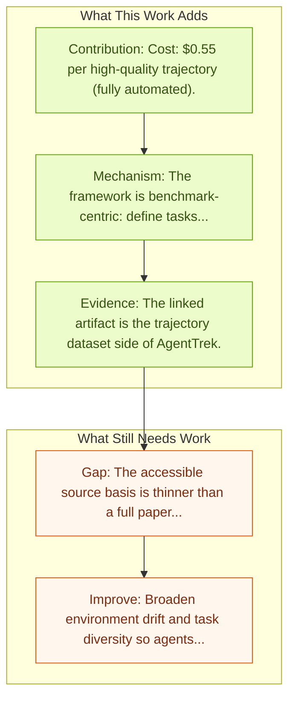

# AgentTrek Trajectories

Entry report generated on 2026-03-28 (Asia/Shanghai). This report is based on the repository entry, linked source metadata, and audit-time cross-checks.

## Snapshot

| Field | Detail |
| --- | --- |
| Repo entry | AgentTrek Trajectories |
| Actual target | [AgentTrek: Agent Trajectory Synthesis via Guiding Replay with Web Tutorials](https://agenttrek.github.io/) |
| Section | Benchmarks and Datasets |
| Source location | `papers/benchmarks/README.md:367` |
| Primary link type | `link` |
| Audit status | `project-page` |
| Date / venue | Not stated in local entry |
| Focus tags | `dataset` `trajectories` `web` |
| Center of gravity | web |

## Quick Read

| Lens | Read |
| --- | --- |
| Problem pressure | Cost: $0.55 per high-quality trajectory (fully automated). |
| Most novel move | The main novelty sits in the evaluation surface itself, especially its emphasis on trajectories, web. |
| Strongest evidence | The linked artifact is the trajectory dataset side of AgentTrek. |
| Main caveat | The accessible source basis is thinner than a full paper review, so some claims rest on project metadata, repo notes, or abstract-level... |

## Visual Frame

```mermaid
flowchart LR
  Problem["Problem: Cost: $0.55 per high-quality trajectory (fully automated)."] --> Novelty["Novelty: The main novelty sits in the evaluation surface itself..."]
  Novelty --> Framework["Framework: The framework is benchmark-centric: define tasks..."]
  Framework --> Evidence["Evidence: The linked artifact is the trajectory dataset side of AgentTrek."]
  Evidence --> Gap["Gap: The accessible source basis is thinner than a full paper..."]
  Gap --> Next["Next: Broaden environment drift and task diversity so agents..."]
  classDef insight fill:#dbeafe,stroke:#2563eb,color:#0f172a;
  classDef risk fill:#fee2e2,stroke:#dc2626,color:#7f1d1d;
  classDef next fill:#dcfce7,stroke:#16a34a,color:#14532d;
  class Problem,Novelty,Framework insight;
  class Evidence insight;
  class Gap risk;
  class Next next;
```

## Analysis Map

## Executive Summary

Cost: $0.55 per high-quality trajectory (fully automated). The linked artifact is the trajectory dataset side of AgentTrek. The paired method paper uses public web tutorials to synthesize high-quality trajectories by harvesting tutorial text, converting it into structured tasks, replaying the tasks in real environments with a VLM agent, and verifying outputs with a VLM evaluator. The dataset matters because it turns tutorial-like procedural knowledge into reusable training traces at low cost. The benchmark or dataset is the main contribution rather than a new agent policy.

## Code and Supporting Artifacts

- Code repository: no dedicated code link is currently tracked in the repo entry.

## Novelty

- The main novelty sits in the evaluation surface itself, especially its emphasis on trajectories, web.
- The linked artifact is the trajectory dataset side of AgentTrek.
- The paired method paper uses public web tutorials to synthesize high-quality trajectories by harvesting tutorial text, converting it into structured tasks, replaying the tasks in real environments with a VLM agent, and verifying outputs with a VLM evaluator.

## Core Contributions

- Cost: $0.55 per high-quality trajectory (fully automated).
- The linked artifact is the trajectory dataset side of AgentTrek.
- The paired method paper uses public web tutorials to synthesize high-quality trajectories by harvesting tutorial text, converting it into structured tasks, replaying the tasks in real environments with a VLM agent, and verifying outputs with a VLM evaluator.
- The dataset matters because it turns tutorial-like procedural knowledge into reusable training traces at low cost.

## Framework and Operating Logic

- The framework is benchmark-centric: define tasks, environments, and success criteria so later agent work can be evaluated on common ground.
- The linked artifact is the trajectory dataset side of AgentTrek.
- The paired method paper uses public web tutorials to synthesize high-quality trajectories by harvesting tutorial text, converting it into structured tasks, replaying the tasks in real environments with a VLM agent, and verifying outputs with a VLM evaluator.

## Evidence and Claimed Results

- The linked artifact is the trajectory dataset side of AgentTrek.
- The paired method paper uses public web tutorials to synthesize high-quality trajectories by harvesting tutorial text, converting it into structured tasks, replaying the tasks in real environments with a VLM agent, and verifying outputs with a VLM evaluator.
- The dataset matters because it turns tutorial-like procedural knowledge into reusable training traces at low cost.

## Gaps and Limitations

- The accessible source basis is thinner than a full paper review, so some claims rest on project metadata, repo notes, or abstract-level evidence rather than a complete methods read.
- Benchmarks can overstate progress if agents learn the evaluator rather than the underlying task skill, especially around live websites, layout drift, and prompt-injection exposure.
- Even a strong benchmark can miss interruptions, login drift, or real user messiness if the environment is too clean.

## How To Improve

- Broaden environment drift and task diversity so agents cannot overfit a narrow evaluator or a fixed slice of live websites, layout drift, and prompt-injection exposure.
- Add richer partial-credit and failure-taxonomy reporting, not only binary success.
- Pair benchmark scores with human-grounded difficulty and usability checks so the suite better reflects real workflows.

## Why It Matters

- This entry matters because benchmarks decide what the rest of the repo gets rewarded for improving.
- It is part of the evaluative scaffolding that lets model and method papers claim progress in a comparable way.

## Connections In This Repo

- [AgentTrek: Agent Trajectory Synthesis via Web Tutorials](../methods-and-techniques/agenttrek-agent-trajectory-synthesis-via-web-tutorials.md) - shared focus on web-agent realism, dynamic pages, or browser-side risk.
- [WebGuard: Safety Dataset for Web Agents](../safety-and-security/webguard-safety-dataset-for-web-agents.md) - shared focus on web-agent realism, dynamic pages, or browser-side risk.
- [Mind2Web: Towards a Generalist Agent for the Web](mind2web-towards-a-generalist-agent-for-the-web.md) - shared focus on web-agent realism, dynamic pages, or browser-side risk.
- [OS-Genesis Trajectories](os-genesis-trajectories.md) - shared evaluative role in defining what progress means.

## Source Basis

- Primary basis: Method-paper arXiv abstract used to deepen the project-page trajectory entry.
- Audit access note: The repo points to a project page, so the report blends page metadata with repo-local notes and, where available, companion abstract-level metadata.
