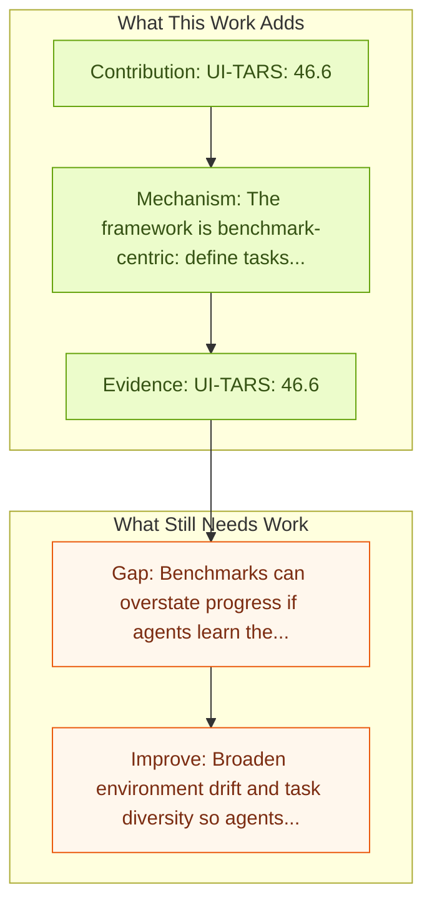

# AndroidWorld: Dynamic Benchmarking Environment

Entry report generated on 2026-03-28 (Asia/Shanghai). This report is based on the repository entry, linked source metadata, and audit-time cross-checks.

## Snapshot

| Field | Detail |
| --- | --- |
| Repo entry | AndroidWorld: Dynamic Benchmarking Environment |
| Actual target | [AndroidWorld: A Dynamic Benchmarking Environment for Autonomous Agents](https://arxiv.org/abs/2405.14573) |
| Section | Benchmarks and Datasets |
| Source location | `papers/benchmarks/README.md:135` |
| Primary link type | `link` |
| Audit status | `limited-access` |
| Date / venue | ICLR 2025 Poster |
| Authors | Christopher Rawles, Sarah Clinckemaillie, Yifan Chang, Jonathan Waltz, Gabrielle Lau, Marybeth Fair, Alice Li, William Bishop, Wei Li, Folawiyo Campbell-Ajala, Daniel Toyama, Robert Berry, Divya Tyamagundlu, Timothy Lillicrap, Oriana Riva |
| Focus tags | `benchmark` `android` `mobile` `dynamic` |
| Center of gravity | web, desktop, mobile |

## Quick Read

| Lens | Read |
| --- | --- |
| Problem pressure | Dynamic benchmarking environment for Android agents. |
| Most novel move | The main novelty sits in the evaluation surface itself, especially its emphasis on android, mobile, dynamic. |
| Strongest evidence | UI-TARS: 46.6 |
| Main caveat | Benchmarks can overstate progress if agents learn the evaluator rather than the underlying task skill, especially around mobile... |

## Visual Frame

```mermaid
flowchart LR
  Problem["Problem: Dynamic benchmarking environment for Android agents."] --> Novelty["Novelty: The main novelty sits in the evaluation surface itself..."]
  Novelty --> Framework["Framework: The framework is benchmark-centric: define tasks..."]
  Framework --> Evidence["Evidence: UI-TARS: 46.6"]
  Evidence --> Gap["Gap: Benchmarks can overstate progress if agents learn the..."]
  Gap --> Next["Next: Broaden environment drift and task diversity so agents..."]
  classDef insight fill:#dbeafe,stroke:#2563eb,color:#0f172a;
  classDef risk fill:#fee2e2,stroke:#dc2626,color:#7f1d1d;
  classDef next fill:#dcfce7,stroke:#16a34a,color:#14532d;
  class Problem,Novelty,Framework insight;
  class Evidence insight;
  class Gap risk;
  class Next next;
```

## Analysis Map

## Executive Summary

Dynamic benchmarking environment for Android agents. Autonomous agents that execute human tasks by controlling computers can enhance human productivity and application accessibility. However, progress in this field will be driven by realistic and reproducible benchmarks. The authors present AndroidWorld, a fully functional Android environment that provides reward signals for 116 programmatic tasks across 20 real-world Android apps.

## Code and Supporting Artifacts

- Code repository: no dedicated code link is currently tracked in the repo entry.

## Novelty

- The main novelty sits in the evaluation surface itself, especially its emphasis on android, mobile, dynamic.
- Autonomous agents that execute human tasks by controlling computers can enhance human productivity and application accessibility.
- However, progress in this field will be driven by realistic and reproducible benchmarks.

## Core Contributions

- UI-TARS: 46.6
- Mobile-Agent-v3: 73.3
- Autonomous agents that execute human tasks by controlling computers can enhance human productivity and application accessibility.
- However, progress in this field will be driven by realistic and reproducible benchmarks.

## Framework and Operating Logic

- The framework is benchmark-centric: define tasks, environments, and success criteria so later agent work can be evaluated on common ground.
- Autonomous agents that execute human tasks by controlling computers can enhance human productivity and application accessibility.
- However, progress in this field will be driven by realistic and reproducible benchmarks.

## Evidence and Claimed Results

- UI-TARS: 46.6
- Mobile-Agent-v3: 73.3
- We present AndroidWorld, a fully functional Android environment that provides reward signals for 116 programmatic tasks across 20 real-world Android apps.
- Our best agent can complete 30.6% of AndroidWorld's tasks, leaving ample room for future work.

## Gaps and Limitations

- Benchmarks can overstate progress if agents learn the evaluator rather than the underlying task skill, especially around mobile interfaces, app transitions, and version drift.
- Even a strong benchmark can miss interruptions, login drift, or real user messiness if the environment is too clean.

## How To Improve

- Broaden environment drift and task diversity so agents cannot overfit a narrow evaluator or a fixed slice of mobile interfaces, app transitions, and version drift.
- Add richer partial-credit and failure-taxonomy reporting, not only binary success.
- Pair benchmark scores with human-grounded difficulty and usability checks so the suite better reflects real workflows.

## Why It Matters

- This entry matters because benchmarks decide what the rest of the repo gets rewarded for improving.
- It is part of the evaluative scaffolding that lets model and method papers claim progress in a comparable way.

## Connections In This Repo

- [AppAgent: Multimodal Agents as Smartphone Users](../models-and-architectures/appagent-multimodal-agents-as-smartphone-users.md) - shared focus on mobile GUI control and cross-app interaction constraints.
- [DigiRL: Training In-The-Wild Device-Control](../methods-and-techniques/digirl-training-in-the-wild-device-control.md) - shared focus on mobile GUI control and cross-app interaction constraints.
- [A3: Android Agent Arena](a3-android-agent-arena.md) - shared focus on mobile GUI control and cross-app interaction constraints.
- [MobileAgentBench](mobileagentbench.md) - shared focus on mobile GUI control and cross-app interaction constraints.

## Source Basis

- Primary basis: abstract-level paper metadata plus the repo-local notes in the source Markdown file.
- Audit access note: The linked source had limited direct readability during the audit, so the report leans more heavily on accessible metadata and repo context.
