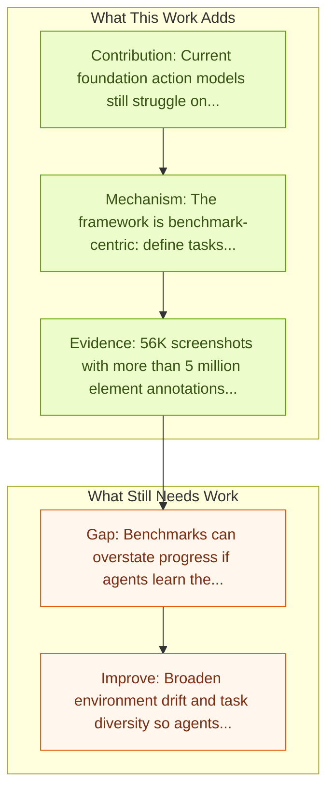

# CUA-Suite: Expert Trajectories and Pixel-Precise Grounding for Computer-use Agents

Entry report generated on 2026-03-28 (Asia/Shanghai). This report is based on the repository entry, linked source metadata, and audit-time cross-checks.

## Snapshot

| Field | Detail |
| --- | --- |
| Repo entry | CUA-Suite: Expert Trajectories and Pixel-Precise Grounding for Computer-use Agents |
| Actual target | [CUA-Suite: Expert Trajectories and Pixel-Precise Grounding for Computer-use Agents](https://openreview.net/forum?id=IgTUGrZfMr) |
| Section | Benchmarks and Datasets |
| Source location | `papers/benchmarks/README.md:315` |
| Primary link type | `link` |
| Audit status | `ok` |
| Date / venue | LLA 2026 Poster |
| Authors | Dongxu Li, Yizheng Pan, Guangchen Song, Yu-Qing Xie, Zeyi Li, Weixin Chen, Yizhe Yang, Tong Xiao, Jianmin Bao |
| Focus tags | `dataset` `grounding` `desktop` `human-demonstrations` |
| Center of gravity | grounding, desktop, human-demonstrations |

## Quick Read

| Lens | Read |
| --- | --- |
| Problem pressure | Desktop CUA benchmark and training suite built from expert trajectories and dense grounding annotations. |
| Most novel move | The main novelty sits in the evaluation surface itself, especially its emphasis on grounding, desktop, human-demonstrations. |
| Strongest evidence | 56K screenshots with more than 5 million element annotations across 87 desktop applications. |
| Main caveat | Benchmarks can overstate progress if agents learn the evaluator rather than the underlying task skill, especially around desktop... |

## Visual Frame

```mermaid
flowchart LR
  Problem["Problem: Desktop CUA benchmark and training suite built from expert..."] --> Novelty["Novelty: The main novelty sits in the evaluation surface itself..."]
  Novelty --> Framework["Framework: The framework is benchmark-centric: define tasks..."]
  Framework --> Evidence["Evidence: 56K screenshots with more than 5 million element annotations..."]
  Evidence --> Gap["Gap: Benchmarks can overstate progress if agents learn the..."]
  Gap --> Next["Next: Broaden environment drift and task diversity so agents..."]
  classDef insight fill:#dbeafe,stroke:#2563eb,color:#0f172a;
  classDef risk fill:#fee2e2,stroke:#dc2626,color:#7f1d1d;
  classDef next fill:#dcfce7,stroke:#16a34a,color:#14532d;
  class Problem,Novelty,Framework insight;
  class Evidence insight;
  class Gap risk;
  class Next next;
```

## Analysis Map

## Executive Summary

Desktop CUA benchmark and training suite built from expert trajectories and dense grounding annotations. CUA-Suite packages dense desktop supervision for computer-use agents by combining UI understanding, grounding, and trajectory data into one suite. It spans 87 applications, 56K screenshots, and more than 5 million UI-element annotations, plus roughly 10,000 expert-demonstrated tasks with detailed reasoning traces. The paper positions this expert-driven corpus as a way to push current action models beyond consumer-style interfaces toward professional desktop software.

## Code and Supporting Artifacts

- Code repository: no dedicated code link is currently tracked in the repo entry.

## Novelty

- The main novelty sits in the evaluation surface itself, especially its emphasis on grounding, desktop, human-demonstrations.
- CUA-Suite packages dense desktop supervision for computer-use agents by combining UI understanding, grounding, and trajectory data into one suite.
- It spans 87 applications, 56K screenshots, and more than 5 million UI-element annotations, plus roughly 10,000 expert-demonstrated tasks with detailed reasoning traces.

## Core Contributions

- Current foundation action models still struggle on professional desktop software despite the richer supervision.
- Multiple other benchmarks
- ## Specialized Benchmarks
- UI-Vision benchmark for desktop GUI understanding.
- GroundCUA grounding data and ActCUA expert trajectory data.

## Framework and Operating Logic

- The framework is benchmark-centric: define tasks, environments, and success criteria so later agent work can be evaluated on common ground.
- CUA-Suite packages dense desktop supervision for computer-use agents by combining UI understanding, grounding, and trajectory data into one suite.
- It spans 87 applications, 56K screenshots, and more than 5 million UI-element annotations, plus roughly 10,000 expert-demonstrated tasks with detailed reasoning traces.

## Evidence and Claimed Results

- 56K screenshots with more than 5 million element annotations across 87 desktop applications.
- Roughly 10,000 expert-demonstrated tasks with lengthy step-level reasoning annotations.
- Current foundation action models still struggle on professional desktop software despite the richer supervision.
- Multiple other benchmarks
- ## Specialized Benchmarks

## Gaps and Limitations

- Benchmarks can overstate progress if agents learn the evaluator rather than the underlying task skill, especially around desktop heterogeneity, long workflows, and OS-level side effects.
- Even a strong benchmark can miss interruptions, login drift, or real user messiness if the environment is too clean.

## How To Improve

- Broaden environment drift and task diversity so agents cannot overfit a narrow evaluator or a fixed slice of desktop heterogeneity, long workflows, and OS-level side effects.
- Add richer partial-credit and failure-taxonomy reporting, not only binary success.
- Pair benchmark scores with human-grounded difficulty and usability checks so the suite better reflects real workflows.

## Why It Matters

- This entry matters because benchmarks decide what the rest of the repo gets rewarded for improving.
- It is part of the evaluative scaffolding that lets model and method papers claim progress in a comparable way.

## Connections In This Repo

- [Grounding Computer Use Agents on Human Demonstrations](../methods-and-techniques/grounding-computer-use-agents-on-human-demonstrations.md) - shared emphasis on precise UI localization and action placement.
- [ShowUI-Aloha: Human-Taught GUI Agent](../models-and-architectures/showui-aloha-human-taught-gui-agent.md) - shared desktop or OS-level interaction surface.
- [OmniParser: Pure Vision Based GUI Agent](../models-and-architectures/omniparser-pure-vision-based-gui-agent.md) - shared emphasis on precise UI localization and action placement.
- [SeeClick: Harnessing GUI Grounding for Advanced Visual GUI Agents](../models-and-architectures/seeclick-harnessing-gui-grounding-for-advanced-visual-gui-agents.md) - shared emphasis on precise UI localization and action placement.

## Source Basis

- Primary basis: Primary OpenReview abstract and metadata were used because this entry is not available through the arXiv API.
- Audit access note: Metadata resolved cleanly during the audit.
