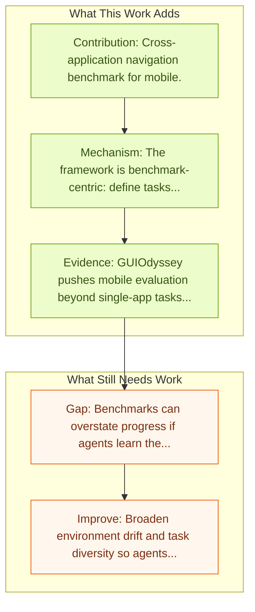

# GUI Odyssey: Cross-app Mobile Navigation

Entry report generated on 2026-03-28 (Asia/Shanghai). This report is based on the repository entry, linked source metadata, and audit-time cross-checks.

> Link mismatch: The repo entry points to `https://arxiv.org/abs/2411.00820`, which currently resolves to AutoGLM instead of GUI Odyssey. Recommended replacement: [https://arxiv.org/abs/2406.08451](https://arxiv.org/abs/2406.08451).

## Snapshot

| Field | Detail |
| --- | --- |
| Repo entry | GUI Odyssey: Cross-app Mobile Navigation |
| Actual target | [arXiv:2411.00820](https://arxiv.org/abs/2411.00820) |
| Section | Benchmarks and Datasets |
| Source location | `papers/benchmarks/README.md:195` |
| Primary link type | `link` |
| Audit status | `ok` |
| Date / venue | 2024 |
| Authors | Quanfeng Lu, Wenqi Shao, Zitao Liu, Lingxiao Du, Fanqing Meng, Boxuan Li, Botong Chen, Siyuan Huang, Kaipeng Zhang, Ping Luo |
| Focus tags | `benchmark` `mobile` `cross-app` `navigation` |
| Center of gravity | mobile, grounding |
| Intended paper | [GUIOdyssey: A Comprehensive Dataset for Cross-App GUI Navigation on Mobile Devices](https://arxiv.org/abs/2406.08451) |
| Current broken target | [AutoGLM: Autonomous Foundation Agents for GUIs](https://arxiv.org/abs/2411.00820) |

## Quick Read

| Lens | Read |
| --- | --- |
| Problem pressure | Cross-application navigation benchmark for mobile. |
| Most novel move | The main novelty sits in the evaluation surface itself, especially its emphasis on mobile, cross-app, navigation. |
| Strongest evidence | GUIOdyssey pushes mobile evaluation beyond single-app tasks by building a cross-app dataset with 8,334 episodes, 212 apps, 1,357 app... |
| Main caveat | Benchmarks can overstate progress if agents learn the evaluator rather than the underlying task skill, especially around mobile... |

## Visual Frame

```mermaid
flowchart LR
  Problem["Problem: Cross-application navigation benchmark for mobile."] --> Novelty["Novelty: The main novelty sits in the evaluation surface itself..."]
  Novelty --> Framework["Framework: The framework is benchmark-centric: define tasks..."]
  Framework --> Evidence["Evidence: GUIOdyssey pushes mobile evaluation beyond single-app tasks..."]
  Evidence --> Gap["Gap: Benchmarks can overstate progress if agents learn the..."]
  Gap --> Next["Next: Broaden environment drift and task diversity so agents..."]
  classDef insight fill:#dbeafe,stroke:#2563eb,color:#0f172a;
  classDef risk fill:#fee2e2,stroke:#dc2626,color:#7f1d1d;
  classDef next fill:#dcfce7,stroke:#16a34a,color:#14532d;
  class Problem,Novelty,Framework insight;
  class Evidence insight;
  class Gap risk;
  class Next next;
```

## Analysis Map

## Executive Summary

Cross-application navigation benchmark for mobile. GUIOdyssey pushes mobile evaluation beyond single-app tasks by building a cross-app dataset with 8,334 episodes, 212 apps, 1,357 app combinations, and an average of 15.3 steps per episode. Each step includes semantic reasoning annotations to help agents learn long-horizon decision processes. The paper also introduces OdysseyAgent with a history resampler so the model can reuse prior screenshots and actions without letting context grow uncontrollably.

## Code and Supporting Artifacts

- Code repository: no dedicated code link is currently tracked in the repo entry.

## Novelty

- The main novelty sits in the evaluation surface itself, especially its emphasis on mobile, cross-app, navigation.
- GUIOdyssey pushes mobile evaluation beyond single-app tasks by building a cross-app dataset with 8,334 episodes, 212 apps, 1,357 app combinations, and an average of 15.3 steps per episode.
- Each step includes semantic reasoning annotations to help agents learn long-horizon decision processes.

## Core Contributions

- Cross-application navigation benchmark for mobile.
- GUIOdyssey pushes mobile evaluation beyond single-app tasks by building a cross-app dataset with 8,334 episodes, 212 apps, 1,357 app combinations, and an average of 15.3 steps per episode.
- Each step includes semantic reasoning annotations to help agents learn long-horizon decision processes.
- The paper also introduces OdysseyAgent with a history resampler so the model can reuse prior screenshots and actions without letting context grow uncontrollably.

## Framework and Operating Logic

- The framework is benchmark-centric: define tasks, environments, and success criteria so later agent work can be evaluated on common ground.
- GUIOdyssey pushes mobile evaluation beyond single-app tasks by building a cross-app dataset with 8,334 episodes, 212 apps, 1,357 app combinations, and an average of 15.3 steps per episode.
- Each step includes semantic reasoning annotations to help agents learn long-horizon decision processes.

## Evidence and Claimed Results

- GUIOdyssey pushes mobile evaluation beyond single-app tasks by building a cross-app dataset with 8,334 episodes, 212 apps, 1,357 app combinations, and an average of 15.3 steps per episode.
- Each step includes semantic reasoning annotations to help agents learn long-horizon decision processes.
- The paper also introduces OdysseyAgent with a history resampler so the model can reuse prior screenshots and actions without letting context grow uncontrollably.

## Gaps and Limitations

- Benchmarks can overstate progress if agents learn the evaluator rather than the underlying task skill, especially around mobile interfaces, app transitions, and version drift.
- Even a strong benchmark can miss interruptions, login drift, or real user messiness if the environment is too clean.

## How To Improve

- Broaden environment drift and task diversity so agents cannot overfit a narrow evaluator or a fixed slice of mobile interfaces, app transitions, and version drift.
- Add richer partial-credit and failure-taxonomy reporting, not only binary success.
- Pair benchmark scores with human-grounded difficulty and usability checks so the suite better reflects real workflows.

## Why It Matters

- This entry matters because benchmarks decide what the rest of the repo gets rewarded for improving.
- It is part of the evaluative scaffolding that lets model and method papers claim progress in a comparable way.

## Connections In This Repo

- [AndroidWorld: Dynamic Benchmarking Environment](androidworld-dynamic-benchmarking-environment.md) - shared focus on mobile GUI control and cross-app interaction constraints.
- [MobileAgentBench](mobileagentbench.md) - shared focus on mobile GUI control and cross-app interaction constraints.
- [LLM-Powered GUI Agents in Phone Automation](../survey-papers/llm-powered-gui-agents-in-phone-automation.md) - shared focus on mobile GUI control and cross-app interaction constraints.
- [AppAgent: Multimodal Agents as Smartphone Users](../models-and-architectures/appagent-multimodal-agents-as-smartphone-users.md) - shared focus on mobile GUI control and cross-app interaction constraints.

## Source Basis

- Primary basis: Replacement arXiv paper used because the repo URL resolves to the wrong target.
- Audit access note: Metadata resolved cleanly during the audit.
- Integrity note: The repository entry currently points to the wrong paper; this report is intentionally written against the confirmed intended target.
