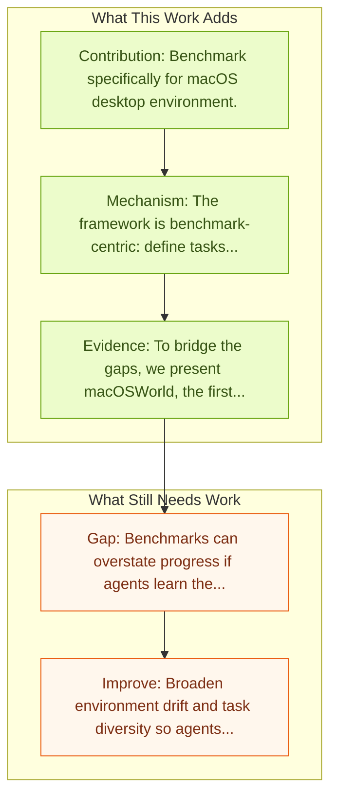

# macOSWorld

Entry report generated on 2026-03-28 (Asia/Shanghai). This report is based on the repository entry, linked source metadata, and audit-time cross-checks.

## Snapshot

| Field | Detail |
| --- | --- |
| Repo entry | macOSWorld |
| Actual target | [macOSWorld: A Multilingual Interactive Benchmark for GUI Agents](https://arxiv.org/abs/2506.04135) |
| Section | Benchmarks and Datasets |
| Source location | `papers/benchmarks/README.md:52` |
| Primary link type | `link` |
| Audit status | `limited-access` |
| Date / venue | June 2025 |
| Authors | Pei Yang, Hai Ci, Mike Zheng Shou |
| Focus tags | `benchmark` `macos` `desktop` |
| Center of gravity | web, desktop, mobile |

## Quick Read

| Lens | Read |
| --- | --- |
| Problem pressure | Benchmark specifically for macOS desktop environment. |
| Most novel move | The main novelty sits in the evaluation surface itself, especially its emphasis on macos, desktop. |
| Strongest evidence | To bridge the gaps, we present macOSWorld, the first comprehensive benchmark for evaluating GUI agents on macOS. macOSWorld features 202... |
| Main caveat | Benchmarks can overstate progress if agents learn the evaluator rather than the underlying task skill, especially around desktop... |

## Visual Frame

```mermaid
flowchart LR
  Problem["Problem: Benchmark specifically for macOS desktop environment."] --> Novelty["Novelty: The main novelty sits in the evaluation surface itself..."]
  Novelty --> Framework["Framework: The framework is benchmark-centric: define tasks..."]
  Framework --> Evidence["Evidence: To bridge the gaps, we present macOSWorld, the first..."]
  Evidence --> Gap["Gap: Benchmarks can overstate progress if agents learn the..."]
  Gap --> Next["Next: Broaden environment drift and task diversity so agents..."]
  classDef insight fill:#dbeafe,stroke:#2563eb,color:#0f172a;
  classDef risk fill:#fee2e2,stroke:#dc2626,color:#7f1d1d;
  classDef next fill:#dcfce7,stroke:#16a34a,color:#14532d;
  class Problem,Novelty,Framework insight;
  class Evidence insight;
  class Gap risk;
  class Next next;
```

## Analysis Map

## Executive Summary

Benchmark specifically for macOS desktop environment. Graphical User Interface (GUI) agents show promising capabilities for automating computer-use tasks and facilitating accessibility, but existing interactive benchmarks are mostly English-only, covering web-use or Windows, Linux, and Android environments, but not macOS. macOS is a major OS with distinctive GUI patterns and exclusive applications. To bridge the gaps, we present macOSWorld, the first comprehensive benchmark for evaluating GUI agents on macOS. macOSWorld features 202 multilingual interactive tasks across 30 applications (28 macOS-exclusive), with task instructions and OS interfaces offered in 5 languages (English, Chinese, Arabic, Japanese, and Russian). As GUI agents are shown to be vulnerable to deception attacks, macOSWorld also includes a dedicated safety benchmarking subset.

## Code and Supporting Artifacts

- Code repository: no dedicated code link is currently tracked in the repo entry.

## Novelty

- The main novelty sits in the evaluation surface itself, especially its emphasis on macos, desktop.
- Graphical User Interface (GUI) agents show promising capabilities for automating computer-use tasks and facilitating accessibility, but existing interactive benchmarks are mostly English-only, covering web-use or Windows, Linux, and Android environments, but not macOS. macOS is a major OS with distinctive GUI patterns and exclusive applications.
- To bridge the gaps, we present macOSWorld, the first comprehensive benchmark for evaluating GUI agents on macOS. macOSWorld features 202 multilingual interactive tasks across 30 applications (28 macOS-exclusive), with task instructions and OS interfaces offered in 5 languages (English, Chinese, Arabic, Japanese, and Russian).

## Core Contributions

- Benchmark specifically for macOS desktop environment.
- Graphical User Interface (GUI) agents show promising capabilities for automating computer-use tasks and facilitating accessibility, but existing interactive benchmarks are mostly English-only, covering web-use or Windows, Linux, and Android environments, but not macOS. macOS is a major OS with distinctive GUI patterns and exclusive applications.
- To bridge the gaps, we present macOSWorld, the first comprehensive benchmark for evaluating GUI agents on macOS. macOSWorld features 202 multilingual interactive tasks across 30 applications (28 macOS-exclusive), with task instructions and OS interfaces offered in 5 languages (English, Chinese, Arabic, Japanese, and Russian).
- As GUI agents are shown to be vulnerable to deception attacks, macOSWorld also includes a dedicated safety benchmarking subset.

## Framework and Operating Logic

- The framework is benchmark-centric: define tasks, environments, and success criteria so later agent work can be evaluated on common ground.
- Graphical User Interface (GUI) agents show promising capabilities for automating computer-use tasks and facilitating accessibility, but existing interactive benchmarks are mostly English-only, covering web-use or Windows, Linux, and Android environments, but not macOS. macOS is a major OS with distinctive GUI patterns and exclusive applications.
- To bridge the gaps, we present macOSWorld, the first comprehensive benchmark for evaluating GUI agents on macOS. macOSWorld features 202 multilingual interactive tasks across 30 applications (28 macOS-exclusive), with task instructions and OS interfaces offered in 5 languages (English, Chinese, Arabic, Japanese, and Russian).

## Evidence and Claimed Results

- To bridge the gaps, we present macOSWorld, the first comprehensive benchmark for evaluating GUI agents on macOS. macOSWorld features 202 multilingual interactive tasks across 30 applications (28 macOS-exclusive), with task instructions and OS interfaces offered in 5 languages (English, Chinese, Arabic, Japanese, and Russian).
- Our evaluation on six GUI agents reveals a dramatic gap: proprietary computer-use agents lead at above 30% success rate, while open-source lightweight research models lag at below 5\%, highlighting the need for macOS domain adaptation.
- Multilingual benchmarks also expose common weaknesses, especially in Arabic, with a 28.8% average degradation compared to English.

## Gaps and Limitations

- Benchmarks can overstate progress if agents learn the evaluator rather than the underlying task skill, especially around desktop heterogeneity, long workflows, and OS-level side effects.
- Even a strong benchmark can miss interruptions, login drift, or real user messiness if the environment is too clean.

## How To Improve

- Broaden environment drift and task diversity so agents cannot overfit a narrow evaluator or a fixed slice of desktop heterogeneity, long workflows, and OS-level side effects.
- Add richer partial-credit and failure-taxonomy reporting, not only binary success.
- Pair benchmark scores with human-grounded difficulty and usability checks so the suite better reflects real workflows.

## Why It Matters

- This entry matters because benchmarks decide what the rest of the repo gets rewarded for improving.
- It is part of the evaluative scaffolding that lets model and method papers claim progress in a comparable way.

## Connections In This Repo

- [OS-Harm: A Benchmark for Measuring Safety of Computer Use Agents](../safety-and-security/os-harm-a-benchmark-for-measuring-safety-of-computer-use-agents.md) - shared desktop or OS-level interaction surface.
- [OSWorld: Multimodal Agents for Open-Ended Tasks in Real Computer Environments](osworld-multimodal-agents-for-open-ended-tasks-in-real-computer-environments.md) - shared desktop or OS-level interaction surface.
- [Windows Agent Arena (WAA)](windows-agent-arena-waa.md) - shared desktop or OS-level interaction surface.
- [OmniACT](omniact.md) - shared desktop or OS-level interaction surface.

## Source Basis

- Primary basis: abstract-level paper metadata plus the repo-local notes in the source Markdown file.
- Audit access note: The linked source had limited direct readability during the audit, so the report leans more heavily on accessible metadata and repo context.
