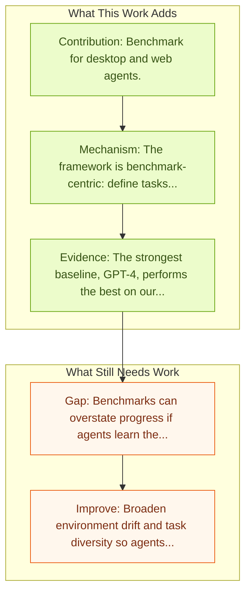

# OmniACT

Entry report generated on 2026-03-28 (Asia/Shanghai). This report is based on the repository entry, linked source metadata, and audit-time cross-checks.

## Snapshot

| Field | Detail |
| --- | --- |
| Repo entry | OmniACT |
| Actual target | [OmniACT: A Dataset and Benchmark for Enabling Multimodal Generalist Autonomous Agents for Desktop and Web](https://arxiv.org/abs/2402.17553) |
| Section | Benchmarks and Datasets |
| Source location | `papers/benchmarks/README.md:223` |
| Primary link type | `link` |
| Audit status | `limited-access` |
| Date / venue | February 2024 |
| Authors | Raghav Kapoor, Yash Parag Butala, Melisa Russak, Jing Yu Koh, Kiran Kamble, Waseem Alshikh, Ruslan Salakhutdinov |
| Focus tags | `benchmark` `desktop` `web` `cross-platform` |
| Center of gravity | web, desktop, grounding |

## Quick Read

| Lens | Read |
| --- | --- |
| Problem pressure | Benchmark for desktop and web agents. |
| Most novel move | The main novelty sits in the evaluation surface itself, especially its emphasis on desktop, web, cross-platform. |
| Strongest evidence | The strongest baseline, GPT-4, performs the best on our benchmark However, its performance level still reaches only 15% of the human... |
| Main caveat | Benchmarks can overstate progress if agents learn the evaluator rather than the underlying task skill, especially around live websites... |

## Visual Frame

```mermaid
flowchart LR
  Problem["Problem: Benchmark for desktop and web agents."] --> Novelty["Novelty: The main novelty sits in the evaluation surface itself..."]
  Novelty --> Framework["Framework: The framework is benchmark-centric: define tasks..."]
  Framework --> Evidence["Evidence: The strongest baseline, GPT-4, performs the best on our..."]
  Evidence --> Gap["Gap: Benchmarks can overstate progress if agents learn the..."]
  Gap --> Next["Next: Broaden environment drift and task diversity so agents..."]
  classDef insight fill:#dbeafe,stroke:#2563eb,color:#0f172a;
  classDef risk fill:#fee2e2,stroke:#dc2626,color:#7f1d1d;
  classDef next fill:#dcfce7,stroke:#16a34a,color:#14532d;
  class Problem,Novelty,Framework insight;
  class Evidence insight;
  class Gap risk;
  class Next next;
```

## Analysis Map

## Executive Summary

Benchmark for desktop and web agents. For decades, human-computer interaction has fundamentally been manual. Even today, almost all productive work done on the computer necessitates human input at every step. Autonomous virtual agents represent an exciting step in automating many of these menial tasks.

## Code and Supporting Artifacts

- Code repository: no dedicated code link is currently tracked in the repo entry.

## Novelty

- The main novelty sits in the evaluation surface itself, especially its emphasis on desktop, web, cross-platform.
- For decades, human-computer interaction has fundamentally been manual.
- Even today, almost all productive work done on the computer necessitates human input at every step.

## Core Contributions

- Benchmark for desktop and web agents.
- For decades, human-computer interaction has fundamentally been manual.
- Even today, almost all productive work done on the computer necessitates human input at every step.
- Autonomous virtual agents represent an exciting step in automating many of these menial tasks.

## Framework and Operating Logic

- The framework is benchmark-centric: define tasks, environments, and success criteria so later agent work can be evaluated on common ground.
- For decades, human-computer interaction has fundamentally been manual.
- Even today, almost all productive work done on the computer necessitates human input at every step.

## Evidence and Claimed Results

- The strongest baseline, GPT-4, performs the best on our benchmark However, its performance level still reaches only 15% of the human proficiency in generating executable scripts capable of completing the task, demonstrating the challenge of our task for conventional web agents.
- For decades, human-computer interaction has fundamentally been manual.
- Even today, almost all productive work done on the computer necessitates human input at every step.

## Gaps and Limitations

- Benchmarks can overstate progress if agents learn the evaluator rather than the underlying task skill, especially around live websites, layout drift, and prompt-injection exposure.
- Even a strong benchmark can miss interruptions, login drift, or real user messiness if the environment is too clean.

## How To Improve

- Broaden environment drift and task diversity so agents cannot overfit a narrow evaluator or a fixed slice of live websites, layout drift, and prompt-injection exposure.
- Add richer partial-credit and failure-taxonomy reporting, not only binary success.
- Pair benchmark scores with human-grounded difficulty and usability checks so the suite better reflects real workflows.

## Why It Matters

- This entry matters because benchmarks decide what the rest of the repo gets rewarded for improving.
- It is part of the evaluative scaffolding that lets model and method papers claim progress in a comparable way.

## Connections In This Repo

- [Mobile-Agent-v3.5: Multi-platform Fundamental GUI Agents](../models-and-architectures/mobile-agent-v3-5-multi-platform-fundamental-gui-agents.md) - shared desktop or OS-level interaction surface.
- [OS-Harm: A Benchmark for Measuring Safety of Computer Use Agents](../safety-and-security/os-harm-a-benchmark-for-measuring-safety-of-computer-use-agents.md) - shared desktop or OS-level interaction surface.
- [HackWorld: Evaluating Computer-Use Agents on Exploiting Web Application Vulnerabilities](../safety-and-security/hackworld-evaluating-computer-use-agents-on-exploiting-web-application-vulnerabilities.md) - shared focus on web-agent realism, dynamic pages, or browser-side risk.
- [OSWorld: Multimodal Agents for Open-Ended Tasks in Real Computer Environments](osworld-multimodal-agents-for-open-ended-tasks-in-real-computer-environments.md) - shared desktop or OS-level interaction surface.

## Source Basis

- Primary basis: abstract-level paper metadata plus the repo-local notes in the source Markdown file.
- Audit access note: The linked source had limited direct readability during the audit, so the report leans more heavily on accessible metadata and repo context.
