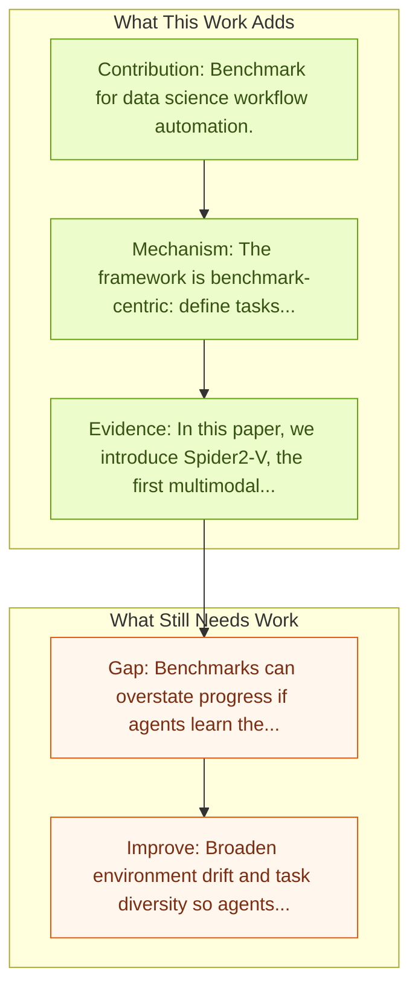

# Spider2-V: Data Science Workflows

Entry report generated on 2026-03-28 (Asia/Shanghai). This report is based on the repository entry, linked source metadata, and audit-time cross-checks.

## Snapshot

| Field | Detail |
| --- | --- |
| Repo entry | Spider2-V: Data Science Workflows |
| Actual target | [Spider2-V: How Far Are Multimodal Agents From Automating Data Science and Engineering Workflows?](https://arxiv.org/abs/2407.10956) |
| Section | Benchmarks and Datasets |
| Source location | `papers/benchmarks/README.md:338` |
| Primary link type | `link` |
| Audit status | `ok` |
| Date / venue | 2024 |
| Authors | Ruisheng Cao, Fangyu Lei, Haoyuan Wu, Jixuan Chen, Yeqiao Fu, Hongcheng Gao, Xinzhuang Xiong, Hanchong Zhang, Yuchen Mao, Wenjing Hu, Tianbao Xie, Hongshen Xu, Danyang Zhang, Sida Wang, Ruoxi Sun, Pengcheng Yin, Caiming Xiong, Ansong Ni, Qian Liu, Victor Zhong, Lu Chen, Kai Yu, Tao Yu |
| Focus tags | `benchmark` `data-science` `specialized` |
| Center of gravity | data-science, specialized |

## Quick Read

| Lens | Read |
| --- | --- |
| Problem pressure | Benchmark for data science workflow automation. |
| Most novel move | The main novelty sits in the evaluation surface itself, especially its emphasis on data-science, specialized. |
| Strongest evidence | In this paper, we introduce Spider2-V, the first multimodal agent benchmark focusing on professional data science and engineering... |
| Main caveat | Benchmarks can overstate progress if agents learn the evaluator rather than the underlying task skill, especially around long-horizon... |

## Visual Frame

```mermaid
flowchart LR
  Problem["Problem: Benchmark for data science workflow automation."] --> Novelty["Novelty: The main novelty sits in the evaluation surface itself..."]
  Novelty --> Framework["Framework: The framework is benchmark-centric: define tasks..."]
  Framework --> Evidence["Evidence: In this paper, we introduce Spider2-V, the first multimodal..."]
  Evidence --> Gap["Gap: Benchmarks can overstate progress if agents learn the..."]
  Gap --> Next["Next: Broaden environment drift and task diversity so agents..."]
  classDef insight fill:#dbeafe,stroke:#2563eb,color:#0f172a;
  classDef risk fill:#fee2e2,stroke:#dc2626,color:#7f1d1d;
  classDef next fill:#dcfce7,stroke:#16a34a,color:#14532d;
  class Problem,Novelty,Framework insight;
  class Evidence insight;
  class Gap risk;
  class Next next;
```

## Analysis Map

## Executive Summary

Benchmark for data science workflow automation. Data science and engineering workflows often span multiple stages, from warehousing to orchestration, using tools like BigQuery, dbt, and Airbyte. As vision language models (VLMs) advance in multimodal understanding and code generation, VLM-based agents could potentially automate these workflows by generating SQL queries, Python code, and GUI operations. This automation can improve the productivity of experts while democratizing access to large-scale data analysis.

## Code and Supporting Artifacts

- Code repository: no dedicated code link is currently tracked in the repo entry.

## Novelty

- The main novelty sits in the evaluation surface itself, especially its emphasis on data-science, specialized.
- Data science and engineering workflows often span multiple stages, from warehousing to orchestration, using tools like BigQuery, dbt, and Airbyte.
- As vision language models (VLMs) advance in multimodal understanding and code generation, VLM-based agents could potentially automate these workflows by generating SQL queries, Python code, and GUI operations.

## Core Contributions

- Benchmark for data science workflow automation.
- Data science and engineering workflows often span multiple stages, from warehousing to orchestration, using tools like BigQuery, dbt, and Airbyte.
- As vision language models (VLMs) advance in multimodal understanding and code generation, VLM-based agents could potentially automate these workflows by generating SQL queries, Python code, and GUI operations.
- This automation can improve the productivity of experts while democratizing access to large-scale data analysis.

## Framework and Operating Logic

- The framework is benchmark-centric: define tasks, environments, and success criteria so later agent work can be evaluated on common ground.
- Data science and engineering workflows often span multiple stages, from warehousing to orchestration, using tools like BigQuery, dbt, and Airbyte.
- As vision language models (VLMs) advance in multimodal understanding and code generation, VLM-based agents could potentially automate these workflows by generating SQL queries, Python code, and GUI operations.

## Evidence and Claimed Results

- In this paper, we introduce Spider2-V, the first multimodal agent benchmark focusing on professional data science and engineering workflows, featuring 494 real-world tasks in authentic computer environments and incorporating 20 enterprise-level professional applications.
- Our empirical evaluation reveals that existing state-of-the-art LLM/VLM-based agents do not reliably automate full data workflows (14.0% success).
- Even with step-by-step guidance, these agents still underperform in tasks that require fine-grained, knowledge-intensive GUI actions (16.2%) and involve remote cloud-hosted workspaces (10.6%).
- We hope that Spider2-V paves the way for autonomous multimodal agents to transform the automation of data science and engineering workflow.

## Gaps and Limitations

- Benchmarks can overstate progress if agents learn the evaluator rather than the underlying task skill, especially around long-horizon transfer, recovery behavior, and distribution shift.
- Even a strong benchmark can miss interruptions, login drift, or real user messiness if the environment is too clean.

## How To Improve

- Broaden environment drift and task diversity so agents cannot overfit a narrow evaluator or a fixed slice of long-horizon transfer, recovery behavior, and distribution shift.
- Add richer partial-credit and failure-taxonomy reporting, not only binary success.
- Pair benchmark scores with human-grounded difficulty and usability checks so the suite better reflects real workflows.

## Why It Matters

- This entry matters because benchmarks decide what the rest of the repo gets rewarded for improving.
- It is part of the evaluative scaffolding that lets model and method papers claim progress in a comparable way.

## Connections In This Repo

- [AgentHarm: LLM Agent Safety Benchmark](../safety-and-security/agentharm-llm-agent-safety-benchmark.md) - shared evaluative role in defining what progress means.
- [OS-Harm: A Benchmark for Measuring Safety of Computer Use Agents](../safety-and-security/os-harm-a-benchmark-for-measuring-safety-of-computer-use-agents.md) - shared evaluative role in defining what progress means.
- [VPI-Bench: Visual Prompt Injection Attacks for Computer-Use Agents](../safety-and-security/vpi-bench-visual-prompt-injection-attacks-for-computer-use-agents.md) - shared evaluative role in defining what progress means.
- [HackWorld: Evaluating Computer-Use Agents on Exploiting Web Application Vulnerabilities](../safety-and-security/hackworld-evaluating-computer-use-agents-on-exploiting-web-application-vulnerabilities.md) - shared evaluative role in defining what progress means.

## Source Basis

- Primary basis: Primary arXiv abstract metadata was fetched live from the linked paper page.
- Audit access note: Metadata resolved cleanly during the audit.
