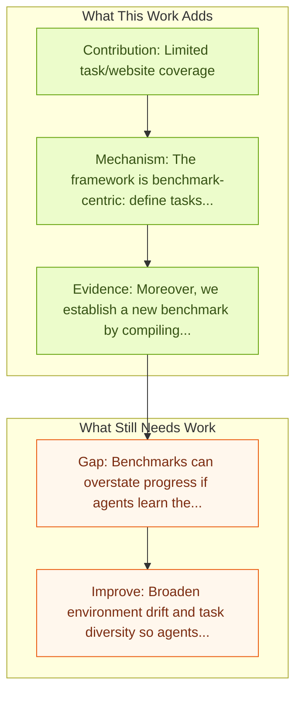

# WebVoyager: End-to-End Web Agent with LMMs

Entry report generated on 2026-03-28 (Asia/Shanghai). This report is based on the repository entry, linked source metadata, and audit-time cross-checks.

## Snapshot

| Field | Detail |
| --- | --- |
| Repo entry | WebVoyager: End-to-End Web Agent with LMMs |
| Actual target | [WebVoyager: Building an End-to-End Web Agent with Large Multimodal Models](https://arxiv.org/abs/2401.13919) |
| Section | Benchmarks and Datasets |
| Source location | `papers/benchmarks/README.md:112` |
| Primary link type | `link` |
| Audit status | `limited-access` |
| Date / venue | ACL 2024 |
| Authors | Hongliang He, Wenlin Yao, Kaixin Ma, Wenhao Yu, Yong Dai, Hongming Zhang, Zhenzhong Lan, Dong Yu |
| Focus tags | `benchmark` `web` `evaluation` `end-to-end` |
| Center of gravity | web |

## Quick Read

| Lens | Read |
| --- | --- |
| Problem pressure | The paper targets a concrete bottleneck in computer-use agents. |
| Most novel move | The main novelty sits in the evaluation surface itself, especially its emphasis on web, end-to-end, known limitations. |
| Strongest evidence | Moreover, we establish a new benchmark by compiling real-world tasks from 15 popular websites and introduce an automatic evaluation... |
| Main caveat | Benchmarks can overstate progress if agents learn the evaluator rather than the underlying task skill, especially around live websites... |

## Visual Frame

```mermaid
flowchart LR
  Problem["Problem: The rapid advancement of large language models (LLMs) has..."] --> Novelty["Novelty: The main novelty sits in the evaluation surface itself..."]
  Novelty --> Framework["Framework: The framework is benchmark-centric: define tasks..."]
  Framework --> Evidence["Evidence: Moreover, we establish a new benchmark by compiling..."]
  Evidence --> Gap["Gap: Benchmarks can overstate progress if agents learn the..."]
  Gap --> Next["Next: Broaden environment drift and task diversity so agents..."]
  classDef insight fill:#dbeafe,stroke:#2563eb,color:#0f172a;
  classDef risk fill:#fee2e2,stroke:#dc2626,color:#7f1d1d;
  classDef next fill:#dcfce7,stroke:#16a34a,color:#14532d;
  class Problem,Novelty,Framework insight;
  class Evidence insight;
  class Gap risk;
  class Next next;
```

## Analysis Map

## Executive Summary

The rapid advancement of large language models (LLMs) has led to a new era marked by the development of autonomous applications in real-world scenarios, which drives innovation in creating advanced web agents. Existing web agents typically only handle one input modality and are evaluated only in simplified web simulators or static web snapshots, greatly limiting their applicability in real-world scenarios. To bridge this gap, we introduce WebVoyager, an innovative Large Multimodal Model (LMM) powered web agent that can complete user instructions end-to-end by interacting with real-world websites. The benchmark or dataset is the main contribution rather than a new agent policy.

## Code and Supporting Artifacts

- Code repository: no dedicated code link is currently tracked in the repo entry.

## Novelty

- The main novelty sits in the evaluation surface itself, especially its emphasis on web, end-to-end, known limitations.
- The rapid advancement of large language models (LLMs) has led to a new era marked by the development of autonomous applications in real-world scenarios, which drives innovation in creating advanced web agents.
- Existing web agents typically only handle one input modality and are evaluated only in simplified web simulators or static web snapshots, greatly limiting their applicability in real-world scenarios.

## Core Contributions

- Limited task/website coverage
- Shortcut solutions possible (51% via Google Search)
- Low LLM-as-Judge agreement with humans
- The rapid advancement of large language models (LLMs) has led to a new era marked by the development of autonomous applications in real-world scenarios, which drives innovation in creating advanced web agents.

## Framework and Operating Logic

- The framework is benchmark-centric: define tasks, environments, and success criteria so later agent work can be evaluated on common ground.
- The rapid advancement of large language models (LLMs) has led to a new era marked by the development of autonomous applications in real-world scenarios, which drives innovation in creating advanced web agents.
- Existing web agents typically only handle one input modality and are evaluated only in simplified web simulators or static web snapshots, greatly limiting their applicability in real-world scenarios.

## Evidence and Claimed Results

- Moreover, we establish a new benchmark by compiling real-world tasks from 15 popular websites and introduce an automatic evaluation protocol leveraging multimodal understanding abilities of GPT-4V to evaluate open-ended web agents.
- We show that WebVoyager achieves a 59.1% task success rate on our benchmark, significantly surpassing the performance of both GPT-4 (All Tools) and the WebVoyager (text-only) setups, underscoring the exceptional capability of WebVoyager.
- The proposed automatic evaluation metric achieves 85.3% agreement with human judgment, indicating its effectiveness in providing reliable and accurate assessments of web agents.

## Gaps and Limitations

- Benchmarks can overstate progress if agents learn the evaluator rather than the underlying task skill, especially around live websites, layout drift, and prompt-injection exposure.
- Even a strong benchmark can miss interruptions, login drift, or real user messiness if the environment is too clean.

## How To Improve

- Broaden environment drift and task diversity so agents cannot overfit a narrow evaluator or a fixed slice of live websites, layout drift, and prompt-injection exposure.
- Add richer partial-credit and failure-taxonomy reporting, not only binary success.
- Pair benchmark scores with human-grounded difficulty and usability checks so the suite better reflects real workflows.

## Why It Matters

- This entry matters because benchmarks decide what the rest of the repo gets rewarded for improving.
- It is part of the evaluative scaffolding that lets model and method papers claim progress in a comparable way.

## Connections In This Repo

- [HackWorld: Evaluating Computer-Use Agents on Exploiting Web Application Vulnerabilities](../safety-and-security/hackworld-evaluating-computer-use-agents-on-exploiting-web-application-vulnerabilities.md) - shared focus on web-agent realism, dynamic pages, or browser-side risk.
- [WebArena: Realistic Web Environment for Building Autonomous Agents](webarena-realistic-web-environment-for-building-autonomous-agents.md) - shared focus on web-agent realism, dynamic pages, or browser-side risk.
- [Mind2Web: Towards a Generalist Agent for the Web](mind2web-towards-a-generalist-agent-for-the-web.md) - shared focus on web-agent realism, dynamic pages, or browser-side risk.
- [Online-Mind2Web](online-mind2web.md) - shared focus on web-agent realism, dynamic pages, or browser-side risk.

## Source Basis

- Primary basis: abstract-level paper metadata plus the repo-local notes in the source Markdown file.
- Audit access note: The linked source had limited direct readability during the audit, so the report leans more heavily on accessible metadata and repo context.
