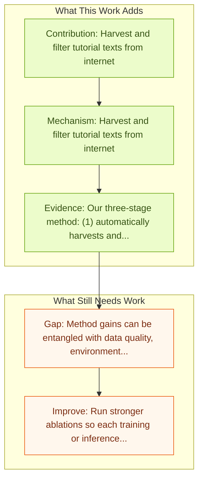

# AgentTrek: Agent Trajectory Synthesis via Web Tutorials

Entry report generated on 2026-03-28 (Asia/Shanghai). This report is based on the repository entry, linked source metadata, and audit-time cross-checks.

## Snapshot

| Field | Detail |
| --- | --- |
| Repo entry | AgentTrek: Agent Trajectory Synthesis via Web Tutorials |
| Actual target | [AgentTrek: Agent Trajectory Synthesis via Guiding Replay with Web Tutorials](https://arxiv.org/abs/2412.09605) |
| Section | Methods and Techniques |
| Source location | `papers/methods/README.md:57` |
| Primary link type | `link` |
| Audit status | `ok` |
| Date / venue | ICLR 2025 Spotlight |
| Authors | Yiheng Xu, Dunjie Lu, Zhennan Shen, Junli Wang, Zekun Wang, Yuchen Mao, Caiming Xiong, Tao Yu |
| Focus tags | `method` `data-synthesis` `trajectories` `web` |
| Center of gravity | web, grounding |
| Project page | [agenttrek.github.io](https://agenttrek.github.io/) |

## Quick Read

| Lens | Read |
| --- | --- |
| Problem pressure | Scalable data synthesis pipeline using public tutorials. |
| Most novel move | The method's clearest new move is harvest and filter tutorial texts from internet. |
| Strongest evidence | Our three-stage method: (1) automatically harvests and filters tutorial-like texts from the internet using a specialized classification... |
| Main caveat | Method gains can be entangled with data quality, environment choice, or evaluator assumptions if ablations are thin. |

## Visual Frame

```mermaid
flowchart LR
  Problem["Problem: Scalable data synthesis pipeline using public tutorials."] --> Novelty["Novelty: The method's clearest new move is harvest and filter..."]
  Novelty --> Framework["Framework: Harvest and filter tutorial texts from internet"]
  Framework --> Evidence["Evidence: Our three-stage method: (1) automatically harvests and..."]
  Evidence --> Gap["Gap: Method gains can be entangled with data quality, environment..."]
  Gap --> Next["Next: Run stronger ablations so each training or inference..."]
  classDef insight fill:#dbeafe,stroke:#2563eb,color:#0f172a;
  classDef risk fill:#fee2e2,stroke:#dc2626,color:#7f1d1d;
  classDef next fill:#dcfce7,stroke:#16a34a,color:#14532d;
  class Problem,Novelty,Framework insight;
  class Evidence insight;
  class Gap risk;
  class Next next;
```

## Analysis Map

## Executive Summary

Scalable data synthesis pipeline using public tutorials. Graphical User Interface (GUI) agents can automate complex tasks across digital environments, but their development is hindered by the scarcity of high-quality trajectory data for training. Existing approaches rely on expensive human annotation, making them unsustainable at scale. The authors propose AgentTrek, a scalable data synthesis pipeline that generates web agent trajectories by leveraging publicly available tutorials.

## Code and Supporting Artifacts

- Code repository: no dedicated code link is currently tracked in the repo entry.
- Project page or benchmark site: [agenttrek.github.io](https://agenttrek.github.io/)

## Novelty

- The method's clearest new move is harvest and filter tutorial texts from internet.
- It also stands out for transform to structured task specifications.
- It also stands out for VLM agent executes in real environments.

## Core Contributions

- Harvest and filter tutorial texts from internet
- Transform to structured task specifications
- VLM agent executes in real environments
- VLM evaluator verifies trajectory correctness
- $0.55 per high-quality trajectory (no human annotators)

## Framework and Operating Logic

- Harvest and filter tutorial texts from internet
- Transform to structured task specifications
- VLM agent executes in real environments
- VLM evaluator verifies trajectory correctness

## Evidence and Claimed Results

- Our three-stage method: (1) automatically harvests and filters tutorial-like texts from the internet using a specialized classification model, (2) transforms these texts into structured task specifications with step-by-step instructions, and (3) employs a visual-language model (VLM) agent to execute these instructions in real environments, while a VLM-based evaluator verifies trajectory correctness.
- This multimodal data, enriched with chain-of-thought reasoning, enables agents to achieve state-of-the-art performance on both textual web browsing benchmarks (e.g., WebArena) and visual web grounding and browsing benchmarks (e.g., ScreenSpot Web and Multimodal Mind2Web).
- Furthermore, our fully automated approach significantly reduces data collection costs, achieving a cost of just $0.55 per high-quality trajectory without human annotators.

## Gaps and Limitations

- Method gains can be entangled with data quality, environment choice, or evaluator assumptions if ablations are thin.
- Better grounding or reflection does not automatically solve live websites, layout drift, and prompt-injection exposure.

## How To Improve

- Run stronger ablations so each training or inference component carries a clearly attributable gain.
- Stress-test the method on longer workflows and harder transfer settings involving live websites, layout drift, and prompt-injection exposure.
- Publish sharper failure analyses for the cases where the method improves one stage of control but still fails end-to-end.

## Why It Matters

- This entry matters because training and inference design often determine whether a capable base model can actually become a useful agent.
- It usually connects high-level capability claims to the data, tuning, or orchestration choices that make them work.

## Connections In This Repo

- [AgentTrek Trajectories](../benchmarks-and-datasets/agenttrek-trajectories.md) - shared focus on web-agent realism, dynamic pages, or browser-side risk.
- [OS-Genesis: Automating GUI Agent Trajectory Construction](os-genesis-automating-gui-agent-trajectory-construction.md) - neighbor entry in the same methods and techniques cluster.
- [WebRL: Self-Evolving Online Curriculum RL for Web Agents](webrl-self-evolving-online-curriculum-rl-for-web-agents.md) - shared focus on web-agent realism, dynamic pages, or browser-side risk.
- [SeeAct: GPT-4V Web Agent via Visual Grounding](seeact-gpt-4v-web-agent-via-visual-grounding.md) - shared focus on web-agent realism, dynamic pages, or browser-side risk.

## Source Basis

- Primary basis: abstract-level paper metadata plus the repo-local notes in the source Markdown file.
- Audit access note: Metadata resolved cleanly during the audit.
