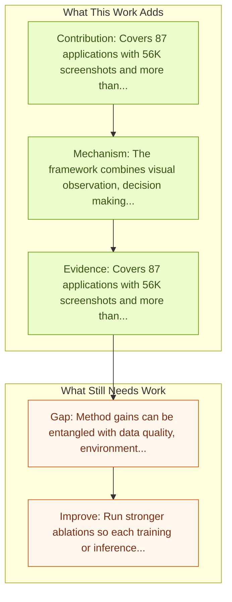

# Grounding Computer Use Agents on Human Demonstrations

Entry report generated on 2026-03-28 (Asia/Shanghai). This report is based on the repository entry, linked source metadata, and audit-time cross-checks.

## Snapshot

| Field | Detail |
| --- | --- |
| Repo entry | Grounding Computer Use Agents on Human Demonstrations |
| Actual target | [Grounding Computer Use Agents on Human Demonstrations](https://arxiv.org/abs/2511.07332) |
| Section | Methods and Techniques |
| Source location | `papers/methods/README.md:141` |
| Primary link type | `link` |
| Audit status | `ok` |
| Date / venue | November 2025 |
| Authors | Aarash Feizi, Shravan Nayak, Xiangru Jian, Kevin Qinghong Lin, Kaixin Li, Rabiul Awal, Xing Han Lù, Johan Obando-Ceron, Juan A. Rodriguez, Nicolas Chapados, David Vazquez, Adriana Romero-Soriano, Reihaneh Rabbany, Perouz Taslakian, Christopher Pal, Spandana Gella, Sai Rajeswar |
| Focus tags | `method` `grounding` `human-demonstrations` `desktop` |
| Center of gravity | grounding, human-demonstrations, desktop |

## Quick Read

| Lens | Read |
| --- | --- |
| Problem pressure | Grounding pipeline and GroundNext model family built from expert human desktop demonstrations. |
| Most novel move | The method's clearest new move is grounding pipeline and GroundNext model family built from expert human desktop demonstrations. |
| Strongest evidence | Covers 87 applications with 56K screenshots and more than 3.56M human-verified annotations. |
| Main caveat | Method gains can be entangled with data quality, environment choice, or evaluator assumptions if ablations are thin. |

## Visual Frame

```mermaid
flowchart LR
  Problem["Problem: Grounding pipeline and GroundNext model family built from..."] --> Novelty["Novelty: The method's clearest new move is grounding pipeline and..."]
  Novelty --> Framework["Framework: The framework combines visual observation, decision making..."]
  Framework --> Evidence["Evidence: Covers 87 applications with 56K screenshots and more than..."]
  Evidence --> Gap["Gap: Method gains can be entangled with data quality, environment..."]
  Gap --> Next["Next: Run stronger ablations so each training or inference..."]
  classDef insight fill:#dbeafe,stroke:#2563eb,color:#0f172a;
  classDef risk fill:#fee2e2,stroke:#dc2626,color:#7f1d1d;
  classDef next fill:#dcfce7,stroke:#16a34a,color:#14532d;
  class Problem,Novelty,Framework insight;
  class Evidence insight;
  class Gap risk;
  class Next next;
```

## Analysis Map

## Executive Summary

Grounding pipeline and GroundNext model family built from expert human desktop demonstrations. Building reliable computer-use agents requires grounding: accurately connecting natural language instructions to the correct on-screen elements. While large datasets exist for web and mobile interactions, high-quality resources for desktop environments are limited. To address this gap, we introduce GroundCUA, a large-scale desktop grounding dataset built from expert human demonstrations.

## Code and Supporting Artifacts

- Code repository: no dedicated code link is currently tracked in the repo entry.

## Novelty

- The method's clearest new move is grounding pipeline and GroundNext model family built from expert human desktop demonstrations.
- Building reliable computer-use agents requires grounding: accurately connecting natural language instructions to the correct on-screen elements.
- While large datasets exist for web and mobile interactions, high-quality resources for desktop environments are limited.

## Core Contributions

- Covers 87 applications with 56K screenshots and more than 3.56M human-verified annotations.
- Building reliable computer-use agents requires grounding: accurately connecting natural language instructions to the correct on-screen elements.
- While large datasets exist for web and mobile interactions, high-quality resources for desktop environments are limited.
- To address this gap, we introduce GroundCUA, a large-scale desktop grounding dataset built from expert human demonstrations.

## Framework and Operating Logic

- The framework combines visual observation, decision making, and action execution into a reusable control loop.
- The abstract indicates that the method should be read as a pipeline change rather than only a bigger base model.
- Building reliable computer-use agents requires grounding: accurately connecting natural language instructions to the correct on-screen elements.

## Evidence and Claimed Results

- Covers 87 applications with 56K screenshots and more than 3.56M human-verified annotations.
- GroundNext reaches state-of-the-art results across five grounding benchmarks at 3B and 7B scales.
- Uses less than one-tenth the training data of earlier approaches while staying competitive in agentic OSWorld evaluation.
- It covers 87 applications across 12 categories and includes 56K screenshots, with every on-screen element carefully annotated for a total of over 3.56M human-verified annotations.
- At both 3B and 7B scales, GroundNext achieves state-of-the-art results across five benchmarks using supervised fine-tuning, while requiring less than one-tenth the training data of prior work.

## Gaps and Limitations

- Method gains can be entangled with data quality, environment choice, or evaluator assumptions if ablations are thin.
- Better grounding or reflection does not automatically solve desktop heterogeneity, long workflows, and OS-level side effects.

## How To Improve

- Run stronger ablations so each training or inference component carries a clearly attributable gain.
- Stress-test the method on longer workflows and harder transfer settings involving desktop heterogeneity, long workflows, and OS-level side effects.
- Publish sharper failure analyses for the cases where the method improves one stage of control but still fails end-to-end.

## Why It Matters

- This entry matters because training and inference design often determine whether a capable base model can actually become a useful agent.
- It usually connects high-level capability claims to the data, tuning, or orchestration choices that make them work.

## Connections In This Repo

- [CUA-Suite: Expert Trajectories and Pixel-Precise Grounding for Computer-use Agents](../benchmarks-and-datasets/cua-suite-expert-trajectories-and-pixel-precise-grounding-for-computer-use-agents.md) - shared emphasis on precise UI localization and action placement.
- [ShowUI-Aloha: Human-Taught GUI Agent](../models-and-architectures/showui-aloha-human-taught-gui-agent.md) - shared desktop or OS-level interaction surface.
- [ComputerRL: End-to-End Online RL for Computer Use Agents](computerrl-end-to-end-online-rl-for-computer-use-agents.md) - shared desktop or OS-level interaction surface.
- [SeeAct: GPT-4V Web Agent via Visual Grounding](seeact-gpt-4v-web-agent-via-visual-grounding.md) - shared emphasis on precise UI localization and action placement.

## Source Basis

- Primary basis: Primary arXiv abstract metadata was fetched live from the linked paper page.
- Audit access note: Metadata resolved cleanly during the audit.
