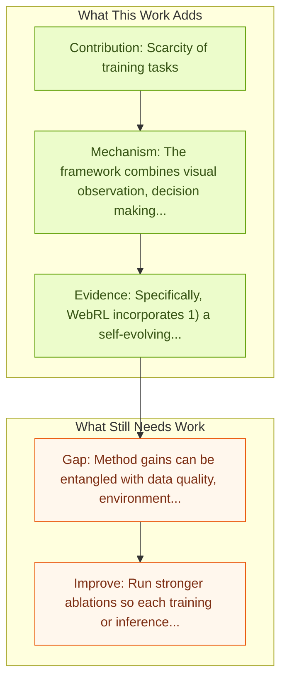

# WebRL: Self-Evolving Online Curriculum RL for Web Agents

Entry report generated on 2026-03-28 (Asia/Shanghai). This report is based on the repository entry, linked source metadata, and audit-time cross-checks.

## Snapshot

| Field | Detail |
| --- | --- |
| Repo entry | WebRL: Self-Evolving Online Curriculum RL for Web Agents |
| Actual target | [WebRL: Training LLM Web Agents via Self-Evolving Online Curriculum Reinforcement Learning](https://arxiv.org/abs/2411.02337) |
| Section | Methods and Techniques |
| Source location | `papers/methods/README.md:21` |
| Primary link type | `link` |
| Audit status | `ok` |
| Date / venue | ICLR 2025 |
| Authors | Zehan Qi, Xiao Liu, Iat Long Iong, Hanyu Lai, Xueqiao Sun, Wenyi Zhao, Yu Yang, Xinyue Yang, Jiadai Sun, Shuntian Yao, Tianjie Zhang, Wei Xu, Jie Tang, Yuxiao Dong |
| Focus tags | `method` `reinforcement-learning` `web` `curriculum` |
| Center of gravity | web |

## Quick Read

| Lens | Read |
| --- | --- |
| Problem pressure | Self-evolving online curriculum RL framework for web agents. |
| Most novel move | The method's clearest new move is self-evolving online curriculum RL framework for web agents. |
| Strongest evidence | Specifically, WebRL incorporates 1) a self-evolving curriculum that generates new tasks from unsuccessful attempts, 2) a robust... |
| Main caveat | Method gains can be entangled with data quality, environment choice, or evaluator assumptions if ablations are thin. |

## Visual Frame

```mermaid
flowchart LR
  Problem["Problem: Self-evolving online curriculum RL framework for web agents."] --> Novelty["Novelty: The method's clearest new move is self-evolving online..."]
  Novelty --> Framework["Framework: The framework combines visual observation, decision making..."]
  Framework --> Evidence["Evidence: Specifically, WebRL incorporates 1) a self-evolving..."]
  Evidence --> Gap["Gap: Method gains can be entangled with data quality, environment..."]
  Gap --> Next["Next: Run stronger ablations so each training or inference..."]
  classDef insight fill:#dbeafe,stroke:#2563eb,color:#0f172a;
  classDef risk fill:#fee2e2,stroke:#dc2626,color:#7f1d1d;
  classDef next fill:#dcfce7,stroke:#16a34a,color:#14532d;
  class Problem,Novelty,Framework insight;
  class Evidence insight;
  class Gap risk;
  class Next next;
```

## Analysis Map

## Executive Summary

Self-evolving online curriculum RL framework for web agents. Large language models (LLMs) have shown remarkable potential as autonomous agents, particularly in web-based tasks. However, existing LLM web agents heavily rely on expensive proprietary LLM APIs, while open LLMs lack the necessary decision-making capabilities. The paper introduces WebRL, a self-evolving online curriculum reinforcement learning framework designed to train high-performance web agents using open LLMs.

## Code and Supporting Artifacts

- Code repository: no dedicated code link is currently tracked in the repo entry.

## Novelty

- The method's clearest new move is self-evolving online curriculum RL framework for web agents.
- Large language models (LLMs) have shown remarkable potential as autonomous agents, particularly in web-based tasks.
- However, existing LLM web agents heavily rely on expensive proprietary LLM APIs, while open LLMs lack the necessary decision-making capabilities.

## Core Contributions

- Scarcity of training tasks
- Sparse feedback signals
- Policy distribution drift in online learning
- Self-evolving curriculum from unsuccessful attempts
- Robust outcome-supervised reward model (ORM)

## Framework and Operating Logic

- The framework combines visual observation, decision making, and action execution into a reusable control loop.
- The abstract indicates that the method should be read as a pipeline change rather than only a bigger base model.
- Large language models (LLMs) have shown remarkable potential as autonomous agents, particularly in web-based tasks.

## Evidence and Claimed Results

- Specifically, WebRL incorporates 1) a self-evolving curriculum that generates new tasks from unsuccessful attempts, 2) a robust outcome-supervised reward model (ORM), and 3) adaptive reinforcement learning strategies to ensure consistent improvements.
- We apply WebRL to transform open Llama-3.1 and GLM-4 models into proficient web agents.
- On WebArena-Lite, WebRL improves the success rate of Llama-3.1-8B from 4.8% to 42.4%, and from 6.1% to 43% for GLM-4-9B.
- These open models significantly surpass the performance of GPT-4-Turbo (17.6%) and GPT-4o (13.9%) and outperform previous state-of-the-art web agents trained on open LLMs (AutoWebGLM, 18.2%).

## Gaps and Limitations

- Method gains can be entangled with data quality, environment choice, or evaluator assumptions if ablations are thin.
- Better grounding or reflection does not automatically solve live websites, layout drift, and prompt-injection exposure.

## How To Improve

- Run stronger ablations so each training or inference component carries a clearly attributable gain.
- Stress-test the method on longer workflows and harder transfer settings involving live websites, layout drift, and prompt-injection exposure.
- Publish sharper failure analyses for the cases where the method improves one stage of control but still fails end-to-end.

## Why It Matters

- This entry matters because training and inference design often determine whether a capable base model can actually become a useful agent.
- It usually connects high-level capability claims to the data, tuning, or orchestration choices that make them work.

## Connections In This Repo

- [AgentTrek: Agent Trajectory Synthesis via Web Tutorials](agenttrek-agent-trajectory-synthesis-via-web-tutorials.md) - shared focus on web-agent realism, dynamic pages, or browser-side risk.
- [SeeAct: GPT-4V Web Agent via Visual Grounding](seeact-gpt-4v-web-agent-via-visual-grounding.md) - shared focus on web-agent realism, dynamic pages, or browser-side risk.
- [ActionEngine: From Reactive to Programmatic GUI Agents via State Machine Memory](actionengine-from-reactive-to-programmatic-gui-agents-via-state-machine-memory.md) - shared focus on web-agent realism, dynamic pages, or browser-side risk.
- [WebArena: Realistic Web Environment for Building Autonomous Agents](../benchmarks-and-datasets/webarena-realistic-web-environment-for-building-autonomous-agents.md) - shared focus on web-agent realism, dynamic pages, or browser-side risk.

## Source Basis

- Primary basis: abstract-level paper metadata plus the repo-local notes in the source Markdown file.
- Audit access note: Metadata resolved cleanly during the audit.
