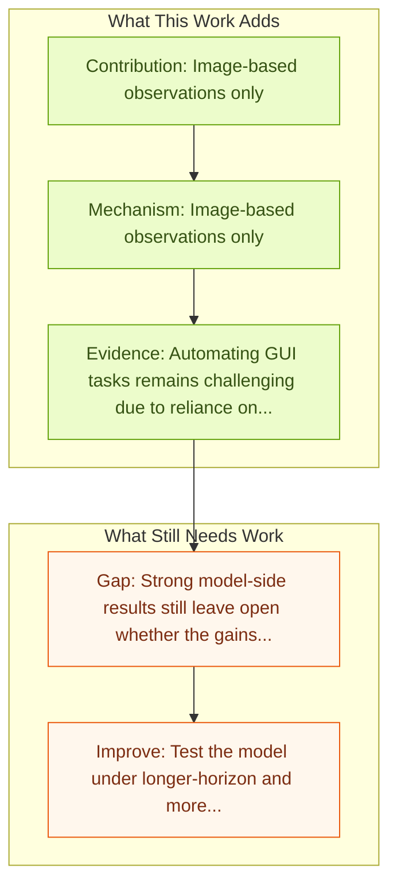

# AGUVIS: Unified Pure Vision Agents for GUI Interaction

Entry report generated on 2026-03-28 (Asia/Shanghai). This report is based on the repository entry, linked source metadata, and audit-time cross-checks.

## Snapshot

| Field | Detail |
| --- | --- |
| Repo entry | AGUVIS: Unified Pure Vision Agents for GUI Interaction |
| Actual target | [Aguvis: Unified Pure Vision Agents for Autonomous GUI Interaction](https://arxiv.org/abs/2412.04454) |
| Section | Models and Architectures |
| Source location | `papers/models/README.md:204` |
| Primary link type | `link` |
| Audit status | `ok` |
| Date / venue | ICML 2025 Poster |
| Authors | Yiheng Xu, Zekun Wang, Junli Wang, Dunjie Lu, Tianbao Xie, Amrita Saha, Doyen Sahoo, Tao Yu, Caiming Xiong |
| Focus tags | `model` `vision-only` `unified` `cross-platform` |
| Center of gravity | grounding |

## Quick Read

| Lens | Read |
| --- | --- |
| Problem pressure | Pure vision-based framework for autonomous GUI agents. |
| Most novel move | The architecture-level novelty is most visible in image-based observations only. |
| Strongest evidence | Automating GUI tasks remains challenging due to reliance on textual representations, platform-specific action spaces, and limited... |
| Main caveat | Strong model-side results still leave open whether the gains survive long-horizon transfer, recovery behavior, and distribution shift. |

## Visual Frame

```mermaid
flowchart LR
  Problem["Problem: Pure vision-based framework for autonomous GUI agents."] --> Novelty["Novelty: The architecture-level novelty is most visible in..."]
  Novelty --> Framework["Framework: Image-based observations only"]
  Framework --> Evidence["Evidence: Automating GUI tasks remains challenging due to reliance on..."]
  Evidence --> Gap["Gap: Strong model-side results still leave open whether the gains..."]
  Gap --> Next["Next: Test the model under longer-horizon and more..."]
  classDef insight fill:#dbeafe,stroke:#2563eb,color:#0f172a;
  classDef risk fill:#fee2e2,stroke:#dc2626,color:#7f1d1d;
  classDef next fill:#dcfce7,stroke:#16a34a,color:#14532d;
  class Problem,Novelty,Framework insight;
  class Evidence insight;
  class Gap risk;
  class Next next;
```

## Analysis Map

## Executive Summary

Pure vision-based framework for autonomous GUI agents. Automating GUI tasks remains challenging due to reliance on textual representations, platform-specific action spaces, and limited reasoning capabilities. We introduce Aguvis, a unified vision-based framework for autonomous GUI agents that directly operates on screen images, standardizes cross-platform interactions and incorporates structured reasoning via inner monologue. To enable this, we construct Aguvis Data Collection, a large-scale dataset with multimodal grounding and reasoning annotations, and develop a two-stage training pipeline that separates GUI grounding from planning and reasoning.

## Code and Supporting Artifacts

- Code repository: no dedicated code link is currently tracked in the repo entry.

## Novelty

- The architecture-level novelty is most visible in image-based observations only.
- It also stands out for consistent action space across platforms.
- It also stands out for large-scale trajectory dataset.

## Core Contributions

- Image-based observations only
- Consistent action space across platforms
- Large-scale trajectory dataset
- Automating GUI tasks remains challenging due to reliance on textual representations, platform-specific action spaces, and limited reasoning capabilities.

## Framework and Operating Logic

- Image-based observations only
- Consistent action space across platforms
- Large-scale trajectory dataset

## Evidence and Claimed Results

- Automating GUI tasks remains challenging due to reliance on textual representations, platform-specific action spaces, and limited reasoning capabilities.
- We introduce Aguvis, a unified vision-based framework for autonomous GUI agents that directly operates on screen images, standardizes cross-platform interactions and incorporates structured reasoning via inner monologue.
- To enable this, we construct Aguvis Data Collection, a large-scale dataset with multimodal grounding and reasoning annotations, and develop a two-stage training pipeline that separates GUI grounding from planning and reasoning.

## Gaps and Limitations

- Strong model-side results still leave open whether the gains survive long-horizon transfer, recovery behavior, and distribution shift.
- A stronger agent core does not by itself guarantee safer planning, error recovery, or tool-use discipline.

## How To Improve

- Test the model under longer-horizon and more safety-sensitive workloads rather than only narrow benchmark slices.
- Separate perception gains from planning gains with clearer studies over long-horizon transfer, recovery behavior, and distribution shift.
- Report richer failure modes, especially around recovery after an early grounding or reasoning error.

## Why It Matters

- This entry matters because architecture choices determine whether GUI understanding becomes reliable control rather than passive description.
- It also acts as a capability anchor that other benchmark and method papers in the repo can be read against.

## Connections In This Repo

- [CogAgent: A Visual Language Model for GUI Agents](cogagent-a-visual-language-model-for-gui-agents.md) - neighbor entry in the same models and architectures cluster.
- [ScaleCUA: Scaling Open-Source Computer Use Agents with Cross-Platform Data](scalecua-scaling-open-source-computer-use-agents-with-cross-platform-data.md) - neighbor entry in the same models and architectures cluster.
- [Mobile-Agent-v3.5: Multi-platform Fundamental GUI Agents](mobile-agent-v3-5-multi-platform-fundamental-gui-agents.md) - neighbor entry in the same models and architectures cluster.
- [OmniACT](../benchmarks-and-datasets/omniact.md) - benchmark pressure here is a natural proving ground for the model.

## Source Basis

- Primary basis: abstract-level paper metadata plus the repo-local notes in the source Markdown file.
- Audit access note: Metadata resolved cleanly during the audit.
