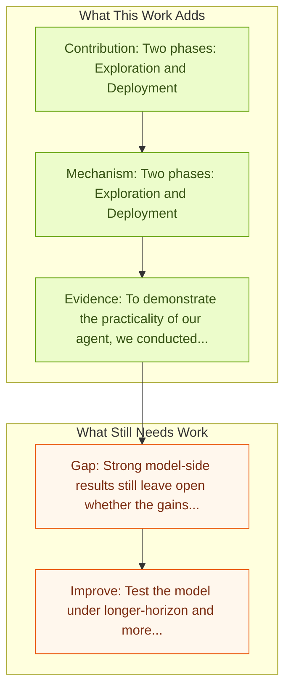

# AppAgent: Multimodal Agents as Smartphone Users

Entry report generated on 2026-03-28 (Asia/Shanghai). This report is based on the repository entry, linked source metadata, and audit-time cross-checks.

## Snapshot

| Field | Detail |
| --- | --- |
| Repo entry | AppAgent: Multimodal Agents as Smartphone Users |
| Actual target | [AppAgent: Multimodal Agents as Smartphone Users](https://arxiv.org/abs/2312.13771) |
| Section | Models and Architectures |
| Source location | `papers/models/README.md:116` |
| Primary link type | `link` |
| Audit status | `ok` |
| Date / venue | CHI 2025 |
| Authors | Chi Zhang, Zhao Yang, Jiaxuan Liu, Yucheng Han, Xin Chen, Zebiao Huang, Bin Fu, Gang Yu |
| Focus tags | `model` `mobile` `android` `learning` |
| Center of gravity | mobile |
| Code repo | [GitHub](https://github.com/TencentQQGYLab/AppAgent) |

## Quick Read

| Lens | Read |
| --- | --- |
| Problem pressure | LLM-based multimodal agent for smartphone operation. |
| Most novel move | The architecture-level novelty is most visible in two phases: Exploration and Deployment. |
| Strongest evidence | To demonstrate the practicality of our agent, we conducted extensive testing over 50 tasks in 10 different applications, including... |
| Main caveat | Strong model-side results still leave open whether the gains survive mobile interfaces, app transitions, and version drift. |

## Visual Frame

```mermaid
flowchart LR
  Problem["Problem: LLM-based multimodal agent for smartphone operation."] --> Novelty["Novelty: The architecture-level novelty is most visible in two..."]
  Novelty --> Framework["Framework: Two phases: Exploration and Deployment"]
  Framework --> Evidence["Evidence: To demonstrate the practicality of our agent, we conducted..."]
  Evidence --> Gap["Gap: Strong model-side results still leave open whether the gains..."]
  Gap --> Next["Next: Test the model under longer-horizon and more..."]
  classDef insight fill:#dbeafe,stroke:#2563eb,color:#0f172a;
  classDef risk fill:#fee2e2,stroke:#dc2626,color:#7f1d1d;
  classDef next fill:#dcfce7,stroke:#16a34a,color:#14532d;
  class Problem,Novelty,Framework insight;
  class Evidence insight;
  class Gap risk;
  class Next next;
```

## Analysis Map

## Executive Summary

LLM-based multimodal agent for smartphone operation. Recent advancements in large language models (LLMs) have led to the creation of intelligent agents capable of performing complex tasks. The paper introduces a novel LLM-based multimodal agent framework designed to operate smartphone applications. Our framework enables the agent to operate smartphone applications through a simplified action space, mimicking human-like interactions such as tapping and swiping.

## Code and Supporting Artifacts

- Code repository: [GitHub](https://github.com/TencentQQGYLab/AppAgent)

## Novelty

- The architecture-level novelty is most visible in two phases: Exploration and Deployment.
- It also stands out for learns through autonomous exploration or human demonstrations.
- It also stands out for generates knowledge base for task execution.

## Core Contributions

- Two phases: Exploration and Deployment
- Learns through autonomous exploration or human demonstrations
- Generates knowledge base for task execution
- Recent advancements in large language models (LLMs) have led to the creation of intelligent agents capable of performing complex tasks.

## Framework and Operating Logic

- Two phases: Exploration and Deployment
- Learns through autonomous exploration or human demonstrations
- Generates knowledge base for task execution

## Evidence and Claimed Results

- To demonstrate the practicality of our agent, we conducted extensive testing over 50 tasks in 10 different applications, including social media, email, maps, shopping, and sophisticated image editing tools.
- Recent advancements in large language models (LLMs) have led to the creation of intelligent agents capable of performing complex tasks.
- The paper introduces a novel LLM-based multimodal agent framework designed to operate smartphone applications.

## Gaps and Limitations

- Strong model-side results still leave open whether the gains survive mobile interfaces, app transitions, and version drift.
- A stronger agent core does not by itself guarantee safer planning, error recovery, or tool-use discipline.

## How To Improve

- Test the model under longer-horizon and more safety-sensitive workloads rather than only narrow benchmark slices.
- Separate perception gains from planning gains with clearer studies over mobile interfaces, app transitions, and version drift.
- Report richer failure modes, especially around recovery after an early grounding or reasoning error.

## Why It Matters

- This entry matters because architecture choices determine whether GUI understanding becomes reliable control rather than passive description.
- It also acts as a capability anchor that other benchmark and method papers in the repo can be read against.

## Connections In This Repo

- [AndroidWorld: Dynamic Benchmarking Environment](../benchmarks-and-datasets/androidworld-dynamic-benchmarking-environment.md) - shared focus on mobile GUI control and cross-app interaction constraints.
- [DigiRL: Training In-The-Wild Device-Control](../methods-and-techniques/digirl-training-in-the-wild-device-control.md) - shared focus on mobile GUI control and cross-app interaction constraints.
- [Mobile-Agent-v3: Fundamental Agents for GUI Automation](mobile-agent-v3-fundamental-agents-for-gui-automation.md) - shared focus on mobile GUI control and cross-app interaction constraints.
- [AutoGLM: Autonomous Foundation Agents for GUIs](autoglm-autonomous-foundation-agents-for-guis.md) - shared focus on mobile GUI control and cross-app interaction constraints.

## Source Basis

- Primary basis: abstract-level paper metadata plus the repo-local notes in the source Markdown file.
- Audit access note: Metadata resolved cleanly during the audit.
