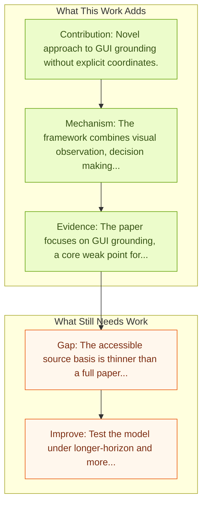

# GUI-Actor: Coordinate-Free Visual Grounding

Entry report generated on 2026-03-28 (Asia/Shanghai). This report is based on the repository entry, linked source metadata, and audit-time cross-checks.

## Snapshot

| Field | Detail |
| --- | --- |
| Repo entry | GUI-Actor: Coordinate-Free Visual Grounding |
| Actual target | [GUI-Actor: Coordinate-Free Visual Grounding for GUI Agents](https://microsoft.github.io/GUI-Actor/) |
| Section | Models and Architectures |
| Source location | `papers/models/README.md:227` |
| Primary link type | `link` |
| Audit status | `project-page` |
| Date / venue | June 2025 |
| Authors | Qianhui Wu, Kanzhi Cheng, Rui Yang, Chaoyun Zhang, Jianwei Yang, Huiqiang Jiang, Jian Mu, Baolin Peng, Bo Qiao, Reuben Tan, Si Qin, Lars Liden |
| Focus tags | `model` `grounding` `coordinate-free` `microsoft` |
| Center of gravity | grounding |

## Quick Read

| Lens | Read |
| --- | --- |
| Problem pressure | Novel approach to GUI grounding without explicit coordinates. |
| Most novel move | The architecture-level novelty is most visible in grounding. |
| Strongest evidence | The paper focuses on GUI grounding, a core weak point for VLM-based agents. |
| Main caveat | The accessible source basis is thinner than a full paper review, so some claims rest on project metadata, repo notes, or abstract-level... |

## Visual Frame

```mermaid
flowchart LR
  Problem["Problem: Novel approach to GUI grounding without explicit coordinates."] --> Novelty["Novelty: The architecture-level novelty is most visible in grounding."]
  Novelty --> Framework["Framework: The framework combines visual observation, decision making..."]
  Framework --> Evidence["Evidence: The paper focuses on GUI grounding, a core weak point for..."]
  Evidence --> Gap["Gap: The accessible source basis is thinner than a full paper..."]
  Gap --> Next["Next: Test the model under longer-horizon and more..."]
  classDef insight fill:#dbeafe,stroke:#2563eb,color:#0f172a;
  classDef risk fill:#fee2e2,stroke:#dc2626,color:#7f1d1d;
  classDef next fill:#dcfce7,stroke:#16a34a,color:#14532d;
  class Problem,Novelty,Framework insight;
  class Evidence insight;
  class Gap risk;
  class Next next;
```

## Analysis Map

## Executive Summary

Novel approach to GUI grounding without explicit coordinates. The paper focuses on GUI grounding, a core weak point for VLM-based agents. Instead of predicting screen coordinates as text, GUI-Actor introduces a coordinate-free action head that aligns a dedicated ACTOR token with relevant visual patch tokens, allowing the model to propose one or more action regions in one pass. A grounding verifier then scores the candidates and selects the most plausible region for execution.

## Code and Supporting Artifacts

- Code repository: no dedicated code link is currently tracked in the repo entry.

## Novelty

- The architecture-level novelty is most visible in grounding.
- The paper focuses on GUI grounding, a core weak point for VLM-based agents.
- Instead of predicting screen coordinates as text, GUI-Actor introduces a coordinate-free action head that aligns a dedicated ACTOR token with relevant visual patch tokens, allowing the model to propose one or more action regions in one pass.

## Core Contributions

- Novel approach to GUI grounding without explicit coordinates.
- The paper focuses on GUI grounding, a core weak point for VLM-based agents.
- Instead of predicting screen coordinates as text, GUI-Actor introduces a coordinate-free action head that aligns a dedicated ACTOR token with relevant visual patch tokens, allowing the model to propose one or more action regions in one pass.
- A grounding verifier then scores the candidates and selects the most plausible region for execution.

## Framework and Operating Logic

- The framework combines visual observation, decision making, and action execution into a reusable control loop.
- The paper focuses on GUI grounding, a core weak point for VLM-based agents.
- Instead of predicting screen coordinates as text, GUI-Actor introduces a coordinate-free action head that aligns a dedicated ACTOR token with relevant visual patch tokens, allowing the model to propose one or more action regions in one pass.

## Evidence and Claimed Results

- The paper focuses on GUI grounding, a core weak point for VLM-based agents.
- Instead of predicting screen coordinates as text, GUI-Actor introduces a coordinate-free action head that aligns a dedicated ACTOR token with relevant visual patch tokens, allowing the model to propose one or more action regions in one pass.
- A grounding verifier then scores the candidates and selects the most plausible region for execution.

## Gaps and Limitations

- The accessible source basis is thinner than a full paper review, so some claims rest on project metadata, repo notes, or abstract-level evidence rather than a complete methods read.
- Strong model-side results still leave open whether the gains survive precise element localization and recovery after grounding misses.
- A stronger agent core does not by itself guarantee safer planning, error recovery, or tool-use discipline.

## How To Improve

- Test the model under longer-horizon and more safety-sensitive workloads rather than only narrow benchmark slices.
- Separate perception gains from planning gains with clearer studies over precise element localization and recovery after grounding misses.
- Report richer failure modes, especially around recovery after an early grounding or reasoning error.

## Why It Matters

- This entry matters because architecture choices determine whether GUI understanding becomes reliable control rather than passive description.
- It also acts as a capability anchor that other benchmark and method papers in the repo can be read against.

## Connections In This Repo

- [OmniParser: Pure Vision Based GUI Agent](omniparser-pure-vision-based-gui-agent.md) - shared emphasis on precise UI localization and action placement.
- [SeeClick: Harnessing GUI Grounding for Advanced Visual GUI Agents](seeclick-harnessing-gui-grounding-for-advanced-visual-gui-agents.md) - shared emphasis on precise UI localization and action placement.
- [Ferret-UI: Grounded Mobile UI Understanding](ferret-ui-grounded-mobile-ui-understanding.md) - shared emphasis on precise UI localization and action placement.
- [R-VLM: Region-Aware VLM for Precise GUI Grounding](r-vlm-region-aware-vlm-for-precise-gui-grounding.md) - shared emphasis on precise UI localization and action placement.

## Source Basis

- Primary basis: Companion arXiv abstract used to complement the project-page entry.
- Audit access note: The repo points to a project page, so the report blends page metadata with repo-local notes and, where available, companion abstract-level metadata.
