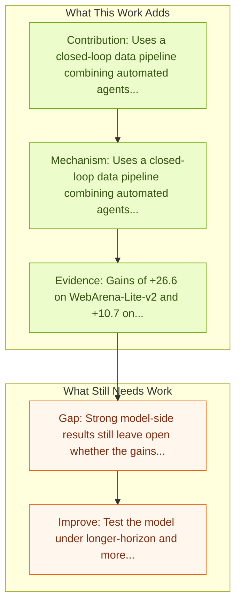

# ScaleCUA: Scaling Open-Source Computer Use Agents with Cross-Platform Data

Entry report generated on 2026-03-28 (Asia/Shanghai). This report is based on the repository entry, linked source metadata, and audit-time cross-checks.

## Snapshot

| Field | Detail |
| --- | --- |
| Repo entry | ScaleCUA: Scaling Open-Source Computer Use Agents with Cross-Platform Data |
| Actual target | [ScaleCUA: Scaling Open-Source Computer Use Agents with Cross-Platform Data](https://arxiv.org/abs/2509.15221) |
| Section | Models and Architectures |
| Source location | `papers/models/README.md:265` |
| Primary link type | `link` |
| Audit status | `ok` |
| Date / venue | September 2025 |
| Authors | Zhaoyang Liu, Jingjing Xie, Zichen Ding, Zehao Li, Bowen Yang, Zhenyu Wu, Xuehui Wang, Qiushi Sun, Shi Liu, Weiyun Wang, Shenglong Ye, Qingyun Li, Xuan Dong, Yue Yu, Chenyu Lu, YunXiang Mo, Yao Yan, Zeyue Tian, Xiao Zhang, Yuan Huang, Yiqian Liu, Weijie Su, Gen Luo, Xiangyu Yue, Biqing Qi, Kai Chen, Bowen Zhou, Yu Qiao, Qifeng Chen, Wenhai Wang |
| Focus tags | `model` `data-scaling` `cross-platform` `open-source` |
| Center of gravity | data-scaling, cross-platform, open-source |
| Code repo | [GitHub](https://github.com/OpenGVLab/ScaleCUA) |

## Quick Read

| Lens | Read |
| --- | --- |
| Problem pressure | Cross-platform open-source CUA trained on large-scale data spanning six operating systems. |
| Most novel move | The architecture-level novelty is most visible in uses a closed-loop data pipeline combining automated agents with human experts. |
| Strongest evidence | Gains of +26.6 on WebArena-Lite-v2 and +10.7 on ScreenSpot-Pro over reported baselines. |
| Main caveat | Strong model-side results still leave open whether the gains survive long-horizon transfer, recovery behavior, and distribution shift. |

## Visual Frame

```mermaid
flowchart LR
  Problem["Problem: Cross-platform open-source CUA trained on large-scale data..."] --> Novelty["Novelty: The architecture-level novelty is most visible in uses a..."]
  Novelty --> Framework["Framework: Uses a closed-loop data pipeline combining automated agents..."]
  Framework --> Evidence["Evidence: Gains of +26.6 on WebArena-Lite-v2 and +10.7 on..."]
  Evidence --> Gap["Gap: Strong model-side results still leave open whether the gains..."]
  Gap --> Next["Next: Test the model under longer-horizon and more..."]
  classDef insight fill:#dbeafe,stroke:#2563eb,color:#0f172a;
  classDef risk fill:#fee2e2,stroke:#dc2626,color:#7f1d1d;
  classDef next fill:#dcfce7,stroke:#16a34a,color:#14532d;
  class Problem,Novelty,Framework insight;
  class Evidence insight;
  class Gap risk;
  class Next next;
```

## Analysis Map

## Executive Summary

Cross-platform open-source CUA trained on large-scale data spanning six operating systems. Vision-Language Models (VLMs) have enabled computer use agents (CUAs) that operate GUIs autonomously, showing great potential, yet progress is limited by the lack of large-scale, open-source computer use data and foundation models. In this work, we introduce ScaleCUA, a step toward scaling open-source CUAs. It offers a large-scale dataset spanning 6 operating systems and 3 task domains, built via a closed-loop pipeline uniting automated agents with human experts.

## Code and Supporting Artifacts

- Code repository: [GitHub](https://github.com/OpenGVLab/ScaleCUA)

## Novelty

- The architecture-level novelty is most visible in uses a closed-loop data pipeline combining automated agents with human experts.
- Vision-Language Models (VLMs) have enabled computer use agents (CUAs) that operate GUIs autonomously, showing great potential, yet progress is limited by the lack of large-scale, open-source computer use data and foundation models.
- In this work, we introduce ScaleCUA, a step toward scaling open-source CUAs.

## Core Contributions

- Uses a closed-loop data pipeline combining automated agents with human experts.
- Vision-Language Models (VLMs) have enabled computer use agents (CUAs) that operate GUIs autonomously, showing great potential, yet progress is limited by the lack of large-scale, open-source computer use data and foundation models.
- In this work, we introduce ScaleCUA, a step toward scaling open-source CUAs.
- It offers a large-scale dataset spanning 6 operating systems and 3 task domains, built via a closed-loop pipeline uniting automated agents with human experts.

## Framework and Operating Logic

- Uses a closed-loop data pipeline combining automated agents with human experts.
- Vision-Language Models (VLMs) have enabled computer use agents (CUAs) that operate GUIs autonomously, showing great potential, yet progress is limited by the lack of large-scale, open-source computer use data and foundation models.
- In this work, we introduce ScaleCUA, a step toward scaling open-source CUAs.

## Evidence and Claimed Results

- Gains of +26.6 on WebArena-Lite-v2 and +10.7 on ScreenSpot-Pro over reported baselines.
- Reports 94.4% on MMBench-GUI L1-Hard, 60.6% on OSWorld-G, and 47.4% on WebArena-Lite-v2.
- It offers a large-scale dataset spanning 6 operating systems and 3 task domains, built via a closed-loop pipeline uniting automated agents with human experts.
- Specifically, it delivers strong gains over baselines (+26.6 on WebArena-Lite-v2, +10.7 on ScreenSpot-Pro) and sets new state-of-the-art results (94.4% on MMBench-GUI L1-Hard, 60.6% on OSWorld-G, 47.4% on WebArena-Lite-v2).

## Gaps and Limitations

- Strong model-side results still leave open whether the gains survive long-horizon transfer, recovery behavior, and distribution shift.
- A stronger agent core does not by itself guarantee safer planning, error recovery, or tool-use discipline.

## How To Improve

- Test the model under longer-horizon and more safety-sensitive workloads rather than only narrow benchmark slices.
- Separate perception gains from planning gains with clearer studies over long-horizon transfer, recovery behavior, and distribution shift.
- Report richer failure modes, especially around recovery after an early grounding or reasoning error.

## Why It Matters

- This entry matters because architecture choices determine whether GUI understanding becomes reliable control rather than passive description.
- It also acts as a capability anchor that other benchmark and method papers in the repo can be read against.

## Connections In This Repo

- [CogAgent: A Visual Language Model for GUI Agents](cogagent-a-visual-language-model-for-gui-agents.md) - neighbor entry in the same models and architectures cluster.
- [AutoGLM: Autonomous Foundation Agents for GUIs](autoglm-autonomous-foundation-agents-for-guis.md) - neighbor entry in the same models and architectures cluster.
- [AGUVIS: Unified Pure Vision Agents for GUI Interaction](aguvis-unified-pure-vision-agents-for-gui-interaction.md) - neighbor entry in the same models and architectures cluster.
- [OpenCUA: Open Foundations for Computer-Use Agents](opencua-open-foundations-for-computer-use-agents.md) - neighbor entry in the same models and architectures cluster.

## Source Basis

- Primary basis: Primary arXiv abstract metadata was fetched live from the linked paper page.
- Audit access note: Metadata resolved cleanly during the audit.
