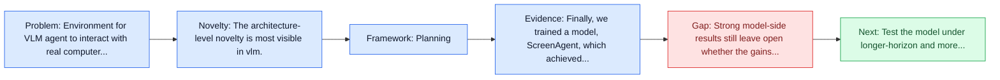
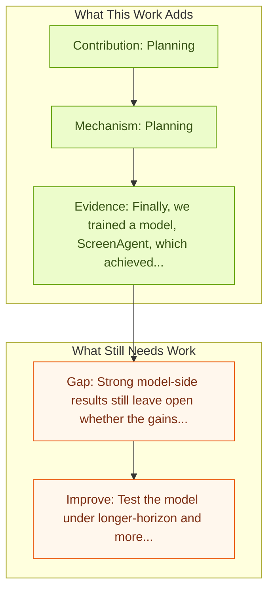

# ScreenAgent: A VLM-driven Computer Control Agent

Entry report generated on 2026-03-28 (Asia/Shanghai). This report is based on the repository entry, linked source metadata, and audit-time cross-checks.

## Snapshot

| Field | Detail |
| --- | --- |
| Repo entry | ScreenAgent: A VLM-driven Computer Control Agent |
| Actual target | [ScreenAgent: A Vision Language Model-driven Computer Control Agent](https://arxiv.org/abs/2402.07945) |
| Section | Models and Architectures |
| Source location | `papers/models/README.md:66` |
| Primary link type | `link` |
| Audit status | `ok` |
| Date / venue | IJCAI 2024 |
| Authors | Runliang Niu, Jindong Li, Shiqi Wang, Yali Fu, Xiyu Hu, Xueyuan Leng, He Kong, Yi Chang, Qi Wang |
| Focus tags | `model` `vlm` `control` `pipeline` |
| Center of gravity | desktop, grounding |
| Code repo | [GitHub](https://github.com/niuzaisheng/ScreenAgent) |

## Quick Read

| Lens | Read |
| --- | --- |
| Problem pressure | Environment for VLM agent to interact with real computer screens. |
| Most novel move | The architecture-level novelty is most visible in vlm. |
| Strongest evidence | Finally, we trained a model, ScreenAgent, which achieved computer control capabilities comparable to GPT-4V and demonstrated more... |
| Main caveat | Strong model-side results still leave open whether the gains survive long-horizon transfer, recovery behavior, and distribution shift. |

## Visual Frame

## Analysis Map

## Executive Summary

Environment for VLM agent to interact with real computer screens. Existing Large Language Models (LLM) can invoke a variety of tools and APIs to complete complex tasks. The computer, as the most powerful and universal tool, could potentially be controlled directly by a trained LLM agent. Powered by the computer, we can hopefully build a more generalized agent to assist humans in various daily digital works.

## Code and Supporting Artifacts

- Code repository: [GitHub](https://github.com/niuzaisheng/ScreenAgent)

## Novelty

- The architecture-level novelty is most visible in vlm.
- Existing Large Language Models (LLM) can invoke a variety of tools and APIs to complete complex tasks.
- The computer, as the most powerful and universal tool, could potentially be controlled directly by a trained LLM agent.

## Core Contributions

- Planning
- Acting
- Reflecting
- Existing Large Language Models (LLM) can invoke a variety of tools and APIs to complete complex tasks.

## Framework and Operating Logic

- Planning
- Acting
- Reflecting

## Evidence and Claimed Results

- Finally, we trained a model, ScreenAgent, which achieved computer control capabilities comparable to GPT-4V and demonstrated more precise UI positioning capabilities.
- Existing Large Language Models (LLM) can invoke a variety of tools and APIs to complete complex tasks.
- The computer, as the most powerful and universal tool, could potentially be controlled directly by a trained LLM agent.

## Gaps and Limitations

- Strong model-side results still leave open whether the gains survive long-horizon transfer, recovery behavior, and distribution shift.
- A stronger agent core does not by itself guarantee safer planning, error recovery, or tool-use discipline.

## How To Improve

- Test the model under longer-horizon and more safety-sensitive workloads rather than only narrow benchmark slices.
- Separate perception gains from planning gains with clearer studies over long-horizon transfer, recovery behavior, and distribution shift.
- Report richer failure modes, especially around recovery after an early grounding or reasoning error.

## Why It Matters

- This entry matters because architecture choices determine whether GUI understanding becomes reliable control rather than passive description.
- It also acts as a capability anchor that other benchmark and method papers in the repo can be read against.

## Connections In This Repo

- [CogAgent: A Visual Language Model for GUI Agents](cogagent-a-visual-language-model-for-gui-agents.md) - neighbor entry in the same models and architectures cluster.
- [Qwen2.5-VL Technical Report](qwen2-5-vl-technical-report.md) - neighbor entry in the same models and architectures cluster.
- [Attacking Vision-Language Computer Agents via Pop-ups](../safety-and-security/attacking-vision-language-computer-agents-via-pop-ups.md) - the papers sit in the same local research cluster in this repository.
- [UI-TARS: Pioneering Automated GUI Interaction with Native Agents](ui-tars-pioneering-automated-gui-interaction-with-native-agents.md) - neighbor entry in the same models and architectures cluster.

## Source Basis

- Primary basis: abstract-level paper metadata plus the repo-local notes in the source Markdown file.
- Audit access note: Metadata resolved cleanly during the audit.
