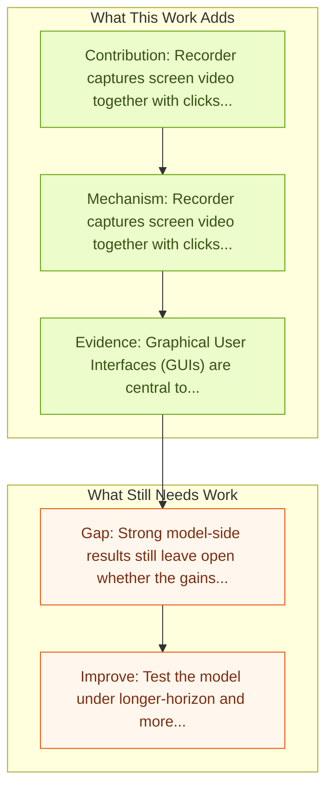

# ShowUI-Aloha: Human-Taught GUI Agent

Entry report generated on 2026-03-28 (Asia/Shanghai). This report is based on the repository entry, linked source metadata, and audit-time cross-checks.

## Snapshot

| Field | Detail |
| --- | --- |
| Repo entry | ShowUI-Aloha: Human-Taught GUI Agent |
| Actual target | [ShowUI-Aloha: Human-Taught GUI Agent](https://arxiv.org/abs/2601.07181) |
| Section | Models and Architectures |
| Source location | `papers/models/README.md:301` |
| Primary link type | `link` |
| Audit status | `ok` |
| Date / venue | January 2026 |
| Authors | Yichun Zhang, Xiangwu Guo, Yauhong Goh, Jessica Hu, Zhiheng Chen, Xin Wang, Difei Gao, Mike Zheng Shou |
| Focus tags | `model` `human-demonstrations` `desktop` `data-pipeline` |
| Center of gravity | human-demonstrations, desktop, data-pipeline |

## Quick Read

| Lens | Read |
| --- | --- |
| Problem pressure | Human-taught GUI agent pipeline that learns from in-the-wild desktop screen recordings. |
| Most novel move | The architecture-level novelty is most visible in recorder captures screen video together with clicks, keystrokes, and scrolls. |
| Strongest evidence | Graphical User Interfaces (GUIs) are central to human-computer interaction, yet automating complex GUI tasks remains a major challenge... |
| Main caveat | Strong model-side results still leave open whether the gains survive desktop heterogeneity, long workflows, and OS-level side effects. |

## Visual Frame

```mermaid
flowchart LR
  Problem["Problem: Human-taught GUI agent pipeline that learns from in-the-wild..."] --> Novelty["Novelty: The architecture-level novelty is most visible in recorder..."]
  Novelty --> Framework["Framework: Recorder captures screen video together with clicks..."]
  Framework --> Evidence["Evidence: Graphical User Interfaces (GUIs) are central to..."]
  Evidence --> Gap["Gap: Strong model-side results still leave open whether the gains..."]
  Gap --> Next["Next: Test the model under longer-horizon and more..."]
  classDef insight fill:#dbeafe,stroke:#2563eb,color:#0f172a;
  classDef risk fill:#fee2e2,stroke:#dc2626,color:#7f1d1d;
  classDef next fill:#dcfce7,stroke:#16a34a,color:#14532d;
  class Problem,Novelty,Framework insight;
  class Evidence insight;
  class Gap risk;
  class Next next;
```

## Analysis Map

## Executive Summary

Human-taught GUI agent pipeline that learns from in-the-wild desktop screen recordings. Graphical User Interfaces (GUIs) are central to human-computer interaction, yet automating complex GUI tasks remains a major challenge for autonomous agents, largely due to a lack of scalable, high-quality training data. While recordings of human demonstrations offer a rich data source, they are typically long, unstructured, and lack annotations, making them difficult for agents to learn from.To address this, we introduce ShowUI-Aloha, a comprehensive pipeline that transforms unstructured, in-the-wild human screen recordings from desktop environments into structured, actionable tasks. Our framework includes four key components: A recorder that captures screen video along with precise user interactions like mouse clicks, keystrokes, and scrolls.

## Code and Supporting Artifacts

- Code repository: no dedicated code link is currently tracked in the repo entry.

## Novelty

- The architecture-level novelty is most visible in recorder captures screen video together with clicks, keystrokes, and scrolls.
- It also stands out for learner converts raw interactions into descriptive task annotations.
- It also stands out for planner and executor turn parsed demonstrations into high-level plans and OS-level actions with safety checks.

## Core Contributions

- Recorder captures screen video together with clicks, keystrokes, and scrolls.
- Learner converts raw interactions into descriptive task annotations.
- Planner and executor turn parsed demonstrations into high-level plans and OS-level actions with safety checks.
- Graphical User Interfaces (GUIs) are central to human-computer interaction, yet automating complex GUI tasks remains a major challenge for autonomous agents, largely due to a lack of scalable, high-quality training data.

## Framework and Operating Logic

- Recorder captures screen video together with clicks, keystrokes, and scrolls.
- Learner converts raw interactions into descriptive task annotations.
- Planner and executor turn parsed demonstrations into high-level plans and OS-level actions with safety checks.

## Evidence and Claimed Results

- Graphical User Interfaces (GUIs) are central to human-computer interaction, yet automating complex GUI tasks remains a major challenge for autonomous agents, largely due to a lack of scalable, high-quality training data.
- While recordings of human demonstrations offer a rich data source, they are typically long, unstructured, and lack annotations, making them difficult for agents to learn from.To address this, we introduce ShowUI-Aloha, a comprehensive pipeline that transforms unstructured, in-the-wild human screen recordings from desktop environments into structured, actionable tasks.
- Our framework includes four key components: A recorder that captures screen video along with precise user interactions like mouse clicks, keystrokes, and scrolls.

## Gaps and Limitations

- Strong model-side results still leave open whether the gains survive desktop heterogeneity, long workflows, and OS-level side effects.
- A stronger agent core does not by itself guarantee safer planning, error recovery, or tool-use discipline.

## How To Improve

- Test the model under longer-horizon and more safety-sensitive workloads rather than only narrow benchmark slices.
- Separate perception gains from planning gains with clearer studies over desktop heterogeneity, long workflows, and OS-level side effects.
- Report richer failure modes, especially around recovery after an early grounding or reasoning error.

## Why It Matters

- This entry matters because architecture choices determine whether GUI understanding becomes reliable control rather than passive description.
- It also acts as a capability anchor that other benchmark and method papers in the repo can be read against.

## Connections In This Repo

- [CUA-Suite: Expert Trajectories and Pixel-Precise Grounding for Computer-use Agents](../benchmarks-and-datasets/cua-suite-expert-trajectories-and-pixel-precise-grounding-for-computer-use-agents.md) - shared desktop or OS-level interaction surface.
- [Grounding Computer Use Agents on Human Demonstrations](../methods-and-techniques/grounding-computer-use-agents-on-human-demonstrations.md) - shared desktop or OS-level interaction surface.
- [OpenCUA: Open Foundations for Computer-Use Agents](opencua-open-foundations-for-computer-use-agents.md) - shared desktop or OS-level interaction surface.
- [Mobile-Agent-v3.5: Multi-platform Fundamental GUI Agents](mobile-agent-v3-5-multi-platform-fundamental-gui-agents.md) - shared desktop or OS-level interaction surface.

## Source Basis

- Primary basis: Primary arXiv abstract metadata was fetched live from the linked paper page.
- Audit access note: Metadata resolved cleanly during the audit.
