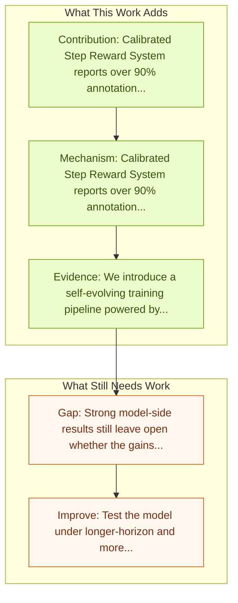

# Step-GUI Technical Report

Entry report generated on 2026-03-28 (Asia/Shanghai). This report is based on the repository entry, linked source metadata, and audit-time cross-checks.

## Snapshot

| Field | Detail |
| --- | --- |
| Repo entry | Step-GUI Technical Report |
| Actual target | [Step-GUI Technical Report](https://arxiv.org/abs/2512.15431) |
| Section | Models and Architectures |
| Source location | `papers/models/README.md:237` |
| Primary link type | `link` |
| Audit status | `ok` |
| Date / venue | December 2025 |
| Authors | Haolong Yan, Jia Wang, Xin Huang, Yeqing Shen, Ziyang Meng, Zhimin Fan, Kaijun Tan, Jin Gao, Lieyu Shi, Mi Yang, Shiliang Yang, Zhirui Wang, Brian Li, Kang An, Chenyang Li, Lei Lei, Mengmeng Duan, Danxun Liang, Guodong Liu, Hang Cheng, Hao Wu, Jie Dong, Junhao Huang, Mei Chen, Renjie Yu, Shunshan Li, Xu Zhou, Yiting Dai, Yineng Deng, Yingdan Liang, Zelin Chen, Wen Sun, Chengxu Yan, Chunqin Xu, Dong Li, Fengqiong Xiao, Guanghao Fan, Guopeng Li, Guozhen Peng, Hongbing Li, Hang Li, Hongming Chen, Jingjing Xie, Jianyong Li, Jingyang Zhang, Jiaju Ren, Jiayu Yuan, Jianpeng Yin, Kai Cao, Liang Zhao, Liguo Tan, Liying Shi, Mengqiang Ren, Min Xu, Manjiao Liu, Mao Luo, Mingxin Wan, Na Wang, Nan Wu, Ning Wang, Peiyao Ma, Qingzhou Zhang, Qiao Wang, Qinlin Zeng, Qiong Gao, Qiongyao Li, Shangwu Zhong, Shuli Gao, Shaofan Liu, Shisi Gao, Shuang Luo, Xingbin Liu, Xiaojia Liu, Xiaojie Hou, Xin Liu, Xuanti Feng, Xuedan Cai, Xuan Wen, Xianwei Zhu, Xin Liang, Xin Liu, Xin Zhou, Yifan Sui, Yingxiu Zhao, Yukang Shi, Yunfang Xu, Yuqing Zeng, Yixun Zhang, Zejia Weng, Zhonghao Yan, Zhiguo Huang, Zhuoyu Wang, Zihan Yan, Zheng Ge, Jing Li, Yibo Zhu, Binxing Jiao, Xiangyu Zhang, Daxin Jiang |
| Focus tags | `model` `training-pipeline` `mcp` `android` |
| Center of gravity | training-pipeline, mcp, android |

## Quick Read

| Lens | Read |
| --- | --- |
| Problem pressure | Self-evolving GUI agent family with calibrated step rewards, GUI-MCP, and AndroidDaily. |
| Most novel move | The architecture-level novelty is most visible in calibrated Step Reward System reports over 90% annotation accuracy with 10-100x lower... |
| Strongest evidence | We introduce a self-evolving training pipeline powered by the Calibrated Step Reward System, which converts model-generated trajectories... |
| Main caveat | Strong model-side results still leave open whether the gains survive mobile interfaces, app transitions, and version drift. |

## Visual Frame

```mermaid
flowchart LR
  Problem["Problem: Self-evolving GUI agent family with calibrated step rewards..."] --> Novelty["Novelty: The architecture-level novelty is most visible in calibrated..."]
  Novelty --> Framework["Framework: Calibrated Step Reward System reports over 90% annotation..."]
  Framework --> Evidence["Evidence: We introduce a self-evolving training pipeline powered by..."]
  Evidence --> Gap["Gap: Strong model-side results still leave open whether the gains..."]
  Gap --> Next["Next: Test the model under longer-horizon and more..."]
  classDef insight fill:#dbeafe,stroke:#2563eb,color:#0f172a;
  classDef risk fill:#fee2e2,stroke:#dc2626,color:#7f1d1d;
  classDef next fill:#dcfce7,stroke:#16a34a,color:#14532d;
  class Problem,Novelty,Framework insight;
  class Evidence insight;
  class Gap risk;
  class Next next;
```

## Analysis Map

## Executive Summary

Self-evolving GUI agent family with calibrated step rewards, GUI-MCP, and AndroidDaily. Recent advances in multimodal large language models unlock unprecedented opportunities for GUI automation. However, a fundamental challenge remains: how to efficiently acquire high-quality training data while maintaining annotation reliability? We introduce a self-evolving training pipeline powered by the Calibrated Step Reward System, which converts model-generated trajectories into reliable training signals through trajectory-level calibration, achieving >90% annotation accuracy with 10-100x lower cost.

## Code and Supporting Artifacts

- Code repository: no dedicated code link is currently tracked in the repo entry.

## Novelty

- The architecture-level novelty is most visible in calibrated Step Reward System reports over 90% annotation accuracy with 10-100x lower labeling cost.
- It also stands out for step-GUI 8B reports 80.2% on AndroidWorld, 48.5% on OSWorld, and 62.6% on ScreenSpot-Pro.
- It also stands out for introduces GUI-MCP for privacy-aware hierarchical GUI automation and AndroidDaily for real-world mobile usage.

## Core Contributions

- Calibrated Step Reward System reports over 90% annotation accuracy with 10-100x lower labeling cost.
- Step-GUI 8B reports 80.2% on AndroidWorld, 48.5% on OSWorld, and 62.6% on ScreenSpot-Pro.
- Introduces GUI-MCP for privacy-aware hierarchical GUI automation and AndroidDaily for real-world mobile usage.
- Recent advances in multimodal large language models unlock unprecedented opportunities for GUI automation.

## Framework and Operating Logic

- Calibrated Step Reward System reports over 90% annotation accuracy with 10-100x lower labeling cost.
- Step-GUI 8B reports 80.2% on AndroidWorld, 48.5% on OSWorld, and 62.6% on ScreenSpot-Pro.
- Introduces GUI-MCP for privacy-aware hierarchical GUI automation and AndroidDaily for real-world mobile usage.

## Evidence and Claimed Results

- We introduce a self-evolving training pipeline powered by the Calibrated Step Reward System, which converts model-generated trajectories into reliable training signals through trajectory-level calibration, achieving >90% annotation accuracy with 10-100x lower cost.
- Leveraging this pipeline, we introduce Step-GUI, a family of models (4B/8B) that achieves state-of-the-art GUI performance (8B: 80.2% AndroidWorld, 48.5% OSWorld, 62.6% ScreenShot-Pro) while maintaining robust general capabilities.
- Finally, to assess whether agents can handle authentic everyday usage, we introduce AndroidDaily, a benchmark grounded in real-world mobile usage patterns with 3146 static actions and 235 end-to-end tasks across high-frequency daily scenarios (8B: static 89.91%, end-to-end 52.50%).

## Gaps and Limitations

- Strong model-side results still leave open whether the gains survive mobile interfaces, app transitions, and version drift.
- A stronger agent core does not by itself guarantee safer planning, error recovery, or tool-use discipline.

## How To Improve

- Test the model under longer-horizon and more safety-sensitive workloads rather than only narrow benchmark slices.
- Separate perception gains from planning gains with clearer studies over mobile interfaces, app transitions, and version drift.
- Report richer failure modes, especially around recovery after an early grounding or reasoning error.

## Why It Matters

- This entry matters because architecture choices determine whether GUI understanding becomes reliable control rather than passive description.
- It also acts as a capability anchor that other benchmark and method papers in the repo can be read against.

## Connections In This Repo

- [AppAgent: Multimodal Agents as Smartphone Users](appagent-multimodal-agents-as-smartphone-users.md) - shared focus on mobile GUI control and cross-app interaction constraints.
- [AndroidWorld: Dynamic Benchmarking Environment](../benchmarks-and-datasets/androidworld-dynamic-benchmarking-environment.md) - shared focus on mobile GUI control and cross-app interaction constraints.
- [Android in the Wild (AitW)](../benchmarks-and-datasets/android-in-the-wild-aitw.md) - shared focus on mobile GUI control and cross-app interaction constraints.
- [AMEX: Android Multi-annotation EXpo](../benchmarks-and-datasets/amex-android-multi-annotation-expo.md) - shared focus on mobile GUI control and cross-app interaction constraints.

## Source Basis

- Primary basis: Primary arXiv abstract metadata was fetched live from the linked paper page.
- Audit access note: Metadata resolved cleanly during the audit.
