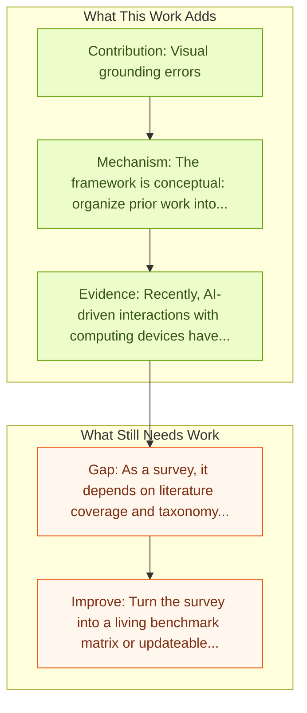

# JARVIS or Ultron? Safety and Security Threats of Computer-Using Agents

Entry report generated on 2026-03-28 (Asia/Shanghai). This report is based on the repository entry, linked source metadata, and audit-time cross-checks.

## Snapshot

| Field | Detail |
| --- | --- |
| Repo entry | JARVIS or Ultron? Safety and Security Threats of Computer-Using Agents |
| Actual target | [A Survey on the Safety and Security Threats of Computer-Using Agents: JARVIS or Ultron?](https://arxiv.org/abs/2505.10924) |
| Section | Survey Papers |
| Source location | `papers/surveys/README.md:72` |
| Primary link type | `link` |
| Audit status | `ok` |
| Date / venue | May 2025 |
| Authors | Ada Chen, Yongjiang Wu, Junyuan Zhang, Jingyu Xiao, Shu Yang, Jen-tse Huang, Kun Wang, Wenxuan Wang, Shuai Wang |
| Focus tags | `survey` `safety` `security` `threats` |
| Center of gravity | web, desktop, mobile |

## Quick Read

| Lens | Read |
| --- | --- |
| Problem pressure | Comprehensive survey on safety and security concerns specific to computer-using agents. |
| Most novel move | The novelty is synthetic rather than model-side: the paper tries to stabilize a fast-moving literature around threats, threat categories. |
| Strongest evidence | Recently, AI-driven interactions with computing devices have advanced from basic prototype tools to sophisticated, LLM-based systems... |
| Main caveat | As a survey, it depends on literature coverage and taxonomy quality more than on new experimental validation. |

## Visual Frame

```mermaid
flowchart LR
  Problem["Problem: Comprehensive survey on safety and security concerns..."] --> Novelty["Novelty: The novelty is synthetic rather than model-side: the paper..."]
  Novelty --> Framework["Framework: The framework is conceptual: organize prior work into..."]
  Framework --> Evidence["Evidence: Recently, AI-driven interactions with computing devices have..."]
  Evidence --> Gap["Gap: As a survey, it depends on literature coverage and taxonomy..."]
  Gap --> Next["Next: Turn the survey into a living benchmark matrix or updateable..."]
  classDef insight fill:#dbeafe,stroke:#2563eb,color:#0f172a;
  classDef risk fill:#fee2e2,stroke:#dc2626,color:#7f1d1d;
  classDef next fill:#dcfce7,stroke:#16a34a,color:#14532d;
  class Problem,Novelty,Framework insight;
  class Evidence insight;
  class Gap risk;
  class Next next;
```

## Analysis Map

## Executive Summary

Comprehensive survey on safety and security concerns specific to computer-using agents. Recently, AI-driven interactions with computing devices have advanced from basic prototype tools to sophisticated, LLM-based systems that emulate human-like operations in graphical user interfaces. We are now witnessing the emergence of \emph{Computer-Using Agents} (CUAs), capable of autonomously performing tasks such as navigating desktop applications, web pages, and mobile apps. However, as these agents grow in capability, they also introduce novel safety and security risks.

## Code and Supporting Artifacts

- Code repository: no dedicated code link is currently tracked in the repo entry.

## Novelty

- The novelty is synthetic rather than model-side: the paper tries to stabilize a fast-moving literature around threats, threat categories.
- Recently, AI-driven interactions with computing devices have advanced from basic prototype tools to sophisticated, LLM-based systems that emulate human-like operations in graphical user interfaces.
- We are now witnessing the emergence of \emph{Computer-Using Agents} (CUAs), capable of autonomously performing tasks such as navigating desktop applications, web pages, and mobile apps.

## Core Contributions

- Visual grounding errors
- Response delays
- UI interpretation pitfalls
- Adversarial attacks
- Jailbreak strategies in GUI environments

## Framework and Operating Logic

- The framework is conceptual: organize prior work into categories, then compare assumptions, metrics, and open problems.
- Recently, AI-driven interactions with computing devices have advanced from basic prototype tools to sophisticated, LLM-based systems that emulate human-like operations in graphical user interfaces.
- We are now witnessing the emergence of \emph{Computer-Using Agents} (CUAs), capable of autonomously performing tasks such as navigating desktop applications, web pages, and mobile apps.

## Evidence and Claimed Results

- Recently, AI-driven interactions with computing devices have advanced from basic prototype tools to sophisticated, LLM-based systems that emulate human-like operations in graphical user interfaces.
- We are now witnessing the emergence of \emph{Computer-Using Agents} (CUAs), capable of autonomously performing tasks such as navigating desktop applications, web pages, and mobile apps.
- However, as these agents grow in capability, they also introduce novel safety and security risks.

## Gaps and Limitations

- As a survey, it depends on literature coverage and taxonomy quality more than on new experimental validation.
- Fast-moving agent releases can age the benchmark map or architecture taxonomy quickly.

## How To Improve

- Turn the survey into a living benchmark matrix or updateable appendix so it stays useful as the field changes.
- Separate capability, safety, and deployment-readiness lenses more sharply so the taxonomy can guide applied system design.
- Add clearer links between benchmark choice and the failure modes practitioners should expect in real deployments.

## Why It Matters

- This entry matters because the repository is large enough that a good field map saves readers from rediscovering the same bottlenecks paper by paper.
- It also helps turn the repo from a list of links into a navigable research landscape.

## Connections In This Repo

- [JARVIS or Ultron? Safety and Security Threats of CUAs](../safety-and-security/jarvis-or-ultron-safety-and-security-threats-of-cuas.md) - shared concern with adversarial behavior, guardrails, or deployment risk.
- [AI Agents Under Threat: Key Security Challenges and Future Pathways](../safety-and-security/ai-agents-under-threat-key-security-challenges-and-future-pathways.md) - shared concern with adversarial behavior, guardrails, or deployment risk.
- [AgentHarm: LLM Agent Safety Benchmark](../safety-and-security/agentharm-llm-agent-safety-benchmark.md) - shared concern with adversarial behavior, guardrails, or deployment risk.
- [WebGuard: Safety Dataset for Web Agents](../safety-and-security/webguard-safety-dataset-for-web-agents.md) - shared concern with adversarial behavior, guardrails, or deployment risk.

## Source Basis

- Primary basis: abstract-level paper metadata plus the repo-local notes in the source Markdown file.
- Audit access note: Metadata resolved cleanly during the audit.
