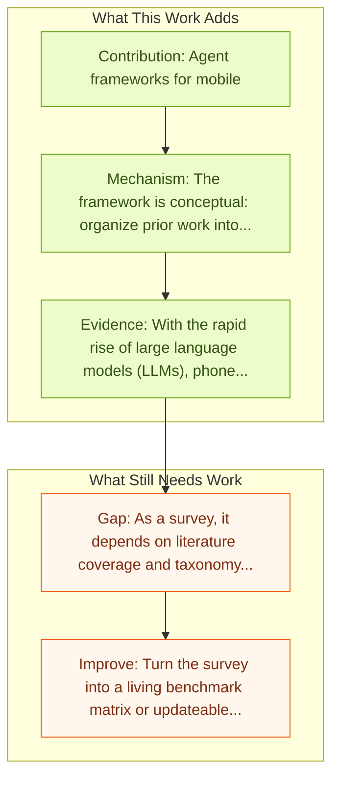

# LLM-Powered GUI Agents in Phone Automation

Entry report generated on 2026-03-28 (Asia/Shanghai). This report is based on the repository entry, linked source metadata, and audit-time cross-checks.

## Snapshot

| Field | Detail |
| --- | --- |
| Repo entry | LLM-Powered GUI Agents in Phone Automation |
| Actual target | [LLM-Powered GUI Agents in Phone Automation: Surveying Progress and Prospects](https://arxiv.org/abs/2504.19838) |
| Section | Survey Papers |
| Source location | `papers/surveys/README.md:56` |
| Primary link type | `link` |
| Audit status | `ok` |
| Date / venue | TMLR 2025 |
| Authors | Guangyi Liu, Pengxiang Zhao, Yaozhen Liang, Liang Liu, Yaxuan Guo, Han Xiao, Weifeng Lin, Yuxiang Chai, Yue Han, Shuai Ren, Hao Wang, Xiaoyu Liang, WenHao Wang, Tianze Wu, Zhengxi Lu, Siheng Chen,  LiLinghao, Hao Wang, Guanjing Xiong, Yong Liu, Hongsheng Li |
| Focus tags | `survey` `mobile` `phone` `automation` |
| Center of gravity | mobile, safety |

## Quick Read

| Lens | Read |
| --- | --- |
| Problem pressure | Systematically reviews LLM-driven phone GUI agents, highlighting their evolution from script-based automation to intelligent, adaptive... |
| Most novel move | The novelty is synthetic rather than model-side: the paper tries to stabilize a fast-moving literature around mobile, phone, automation. |
| Strongest evidence | With the rapid rise of large language models (LLMs), phone automation has undergone transformative changes. |
| Main caveat | As a survey, it depends on literature coverage and taxonomy quality more than on new experimental validation. |

## Visual Frame

## Analysis Map

## Executive Summary

Systematically reviews LLM-driven phone GUI agents, highlighting their evolution from script-based automation to intelligent, adaptive systems. With the rapid rise of large language models (LLMs), phone automation has undergone transformative changes. This paper systematically reviews LLM-driven phone GUI agents, highlighting their evolution from script-based automation to intelligent, adaptive systems. We first contextualize key challenges, (i) limited generality, (ii) high maintenance overhead, and (iii) weak intent comprehension, and show how LLMs address these issues through advanced language understanding, multimodal perception, and robust decision-making. Its main contribution is a field map, taxonomy, and synthesis rather than a new model.

## Code and Supporting Artifacts

- Code repository: no dedicated code link is currently tracked in the repo entry.

## Novelty

- The novelty is synthetic rather than model-side: the paper tries to stabilize a fast-moving literature around mobile, phone, automation.
- With the rapid rise of large language models (LLMs), phone automation has undergone transformative changes.
- This paper systematically reviews LLM-driven phone GUI agents, highlighting their evolution from script-based automation to intelligent, adaptive systems.

## Core Contributions

- Agent frameworks for mobile
- Modeling approaches
- Essential datasets
- LLM enhancements for GUI tasks
- Provides a structured taxonomy that helps compare papers that would otherwise look incomparable.

## Framework and Operating Logic

- The framework is conceptual: organize prior work into categories, then compare assumptions, metrics, and open problems.
- With the rapid rise of large language models (LLMs), phone automation has undergone transformative changes.
- This paper systematically reviews LLM-driven phone GUI agents, highlighting their evolution from script-based automation to intelligent, adaptive systems.

## Evidence and Claimed Results

- With the rapid rise of large language models (LLMs), phone automation has undergone transformative changes.
- This paper systematically reviews LLM-driven phone GUI agents, highlighting their evolution from script-based automation to intelligent, adaptive systems.
- We first contextualize key challenges, (i) limited generality, (ii) high maintenance overhead, and (iii) weak intent comprehension, and show how LLMs address these issues through advanced language understanding, multimodal perception, and robust decision-making.

## Gaps and Limitations

- As a survey, it depends on literature coverage and taxonomy quality more than on new experimental validation.
- Fast-moving agent releases can age the benchmark map or architecture taxonomy quickly.

## How To Improve

- Turn the survey into a living benchmark matrix or updateable appendix so it stays useful as the field changes.
- Separate capability, safety, and deployment-readiness lenses more sharply so the taxonomy can guide applied system design.
- Add clearer links between benchmark choice and the failure modes practitioners should expect in real deployments.

## Why It Matters

- This entry matters because the repository is large enough that a good field map saves readers from rediscovering the same bottlenecks paper by paper.
- It also helps turn the repo from a list of links into a navigable research landscape.

## Connections In This Repo

- [AppAgent: Multimodal Agents as Smartphone Users](../models-and-architectures/appagent-multimodal-agents-as-smartphone-users.md) - shared focus on mobile GUI control and cross-app interaction constraints.
- [Mobile-Agent-v3: Fundamental Agents for GUI Automation](../models-and-architectures/mobile-agent-v3-fundamental-agents-for-gui-automation.md) - shared focus on mobile GUI control and cross-app interaction constraints.
- [AutoGLM: Autonomous Foundation Agents for GUIs](../models-and-architectures/autoglm-autonomous-foundation-agents-for-guis.md) - shared focus on mobile GUI control and cross-app interaction constraints.
- [AgentCPM-GUI: On-device Mobile Agent](../models-and-architectures/agentcpm-gui-on-device-mobile-agent.md) - shared focus on mobile GUI control and cross-app interaction constraints.

## Source Basis

- Primary basis: abstract-level paper metadata plus the repo-local notes in the source Markdown file.
- Audit access note: Metadata resolved cleanly during the audit.
